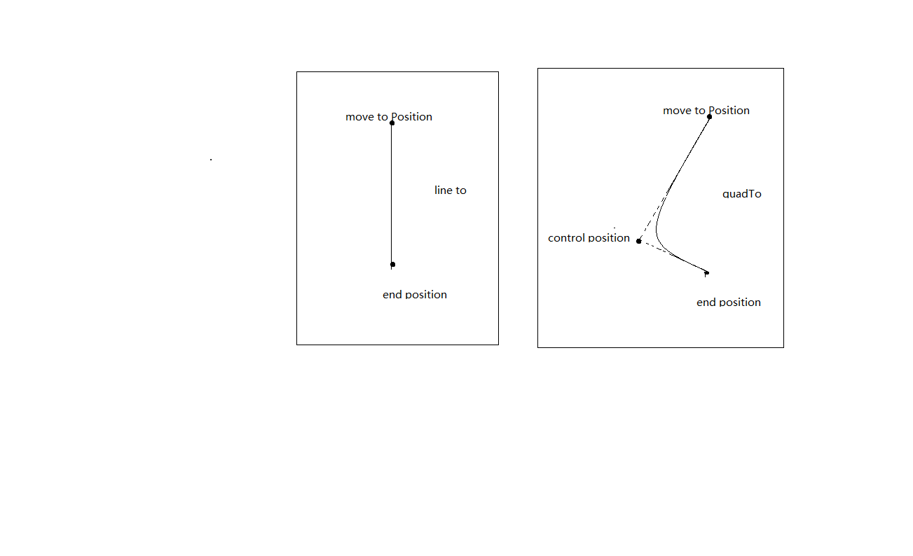

#Android Path
##简介
> The Path class encapsulates compound (multiple contour) geometric paths consisting of straight line segments, quadratic curves, and cubic curves. It can be drawn with canvas.drawPath(path, paint), either filled or stroked (based on the paint's Style), or it can be used for clipping or to draw text on a path.[内容选自Android源代码](#)

> Skia Graphics Library（SGL）是一个由C++编写的开放源代码图形库。Skia主要的类别是SkCanvas，所有的绘图功能都是实作于此类别。[内容选自wikipedia](https://zh.wikipedia.org/wiki/Skia_Graphics_Library)

> moveTo、lineTo、quadTo、cubicTo、arcTo

@(源码分析)[Path|skia|Android]

 

- **创建及初始化** 

```java
    public Path() {
        mNativePath = init1();
        mDetectSimplePaths = HardwareRenderer.isAvailable();
    }
```
首先调用本地方法init1,实现文件位于 **frameworks/base/core/jni/android/graphics/Path.cpp**


```c
    static jlong init1(JNIEnv* env, jobject clazz) {
        return reinterpret_cast<jlong>(new SkPath());
    }
```

创建一个SkPath的本地对象。然后根据HardwareRenderer.isAvailable判断，

```c
    static jboolean android_view_GLES20Canvas_isAvailable(JNIEnv* env, jobject clazz) {
    #ifdef USE_OPENGL_RENDERER
        char prop[PROPERTY_VALUE_MAX];
        if (property_get("ro.kernel.qemu", prop, NULL) == 0) {
            // not in the emulator
            return JNI_TRUE;
        }
        // In the emulator this property will be set to 1 when hardware GLES is
        // enabled, 0 otherwise. On old emulator versions it will be undefined.
        property_get("ro.kernel.qemu.gles", prop, "0");
        return atoi(prop) == 1 ? JNI_TRUE : JNI_FALSE;
    #else
        return JNI_FALSE;
    #endif
    }

```
代码位于frameworks/base/core/jni/android_view_GLES20Canvas.cpp

##SkPath的主要类型

- kMove_Verb：表示需要移动起点
- kLine_Verb：直线
- kQuad_Verb：二次曲线
- kConic_Verb：圆锥曲线
- kCubic_Verb：三次曲线
- kClose_Verb：表闭合到某点
- kDone_Verb：表结束


## moveTo 不会进行绘制，只用于移动移动画笔。

## lineTo 用于进行直线绘制。
## quadto ,cubicTo 
用于绘制圆滑曲线，即贝塞尔曲线。
- quadTo(controlX1, controlY1, endX, endY) (controlX1,controlY1) 为控制点，(endX,endY)为结束点。
- cubicTo(controlX1, controlY1, controlX2, controlY2, endX, endY) (controlX1,controlY1) 为控制点，(controlX2,controlY2)为控制点，(endX,endY) 为结束点。
关于控制点与结束点，看下图<br/>

## arcTo
用于绘制弧线（实际是截取圆或椭圆的一部分）。<br/>

mPath.arcTo(ovalRectF, startAngle, sweepAngle) , ovalRectF为椭圆的矩形，startAngle 为开始角度，sweepAngle 为结束角度。

## 吸入动画效果

###PathMeasure （frameworks/base/core/jni/android/graphics/PathMeasure.cpp）
> getPosTan方法， 不管实际 Path 多么的复杂，PathMeasure 都相当于做了一个事情，就是把 Path “拉直”，然后给了我们一个接口(getLength)告诉我们path的总长度，然后我们想要知道具体某一点的坐标，只需要用相对的distance去取即可[ Path特效之PathMeasure打造万能路径动效](http://blog.csdn.net/tianjian4592/article/details/47067161)

###Shader
###ColorMatrix  


#Skia
> SkBitmap 、 SkCanvas 、 SkPaint 和 SkRect 

#svg
> [http://www.w3school.com.cn/svg/svg_path.asp](http://www.w3school.com.cn/svg/svg_path.asp)