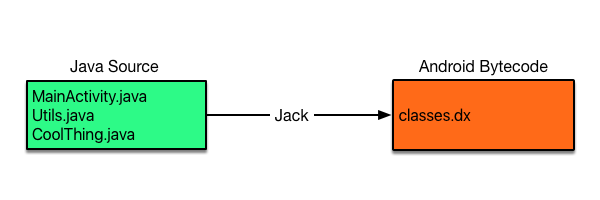
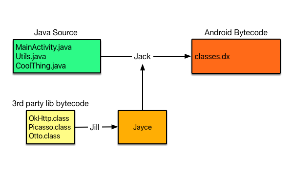

##Jack (Java* Android* Compiler Kit) - is a compiler. Similar to javac


>Jack compiles Java source code straight into Dex file! We don't have intermediate *.class files anymore, so dx tool is not needed! [The dark side of Jack and Jill -  Pavel Dudka  ](http://trickyandroid.com/the-dark-world-of-jack-and-jill/)

支持

- Retrolambda
- Proguard

不支持

- Transform API is not supported by Jack
- Annotation processing is not currently supported by Jack, so if you heavily depend on libraries like Dagger, AutoValue, etc.
- Lint detectors which operate on a Java bytecode level are not supported
- Jack is currently slower than javac + dx
- Jacoco is not supported - well
- Dexguard - enterprise version of Proguard is not currently supported

##Jill can process class files and transform them into special Jayce format which can be used as an input for Jack compiler.


##关于注解
> 文件取至于Webview的addJavascriptInterface添加的对象，觉得object和name这两个参数关联很大，所以干脆用注解写在类中。

1. 文件 **JsObjectName.java**进行转化为dex信息后，可以发现，注解类继承 *java.lang.annotation.Annotation*。<br/>
可以看做是以下写法，但是不能直接这么写。
```java
public interface JsObjectName extends java.lang.annotation.Annotation
```
2. 注解的值被编译成抽象方法 *public abstract java.lang.String name()*


##synchronized
**synchronized**
- 同步方法 编译成flags: ACC_PUBLIC, ACC_STATIC, ACC_SYNCHRONIZED
- 同步方法 编译成 monitorenter，monitorexit