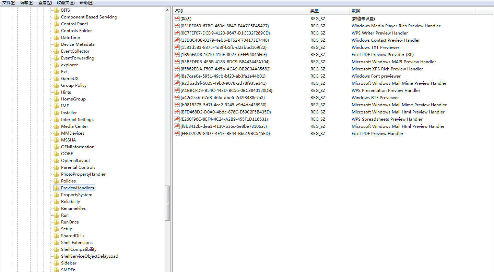

##文件预览设置
###注册表
1.打开注册表的命令**regedit**

2.打开注册表PreviewHandlers位置

HKEY_LOCAL_MACHINE\SOFTWARE\Microsoft\Windows\CurrentVersion\PreviewHandlers



其中 Windows TXT Previewer 的 id 是{1531d583-8375-4d3f-b5fb-d23bbd169f22}

###修改注册表
新建reg文件，设置要修改的文件后缀名，并运行reg文件。
以下是md文件保存案例。
```
[HKEY_LOCAL_MACHINE\SOFTWARE\Classes\.md\shellex\{8895B1C6-B41F-4C1C-A562-0D564250836F}]
@="{{031EE060-67BC-460d-8847-E4A7C5E45A27}}"
```