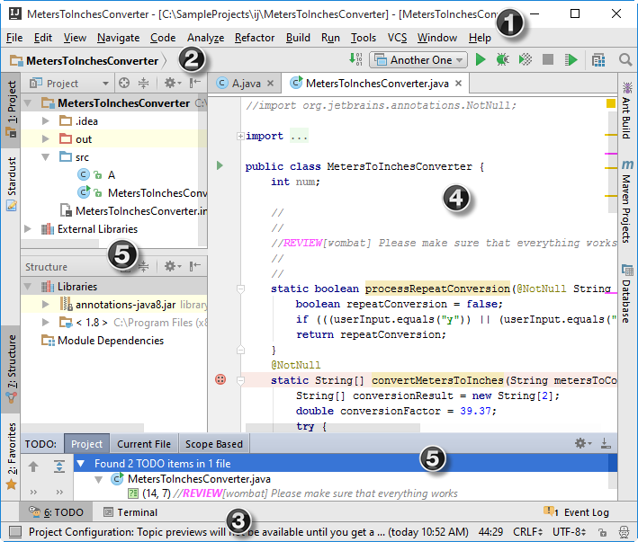

#Intellij插件开发

> [官网doc地址](http://www.jetbrains.org/intellij/sdk/docs/basics.html)
>   [插件案例](https://plugins.jetbrains.com/)
>   [api 范例](http://www.programcreek.com/java-api-examples)
>   可以在IntelliJ IDEA Community Edition 2016.2.4\lib目录下找到openapi.jar库，该jar文件包含插件的弹窗api,[Maven仓库的地址](http://mvnrepository.com/artifact/com.intellij/openapi/6.0.5)

## [Intellij 界面介绍 ](https://www.jetbrains.com/help/idea/2016.2/guided-tour-around-the-user-interface.html)


## group-id

PluginProj\resources\META-INF\plugin.xml
```html

```