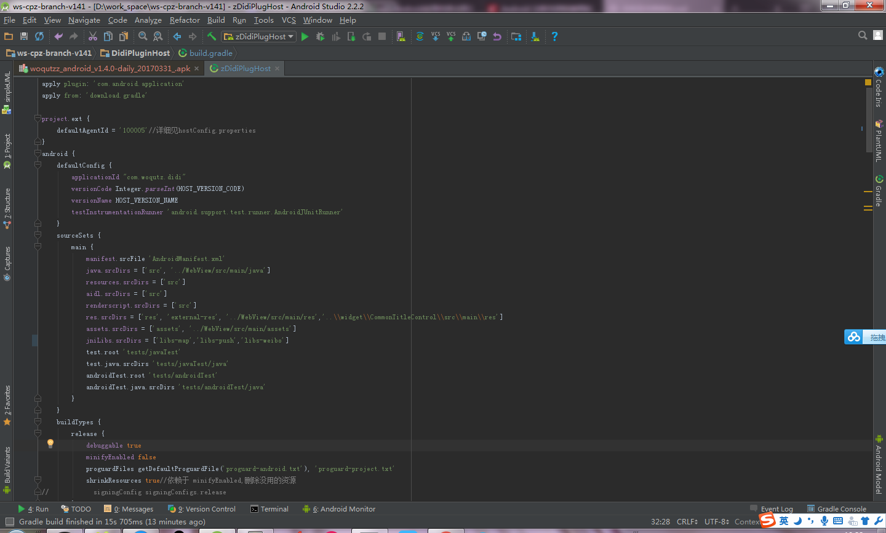
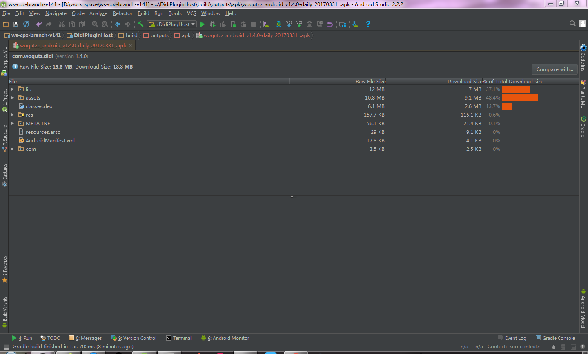

#文件及内存优化


##文件优化

文件包含的信息可以通过 gradle 脚本的 sourceSets 和 dependencies 看出文件打包进去的数据。



将会打包进应用包的文件及文件夹有
```
            manifest.srcFile 'AndroidManifest.xml'
            java.srcDirs = ['src', '../WebView/src/main/java']
            resources.srcDirs = ['src']
            aidl.srcDirs = ['src']
            renderscript.srcDirs = ['src']
            res.srcDirs = ['res', 'external-res', '../WebView/src/main/res','..\\widget\\CommonTitleControl\\src\\main\\res']
            assets.srcDirs = ['assets', '../WebView/src/main/assets']
            jniLibs.srcDirs = ['libs-map','libs-push','libs-weibo']
```

其中 dependencies 包含以下信息

```
dependencies {

    //----------------------------------------Android 官方库
    compile ':support-v4_23.0.1'
    compile ':support-v4_internal_impl-23.0.1'
    compile ':support-annotations-23.0.1'
    compile project(':RecyclerView')
    compile ':recyclerview-v7-23.0.1'
    //兼容-运行时权限
    compile (name:'dexter-release',ext:'aar')
    //----------------------------------------

    //------------------------插件
    compile(':PlugDL-lib-1.0') {
        transitive = false
    }
    compile(':EventBus-1.0') {
        transitive = false
    }
    compile(project(':Common')) {
        transitive = false
    }
    //------------------------插件 end

    //-------------------------------网络分装库
    compile ':retrofit-2.1.0'
    //网络库
    compile ':okhttp-3.3.0'
    compile ':okio-1.8.0'
    //图片资源加载库
    compile ':glide-3.7.0'
    //数据解析库
    compile 'com.alibaba:fastjson:1.2.29'
    //-------------------------------网络分装库 end

    //-------------推送 - 运营手段,触达一些低频或新用户
    compile ':Xg_sdk_v2.43_20160308_1031'
    compile ':wup-1.0.0.E-SNAPSHOT'
    compile ':jg_filter_sdk_1.1'
    //-------------推送

    //支付-连连
    compile ':securepay_stand_2.4.6'
    compile ':lianlian_lib-1.0'
    //支付-深圳市威富通（包含微信和支付宝）
    compile ':banksdk'
    compile ':libammsdk'

    //社交渠道 - 微博分享
    compile ':weiboSDKCore_3.1.4'

    //社交渠道 - 登录和分享 qq
    compile ':open-sdk5756'
//    compile ':mta-sdk-1.6.2'//mta包请自主选择，非必须。统计接口，上报数据的作用

    //地图定位
    compile ':BaiduLBS_Android'
    compile ':locSDK_5.2'

    //友盟统计
    compile 'com.umeng.analytics:analytics:latest.integration'
    //问题统计
    compile 'com.tencent.bugly:crashreport:2.1'

    //--------------------问题反馈 start
    compile(name: 'alisdk-feedback-2.3.0', ext: 'aar')
    compile(name: 'securityguardaar3-5.1.81', ext: 'aar')
    compile ':app-monitor-sdk-2.5.1.1_for_bc_proguard'
    compile ':utdid4all-1.1.5.3_proguard'
    //--------------------问题反馈 end


    //功能测试库
    androidTestCompile 'com.android.support.test.espresso:espresso-core:2.2.2', {
        exclude group: 'com.android.support', module: 'support-annotations'
    }
    androidTestCompile 'com.android.support.test.espresso:espresso-intents:2.2.2'
    //单元测试库
    testCompile 'junit:junit:4.12'
}

```

通过 Android Studio 可以看出各个文件及文件夹占用的情况



可以看出，lib文件夹占用的空间比较大，而 lib 文件的包含了微博，腾讯信鸽，百度地图的动态库。
占用文件大小比例第二的是 assets，assets


##内存优化

App内存->运行时内存->{进程可分配内存,文件大小}

文件大小->{sourceSets}
//IDE 分析，lib 文件夹占用37.1%，assets 占用48.4%，classes.dex占用 18.7%
//原因分析：lib 动态库兼容多个手机，所以占用大。目前包含微博，信鸽推送，百度地图
//          assets 中插件占用 43.3%，其中 Main插件占用41.8%
sourceSets->{}

##压缩图片
[Pngyu](http://nukesaq88.github.io/Pngyu/)

## 减少 so 库的支持
/**
 *   armeabi设备只兼容armeabi；
 *   armeabi-v7a设备兼容armeabi-v7a、armeabi；
 *   arm64-v8a设备兼容arm64-v8a、armeabi-v7a、armeabi；
 *   X86设备兼容X86、armeabi；
 *   X86_64设备兼容X86_64、X86、armeabi；
 *   mips64设备兼容mips64、mips；
 *   mips只兼容mips；
 */
abiFilters "armeabi"//, "armeabi-v7a", "x86"


## 删除彩种
快三，其他高频彩，数字彩