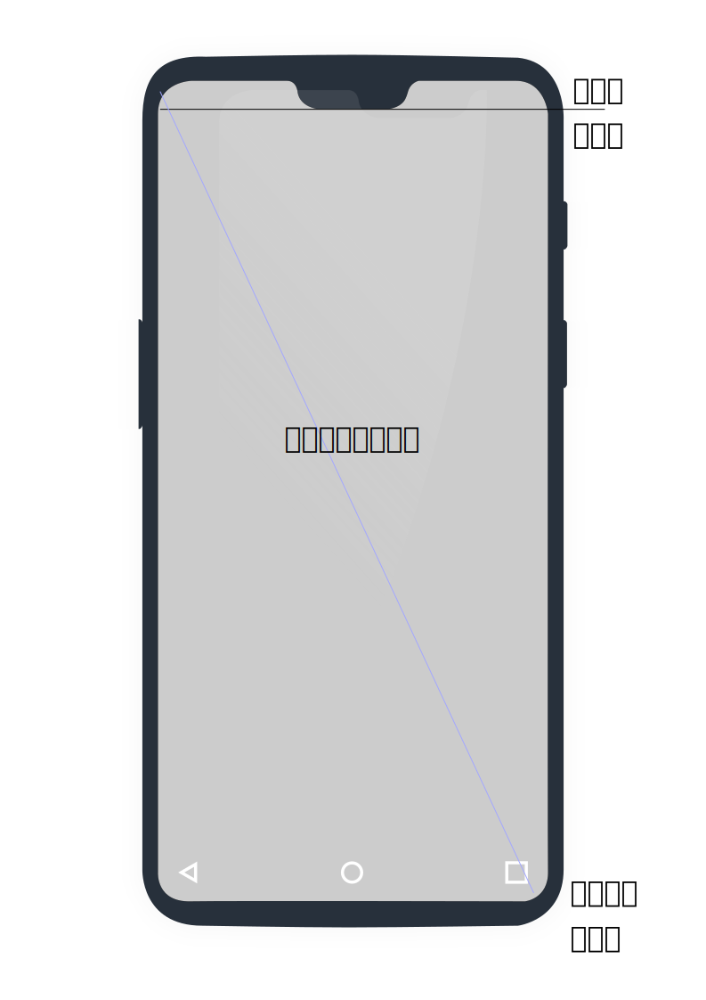

## 参数
### 屏幕
> 屏幕尺寸：手机对角线的物理大小，单位为英寸（inch），1英寸=2.54cm，Android手机常见的尺寸有5寸、5.5寸、6寸等等

> 屏幕分辨率：屏幕图像的精密度，是指显示器所能显示的像素有多少。 

### 像素相关单位

> 像素即px，为视频显示的基本单位，每个这样的消息元素不是一个点或者一个方块，而是一个抽象的取样。

> 比特每像素：一个像素所能表达的不同颜色数取决于比特每像素。256色，亦称为“8位”；216=65,536色，称为高彩色，亦称为“16位”；224=16,777,216色，称为真彩色，通常的记法为“1670万色”，亦称为“24位色”；224 +28，计算机领域较常见的32位色并不是表示232种颜色，而是在24位色基础上增加了8位（28=256级）的灰阶，因此32位的色彩总数和24位是相同的，32位也称为全彩；248=281,474,976,710,656色，用于很多专业的扫描仪。

> 屏幕像素密度：每英寸的像素点数，单位dpi（dots per ich）

> 密度无关像素：dp/dip，保证在不同屏幕像素密度的设备上显示相同的效果

> 独立比例像素：区别于 *密度无关像素*，对字体大小首选项进行缩放

## 屏幕数据

| 屏幕标准标准  |           |                         | 图标尺寸标准  | 比例    | 屏幕密度(dpi) | 边距(px) |
| :-: | :-: | :-: | :-: | :-: | :-: | :-: |
| xxxhdpi | 3840*2160 | 4K分辨率                   | 192*192 | 4     | 640       | 12-16  |
| xxhdpi  | 1920*1080 |                         | 144*144 | 3     | 480       | 8-12   |
| xhdpi   | 1280*720  |                         | 96*96   | 2     | 320       | 6-8    |
| hdpi    | 480*800   | 高分辨率 WVGA (480x800) | 72*72   | 1.5   | 240       | 4-6    |
| mdpi    | 480*320   | 中等分辨率  HVGA         | 48*48   | 1     | 160       | 3-4    |
| ldpi    | 320*240   | 低分辨率  QVGA          | 36*36   | 0.75  | 120       | 2-3    |

中等分辨率（mdpi）1px 等于 1in/160 = 0.0157in =0.0157cm 
超高分辨率（xhdpi）1px 等于 1in/320 = 0.007in =0.008cm 

## 适配方案
1. dp适配
   ❌同样的分辨率可能dpi不同（同样1080p。480dpi时，1080/3=360dp占满屏幕宽度；有些是420dpi，360dp*2.625=946px，没有占满屏幕宽度）
2. 宽高限定符适配
   以mdpi为基准，准确适配宽高 value-480x320 ；
   ❌需要准确的宽高
3. 动态修改density值，从而保证(手机像素宽度)px/density这个值始终是屏幕宽度480dp
   
4. smallestWidth适配
   相比第2种方案，提高容错率

### 屏幕分布
[流量研究院 - 移动设备分辨率排名](https://mtj.baidu.com/data/mobile/device)
[腾讯移动分析 - 设备分辨率排名](https://mta.qq.com/mta/data/device/resolution)

### 控件字体尺寸适配 - 生成所有分辨率对应像素数列表

优点
- 进行90%的适配

缺点
- 如果有某个分辨率缺少，将无法完成该屏幕的适配
- 过多的分辨率像素描述xml文件会增加软件包的大小和维护的难度
- google的要求使用dp作为度量单位会有所背离

### 图片适配 - 一套分辨率规格的图片资源

### 屏幕

