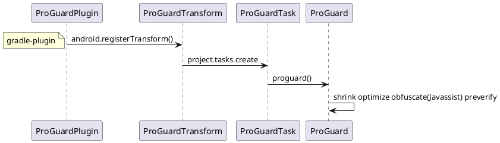

# 高效的稳健开发
1. 设计模式
稳定（单元测试）自动化（代码管理，编译打包），可分析（日志调试）可拓展（设计原则与模式）


adb 命令 
    install 
    adb logcat -c & adb logcat -e {\"
    [bugreport](https://bathist.ef.lc/)
adb shell 命令
    查看信息 getprop，dumpsys
    调用指令 am pm wm monkey
    
studio命令
    set JAVA_HOME=E:\Program\Android\jdk8u322-b06 \sdk-windows\tools\bin\uiautomatorviewer.bat

    set JAVA_HOME=E:\Program\Android\jdk8u322-b06
    set PATH=%PATH%;%JAVA_HOME%\bin
    sdk-windows\tools\lib\monitor-x86_64\monitor

    set JAVA_HOME=E:\Program\Android\jdk8u322-b06
    set PATH=%PATH%;%JAVA_HOME%\bin
    sdk-windows\emulator\emulator.exe -avd Pixel_2_API_30 -writable-system


## 稳定
Crash 和 ANR

 AndroidJunitRunner


### 代码Review：提高代码质量


### Android Lint、QAPlugins（Findbugs、Checkstyle、PMD）

### 版本管理与推进
android 相关，Google要求tartgetSdkVersion要保持最新：
compileSdkVersion>=targetSdkVersion>=minSdkVersion
ndk所支持API级别可以通过NDK解压缩包中platforms目录查看

[jdk版本](https://www.oracle.com/java/technologies/downloads/archive/)支持Java8可以，开发使用kotlin：
sourceCompatibility JavaVersion.VERSION_1_8
targetCompatibility JavaVersion.VERSION_1_8
使用高版本，android 会使用D8 R8脱糖处理，使低版本手机支持

Kotlin版本，最新的 Android 平台功能建议最新版本：
[kotlin/KSP](https://plugins.gradle.org/search?term=org.jetbrains.kotlin)：
[Kotlin Gradle plugin](https://kotlinlang.org/docs/gradle-configure-project.html#apply-the-plugin)
[Kotlin 版本所需的 D8 和 R8 编译器版本](https://developer.android.com/studio/write/kotlin-support?hl=zh-cn)

android studio 版本保持最新，核心用到AGP要保持最新，需要gradle支持：
[AGP版本号建议](https://developer.android.google.cn/studio/releases/gradle-plugin?hl=zh-cn#versioning-update) 
[flutter AGP版本号建议](packages/flutter_tools/lib/src/android/gradle_utils.dart)
[AGP maven仓库](https://maven.google.com/web/index.html?#com.android.application)
[Gradle版本](https://services.gradle.org/distributions/)


### studio
[JetBrains intellij android](https://github.com/JetBrains/android.git)

```java
问题：The emulator process for AVD Pixel_2_API_29 was killed 
修改：C:\Users\anshu\.android\avd\Pixel_2_API_30.avd\config.ini
hw.gpu.enabled = no hw.gpu.mode = off


问题：你的主机中的软件中止了一个已建立的连接
解决：gradle 6.5 不支持热点

问题： gradle 下载慢
解决：http://services.gradle.org/distributions/
    放在user/.gradle/wrapper/dist/

安装插件导致卡顿 tools > customproperties
C:\Users\anshu\AppData\Roaming\Google\AndroidStudio4.1\plugins


wsl 安装sdk
下载commandlinetools-linux，根据所需版本，执行命令
sdkmanager "platform-tools" "build-tools;28.0.3" "platforms;android-28" "cmake;3.6.4111459" "ndk;22.0.7026061"  "ndk-bundle"

```

#### Gradle 5.3  支持kotlin
### 版本特性
[Android 版本与API level](https://developer.android.google.cn/studio/releases/platforms?hl=zh-cn)

[Android api level](https://developer.android.google.cn/guide/topics/manifest/uses-sdk-element?hl=zh-cn#top_of_page)

https://zwc365.com/2020/08/30/android10-baiduwangpan

#### Android 14 API level 33 
Android 13 为管理设备与周围 Wi-Fi 热点连接的应用添加 NEARBY_WIFI_DEVICES 运行时权限 (属于 NEARBY_DEVICES权限组)，从而在不需要 ACCESS_FINE_LOCATION 权限的情况下
应用自撤销权限
相册权限


#### Android 12 API level 31/32
Material You
应用启动页
Notification通知栏
蓝牙权限： 申请蓝牙相关权限时，不再需要申请设备位置信息相关权限
精确位置，需同时请求 ACCESS_FINE_LOCATION 和 ACCESS_COARSE_LOCATION 权限，参考ios
禁止从后台启动前台服务
声明 android:exported

#### Android 11 API level 30
[行为变更：以 Android 11 为目标平台的应用](https://developer.android.google.cn/preview/behavior-changes-11?hl=zh-cn)

- [Android 11 中的隐私权（存储文件和用户数据、请求权限以及请求位置信息）](https://developer.android.google.cn/preview/privacy?hl=zh-cn)
⭐ 强制分区存储，还需要访问系统文件
<uses-permission android:name="android.permission.MANAGE_EXTERNAL_STORAGE" />
 android11 根目录创建文件夹<application android:preserveLegacyExternalStorage="true"/>
     在Android11的机器上覆盖安装时，才能访问旧版存储位置，卸载重装会失效
#### Android 10 API level 29
[面向开发者的 Android 10](https://developer.android.google.cn/about/versions/10/highlights?hl=zh-cn#privacy_for_users)
- 折叠屏（resizeableActivity）
- 用户隐私设置：必须使用 MediaStore 来访问共享媒体文件；
⭐安全问题-权限
⭐[分区存储，对外部存储空间的分区访问权限（应用专属目录和 MediaStore）](https://developer.android.google.cn/training/data-storage/use-cases)
<application
    android:requestLegacyExternalStorage="true">
⭐ 设备ID就不能获取，去掉了READ_PHONE_STATE权限，阻止设备跟踪 （OAID替换）
⭐ AndroidX代替v4,v7
⭐ EPERM (Operation not permitted) 添加属性 compilesdk 29,requestLegacyExternalStorage https://developer.android.google.cn/training/data-storage/use-cases#opt-out-scoped-storage

#### Android  9 API level 28
[行为变更：以 API 级别 28 及更高级别为目标的应用](https://developer.android.google.cn/about/versions/pie/android-9.0-changes-28?hl=zh-cn)
- 支持最新的全面屏，其中包含为摄像头和扬声器预留空间的屏幕缺口。 通过 DisplayCutout 
- ImageDecoder 类，可提供现代化的图像解码方法。 使用该类取代 BitmapFactory 和 BitmapFactory.Options
- AnimatedImageDrawable类来绘制和显示GIF和WebP动画图像
- AMS：后台服务JobScheduler；后台进程不允许startService前台服务（IllegalStateException）；FLAG_ACTIVITY_NEW_TASK，才允许在非Activity场景启动Activity；
- webview多进程需要设置setDataDirectorySuffix
-  Android 9（API 级别 28）引入了新的电池管理功能：应用待机存储分区。[](https://developer.android.google.cn/topic/performance/appstandby)
⭐ 非可调用 sdk 接口限制
⭐ Http 明文请求
```java
        android:usesCleartextTraffic="true" 
        tls支持：
   public static OkHttpClient.Builder ignoreSSL (OkHttpClient.Builder builder) {
        builder.sslSocketFactory(createSSLSocketFactory())
            .hostnameVerifier((s, sslSession) -> true);
        return builder;
    }

    private static SSLSocketFactory createSSLSocketFactory () {

        SSLSocketFactory sSLSocketFactory = null;

        try {
            SSLContext sc = SSLContext.getInstance("TLS");
            sc.init(null, new TrustManager[]{new TrustAllManager()}, new SecureRandom());
            sSLSocketFactory = sc.getSocketFactory();
        } catch (Exception e) {
            LOGGER.info(e.getMessage(), e);
        }

        return sSLSocketFactory;
    }

    private static class TrustAllManager implements X509TrustManager {

        @Override
        public void checkClientTrusted (java.security.cert.X509Certificate[] x509Certificates,
            String s) throws java.security.cert.CertificateException {

        }

        @Override
        public void checkServerTrusted (java.security.cert.X509Certificate[] x509Certificates,
            String s) throws java.security.cert.CertificateException {

        }


        @Override
        public java.security.cert.X509Certificate[] getAcceptedIssuers () {
            return new X509Certificate[0];
        }
    }

```
#### Android  8 API level 26
[Android 8.0 变更](https://developer.android.google.cn/about/versions/oreo/android-8.0-changes?hl=zh-cn#back-all)

- ⭐后台执行Service限制，Notification Channels 创建一个用户可自定义的频道。
- 画中画
[Android 8.0（API 级别 26）及更高版本中，位图像素数据存储在原生堆中](https://developer.android.google.cn/topic/performance/graphics/manage-memory.html#save-a-bitmap-for-later-use)
 26 
@FastNative注解

- Safe Browsing API 的 WebView 实现
 ```xml
 <application>
            ...
            <meta-data android:name="android.webkit.WebView.EnableSafeBrowsing"
                       android:value="true" />
</application>
 ```

 ```java
superSafeWebView.startSafeBrowsing(this, new ValueCallback<Boolean>() {
            @Override
            public void onReceiveValue(Boolean success) {
                safeBrowsingIsInitialized = true;
                if (!success) {
                    Log.e("MY_APP_TAG", "Unable to initialize Safe Browsing!");
                }
            }
        });
 ```
#### Android  7 API Level 24
[Android 7.0 行为变更](https://developer.android.google.cn/about/versions/nougat/android-7.0-changes?hl=zh-cn)
- 低耗电
- 夜间模式
- 多窗口
V2签名
Android 7.x中,PopupWindow高度为match_parent时,会出现兼容性问题,需要处理兼容性
⭐FileProvider访问文件
#### Android  6 API level 23
[Android 6.0 变更](https://developer.android.google.cn/about/versions/marshmallow/android-6.0-changes?hl=zh-cn)

- [Android 临时访问权限](https://www.jianshu.com/p/f15f956763c1)
⭐动态权限管理，IMEI可能获取不到
深层链接和 Android 应用链接
#### Android  5 API level 21 
[Android Lollipop](https://developer.android.google.cn/about/versions/lollipop?hl=zh-cn)
- Material Design
Art正式替代Dalvik VM
⭐Material Design风格，AppTheme，ToolBar 代替Actionbar 
#### Android  4 API level 14
[Android KitKat 4.4(api level 19)](https://developer.android.google.cn/about/versions/kitkat?hl=zh-cn)
⭐ VSYNC/Choreographer
⭐ Holo风格，Fragment，FragmentActivity，v7兼容低版本

#### Android 3
⭐ActionBar Theme.Holo AppCompatActivity

## 自动化（代码，编译，依赖，）
[](知识体系-存储-VCS.md)
Commit 审阅 if，系统版本，模块管理
Push   代码重用,多次提交Review
### 科大源编译
https://android.googlesource.com https://aosp.tuna.tsinghua.edu.cn
https://gerrit-googlesource.lug.ustc.edu.cn https://gerrit-googlesource.lug.ustc.edu.cn
#### Android 11 内核编译
https://source.android.google.cn/devices/architecture/kernel/android-common?hl=zh-cn
https://sidneygod.github.io/posts/c64b5633/
#### Android编译
http://iso.mirrors.ustc.edu.cn/aosp-monthly/aosp-latest.tar
wsl路径：
C:\Users\anshu\AppData\Local\Packages\CanonicalGroupLimited.UbuntuonWindows_79rhkp1fndgsc\LocalState\rootfs

cannot execute binary file: Exec format error
https://www.cnblogs.com/JiuHuan/p/10073632.html

https://mirrors.ustc.edu.cn/help/aosp.html

 ⭐创建大小写敏感的文件夹，在编译的时候会提示 
 fsutil.exe file SetCaseSensitiveInfo D:\workspace\ws-androidbuild\source enable 
fsutil.exe file queryCaseSensitiveInfo 
⭐Failed to listen for path logs: listen unix out/.path_interposer_log: bind: invalid argument  
移动到/home/user 目录下编译//https://www.jianshu.com/p/c9ef830d5e21 在wsl2中，是无法直接访问Linux的文件的，但是可以网络的方式进行访问。通过Windows Terminal访问
wsl -l -v #查看版本和名称
//先更新适用于 x64 计算机的 WSL2 Linux 内核更新包
wsl --set-version Ubuntu 2 #升级到WSL2

步骤一： repo命令下载配置，.repo/manifests.git/config改为科大源同步地址
步骤二： [manifest版本号旋转](https://source.android.google.cn/setup/start/build-numbers?hl=zh-cn)
repo init -u git://mirrors.ustc.edu.cn/aosp/platform/manifest -b android-10.0.0_r1	android-12.0.0_r1 //	android-10.0.0_r1	
⭐repo init --depth=1 -u git://mirrors.ustc.edu.cn/aosp/platform/manifest -b android-11.0.0_r9 android-11.0.0_r17  android-12.0.0_r3  android-10.0.0_r42 android-9.0.0_r30//只下载当前代码 
git_command.py 增加日志输出，然后就能看到过程中使用的git指令


error.GitError: manifests rev-list ('^HEAD', 'e0a1ee6450c817d46067ddc7574819044a2169e9', '--'): fatal: bad revision '^HEAD'

解决方法，用的是2020年的tar包，.repo\manifests.git\refs\tags没有android 12导致的，也是各种错误
cd .repo/manifests ;git reset --hard remotes/origin/android-10.0.0_r1


error: Exited sync due to gc errors
查找问题，打印异常 E:\aosp\.repo\repo\subcmds\sync.py
异常为：platform/external/scapy gc: fatal:not a git repository: 'mnt/e/aosp/.repo/projects/external/scapy.git'

步骤三：⭐repo sync -c -f --no-tags --no-clone-bundle -j`nproc` //注释掉repo的subcommand/sync.py 的_GCProjects方法加快编译


Fetching: 100% (782/782), done in 1h7m59.765s
Garbage collecting: 100% (782/782), done in 11.066s
Checking out: 100% (781/781), done in 1h41m27.600s
repo sync has finished successfully.

error: external/openssh/: Cannot checkout platform/external/openssh due to missing network sync; Run `repo sync -n platform/external/openssh` first.
⭐repo sync -n platform/external/openssh //需要projects-object有bare项目才能执行，会修改project-object的.git/config配置
repo sync --force-sync prebuilts/rust frameworks/libs/modules-utils external/openssh //需要project-object有非bare项目才能执行，测试工作目录是否能正常fetch和checkout，git_command.py 增加日志输出

gc: fatal: not a git repository: '/mnt/e/aosp/.repo/projects/external/openssh.git' 确实没有文件夹
git clone --bare -b android-10.0.0_r1 --depth=1 git://mirrors.ustc.edu.cn/aosp/platform/external/openssh.git .repo/project-objects/platform/external/openssh.git
git clone --bare git://mirrors.ustc.edu.cn/aosp/platform/external/openssh.git .repo/projects/external/openssh.git projects的不能是bare，需要config去掉bare
以上的问题没有解决，将会出现下面问题


解决方法
 拷贝tags到refs/heads/android-12.0.0_r1 并且执行修复命令git symbolic-ref HEAD refs/heads/android-12.0.0_r1

Git error "non-monotonic index" 执行下面命令
> rm .git/objects/pack/pack-29a18084cf61cd0322a6e9cfd485ce0977348c53.idx
> git index-pack .git/objects/pack/pack-29a18084cf61cd0322a6e9cfd485ce0977348c53.pack 
> git gc --prune=now

error: refs/tags/android-wear-9.0.0_r32 does not point to a valid object! 解决方法
rm .git/refs/tags/android-wear-9.0.0_r32 .git/logs/refs/tags/android-wear-9.0.0_r32


\.repo\manifests\default.xml 修改地址 git://Android.git.linaro.org/ git://git.omapzoom.org 
https://www.cnblogs.com/kobe8/p/3990297.html

⭐error: .repo/repo/: contains uncommitted changes
info: A new version of repo is available
warning: repo is not tracking a remote branch, so it will not receive updates
repo reset: error: Entry 'SUBMITTING_PATCHES.md' not uptodate. Cannot merge.
fatal: Could not reset index file to revision 'v2.20^0'.

git stash和git clean -df 还是无效可能是文件权限修改导致的，可用以下命令修改
git config core.filemode false


error： cannot initialize work tree的报错
处理方法：
执行repo sync -cdf输出sync的详细信息 
error.GitError: cannot initialize work tree
找到报错的仓库路径packages/apps/DocumentsUI
然后分别删除根目录下 
.repo/projects/packages/apps/DocumentsUI.git和
.repo/project-objects/packages/apps/DocumentsUI.git
删除之后重新执行repo sync -j2 -c即可

 
cannot execute binary file: Exec format error
    sudo apt install qemu-user-static
    sudo update-binfmts --install i386 /usr/bin/qemu-i386-static --magic '\x7fELF\x01\x01\x01\x03\x00\x00\x00\x00\x00\x00\x00\x00\x03\x00\x03\x00\x01\x00\x00\x00' --mask '\xff\xff\xff\xff\xff\xff\xff\xfc\xff\xff\xff\xff\xff\xff\xff\xff\xf8\xff\xff\xff\xff\xff\xff\xff'
    service binfmt-support start

prebuilts/clang/host/linux-x86/clang-4691093/bin/clang++.real: error while loading shared libraries: libtinfo.so.5: cannot open shared object file: No such file or directory
arthur@LAPTOP-RBD26HNH:~/aosp$ sudo apt-get install libncurses5
/bin/sh: 1: unzip: not found
arthur@LAPTOP-RBD26HNH:~/aosp$ sudo apt-get install unzip
/bin/bash: zip: command not found
arthur@LAPTOP-RBD26HNH:~/aosp$ sudo apt-get install zip
一次性安装环境：
sudo apt-get install git-core gnupg flex bison gperf build-essential zip curl zlib1g-dev gcc-multilib g++-multilib libc6-dev-i386 lib32ncurses5-dev x11proto-core-dev libx11-dev lib32z-dev libgl1-mesa-dev libxml2-utils xsltproc unzip


dex2oat did not finish after 2850 seconds
    build/core/dex_preopt_libart.mk
        ANDROID_LOG_TAGS="*:e" $(DEX2OAT) \
            -j1 \
            --runtime-arg -Xms$(DEX2OAT_XMS) --runtime-arg -Xmx$(DEX2OAT_XMX) \

⭐步骤四 ：编译
//如果是编译 10
export _JAVA_OPTIONS="-Xmx4g"
//如果是编译 11
export _JAVA_OPTIONS="-Xmx8g"
//java -XX:+PrintFlagsFinal -version | grep -iE 'HeapSize' 查看设置的大小

free -m 
//查看内存，
//Android 10 ，8G 内存，8G swap
//Android 11 ，内存使用 4G 无法编译，编译应用层时候，飙到12GB，%UserProfile%\.wslconfig 调整 memory=12GB swap=16G
 df -h //查看磁盘使用情况

 make clobber
source build/envsetup.sh
lunch aosp_x86_64-eng //android 11（8.0不支持） aosp_x86_64-eng可以运行arm；其他名称https://source.android.google.cn/setup/build/running
make -j`nproc` //如果卡住可能是内存不够用，可以用mma单独编译模块，看下错误

编译后emulator aosp\out\target\product\generic_x86\system 移动到 sdk\system-images\android-28\google_apis_playstore\x86；
并修改 xxx-qemu.img 替换原来的xxx.img，拷贝aosp\out\target\product\generic_x86\system\build.prop到generic_x86目录，创建启动

这种可行⭐编译后emulator aosp\out\target\product\generic_x86\里面的非文件夹 移动到 sdk\system-images\android-28\google_apis_playstore\x86；
并修改 xxx-qemu.img 替换原来的xxx.img，⭐这点很重要，拷贝aosp\out\target\product\generic_x86\system\build.prop到generic_x86目录，创建启动


### x86_64支持arm
查找image
https://github.com/eagletmt/android-repository-history/blob/master/repository/sys-img/google_apis_playstore/sys-img2-1.xml
下载zip
https://dl.google.com/android/repository/sys-img/google_apis_playstore/x86_64-30_r09-linux.zip
https://dl.google.com/android/repository/sys-img/google_apis_playstore/x86_64-31_r02.zip
解压system.img的super.img system文件夹，并执行以下命令，打包资源
find /system \( -name 'libndk_translation*' -o -name '*arm*' -o -name 'ndk_translation*' \) | tar -cf native-bridge.tar -T -

关于x86运行arm，参考houdini(Android 9之前) 和 libndk_translation (android 11专有模块) 
https://www.android-x86.org/
https://gitlab.com/android-generic/android_vendor_google_emu-x86
https://github.com/newbit1/libndk_translation_Module
https://www.dazhuanlan.com/zty9301/topics/1331077
https://dl.google.com/android/repository/ 镜像地址
https://gerrit-googlesource.proxy.ustclug.org/
https://chgans.design.blog/2021/05/23/adding-arm-native-bridge-to-the-aosp11-x86-emulator/
https://android-developers.googleblog.com/2020/03/run-arm-apps-on-android-emulator.html?m=1
https://github.com/geeks-r-us/anbox-playstore-installer
https://developers.google.cn/android/images#oriole
https://github.com/geeks-r-us/anbox-playstore-installer

[Enable libndk_translation in waydroid.](https://purplepalmdash.github.io/page/5/)
```makefile

BUILD_ARM_FOR_X86 := true
WITH_NATIVE_BRIDGE := true
NDK_TRANSLATION_PREINSTALL := true

TARGET_SUPPORTS_32_BIT_APPS := true
TARGET_SUPPORTS_64_BIT_APPS := true
# If native bridge is bundled with the system, indicate support for ARM ABIs
ifeq ($(WITH_NATIVE_BRIDGE), true)
    NATIVE_BRIDGE_ABI_LIST_32_BIT := armeabi-v7a armeabi
    NATIVE_BRIDGE_ABI_LIST_64_BIT := arm64-v8a
endif

# Add ARM to supported ABIs
ifeq ($(TARGET_ARCH),x86_64)
    TARGET_2ND_CPU_ABI2 := armeabi-v7a
    TARGET_CPU_ABI_LIST_32_BIT := $(TARGET_2ND_CPU_ABI) $(NATIVE_BRIDGE_ABI_LIST_32_BIT)
else
    TARGET_CPU_ABI2 := armeabi-v7a
    TARGET_CPU_ABI_LIST_32_BIT := $(TARGET_CPU_ABI) $(NATIVE_BRIDGE_ABI_LIST_32_BIT)
endif

ifneq ($(WITH_NATIVE_BRIDGE), true)
    PRODUCT_BUILD_PROP_OVERRIDES += TARGET_CPU_ABI2=
endif

PRODUCT_PROPERTY_OVERRIDES += \
    ro.dalvik.vm.isa.arm=x86 \
    ro.dalvik.vm.isa.arm64=x86_64 \
    ro.enable.native.bridge.exec=1 \
    ro.dalvik.vm.native.bridge=libndk_translation.so

PRODUCT_DEFAULT_PROPERTY_OVERRIDES := \
    ro.dalvik.vm.native.bridge=libndk_translation.so

PRODUCT_COPY_FILES += \
	$(call find-copy-subdir-files,*,$(LOCAL_PATH)/google-ndk-translation,$(TARGET_COPY_OUT_SYSTEM))
```
编译自定义属性
 ：
``` makefile

2) build/tools/buildinfo.sh;
3) $(TARGET_DEVICE_DIR)/system.prop的内容追加到build.prop;
4) 在build/target/product/core.mk
ADDITIONAL_BUILD_PROPERTIES或PRODUCT_PROPERTY_OVERRIDES
PRODUCT_PROPERTY_OVERRIDES += \
    ro.dalvik.vm.isa.arm=x86 \
    ro.dalvik.vm.isa.arm64=x86_64 \
    ro.enable.native.bridge.exec=1 \
    ro.dalvik.vm.native.bridge=libndk_translation.so
```


#### 一定要使用 google api镜像，才能root
```
https://github.com/newbit1/rootAVD
 emulator -avd Pixel_2_API_30_x86_64_api -writable-system

 adb root
 adb shell avbctl disable-verification
 adb disable-verity
 adb reboot
 adb root
 adb remount
 adb shell
```

模块编译
find  frameworks -name Android.mk
cat   frameworks/base/packages/SystemUI/Android.mk | grep LOCAL_MODULE
1.  make  SystemUI //LOCAL_MODULE:= SystemUI
2. 模块根目录编译 mm  //当前目录 packages/apps/phone
mm： 编译当前目录下的模块，当前目录下要有Android.mk/Android.bp文件，不构建依赖
mma：编译当前目录下的模块，构建依赖 mm出现ninja: error: 'xxx', needed by 'xxx', missing and no known rule to make it
3. 相对目录编译 mmm packages/apps/phone
mmm：编译指定路径下的模块，指定路径下要有Android.mk/Android.bp文件，不构建依赖
mmma：编译指定路径下的模块，构建依赖

 make systemimage //重现编译system.img，包含systemui.apk；#make bootimage 编译boot.img； make userdataimage-nodeps 快速编译userdata.img；


//要先用x86_64GooglePlay镜像sdk_gphone_x86_64-user创建，自定义-sysdir，不然会使用默认x86_64目录。用编译出的文件，放在system-imges；启动模拟器就会加载编译的文件
//运行后，修改/system/build.prop 相关的，让x64支持arm
//default.prop -> system/etc/prop.default
ro.product.cpu.abilist=x86_64,x86,arm64-v8a,armeabi-v7a,armeabi
ro.product.cpu.abilist32=x86,armeabi-v7a,armeabi
ro.product.cpu.abilist64=x86_64,arm64-v8a
//  /vendor/build.prop
ro.vendor.product.cpu.abilist=x86_64,x86,arm64-v8a,armeabi-v7a,armeabi
ro.vendor.product.cpu.abilist32=x86,armeabi-v7a,armeabi
ro.vendor.product.cpu.abilist64=x86_64,arm64-v8a

//  vender.img : /default.prop  system.img/super.img: /system/etc/prop.default
ro.dalvik.vm.native.bridge=libndk_translation.so
ro.enable.native.bridge.exec=1


//用Nexus_4_模拟器默认可以root，是userdebug模式，但不支持GooglePlay镜像；要使用使用，Nexus_5_才有GooglePlay镜像；
//PIXEL模拟器需要注意 先替换system-images，判断是否模式正确**getprop | grep product.build.type 是否是eng模式**
//超级权限，adb root;adb remount后，可以push SystemUI.apk到 /system/priv-app/SystemUI/SystemUI.apk

.\android-sdk\tools\bin\avdmanager.bat  create avd -n Pixel_2_API_30_api  -k "system-images;android-30;google_apis;x86_64"  --device 17 --force
⭐.\android-sdk\tools\emulator.exe -avd Nexus_5_API_28 -writable-system  
.\android-sdk\tools\bin\avdmanager.bat delete avd  -n  Pixel_2_API_30_api

D:\Program\Android\sdk-ndk\emulator\qemu\windows-x86_64\qemu-system-x86_64.exe: WHPX: Unexpected VP exit code 4 需要使用system-qemu.img镜像

user	                                              userdebug	                       eng
仅安装标签为 user 的模块	               安装标签为 user、debug 的模块	          安装标签为 user、debug、eng 的模块
设定属性 ro.secure=1，打开安全检查功能	    设定属性 ro.secure=1，打开安全检查功能	   设定属性 ro.secure=0，关闭安全检查功能
设定属性 ro.debuggable=0，关闭应用调试功能	设定属性 ro.debuggable=1，启用应用调试功能	设定属性 ro.debuggable=1，启用应用调试功能
 	 	                                                                            设定属性 ro.kernel.android.checkjni=1，启用 JNI 调用检查
默认关闭 adb 功能	                              默认打开 adb 功能	                 默认打开 adb 功能
打开 Proguard 混淆器	                          打开 Proguard 混淆器            	 关闭 Proguard 混淆器
打开 DEXPREOPT 预先编译优化	                       打开 DEXPREOPT 预先编译优化	      关闭 DEXPREOPT 预先编译优化


https://github.com/remote-android/redroid-doc
sudo modprobe binfmt_misc


ro.product.cpu.abilist=x86_64,arm64-v8a,x86,armeabi-v7a,armeabi
ro.product.cpu.abilist64=x86_64,arm64-v8a
ro.product.cpu.abilist32=x86,armeabi-v7a,armeabi
ro.dalvik.vm.isa.arm=x86
ro.dalvik.vm.isa.arm64=x86_64
ro.enable.native.bridge.exec=1
ro.dalvik.vm.native.bridge=libndk_translation.so
ro.ndk_translation.version=0.2.2
[genymotion_arm_translation](https://gitcode.net/mirrors/m9rco/genymotion_arm_translation)
### 系统签名
1. 编译signapk.jar ,**make signapk**
2. 拷贝/build/target/product/security/中，**platform.pk8 platform.x509.pem**
3. 执行系统签名 **java -Djava.library.path=. java -jar signapk.jar  platform.x509.pem platform.pk8　old.apk new.apk** 
    //-Djava.library.path=. 放out/host/linux-x86/lib64/libconscrypt_openjdk_jni.so
    //out/host/linux-x86/framework/signapk.jar
    //build/target/product/security/platform.x509.pem 或者 https://github.com/aosp-mirror/platform_build/tree/master/target/product/security
    //build/target/product/security/platform.pk8 
4. 转化签名文件后，签名不一样，未能成功安装


```java
//window wsl下， /bin/bash^M: bad interpreter: No such file or directory
sed -i -e 's/\r$//' keytool-importkeypair
./keytool-importkeypair -k sign-system11.keystore -p android（密钥密码） -pk8 platform.pk8 -cert platform.x509.pem -alias platform（密钥别名） // 生成 sign-system11.keystore
keyAlias 'platform'
keyPassword 'android'
storePassword 'android'

或者下面三条命令
1.openssl pkcs8 -inform DER -nocrypt -in platform.pk8 -out platform.pem
2.sudo openssl pkcs12 -export -in platform.x509.pem -out platform.p12 -inkey platform.pem -password pass:key密码 -name key别名
3.keytool -importkeystore -deststorepass key密码 -destkeystore keystore名称 -srckeystore ./platform.p12 -srcstoretype PKCS12 -srcstorepass key密码
```

keytool -list -v -keystore sign-system11.keystore（密钥文件） -storepass android（密码）//检查签名

//v1 签名
java -jar jarsigner.jar -verbose -keystore sign-system11.keystore（密钥文件） -storepass android（密码） -signedjar %1_signed（生成文件） -digestalg SHA1（摘要算法） -sigalg MD5withRSA（签名算法） %1（输入文件） platform（别名） //v1签名

//v3 签名
D:\program\Android\android-sdk\build-tools\30.0.3\apksigner.bat sign -verbose --ks sign-system11.keystore --v1-signing-enabled false --v2-signing-enabled false --v3-signing-enabled true --ks-pass pass:android --ks-key-alias platform --key-pass pass:android --out systemui.apk_signed --in systemui.apk


### 烧录
[烧录内核](https://www.cnblogs.com/hixin/p/6892206.html)
```js
adb reboot bootloader 
fastboot flash boot boot.img 
fastboot reboot
```

[编译到烧录系统](https://zhuanlan.zhihu.com/p/77795607)
[烧录系统](https://blog.csdn.net/weixin_45767368/article/details/105962606)
```js
1、adb reboot bootloader
2、fastboot flashing unlock
3、source ./build/envsetup.sh
lunch aosp_sargo-userdebug
export ANDROID_PRODUCT_OUT=//（boot.img,system.img, cache.img, userdata.img）
fastboot flashall -w
```
#### adb root 模拟器
adbd cannot run as root in production builds
不能root
    Pixel_2_API_28(**Google Play use**) 
可以root
    Pixel_2_API_28(**Google APIs userdebug**)
emulator.exe -avd Pixel_2_API_28  -writable-system  -selinux disabled
### 包内精简 - APK打包 （编译，打包，优化，签名，安装）
[包大小](https://mp.weixin.qq.com/s/_gnT2kjqpfMFs0kqAg4Qig?utm_source=androidweekly.io&utm_medium=website)
gradle,Transform的应用
批量打包
```打包流程
G: gradle build tools
B: android build tools
J: JDK tools


+--------------------------------------------------------------------------------------+
| /META-INF                                                                            |
| /assets                                                                              |
| /res                                                                                 |
| /libs                                                                                |
| class.dex                                                                            |
| resources.arsc                                                                       |
| AndroidManifest.xml                                                                  |
+--------------------------------------------------------------------------------------+
|G                                                                                     |
|    multiple agent tool                                                               |
+--------------------------------------------------------------------------------------+
|B                                                                                     |
|   zipalign                                                                           |
+--------------------------------------------------------------------------------------+
|J                                                                                     |
|   javasigner  V1, V2(N), V3(P)   /   bouncycastle                                    |
+--------------------------------------------------------------------------------------+
|G                                                                                     |
|   ApkBuilder (so,FontCreator)                                                        |
+--------------------+                          +--------------------------------------+
|B                   |                          |B                                     |
|  linker            |                          |    dex                               |
+--------------------------------------------------------------------------------------+
|B                   |B                         |G             +-----------------------+
|  bcc compat        |   AAPT                   |    proguard  |          Preveirfy    |
|                    |  (Lint,TinyPNG,tintcolor)|              |          Obfuscate    |
|                    |  (WebP,svg)              |              |          Optimize     |
|                    |                          |              |          Shrink       |
|                    |                          |              +-----------------------+
+--------------------+                          +--------------------------------------+
|B                   |                          |        J                             |
|  llvm-rs-cc        |                          +-------+    javac                     |
|                    |                          | R.java|                              |
|                    +--------------------------+--------------------------------------+
|                    |G                                 |B                             |
|                    | menifest/assets/resource merger  |    aidl                      |
+--------------------+-----------------------------------------------------------------+

```
Resource shrink:
ResourceUsageAnalyzer.java
图片压缩插件McImage


### 打包自动化
walle
```
+---------------------------------------------------------------------------------------------+
|                                        walle-cli                                            |
|                                                                                             |
+---------------------------------------------------------------------------------------------+
|                         jcommander                                                          |
|                                                               Batch2Command                 |
|                                                                                             |
+---------------------------------------------------------------------------------------------+
|                                                                                             |
|                      ChannelReader                ChannelWriter                             |
|                                                                                             |
|                                                                                             |
|                      PayloadReader                                                          |
|                                                                                             |
+---------------------------------------------------------------------------------------------+
|                      ApkUtil                                                                |
|                         findApkSigningBlock()                                               |
+---------------------------------------------------------------------------------------------+

```

#### ProGuard
     代码混淆 -printmapping ，-applymapping
[ProGuard android ](https://github.com/Guardsquare/proguard.git)

[ProGuard java](https://github.com/Guardsquare/proguard-core.git)


```
aar 给主模块使用的代码混淆文件

        consumerProguardFiles 'consumer-rules.pro'

```
#### 资源打包 AAPT
     [aapt2 适配之资源 id 固定](https://fucknmb.com/2017/11/15/aapt2%E9%80%82%E9%85%8D%E4%B9%8B%E8%B5%84%E6%BA%90id%E5%9B%BA%E5%AE%9A/)
          aapt  -p public.xml
          aapt2 --stable-ids ,--emit-ids


在aar/jar的build.gradle中添加下面的代码禁止生成BuildConfig即可。

afterEvaluate {
    generateReleaseBuildConfig.enabled = false
    generateDebugBuildConfig.enabled = false
}
## 可分析
调试和分析
异常处理
日志
包大小 jdx
界面解析 qtscrcpy
### 日志 Timer 
制造商，CPU型号，品牌及型号，编译标识	，系统版本号，系统SDK版本
adb shell getprop | grep product
```
[ro.build.product]: []
[ro.product.board]: []
[ro.product.brand]: []
[ro.product.cpu.abi]: [armeabi-v7a] CPU型号
[ro.product.device]: []
[ro.product.first_api_level]: [28]
[ro.product.locale]: [zh-CN]
[ro.product.manufacturer]: [alps] 硬件/主板制造商
[ro.product.model]: [] 型号
[ro.product.name]: []
[ro.product.vendor.brand]: [] 品牌
[ro.product.vendor.device]: []
[ro.product.vendor.manufacturer]: [alps] 
[ro.product.vendor.model]: []
[ro.product.vendor.name]: []
[ro.build.id]: [PQ2A.190405.003] 编译版本号
[ro.build.version.release]: [9]  系统版本号
[ro.build.version.sdk]: [28]     系统版本值

```

### 日志埋点/布点 AspectJ
Android AspectJ 常用埋点
### 应用稳定性（Stability：how many failures an application exhibits）-异常及严苛模式
```
services/core/java/com/android/server/am/AppErrors.java:

StrictMode.setThreadPolicy(new StrictMode.ThreadPolicy.Builder()
                    .detectCustomSlowCalls() //API等级11，使用StrictMode.noteSlowCode
//                    .detectDiskReads()
//                    .detectDiskWrites()
                    .detectNetwork()   // or .detectAll() for all detectable problems
                    .penaltyDialog() //弹出违规提示对话框
                    .penaltyLog() //在Logcat 中打印违规异常信息
                    .penaltyFlashScreen() //API等级11
                    .build());
StrictMode.setVmPolicy(new StrictMode.VmPolicy.Builder()
        .detectLeakedSqlLiteObjects()
        .detectLeakedClosableObjects() //API等级11
        .penaltyLog()
        .detectFileUriExposure()
        .penaltyDeath()
        .build());
```
### （异常 错误 安全）

[ Crash防护](https://www.jianshu.com/p/01b69d91a3a8)
try{Looper.loop()}


Application Not Responding          不在主线程访问网络文件复杂逻辑
java.lang.OutOfMemoryException      生命周期完释放，activity fragment bitmap 等
java.lang.NullPointerException      增加判断
java.lang.IndexOutOfBoundsException 数据index判断
java.lang.IllegalStateException     fragment获取不到context，activity destroy
java.lang.ClassCastException        使用接口或泛型，代替类型转化
java.lang.ClassNotFoundException    避免反射
java.util.ConcurrentModificationException 考虑并发情况

### sdk
/cmdline-tools 下载安装器
#### /tools/monitor.bat       DDMS/animator dump/systrace,Hierarchy ivew, pixel perfect
（adb root）
手机需要开启开发者模式，才能开启 adb root

systrace.py -b 8000 -t 5 -o systrace.html
d:\Program\Python27\python.exe systrace.py sched freq idle am wm gfx view sync binder_driver irq workq input -b 8000 -t 5  -o systrace.html
chromium打开：chrome://tracing/ load加载html文件
可能引起jank代码地方，添加如下内容标记（使用-a或--app）：
Trace.beginSection("Tag.mycode"); 和 Trace.endSection();

#### uiautomator
dump
events
runtest

### 手机交互命令
```sh
grep更适合单纯的查找或匹配文本，sed更适合编辑匹配到的文本，awk更适合格式化文本，对文本进行较复杂格式处理

adb 命令源码地址：
/system/core/ （adb logcat）
/system/core/toolbox（getprop，cat GNU项目）
adb shell 命令源码地址（find -iname 'cmds'）：
/development/cmds/monkey
    /frameworks/av/cmds（）
/frameworks/base/cmds/( 操作命令：am pm  wm input；查看分析命令： dumpsys bugreport  )
    /frameworks/native/cmds/(bugreport)
    /frameworks/testing/uiautomator/cmds
```
#### system/core
adb shell "getprop ro.build.version.release"
adb shell "getprop ro.build.version.sdk"
adb shell " getprop | grep product"
adb shell pm path com.android.settings

#### system/extras/su 提权
1. Android 4.4，system分区多被挂载为nosuid，即使修改su.c ，关掉selinux setenforce 0，也有framework验证。init进程开启一个su daemon 守护进程，init进程具有天然的root权限，由它 fork 出的su daemon也有（https://www.jianshu.com/p/6bc251ee9026）
2. Android中，默认没有root用户的存在。采取的方案是在第三方recovery下刷入SuperSU 包或者 Magisk 包这样的第三方root方案

1. Ensure /system/xbin/su exists
2. chmod 06755 /system/xbin/su
3. symlink  ../xbin/su -> /bin/su
https://anthony-f-tannous.medium.com/android-10-emulation-of-magisk-supersu-on-an-aosp-avd-de93ed080fad
https://github.com/topjohnwu/libsu
https://source.android.google.cn/devices/bootloader/system-as-root?hl=zh-cn


#### MONKEY
1. monkey tools 测试
adb shell monkey -p com.bla.yourpackage -v 1000
adb -s 127.0.0.1:7555 shell monkey -p com.example.proj -s 1574490540 --hprof --throttle 200 -v -v -v 90000000 -pct-touch 60% --pct-motion 20% --pct-anyevent 20% --ignore-security-exceptions --kill-process-after-error --monitor-native-crashes >logs/20191123/142900/monkey.txt


adb -s 127.0.0.1:7555 shell monkey -p com.example.proj -s 1574490540 --hprof --throttle 200 -v -v -v 90000000 -pct-touch 60% --pct-motion 20% --pct-anyevent 20% --pct-nav 0% --pct-majornav 0% --ignore-security-exceptions --kill-process-after-error --monitor-native-crashes >logs/20191123/142900/monkey.txt

heisha:
adb -s 127.0.0.1:7555 shell monkey -p com.example.proj -s 9455 --throttle 300 -v -v -v 300000 --pct-appswitch  0 --ignore-security-exceptions --ignore-crashes --ignore-timeouts  --monitor-native-crashes

[--pkg-whitelist-file, /sdcard/systemwhitelist.txt, --ignore-crashes, --ignore-timeouts, --ignore-security-exceptions, --ignore-native-crashes, --monitor-native-crashes, --throttle, 500, -v, -v, -v, -s, 800, 570000]
[-p, com.example.proj, -s, 9455, --throttle, 300, --ignore-security-exceptions, --pct-appswitch, 0, --ignore-crashes, --ignore-timeouts, --ignore-native-crashes, -v, -v, -v, 300000]


停止 monkey
adb shell ps | awk '/com\.android\.commands\.monkey/ { system("adb shell kill " $2) }'

基础参数 | 事件参数 | 调试参数
|------:|---------:|---------:|
-v |     -pct-touch| -hprof   |
-s |            ...|--ignore-security-exceptions|
-p |               |       ...|
--throttle|  |  |

```java
    public static final int FACTOR_TOUCH        = 0;//点击
    public static final int FACTOR_MOTION       = 1;//滑动
    public static final int FACTOR_TRACKBALL    = 2;//滚动
    public static final int FACTOR_NAV          = 3;
    public static final int FACTOR_MAJORNAV     = 4;//back home menu
    public static final int FACTOR_SYSOPS       = 5;//物理按键
    public static final int FACTOR_APPSWITCH    = 6;//startActivity
    public static final int FACTOR_ANYTHING     = 7;
```


```
monkey network
adb forward tcp:1080 tcp:1080
adb shell monkey --port 1080
telnet 127.0.0.1 1080

```


2. 使用 adb 获取错误报告
adb bugreport E:/bugs/
3. anr文件
adb pull /data/anr/anr_2019-11-21-11-41-10-537 e:/bugs/

4. 日志
- ANR **(// NOT RESPONDING: )**,CRASH **(// CRASH: )**
- EXCEPTION,NullPointerException
- ERROR

[ChkBugReport日志报告](https://github.com/sonyxperiadev/ChkBugReport.git)
[ChkBugReport下载地址](https://github.com/sonyxperiadev/ChkBugReport/wiki/Where-to-obtain-it)

#### am  pm 
``` s
adb shell am help
adb shell am start -n com.android.music/com.android.music.MusicBrowserActivity
adb shell am stack list
adb shell am kill <packagename>
adb shell am force-stop <PACKAGE>
adb shell kill <PID>

adb shell pm help
adb shell pm dump <package>
adb shell pm dump com.tencent.weread.eink | findstr "versionName"
adb shell pm list features
adb shell pm list package

```
#### dumpsys
/frameworks/native/cmds/dumpsys
``` bash
adb shell dumpsys -l 显示所有服务，activity/ams package/pms window/wms input/ims power/pms battery dropbox ，cupinfo meminfo dbinfo
adb shell dumpsys activity -h
    adb shell dumpsys activity top 查看fragment，布局
adb shell dumpsys package -h
    adb shell "dumpsys package edu.ptu.java.application | grep version" 查看版本信息
adb shell dumpsys window -h
    adb shell "dumpsys window visible | grep 'Window #'"
    adb shell " dumpsys window | grep anr"
    adb shell "dumpsys window | grep mCurrent"
    adb shell  "dumpsys window windows |grep "Window #""

adb shell "dumpsys cpuinfo | grep com.android.systemui"
adb shell dumpsys meminfo --package com.android.settings
adb shell "dumpsys dbinfo com.android.launcher3"
 
 adb shell dumpsys SurfaceFlinger //绘制申请

dbinfo, sensorservice,fingerprint,batterystats,usagestats,imms  input input_method, 
statusbar,
```
 
```java
问题：The emulator process for AVD Pixel_2_API_29 was killed 
修改：C:\Users\anshu\.android\avd\Pixel_2_API_30.avd\config.ini
hw.gpu.enabled = no hw.gpu.mode = off
 
adb shell "dumpsys activity activities | sed -En -e '/Running activities/,/Run #0/p'"
adb shell "dumpsys activity activities | sed -En -e '/Stack/p' -e '/Running activities/,/Run #0/p'"
adb shell "dumpsys activity providers | sed -En -e '/Stack/p' -e '/Running activities/,/Run #0/p'"

```
 

### 手机交互工具
https://github.com/eleme/UETool
https://hub.fastgit.org/barry-ran/QtScrcpy


### 其他工具

https://www.androiddevtools.cn/

## 可拓展

### 可维护性/通讯 - 架构之模块化（插件化及组件化）
[](知识体系-平台-Android-desigin.md)
### 并发


