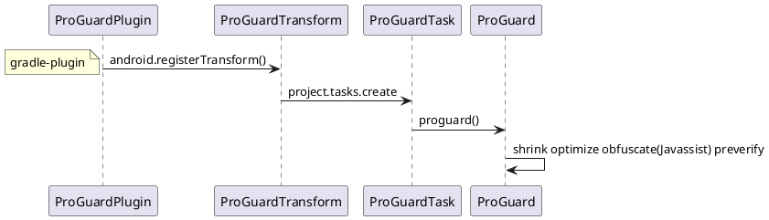

# 高效的稳健开发
1. 设计模式
稳定（单元测试）自动化（代码管理，编译打包），可分析（日志调试）可拓展（设计原则与模式）


## 稳定
Crash 和 ANR

 AndroidJunitRunner


### 代码Review：提高代码质量


### Android Lint、QAPlugins（Findbugs、Checkstyle、PMD）

### studio
[JetBrains intellij android](https://github.com/JetBrains/android.git)

```java
问题：The emulator process for AVD Pixel_2_API_29 was killed 
修改：C:\Users\anshu\.android\avd\Pixel_2_API_30.avd\config.ini
hw.gpu.enabled = no hw.gpu.mode = off


问题：你的主机中的软件中止了一个已建立的连接
解决：gradle 6.5 不支持热点

问题： gradle 下载慢
解决：http://services.gradle.org/distributions/
    放在user/.gradle/wrapper/dist/

安装插件导致卡顿 tools > customproperties
C:\Users\anshu\AppData\Roaming\Google\AndroidStudio4.1\plugins


wsl 安装sdk
下载commandlinetools-linux，根据所需版本，执行命令
sdkmanager "platform-tools" "build-tools;28.0.3" "platforms;android-28" "cmake;3.6.4111459" "ndk;22.0.7026061"  "ndk-bundle"

```

#### Gradle 5.3  支持kotlin
### 版本特性
[Android 版本与API level](https://developer.android.google.cn/studio/releases/platforms?hl=zh-cn)

[Android api level](https://developer.android.google.cn/guide/topics/manifest/uses-sdk-element?hl=zh-cn#top_of_page)
#### Android 11 API level 30
[行为变更：以 Android 11 为目标平台的应用](https://developer.android.google.cn/preview/behavior-changes-11?hl=zh-cn)

- [Android 11 中的隐私权（存储文件和用户数据、请求权限以及请求位置信息）](https://developer.android.google.cn/preview/privacy?hl=zh-cn)
#### Android 10 API level 29
[面向开发者的 Android 10](https://developer.android.google.cn/about/versions/10/highlights?hl=zh-cn#privacy_for_users)
- 折叠屏（resizeableActivity）
- 用户隐私设置：必须使用 MediaStore 来访问共享媒体文件；
⭐[分区存储，对外部存储空间的分区访问权限（应用专属目录和 MediaStore）](https://developer.android.google.cn/training/data-storage/use-cases)
⭐ 设备ID就不能获取，去掉了READ_PHONE_STATE权限，阻止设备跟踪 （OAID替换）
⭐ AndroidX代替v4,v7

#### Android  9 API level 28
[行为变更：以 API 级别 28 及更高级别为目标的应用](https://developer.android.google.cn/about/versions/pie/android-9.0-changes-28?hl=zh-cn)
- 支持最新的全面屏，其中包含为摄像头和扬声器预留空间的屏幕缺口。 通过 DisplayCutout 
- ImageDecoder 类，可提供现代化的图像解码方法。 使用该类取代 BitmapFactory 和 BitmapFactory.Options
- AnimatedImageDrawable类来绘制和显示GIF和WebP动画图像
- AMS：后台服务JobScheduler；后台进程不允许startService前台服务（IllegalStateException）；FLAG_ACTIVITY_NEW_TASK，才允许在非Activity场景启动Activity；
- webview多进程需要设置setDataDirectorySuffix
-  Android 9（API 级别 28）引入了新的电池管理功能：应用待机存储分区。[](https://developer.android.google.cn/topic/performance/appstandby)
⭐ 非可调用 sdk 接口限制
⭐ Http 明文请求
```java
        android:usesCleartextTraffic="true" 
        tls支持：
   public static OkHttpClient.Builder ignoreSSL (OkHttpClient.Builder builder) {
        builder.sslSocketFactory(createSSLSocketFactory())
            .hostnameVerifier((s, sslSession) -> true);
        return builder;
    }

    private static SSLSocketFactory createSSLSocketFactory () {

        SSLSocketFactory sSLSocketFactory = null;

        try {
            SSLContext sc = SSLContext.getInstance("TLS");
            sc.init(null, new TrustManager[]{new TrustAllManager()}, new SecureRandom());
            sSLSocketFactory = sc.getSocketFactory();
        } catch (Exception e) {
            LOGGER.info(e.getMessage(), e);
        }

        return sSLSocketFactory;
    }

    private static class TrustAllManager implements X509TrustManager {

        @Override
        public void checkClientTrusted (java.security.cert.X509Certificate[] x509Certificates,
            String s) throws java.security.cert.CertificateException {

        }

        @Override
        public void checkServerTrusted (java.security.cert.X509Certificate[] x509Certificates,
            String s) throws java.security.cert.CertificateException {

        }


        @Override
        public java.security.cert.X509Certificate[] getAcceptedIssuers () {
            return new X509Certificate[0];
        }
    }

```
#### Android  8 API level 26
[Android 8.0 变更](https://developer.android.google.cn/about/versions/oreo/android-8.0-changes?hl=zh-cn#back-all)

- ⭐后台执行Service限制，Notification Channels 创建一个用户可自定义的频道。
- 画中画
[Android 8.0（API 级别 26）及更高版本中，位图像素数据存储在原生堆中](https://developer.android.google.cn/topic/performance/graphics/manage-memory.html#save-a-bitmap-for-later-use)
 26 
@FastNative注解

- Safe Browsing API 的 WebView 实现
 ```xml
 <application>
            ...
            <meta-data android:name="android.webkit.WebView.EnableSafeBrowsing"
                       android:value="true" />
</application>
 ```

 ```java
superSafeWebView.startSafeBrowsing(this, new ValueCallback<Boolean>() {
            @Override
            public void onReceiveValue(Boolean success) {
                safeBrowsingIsInitialized = true;
                if (!success) {
                    Log.e("MY_APP_TAG", "Unable to initialize Safe Browsing!");
                }
            }
        });
 ```
#### Android  7 API Level 24
[Android 7.0 行为变更](https://developer.android.google.cn/about/versions/nougat/android-7.0-changes?hl=zh-cn)
- 低耗电
- 夜间模式
V2签名
Android 7.x中,PopupWindow高度为match_parent时,会出现兼容性问题,需要处理兼容性
⭐FileProvider访问文件
#### Android  6 API level 23
[Android 6.0 变更](https://developer.android.google.cn/about/versions/marshmallow/android-6.0-changes?hl=zh-cn)

- [Android 临时访问权限](https://www.jianshu.com/p/f15f956763c1)
⭐动态权限管理，IMEI可能获取不到
深层链接和 Android 应用链接
#### Android  5 API level 21 
[Android Lollipop](https://developer.android.google.cn/about/versions/lollipop?hl=zh-cn)
- Material Design
Art正式替代Dalvik VM
⭐Material Design风格，AppTheme，ToolBar 代替Actionbar 
#### Android  4 API level 14
[Android KitKat 4.4(api level 19)](https://developer.android.google.cn/about/versions/kitkat?hl=zh-cn)
⭐ VSYNC/Choreographer
⭐ Holo风格，Fragment，FragmentActivity，v7兼容低版本

#### Android 3
⭐ActionBar Theme.Holo AppCompatActivity

## 自动化（代码，编译，依赖，）
[](知识体系-存储-VCS.md)
Commit 审阅 if，系统版本，模块管理
Push   代码重用,多次提交Review

### 包内精简 - APK打包 （编译，打包，优化，签名，安装）
[包大小](https://mp.weixin.qq.com/s/_gnT2kjqpfMFs0kqAg4Qig?utm_source=androidweekly.io&utm_medium=website)
gradle,Transform的应用
批量打包
```打包流程
G: gradle build tools
B: android build tools
J: JDK tools


+--------------------------------------------------------------------------------------+
| /META-INF                                                                            |
| /assets                                                                              |
| /res                                                                                 |
| /libs                                                                                |
| class.dex                                                                            |
| resources.arsc                                                                       |
| AndroidManifest.xml                                                                  |
+--------------------------------------------------------------------------------------+
|G                                                                                     |
|    multiple agent tool                                                               |
+--------------------------------------------------------------------------------------+
|B                                                                                     |
|   zipalign                                                                           |
+--------------------------------------------------------------------------------------+
|J                                                                                     |
|   javasigner  V1, V2(N), V3(P)   /   bouncycastle                                    |
+--------------------------------------------------------------------------------------+
|G                                                                                     |
|   ApkBuilder (so,FontCreator)                                                        |
+--------------------+                          +--------------------------------------+
|B                   |                          |B                                     |
|  linker            |                          |    dex                               |
+--------------------------------------------------------------------------------------+
|B                   |B                         |G             +-----------------------+
|  bcc compat        |   AAPT                   |    proguard  |          Preveirfy    |
|                    |  (Lint,TinyPNG,tintcolor)|              |          Obfuscate    |
|                    |  (WebP,svg)              |              |          Optimize     |
|                    |                          |              |          Shrink       |
|                    |                          |              +-----------------------+
+--------------------+                          +--------------------------------------+
|B                   |                          |        J                             |
|  llvm-rs-cc        |                          +-------+    javac                     |
|                    |                          | R.java|                              |
|                    +--------------------------+--------------------------------------+
|                    |G                                 |B                             |
|                    | menifest/assets/resource merger  |    aidl                      |
+--------------------+-----------------------------------------------------------------+

```


### 打包自动化
walle
```
+---------------------------------------------------------------------------------------------+
|                                        walle-cli                                            |
|                                                                                             |
+---------------------------------------------------------------------------------------------+
|                         jcommander                                                          |
|                                                               Batch2Command                 |
|                                                                                             |
+---------------------------------------------------------------------------------------------+
|                                                                                             |
|                      ChannelReader                ChannelWriter                             |
|                                                                                             |
|                                                                                             |
|                      PayloadReader                                                          |
|                                                                                             |
+---------------------------------------------------------------------------------------------+
|                      ApkUtil                                                                |
|                         findApkSigningBlock()                                               |
+---------------------------------------------------------------------------------------------+

```

#### ProGuard
     代码混淆 -printmapping ，-applymapping
[ProGuard android ](https://github.com/Guardsquare/proguard.git)

[ProGuard java](https://github.com/Guardsquare/proguard-core.git)


```
aar 给主模块使用的代码混淆文件

        consumerProguardFiles 'consumer-rules.pro'

```
#### 资源打包 AAPT
     [aapt2 适配之资源 id 固定](https://fucknmb.com/2017/11/15/aapt2%E9%80%82%E9%85%8D%E4%B9%8B%E8%B5%84%E6%BA%90id%E5%9B%BA%E5%AE%9A/)
          aapt  -p public.xml
          aapt2 --stable-ids ,--emit-ids


## 可分析
调试和分析
异常处理
日志
### 日志 Timer 
### 日志埋点/布点 AspectJ
Android AspectJ 常用埋点
### 应用稳定性（Stability：how many failures an application exhibits）-异常及严苛模式
```
services/core/java/com/android/server/am/AppErrors.java:

StrictMode.setThreadPolicy(new StrictMode.ThreadPolicy.Builder()
                    .detectCustomSlowCalls() //API等级11，使用StrictMode.noteSlowCode
//                    .detectDiskReads()
//                    .detectDiskWrites()
                    .detectNetwork()   // or .detectAll() for all detectable problems
                    .penaltyDialog() //弹出违规提示对话框
                    .penaltyLog() //在Logcat 中打印违规异常信息
                    .penaltyFlashScreen() //API等级11
                    .build());
StrictMode.setVmPolicy(new StrictMode.VmPolicy.Builder()
        .detectLeakedSqlLiteObjects()
        .detectLeakedClosableObjects() //API等级11
        .penaltyLog()
        .detectFileUriExposure()
        .penaltyDeath()
        .build());
```
### （异常 错误 安全）反编译
[dex2jar](https://github.com/pxb1988/dex2jar)
[jd-gui](https://github.com/java-decompiler/jd-gui)
[Apktool](https://github.com/iBotPeaches/Apktool)
[jad（不维护）](http://www.kpdus.com/jad.html)

[ Crash防护](https://www.jianshu.com/p/01b69d91a3a8)
try{Looper.loop()}


### 手机交互命令
```sh
grep更适合单纯的查找或匹配文本，sed更适合编辑匹配到的文本，awk更适合格式化文本，对文本进行较复杂格式处理

adb 命令源码地址：
/system/core/adb/
/system/core/toolbox（getprop，cat GNU项目）
adb shell 命令源码地址（find -iname 'cmds'）：
/development/cmds/monkey
    /frameworks/av/cmds（）
/frameworks/base/cmds/(am pm bugreport dumpsys ime imput  )
    /frameworks/native/cmds/(bugreport)
    /frameworks/testing/uiautomator/cmds
```
#### system/core
adb shell "getprop ro.build.version.release"
adb shell "getprop ro.build.version.sdk"
#### MONKEY
1. monkey tools 测试
adb shell monkey -p com.bla.yourpackage -v 1000
adb -s 127.0.0.1:7555 shell monkey -p com.example.proj -s 1574490540 --hprof --throttle 200 -v -v -v 90000000 -pct-touch 60% --pct-motion 20% --pct-anyevent 20% --ignore-security-exceptions --kill-process-after-error --monitor-native-crashes >logs/20191123/142900/monkey.txt


adb -s 127.0.0.1:7555 shell monkey -p com.example.proj -s 1574490540 --hprof --throttle 200 -v -v -v 90000000 -pct-touch 60% --pct-motion 20% --pct-anyevent 20% --pct-nav 0% --pct-majornav 0% --ignore-security-exceptions --kill-process-after-error --monitor-native-crashes >logs/20191123/142900/monkey.txt

heisha:
adb -s 127.0.0.1:7555 shell monkey -p com.example.proj -s 9455 --throttle 300 -v -v -v 300000 --pct-appswitch  0 --ignore-security-exceptions --ignore-crashes --ignore-timeouts  --monitor-native-crashes

[--pkg-whitelist-file, /sdcard/systemwhitelist.txt, --ignore-crashes, --ignore-timeouts, --ignore-security-exceptions, --ignore-native-crashes, --monitor-native-crashes, --throttle, 500, -v, -v, -v, -s, 800, 570000]
[-p, com.example.proj, -s, 9455, --throttle, 300, --ignore-security-exceptions, --pct-appswitch, 0, --ignore-crashes, --ignore-timeouts, --ignore-native-crashes, -v, -v, -v, 300000]


停止 monkey
adb shell ps | awk '/com\.android\.commands\.monkey/ { system("adb shell kill " $2) }'

基础参数 | 事件参数 | 调试参数
|------:|---------:|---------:|
-v |     -pct-touch| -hprof   |
-s |            ...|--ignore-security-exceptions|
-p |               |       ...|
--throttle|  |  |

```java
    public static final int FACTOR_TOUCH        = 0;//点击
    public static final int FACTOR_MOTION       = 1;//滑动
    public static final int FACTOR_TRACKBALL    = 2;//滚动
    public static final int FACTOR_NAV          = 3;
    public static final int FACTOR_MAJORNAV     = 4;//back home menu
    public static final int FACTOR_SYSOPS       = 5;//物理按键
    public static final int FACTOR_APPSWITCH    = 6;//startActivity
    public static final int FACTOR_ANYTHING     = 7;
```


```
monkey network
adb forward tcp:1080 tcp:1080
adb shell monkey --port 1080
telnet 127.0.0.1 1080

```


2. 使用 adb 获取错误报告
adb bugreport E:/bugs/
3. anr文件
adb pull /data/anr/anr_2019-11-21-11-41-10-537 e:/bugs/

4. 日志
- ANR **(// NOT RESPONDING: )**,CRASH **(// CRASH: )**
- EXCEPTION,NullPointerException
- ERROR

[ChkBugReport日志报告](https://github.com/sonyxperiadev/ChkBugReport.git)
[ChkBugReport下载地址](https://github.com/sonyxperiadev/ChkBugReport/wiki/Where-to-obtain-it)
#### uiautomator
dump
events
runtest
#### am  pm 
```
adb shell am start -n com.android.music/com.android.music.MusicBrowserActivity

adb shell pm dump com.tencent.weread.eink | findstr “versionName”


adb shell pm list package

adb shell am kill <packagename>

If you want to kill the Sticky Service,the following command NOT WORKING:

adb shell am force-stop <PACKAGE>
adb shell kill <PID>
The following command is WORKING:

adb shell pm disable <PACKAGE>
If you want to restart the app,you must run command below first:

adb shell pm enable <PACKAGE>

```
#### dumpsys

```bash
adb shell dumpsys -T 60000 activity -v all
```
 
```java
问题：The emulator process for AVD Pixel_2_API_29 was killed 
修改：C:\Users\anshu\.android\avd\Pixel_2_API_30.avd\config.ini
hw.gpu.enabled = no hw.gpu.mode = off
 

adb shell dumpsys activity---------------查看ActvityManagerService 所有信息
adb shell dumpsys activity activities----------查看Activity组件信息
adb shell dumpsys activity services-----------查看Service组件信息
adb shell dumpsys activity providers----------产看ContentProvider组件信息
adb shell dumpsys activity broadcasts--------查看BraodcastReceiver信息
adb shell dumpsys activity intents--------------查看Intent信息
adb shell dumpsys activity processes---------查看进程信息


adb shell dumpsys activity activities | sed -En -e '/Running activities/,/Run #0/p'
adb shell dumpsys activity activities | sed -En -e '/Stack/p' -e '/Running activities/,/Run #0/p'

adb shell dumpsys activity providers | sed -En -e '/Stack/p' -e '/Running activities/,/Run #0/p'


adb shell  dumpsys window windows |grep "Window #"

```

### 手机交互工具
https://github.com/eleme/UETool

## 可拓展

### 可维护性/通讯 - 架构之模块化（插件化及组件化）
[](知识体系-平台-Android-desigin.md)
