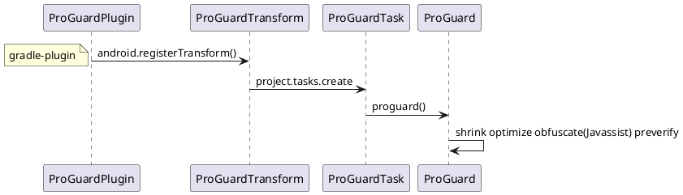

# 高效的稳健开发
1. 设计模式
稳定（单元测试）自动化（代码管理，编译打包），可分析（日志调试）可拓展（设计原则与模式）


## 稳定
Crash 和 ANR

 AndroidJunitRunner


### 代码Review：提高代码质量


### Android Lint、QAPlugins（Findbugs、Checkstyle、PMD）

### studio
[JetBrains intellij android](https://github.com/JetBrains/android.git)

```java
问题：The emulator process for AVD Pixel_2_API_29 was killed 
修改：C:\Users\anshu\.android\avd\Pixel_2_API_30.avd\config.ini
hw.gpu.enabled = no hw.gpu.mode = off


问题：你的主机中的软件中止了一个已建立的连接
解决：gradle 6.5 不支持热点

问题： gradle 下载慢
解决：http://services.gradle.org/distributions/
    放在user/.gradle/wrapper/dist/

安装插件导致卡顿 tools > customproperties
C:\Users\anshu\AppData\Roaming\Google\AndroidStudio4.1\plugins


wsl 安装sdk
下载commandlinetools-linux，根据所需版本，执行命令
sdkmanager "platform-tools" "build-tools;28.0.3" "platforms;android-28" "cmake;3.6.4111459" "ndk;22.0.7026061"  "ndk-bundle"

```

#### Gradle 5.3  支持kotlin
### 版本特性
[Android 版本与API level](https://developer.android.google.cn/studio/releases/platforms?hl=zh-cn)

[Android api level](https://developer.android.google.cn/guide/topics/manifest/uses-sdk-element?hl=zh-cn#top_of_page)
#### Android 11 API level 30
[行为变更：以 Android 11 为目标平台的应用](https://developer.android.google.cn/preview/behavior-changes-11?hl=zh-cn)

- [Android 11 中的隐私权（存储文件和用户数据、请求权限以及请求位置信息）](https://developer.android.google.cn/preview/privacy?hl=zh-cn)
#### Android 10 API level 29
[面向开发者的 Android 10](https://developer.android.google.cn/about/versions/10/highlights?hl=zh-cn#privacy_for_users)
- 折叠屏（resizeableActivity）
- 用户隐私设置：必须使用 MediaStore 来访问共享媒体文件；
⭐[分区存储，对外部存储空间的分区访问权限（应用专属目录和 MediaStore）](https://developer.android.google.cn/training/data-storage/use-cases)
⭐ 设备ID就不能获取，去掉了READ_PHONE_STATE权限，阻止设备跟踪 （OAID替换）
⭐ AndroidX代替v4,v7

#### Android  9 API level 28
[行为变更：以 API 级别 28 及更高级别为目标的应用](https://developer.android.google.cn/about/versions/pie/android-9.0-changes-28?hl=zh-cn)
- 支持最新的全面屏，其中包含为摄像头和扬声器预留空间的屏幕缺口。 通过 DisplayCutout 
- ImageDecoder 类，可提供现代化的图像解码方法。 使用该类取代 BitmapFactory 和 BitmapFactory.Options
- AnimatedImageDrawable类来绘制和显示GIF和WebP动画图像
- AMS：后台服务JobScheduler；后台进程不允许startService前台服务（IllegalStateException）；FLAG_ACTIVITY_NEW_TASK，才允许在非Activity场景启动Activity；
- webview多进程需要设置setDataDirectorySuffix
-  Android 9（API 级别 28）引入了新的电池管理功能：应用待机存储分区。[](https://developer.android.google.cn/topic/performance/appstandby)
⭐ 非可调用 sdk 接口限制
⭐ Http 明文请求

#### Android  8 API level 26
[Android 8.0 变更](https://developer.android.google.cn/about/versions/oreo/android-8.0-changes?hl=zh-cn#back-all)

- ⭐后台执行Service限制，Notification Channels 创建一个用户可自定义的频道。
- 画中画
[Android 8.0（API 级别 26）及更高版本中，位图像素数据存储在原生堆中](https://developer.android.google.cn/topic/performance/graphics/manage-memory.html#save-a-bitmap-for-later-use)
 26 
@FastNative注解

- Safe Browsing API 的 WebView 实现
 ```xml
 <application>
            ...
            <meta-data android:name="android.webkit.WebView.EnableSafeBrowsing"
                       android:value="true" />
</application>
 ```

 ```java
superSafeWebView.startSafeBrowsing(this, new ValueCallback<Boolean>() {
            @Override
            public void onReceiveValue(Boolean success) {
                safeBrowsingIsInitialized = true;
                if (!success) {
                    Log.e("MY_APP_TAG", "Unable to initialize Safe Browsing!");
                }
            }
        });
 ```
#### Android  7 API Level 24
[Android 7.0 行为变更](https://developer.android.google.cn/about/versions/nougat/android-7.0-changes?hl=zh-cn)
- 低耗电
- 夜间模式
V2签名
Android 7.x中,PopupWindow高度为match_parent时,会出现兼容性问题,需要处理兼容性
⭐FileProvider访问文件
#### Android  6 API level 23
[Android 6.0 变更](https://developer.android.google.cn/about/versions/marshmallow/android-6.0-changes?hl=zh-cn)

- [Android 临时访问权限](https://www.jianshu.com/p/f15f956763c1)
⭐动态权限管理，IMEI可能获取不到
深层链接和 Android 应用链接
#### Android  5 API level 21 
[Android Lollipop](https://developer.android.google.cn/about/versions/lollipop?hl=zh-cn)
- Material Design
Art正式替代Dalvik VM
⭐Material Design风格，AppTheme，ToolBar 代替Actionbar 
#### Android  4 API level 14
[Android KitKat 4.4(api level 19)](https://developer.android.google.cn/about/versions/kitkat?hl=zh-cn)
⭐ VSYNC/Choreographer
⭐ Holo风格，Fragment，FragmentActivity，v7兼容低版本

#### Android 3
⭐ActionBar Theme.Holo AppCompatActivity

## 自动化（代码，编译，依赖，）
[](知识体系-存储-VCS.md)
Commit 审阅 if，系统版本，模块管理
Push   代码重用,多次提交Review

### 包内精简 - APK打包 （编译，打包，优化，签名，安装）
[包大小](https://mp.weixin.qq.com/s/_gnT2kjqpfMFs0kqAg4Qig?utm_source=androidweekly.io&utm_medium=website)
gradle,Transform的应用
批量打包
```打包流程
G: gradle build tools
B: android build tools
J: JDK tools


+--------------------------------------------------------------------------------------+
| /META-INF                                                                            |
| /assets                                                                              |
| /res                                                                                 |
| /libs                                                                                |
| class.dex                                                                            |
| resources.arsc                                                                       |
| AndroidManifest.xml                                                                  |
+--------------------------------------------------------------------------------------+
|G                                                                                     |
|    multiple agent tool                                                               |
+--------------------------------------------------------------------------------------+
|B                                                                                     |
|   zipalign                                                                           |
+--------------------------------------------------------------------------------------+
|J                                                                                     |
|   javasigner  V1, V2(N), V3(P)   /   bouncycastle                                    |
+--------------------------------------------------------------------------------------+
|G                                                                                     |
|   ApkBuilder (so,FontCreator)                                                        |
+--------------------+                          +--------------------------------------+
|B                   |                          |B                                     |
|  linker            |                          |    dex                               |
+--------------------------------------------------------------------------------------+
|B                   |B                         |G             +-----------------------+
|  bcc compat        |   AAPT                   |    proguard  |          Preveirfy    |
|                    |  (Lint,TinyPNG,tintcolor)|              |          Obfuscate    |
|                    |  (WebP,svg)              |              |          Optimize     |
|                    |                          |              |          Shrink       |
|                    |                          |              +-----------------------+
+--------------------+                          +--------------------------------------+
|B                   |                          |        J                             |
|  llvm-rs-cc        |                          +-------+    javac                     |
|                    |                          | R.java|                              |
|                    +--------------------------+--------------------------------------+
|                    |G                                 |B                             |
|                    | menifest/assets/resource merger  |    aidl                      |
+--------------------+-----------------------------------------------------------------+

```


### 打包自动化
walle
```
+---------------------------------------------------------------------------------------------+
|                                        walle-cli                                            |
|                                                                                             |
+---------------------------------------------------------------------------------------------+
|                         jcommander                                                          |
|                                                               Batch2Command                 |
|                                                                                             |
+---------------------------------------------------------------------------------------------+
|                                                                                             |
|                      ChannelReader                ChannelWriter                             |
|                                                                                             |
|                                                                                             |
|                      PayloadReader                                                          |
|                                                                                             |
+---------------------------------------------------------------------------------------------+
|                      ApkUtil                                                                |
|                         findApkSigningBlock()                                               |
+---------------------------------------------------------------------------------------------+

```

#### ProGuard
     代码混淆 -printmapping ，-applymapping
[ProGuard android ](https://github.com/Guardsquare/proguard.git)

[ProGuard java](https://github.com/Guardsquare/proguard-core.git)


```
aar 给主模块使用的代码混淆文件

        consumerProguardFiles 'consumer-rules.pro'

```
#### 资源打包 AAPT
     [aapt2 适配之资源 id 固定](https://fucknmb.com/2017/11/15/aapt2%E9%80%82%E9%85%8D%E4%B9%8B%E8%B5%84%E6%BA%90id%E5%9B%BA%E5%AE%9A/)
          aapt  -p public.xml
          aapt2 --stable-ids ,--emit-ids


## 可分析
### 日志 Timer 
### 日志埋点/布点 AspectJ
Android AspectJ 常用埋点
### 应用稳定性（Stability：how many failures an application exhibits）-异常及严苛模式
```
services/core/java/com/android/server/am/AppErrors.java:

StrictMode.setThreadPolicy(new StrictMode.ThreadPolicy.Builder()
                    .detectCustomSlowCalls() //API等级11，使用StrictMode.noteSlowCode
//                    .detectDiskReads()
//                    .detectDiskWrites()
                    .detectNetwork()   // or .detectAll() for all detectable problems
                    .penaltyDialog() //弹出违规提示对话框
                    .penaltyLog() //在Logcat 中打印违规异常信息
                    .penaltyFlashScreen() //API等级11
                    .build());
StrictMode.setVmPolicy(new StrictMode.VmPolicy.Builder()
        .detectLeakedSqlLiteObjects()
        .detectLeakedClosableObjects() //API等级11
        .penaltyLog()
        .detectFileUriExposure()
        .penaltyDeath()
        .build());
```
### （异常 错误 安全）反编译
[dex2jar](https://github.com/pxb1988/dex2jar)
[jd-gui](https://github.com/java-decompiler/jd-gui)
[Apktool](https://github.com/iBotPeaches/Apktool)
[jad（不维护）](http://www.kpdus.com/jad.html)

[ Crash防护](https://www.jianshu.com/p/01b69d91a3a8)
try{Looper.loop()}


### 手机交互命令
```sh
grep更适合单纯的查找或匹配文本，sed更适合编辑匹配到的文本，awk更适合格式化文本，对文本进行较复杂格式处理

adb 命令源码地址：
/system/core/adb/
/system/core/toolbox（getprop，cat GNU项目）
adb shell 命令源码地址（find -iname 'cmds'）：
/development/cmds/monkey
    /frameworks/av/cmds（）
/frameworks/base/cmds/(am pm bugreport dumpsys ime imput  )
    /frameworks/native/cmds/(bugreport)
    /frameworks/testing/uiautomator/cmds
```
#### system/core
adb shell "getprop ro.build.version.release"
adb shell "getprop ro.build.version.sdk"
#### MONKEY
1. monkey tools 测试
adb shell monkey -p com.bla.yourpackage -v 1000
adb -s 127.0.0.1:7555 shell monkey -p com.example.proj -s 1574490540 --hprof --throttle 200 -v -v -v 90000000 -pct-touch 60% --pct-motion 20% --pct-anyevent 20% --ignore-security-exceptions --kill-process-after-error --monitor-native-crashes >logs/20191123/142900/monkey.txt


adb -s 127.0.0.1:7555 shell monkey -p com.example.proj -s 1574490540 --hprof --throttle 200 -v -v -v 90000000 -pct-touch 60% --pct-motion 20% --pct-anyevent 20% --pct-nav 0% --pct-majornav 0% --ignore-security-exceptions --kill-process-after-error --monitor-native-crashes >logs/20191123/142900/monkey.txt

heisha:
adb -s 127.0.0.1:7555 shell monkey -p com.example.proj -s 9455 --throttle 300 -v -v -v 300000 --pct-appswitch  0 --ignore-security-exceptions --ignore-crashes --ignore-timeouts  --monitor-native-crashes

[--pkg-whitelist-file, /sdcard/systemwhitelist.txt, --ignore-crashes, --ignore-timeouts, --ignore-security-exceptions, --ignore-native-crashes, --monitor-native-crashes, --throttle, 500, -v, -v, -v, -s, 800, 570000]
[-p, com.example.proj, -s, 9455, --throttle, 300, --ignore-security-exceptions, --pct-appswitch, 0, --ignore-crashes, --ignore-timeouts, --ignore-native-crashes, -v, -v, -v, 300000]


停止 monkey
adb shell ps | awk '/com\.android\.commands\.monkey/ { system("adb shell kill " $2) }'

基础参数 | 事件参数 | 调试参数
|------:|---------:|---------:|
-v |     -pct-touch| -hprof   |
-s |            ...|--ignore-security-exceptions|
-p |               |       ...|
--throttle|  |  |

```java
    public static final int FACTOR_TOUCH        = 0;//点击
    public static final int FACTOR_MOTION       = 1;//滑动
    public static final int FACTOR_TRACKBALL    = 2;//滚动
    public static final int FACTOR_NAV          = 3;
    public static final int FACTOR_MAJORNAV     = 4;//back home menu
    public static final int FACTOR_SYSOPS       = 5;//物理按键
    public static final int FACTOR_APPSWITCH    = 6;//startActivity
    public static final int FACTOR_ANYTHING     = 7;
```


```
monkey network
adb forward tcp:1080 tcp:1080
adb shell monkey --port 1080
telnet 127.0.0.1 1080

```


2. 使用 adb 获取错误报告
adb bugreport E:/bugs/
3. anr文件
adb pull /data/anr/anr_2019-11-21-11-41-10-537 e:/bugs/

4. 日志
- ANR **(// NOT RESPONDING: )**,CRASH **(// CRASH: )**
- EXCEPTION,NullPointerException
- ERROR

[ChkBugReport日志报告](https://github.com/sonyxperiadev/ChkBugReport.git)
[ChkBugReport下载地址](https://github.com/sonyxperiadev/ChkBugReport/wiki/Where-to-obtain-it)
#### uiautomator
dump
events
runtest
#### am  pm 
```
adb shell am start -n com.android.music/com.android.music.MusicBrowserActivity

adb shell pm dump com.tencent.weread.eink | findstr “versionName”


adb shell pm list package

adb shell am kill <packagename>

If you want to kill the Sticky Service,the following command NOT WORKING:

adb shell am force-stop <PACKAGE>
adb shell kill <PID>
The following command is WORKING:

adb shell pm disable <PACKAGE>
If you want to restart the app,you must run command below first:

adb shell pm enable <PACKAGE>

```
#### dumpsys

```bash
adb shell dumpsys -T 60000 activity -v all
```
 
```java
问题：The emulator process for AVD Pixel_2_API_29 was killed 
修改：C:\Users\anshu\.android\avd\Pixel_2_API_30.avd\config.ini
hw.gpu.enabled = no hw.gpu.mode = off
 

adb shell dumpsys activity---------------查看ActvityManagerService 所有信息
adb shell dumpsys activity activities----------查看Activity组件信息
adb shell dumpsys activity services-----------查看Service组件信息
adb shell dumpsys activity providers----------产看ContentProvider组件信息
adb shell dumpsys activity broadcasts--------查看BraodcastReceiver信息
adb shell dumpsys activity intents--------------查看Intent信息
adb shell dumpsys activity processes---------查看进程信息


adb shell dumpsys activity activities | sed -En -e '/Running activities/,/Run #0/p'
adb shell dumpsys activity activities | sed -En -e '/Stack/p' -e '/Running activities/,/Run #0/p'

adb shell dumpsys activity providers | sed -En -e '/Stack/p' -e '/Running activities/,/Run #0/p'


adb shell  dumpsys window windows |grep "Window #"

```
## 可拓展

### 可维护性/通讯 - 架构之模块化（插件化及组件化）
[](知识体系-平台-Android-desigin.md)

### RxJava
### 概念与设计模式
ReactiveX provides a collection of operators with which you can filter, select, transform, combine, and compose Observables.
```
定时分发：注册倒计时
过滤：点击防抖过滤/搜索词防抖过滤
数据/流切换：缓存优先，数据转化
异常处理：异常重试机制，token处理
调度：线程调度，时间调度，生命周期管理及观察
+--------------------------------------------------------------------------------------------------------------------------------------------------------------+
|  Create/Defer⭐  Debounce/throttleFirst⭐                                           SubscribeOn                                                             |
|  Just/From       Distinct                                                             /ObserveOn⭐                                                           |
|  Empty           First/Last                       Map/FlatMap                        Backpressure                                                            |
|  /Never          ElementAt          All           /ConcatMap⭐                        Subscribe                                                              |
|  /*Throw         IgnoreElement      *Amb          Window                                Delay/Timeout   And/Then/When                                         |
|                                  Contains         Buffer                               TimeInterval     CombineLatest⭐  Concat⭐                            | 
| Interval/Timer⭐ Filter         DefaultIfEmpty                                          /Timestamp        Merge            *Average                           |
|                  Sample        *SequenceEqual                                                                StartWith     Count                              |
|  Range           Skip/Take                                                             Serialize          *Join            *Max                   Connect     |
|  *Repeat         TakeLast/TakeLastTimed           Scan           onErrorResumeNext⭐    Materialize      *Switch         *Min                  Publish        |
|  *Start          TakeLastOne                      GroupBy          Catch              /Dematerialize    *Zip            Reduce                RefCount         |
|                  /TakeUntilPredicate        switchIfEmpty⭐     retryWhen⭐            Using             *Sum                                   Replay     to |
|                  TakeUntil/TakeWhile⭐                                                Do                                                                      |
+---------------------------------------------------------------------------------------------------------------------------------------------------------------+
|  Creating        Filtering     Conditional   Transforming      Error                  Utility        Combining       Mathematical                             |
|                                and Boolean                     Handling                                              and Aggregate        Connectable  Con^ert|
+---------------------------------------------------------------------------------------------------------------------------------------------------------------

```

静态代理
    构建时，Observable静态代理上游订阅方法subscribe
    subscribe订阅时，upstream订阅，Observer静态代理下游的观察者方法


门面模式 Observer,flowable,single,maby,completation

适配器   
静态代理 
      
      Observable 代理上游方法，Observer代理下游方法

命令 Publisher#subscribe，ObservableSource#subscribe
观察者模式 rx.Observer#onNext；rx.Observer#onCompleted；
策略 BackpressureStrategy（MissingEmitter，ErrorAsyncEmitter，DropAsyncEmitter...)

装饰者
      创建操作类，添加构造参数，装饰Observable，增加 subscribeActual 功能
      过滤操作类，装饰观察者类，上游可以发送数据时，下游的观察类，onNext增加功能
      Call CallEnqueueOnSubscribe#call()


模板方法
        flowable，observable，
        single，completable，maybe，
        mixed，parallel
### 搜索业务（debounce，switchMap）
 
```java
        mSubscribe = Observable.unsafeCreate((Observable.OnSubscribe<String>) subscriber -> mSearch = subscriber)
                .debounce(400, TimeUnit.MILLISECONDS, AndroidSchedulers.mainThread())
                .subscribeOn(AndroidSchedulers.mainThread())
                .filter(key -> key.toString().trim().length() > 0)
                .switchMap((Func1<String, Observable<List<Result>>>) key -> searchObservable(key))//避免每次搜索都要重新设置监听
                .subscribeOn(Schedulers.io())
                .observeOn(AndroidSchedulers.mainThread())
                .subscribe(results -> {
                    mSearchListener.onSearchComplete();
                }, throwable -> throwable.printStackTrace());

       mSearch.onNext(key);         
```

###  Rxjava，线程切换 ，异步执行耗时代码
流式构建，订阅及观察事件传递
flowable，observable，single，maybe，completable，mixed，parallel
响应式设计模式：
  异步方法调用：
  回调；
  集合管道：filter、map和reduce
  流接口：编写具有自然语言一样可读性的代码，即方法链
  基于事件的异步模式：执行多个操作，每个操作完成后接收通知
  事件驱动的架构：
  毒丸模式：
  生产者消费者：
  承诺模式：
  Reactor模式：处理一个或多个客户端同时传递到应用程序的服务请求


[rx操作符](http://reactivex.io/documentation/operators.html)

### 线程问题
RxJava 使用 SchedulerPoolFactory 是管理 ScheduledExecutorServices的创建及清除
 System.setProperty("rx2.purge-period-seconds", "1");//默认一秒建议延长
或
 System.setProperty("rx2.purge-enabled", false);


### Rxjava Scheduler / Worker / Runnable 
```
+-----------------+---------------------------------------------------------------------------+
|                 |                             Schedulers                                    |
+--------------------------------------+------------------------------------------------------+
|                 |computation() |io() | trampoline() |newThread()|  single() |from(Executor) |
+---------------------------------------------------------------------------------------------+
|  corePoolSize   |              |1    |              |           |           |               |
+---------------------------------------------------------------------------------------------+
|  maximumPoolSize|              |     |              |           |           |               |
+---------------------------------------------------------------------------------------------+
|  keepAliveTime  |              |     |              |           |           |               |
|                 |              |     |              |           |           |               |
+---------------------------------------------------------------------------------------------+
|  unit           |              |     |              |           |           |               |
+---------------------------------------------------------------------------------------------+
|  workQueue      |              |     |              |           |           |               |
+-----------------+--------------+-----+--------------+-----------+-----------+---------------+


                    RxThreadFactory :ThreadFactory
                         Thread newThread()


 //RxComputationThreadPool          //RxSchedulerPurge
ComputationScheduler :Scheduler     SchedulerPoolFactory


 //RxCachedThreadScheduler
 //RxCachedWorkerPoolEvictor
 IoScheduler :Scheduler
                                                    CachedWorkerPool                                
 //RxNewThreadScheduler                                   evictorService:ScheduledExecutorService
 NewThreadScheduler :Scheduler                            allWorkers:CompositeDisposable
                                                          createWorker():Worker
 //RxSingleScheduler                                      expiringWorkerQueue:ConcurrentLinkedQueue<ThreadWorker> 
 SingleScheduler :Scheduler                         ThreadWorker: NewThreadWorker

                                                    EventLoopWorker:Scheduler.Worker//访问者模式，访问threadworker
                                                          threadWorker:ThreadWorker
                                                          schedule(run:Runnable):Disposable

                                                    ScheduledRunnable :AtomicReferenceArray,Runnable


FlowableSubscribeOn
       scheduler:Scheduler
```
线程间切换
### 背压
 
MISSING（配合onBackPressure，达到后面四种效果）、BUFFER（接收性能比Observable低）、ERROR、DROP、LATEST


### 源码
[Rxjava ](./知识体系-理论-OOAD-Observer.md)

+----------------------------------------------------------------------------------+
|                                                                                  |
|       subscribOn()//upstream first effict                                        |
|                                                                                  |
|       observeOn()//downstream effect                                             |
|                                                                                  |
|                          newThread():Scheduler     HandlerScheduler:Scheduler    |
|                                                                                  |
|                          ScheduledFutureTask       ScheduledRunnable:Runnable    |
|                                                                                  |
+----------------------------------------------------------------------------------+

Rxjava 
工厂方法 构建Observer，通过Observable，Single，Maybe，Completable构建**io.reactivex.rxjava3.internal.operators包**内的 Observable 对象
模板模式
      public interface Observer<@NonNull T> { 
          void onSubscribe(@NonNull Disposable d); 
          void onNext(@NonNull T t); 
          void onError(@NonNull Throwable e); 
          void onComplete();

      }

      public interface Subscriber<T> { 
          public void onSubscribe(Subscription s); 
          public void onNext(T t); 
          public void onError(Throwable t); 
          public void onComplete();
      }

代理模式 onSubscribe()代理subscribeActual()方法，subscribeActual(Observer<? super T> observer)调用的时候，用装饰模式装饰当前的observer
装饰模式 Observer装饰下游 Observer的 subscribe() 方法，装饰调度器

RxJava2.0是非常好用的一个异步链式库,响应式编程，遵循观察者模式。
```
  001_Jersey              697fd66aae9beed107e13f49a741455f1d9d8dd9 Initial commit, working with Maven Central
* 002_rx                  87cfa7a445f7659ef46d1a6a4eb38daa46f5c97a Initial commit
  003_Observer_Observable 2a4122c11b95eaa3213c2c3e54a93d28b9231eec Rename to Observer/Observable
  004_refactoring         9d48f996e4ee55e89dc3c60d9dd7a8d644316140 Refactoring for consistent implementation approach.
                         Observable静态代理，Observer适配器模式，Func通过桥接Observer的具体实现，operations为Observable的子类
                        +----------------------------------------------------------------------------+ 
                        |AtomicObserverSingleThreaded AtomicObserverMultiThreaded                    |decorate pattern
                        |                      AtomicObserver                                        |state pattern
                        |  ToObservableIterable                                                      |
                        +----------------------------------------------------------------------------+ 
                        |Observable<T>           Observer<T>       Subscription                      |
                        |  subscribe(Observer<T>)   onCompleted()      unsubscribe()                 |
                        |                            onError()                        Func0<R>       |
                        |                            onNext(T)     Notification<T>     call():R      | 
                        +----------------------------------------------------------------------------+
                        |                     reactive                           functions operations| 
                        +----------------------------------------------------------------------------+
  005_languageAdapter     f57a242b17f1214142dea97c0cb9049b106378a0 LanguageAdaptor for Function execution
  006_readme              fbbac394fbc2e0af4ef3a507ad3e15dd18bfb10c Create README.md
  007_gh-pages            6797c4384d91a2567cf0b429ccbd8053c72b716f Create gh-pages branch via GitHub
  008_performace          787d8fc0215c5bab541f61c2d69a91753d462559 Refactoring towards performance improvements
                          gradle
  009_example             b61b7607e0f2b00a0d36672a95999f1fb081dbf1 Start of examples with clojure and groovy
  010_readme              10fe96474a6ab4ec62c7cab50fb376a173bda78e Create README.md
  012_0.1.2               74da0769266a8fd5832e558f1a6e0081895b9201 Gradle Release Plugin - pre tag commit:  'rxjava-0.1.2'.
  013_takeLast                      4c5c41364411e062d5d71f22ce311700d045821b TakeLast basic implementation
  014_RxJavaPlugins                 ee001549ef06f17f38139b4cfecd4ce4445ecb6d RxJavaErrorHandler Plugin
  015_operationNext                 d72c5892774a2c67327e07943f6b92416317871f Implemented Operation Next
  062_schedulers                    dfc784126f259361f01f1927f44f5d1aa4e49a43 Naive schedulers implementation
  063_RxJavaObservableExecutionHook c2a40bd1a391edf7f8b71965ca20fa84c72c0bb4 RxJavaObservableExecutionHook
  064_multicast                     0499cffcb53f928a5083f701603ccf3ec3c81c60 Multicast implemented
  065_sample                        1aa722d3379df88d05c9455d7630b7236edb9d9b Merge pull request #248 from jmhofer/sample
  066_throttle                      2ea065c0ef22ea7cf58e9fb6d6f24c69f365bed6 Created and wired an implementation for the throttle operation on Observables.
  067_AndroidSchedulers             3919547f1e5f7940974e383f4f573e48cac7e09b Expose main thread scheduler through AndroidSchedulers class
  068_window                        5789894638a62ac17b5276053e3bea8bdd570580 Merge window operator commit to master
  069_debound_throttleWithTimeout   5fabd5883561ff18b18b0d1dfb7001e2959cb11d Use 'debounce' as proper name for ThrottleWithTimeout which unfortunately is the poorly named Rx Throttle operator.
  070_ApachHttpAsyncClient          db2e08ca039c59d51349255c4b8b3c65b26d52de Observable API for Apache HttpAsyncClient 4.0
  071_AndroidObservables            715dcece5c781c394b59f86e32f1f514fc9f7a31 Drop use of WeakReferences and use a custom subscription instead
  072_backwards                     abff40fd0a40bee4f97b0363014e98aecb50d7ff Backwards compatible deprecated rx.concurrency classes
  073_single                        96064c37af520de375929ae8962c527dd869ad57 Implement the blocking/non-blocking single, singleOrDefault, first, firstOrDefault, last, lastOrDefault
  074_subscribeOn                   89bb9dbdf7e73c8238dc4a92c8281e8ca3a5ec53 Reimplement 'subscribeOn' using 'lift'
  075_observeOn                     9e2691729d94f00cde97efb0b39264c2f0c0b7f5 ObserveOn Merge from @akarnokd:OperatorRepeat2
  076_RxJavaSchedulers              d07d9367911d8ec3d0b65846c8707e0a41d1cf1f RxJavaSchedulers Plugin
  077_math-module                   68d40628a78db18ecb49d880798f1a03551ccd59 math-module
  078_operatorSerialize             4427d03db0d8ba67137654447c6c7a57615c0b00 OperatorSerialize
* 079_contrib-math                  26a4a1a05a6cc367061639fb19bfdda9d5b97fab Operators of contrib-math
  100_1.0.0-rc.1          6de88d2a39e2ae84744cd1f350e28bef4de7dacb Travis build image
                        observeOn 切换了消费者的线程，因此内部实现用队列存储事件。
                        +-----------------------------------------------------------------------+-------------------+
                        |AtomicObserverSingleThreaded AtomicObserverMultiThreaded               |                   |
                        |                      AtomicObserver                                   |                   |
                        |  ToObser^ableIterable                                                 |OperatorSubscribeOn|
                        +-----------------------------------------------------------------------+                   |
                        |ObservablevTv           ObservervTv       Subscription                 |OperatorObserveOn  |
                        |  subscribe(Observer<T>)    onCompleted()     unsubscribe()            |                   |
                        |  observeOn(Scheduler)      onError()                        Func0<R>  +-------------------+
                        |                            onNext(T)     Notification<T>     call():R |      schedulers   |
                        |                                                                       |                   |
                        +-------------------------------------------------------------------------------------------+
                        |                     reactive                                          |      plugins      |
                        +-----------------------------------------------------------------------+-------------------+
                        |                                         functions operations                              |
                        +-------------------------------------------------------------------------------------------+

  200_v2.0.0-RC1          fa565cb184d9d7d45c257afa1fbbec6ab488b1cf Update changes.md and readme.md
                        Disposable装饰Observer，使得Observer可以销毁。ObservableSource,CompletableSource， MaybeSource<T>,SingleSource<T>,FlowableProcessor。
                        io.reactivex.Flowable：发送0个N个的数据，支持Reactive-Streams和背压。Flowable.subscribe(4 args)
                        io.reactivex.Observable：发送0个N个的数据，Rx 2.0 中，不支持背压，Observable.subscribe(4 args)
                        io.reactivex.Single：只能发送单个数据或者一个错误，不支持背压。 Single.toCompletable()
                        io.reactivex.Completable：没有发送任何数据，但只处理 onComplete 和 onError 事件，不支持背压。 Completable.blockingGet()
                        io.reactivex.Maybe：能够发射0或者1个数据，要么成功，要么失败，不支持背压。Maybe.toSingle(T)
                        RxJavaPlugins 转化Obserable.
                        +----------------------------------------------------------------------------+---------------+-------------------+
                        |  FromArrayDisposable                                                       |               |                   |
                        |  ObservableFromArray                                                       |               |                   |
                        +----------------------------------------------------------------------------+               |                   |
                        |                             RxJavaPlugins                                  |               |                   |
                        |                                      apply(Function<T, R> f, T t)          |               |                   |
                        +----------------------------------------------------------------------------+               |                   |
                        |ObservablevTv:ObservableSource          ObservervTv           Disposable    |               |OperatorSubscribeOn|
                        |             subscribe(Observer<T>)         onCompleted()       dispose()   |               |                   |
                        |   subscribeWith(Observer<T>)               onError()           isDisposed()|Function<T, R> |OperatorObserveOn  |
                        |   subscribeActual(ObservervT>)             onNext(T)                       | apply(T):R    |                   |
                        |                                            onSubscribe(Disposable)         |               +-------------------+
                        |                                                                            +---------------+      schedulers   |
                        |                             RxJavaPlugins                                  |   functions   |                   |
                        +----------------------------------------------------------------------------+-----------------------------------+
                        |                                         functions operations                               |      plugins      |
                        +----------------------------------------------------------------------------------------------------------------+
                        |                     reactive-streams      jmh                                              |                   |
                        +--------------------------------------------------------------------------------------------+-------------------+

* 300_v3.0.0-RC0          fb37226be292c8ee0934311f8ca2f139dfd0dc5a 3.x: remove no-arg, dematerialize(); remove replay(Scheduler) variants (#6539)
                        io.reactivex.rxjava3


[reactivestreams](https://github.com/reactive-streams/reactive-streams-jvm.git)
  001_scala           e58fed62249ad6fbd36467d1bbe5c486f31a8c0e Initial implementation
  020_java            6e5c63f3492524c21fda0bc1a08d72b52c9e9692 Reimplements the SPI and API in Java
  021_tck_java        3e67969207994b8e34ff49dffbf9fe3ac2d51284 !tck #12 Migrated TCK to plain Java
  022_api_spi_example f3a43863bd7c370a1f292a456eddcd1e9d226738 API/SPI Combination and Examples
* 101_gradle          dddbd3a52fcb7d71059a30760b5e77127c785c7c fix #96
                        +-------------------------------------------------------------------+--------+
                        |                                                                   |        |
                        |        Processor<T, R> :Subscriber<T>, Publisher<R>               |        |
                        +-------------------------------------------------------------------+        |
                        |                                                                   |        |
                        |  Publisher<T>                Subscriber<T>          Subscription  |        |
                        |     subscribe(Subscriber<T>)    onSubscribe()           cancel()  |        |
                        |                                 onNext(T)                         |        |
                        |                                 onComplete()                      |        |
                        |                                 onError(Throwable)                |        |
                        +-------------------------------------------------------------------+        |
                        |                       api                                         |  tck   |
                        +-------------------------------------------------------------------+--------+

```

```

+--------------------------+        +----------------------------+       +------------------------------+
|                          |        |                            |       |                              |
|     create layer         |        |     subscribe call layer   |       |    execute call layer        |
|                          |        |                            |       | (subscriber/observer method) |
+--------------------------+        +----------------------------+       +------------------------------+
|                          |        |                            |       |                              |
|    +---------------+     |        |    +-------------------+   |       |     +---------------------+  |
|    |    create()   |     |        |    |                   |   |       |     |                     |  |
|    |     just()    |     |        |    |subscribe(observer)|---------------> |   call()            |  |
|    |     from()    |     |        |    |                   |   |       |     |                     |  |
|    +-------+-------+     |        |    +-------------------+   |       |     +---------+-----------+  |
|            |             |        |                            |       |               |              |
|            |             |        |             ^              |       |               v              |
|            v             |        |             |              |       |                              |
|                          |        |             |              |       |     +---------------------+  |
|    +---------------+     |        |    +--------+----------+   |       |     |                     |  |
|    | map<Obj,Str>()|     |        |    |                   |   |       |     |   onNext()          |  |
|    | flatMap ()    |     |        |    |subscribe(observer)|   |       |     |                     |  |
|    |  compose()    |     |        |    |                   |   |       |     +----------+----------+  |
|    +-------+-------+     |        |    +-------------------+   |       |                |             |
|            |             |        |                            |       |                v             |
|            v             |        |             ^              |       |                              |
|                          |        |             |              |       |                              |
|    +---------------+     |        |    +--------+----------+   |       |     +---------------------+  |
|    |               |     |        |    |                   |   |       |     |                     |  |
|    |   observeOn() | +---------------> |subscribe(observer)|   |       |     |   switch thread     |  |
|    | subscribeOn(  |     |        |    |                   |   |       |     |                     |  |
|    |   Schedulers) |     |        |    +-------------------+   |       |     +---------------------+  |
|    +---------------+     |        |                            |       |                              |
|                          |        |                            |       |                              |
+--------------------------+        +----------------------------+       +------------------------------+

```

需要有订阅，Observable才会执行

背压策略：即生产者的速度大于消费者的速度带来的问题，比如在Android中常见的点击事件，点击过快则经常会造成点击两次的效果。
Flowable背压策略
```
onBackpressureBuffer()
onBackpressureDrop()
onBackpressureLatest() 

```
[Rxjava Operater](https://github.com/ReactiveX/RxJava/wiki/Alphabetical-List-of-Observable-Operators)
```
+----------------------------------+--------------------------------------+----------------+-----------------------+
|                                  |                                      |                |                       |
|deferFuture( )    runAsync( )     | getIterator( )                       |                |                       |
|                                  | toIterable( )      mostRecent( )     |                | stringConcat( )       |
|startFuture( )    fromRunnable( ) |  toFuture( )       lastOrDefault( )  |                |                       |
|                                  | singleOrDefault( ) last( )           |                | join( )   split( )    |
|toAsync( )        fromCallable( ) |  single( )         firstOrDefault( ) |                |                       |
|or asyncAction( )                 |                    first( )          |                | encode( )   from( )   |
|or asyncFunc( )   fromAction( )   |  latest( )                           | Flowable       |                       |
|                                  |                    forEach( )        |                | decode( )   byLine( ) |
|start( )          forEachFuture( )|   next( )                            |                |                       |
+------------------------------------------------------------------------------------------------------------------+
|        Async                     |             Blocking Observable      | Parallel flows |    String             |
+----------------------------------+--------------------------------------+----------------+-----------------------+


```