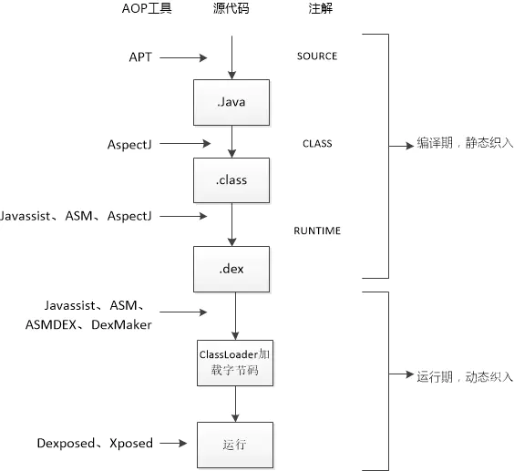

## 代码织入

java->class>dex->classloader->runtime

###  classloader

[设计模式](https://java-design-patterns.com/patterns/)
#### 反射
```java
fiedlclass.setAccessible(true); //访问private
Field modifersField = Field.class.getDeclaredField("modifiers");
modifersField.setAccessible(true);
// 把指定的field中的final修饰符去掉
modifersField.setInt(field, field.getModifiers() & ~Modifier.FINAL);
```
###  运行时

#### Proxy

```
+----------------------------------------------------------------------------------------------+
|                       Proxy                           InvocationHandler                      |
|                          defineClass0()                        invoke()                      |
|                           h:InvocationHandler                                                |
|                                                                                              |
+----------------------------------------------------------------------------------------------+
|   ProxyGenerator                                Proxy.c                                      |
|        generateProxyClass():byte[]                Java_java_lang_reflect_Proxy_defineClass0()|
|        generateClassFile():byte[]               jni.cpp                                      |
|                                                    jni_DefineClass()                         |
|        proxyMethods:Map                                                                      |
|        addProxyMethod()                         classFileParser.cpp                          |
|        generateConstructor():MethodInfo            parseClassFile()                          |
|        generateStaticInitializer() :MethodInfo                                               |
|        cp:ConstantPool                                                                       |
|        saveGeneratedFiles:boolean                                                            |
|                                                                                              |
+----------------------------------------------------------------------------------------------+
|  DataOutputStream                                      .ConstantPool                         |
|  ByteArrayOutputStream                                                                       |
+----------------------------------------------------------------------------------------------+
|                         //generatorclass:Proxy::Interfaces                                   |
|                          com.sun.proxy.$Proxy4.class:Proxy::CustomInterface                  |
|                                hashcode,tostring,equals:Method                               |
+----------------------------------------------------------------------------------------------+


```
### 模块化

### 组件

### 数据路由 - Activity栈

## RxJava /agera
Rxjava 1.0 Rx....
RxJava 2.0 io.reactivex....
RxJava 3.0 io.reactivex.rxjava3...
 ### 概念与设计模式
ReactiveX provides a collection of operators with which you can filter, select, transform, combine, and compose Observables.
```
定时分发：注册倒计时
过滤：点击防抖过滤/搜索词防抖过滤
数据/流切换：缓存优先，数据转化
异常处理：异常重试机制，token处理
调度：线程调度，时间调度，生命周期管理及观察
+--------------------------------------------------------------------------------------------------------------------------------------------------------------+
|  Create/Defer⭐  Debounce/throttleFirst⭐                                           SubscribeOn                                                             |
|  Just/From       Distinct                                                             /ObserveOn⭐                                                           |
|  Empty           First/Last                       Map/FlatMap                        Backpressure                                                            |
|  /Never          ElementAt          All           /ConcatMap⭐                        Subscribe                                                              |
|  /*Throw         IgnoreElement      *Amb          Window                                Delay/Timeout   And/Then/When                                         |
|                                  Contains         Buffer                               TimeInterval     CombineLatest⭐  Concat⭐                            | 
| Interval/Timer⭐ Filter         DefaultIfEmpty                                          /Timestamp        Merge            *Average                           |
|                  Sample        *SequenceEqual                                                                StartWith     Count                              |
|  Range           Skip/Take                                                             Serialize          *Join            *Max                   Connect     |
|  *Repeat         TakeLast/TakeLastTimed           Scan           onErrorResumeNext⭐    Materialize      *Switch         *Min                  Publish        |
|  *Start          TakeLastOne                      GroupBy          Catch              /Dematerialize    *Zip            Reduce                RefCount         |
|                  /TakeUntilPredicate        switchIfEmpty⭐     retryWhen⭐            Using             *Sum                                   Replay     to |
|                  TakeUntil/TakeWhile⭐                                                Do                                                                      |
+---------------------------------------------------------------------------------------------------------------------------------------------------------------+
|  Creating        Filtering     Conditional   Transforming      Error                  Utility        Combining       Mathematical                             |
|                                and Boolean                     Handling                                              and Aggregate        Connectable  Con^ert|
+---------------------------------------------------------------------------------------------------------------------------------------------------------------

```

静态代理
    构建时，Observable静态代理上游订阅方法subscribe
    subscribe订阅时，upstream订阅，Observer静态代理下游的观察者方法


门面模式 Observer,flowable,single,maby,completation

适配器   
静态代理 
      
      Observable 代理上游方法，Observer代理下游方法

命令 Publisher#subscribe，ObservableSource#subscribe
观察者模式 rx.Observer#onNext；rx.Observer#onCompleted；
策略 BackpressureStrategy（MissingEmitter，ErrorAsyncEmitter，DropAsyncEmitter...)

装饰者
      创建操作类，添加构造参数，装饰Observable，增加 subscribeActual 功能
      过滤操作类，装饰观察者类，上游可以发送数据时，下游的观察类，onNext增加功能
      Call CallEnqueueOnSubscribe#call()


模板方法
        flowable，observable，
        single，completable，maybe，
        mixed，parallel


### 线程拓展

#### 线程池拓展
 
MISSING（配合onBackPressure，达到后面四种效果）、BUFFER（接收性能比Observable低）、ERROR、DROP、LATEST

Rxjava Scheduler / Worker / Runnable 
```
+-----------------+---------------------------------------------------------------------------+
|                 |                             Schedulers                                    |
+--------------------------------------+------------------------------------------------------+
|                 |computation() |io() | trampoline() |newThread()|  single() |from(Executor) |
+---------------------------------------------------------------------------------------------+
|  corePoolSize   |              |1    |              |           |           |               |
+---------------------------------------------------------------------------------------------+
|  maximumPoolSize|              |     |              |           |           |               |
+---------------------------------------------------------------------------------------------+
|  keepAliveTime  |              |     |              |           |           |               |
|                 |              |     |              |           |           |               |
+---------------------------------------------------------------------------------------------+
|  unit           |              |     |              |           |           |               |
+---------------------------------------------------------------------------------------------+
|  workQueue      |              |     |              |           |           |               |
+-----------------+--------------+-----+--------------+-----------+-----------+---------------+

                    RxThreadFactory :ThreadFactory
                         Thread newThread()


 //RxComputationThreadPool          //RxSchedulerPurge
ComputationScheduler :Scheduler     SchedulerPoolFactory


 //RxCachedThreadScheduler
 //RxCachedWorkerPoolEvictor
 IoScheduler :Scheduler
                                                    CachedWorkerPool                                
 //RxNewThreadScheduler                                   evictorService:ScheduledExecutorService
 NewThreadScheduler :Scheduler                            allWorkers:CompositeDisposable
                                                          createWorker():Worker
 //RxSingleScheduler                                      expiringWorkerQueue:ConcurrentLinkedQueue<ThreadWorker> 
 SingleScheduler :Scheduler                         ThreadWorker: NewThreadWorker

                                                    EventLoopWorker:Scheduler.Worker//访问者模式，访问threadworker
                                                          threadWorker:ThreadWorker
                                                          schedule(run:Runnable):Disposable

                                                    ScheduledRunnable :AtomicReferenceArray,Runnable


FlowableSubscribeOn
       scheduler:Scheduler
```
线程间切换
 

####  线程切换 ，异步执行耗时代码
流式构建，订阅及观察事件传递
flowable，observable，single，maybe，completable，mixed，parallel
响应式设计模式：
  异步方法调用：
  回调；
  集合管道：filter、map和reduce
  流接口：编写具有自然语言一样可读性的代码，即方法链
  基于事件的异步模式：执行多个操作，每个操作完成后接收通知
  事件驱动的架构：
  毒丸模式：
  生产者消费者：
  承诺模式：
  Reactor模式：处理一个或多个客户端同时传递到应用程序的服务请求


[rx操作符](http://reactivex.io/documentation/operators.html)


### 生命周期绑定
### 搜索业务（debounce，switchMap）
 
```java
        mSubscribe = Observable.unsafeCreate((Observable.OnSubscribe<String>) subscriber -> mSearch = subscriber)
                .debounce(400, TimeUnit.MILLISECONDS, AndroidSchedulers.mainThread())
                .subscribeOn(AndroidSchedulers.mainThread())
                .filter(key -> key.toString().trim().length() > 0)
                .switchMap((Func1<String, Observable<List<Result>>>) key -> searchObservable(key))//避免每次搜索都要重新设置监听
                .subscribeOn(Schedulers.io())
                .observeOn(AndroidSchedulers.mainThread())
                .subscribe(results -> {
                    mSearchListener.onSearchComplete();
                }, throwable -> throwable.printStackTrace());

       mSearch.onNext(key);         
```


### 源码
[Rxjava ](./知识体系-理论-OOAD-Observer.md)

+----------------------------------------------------------------------------------+
|                                                                                  |
|       subscribOn()//upstream first effict                                        |
|                                                                                  |
|       observeOn()//downstream effect                                             |
|                                                                                  |
|                          newThread():Scheduler     HandlerScheduler:Scheduler    |
|                                                                                  |
|                          ScheduledFutureTask       ScheduledRunnable:Runnable    |
|                                                                                  |
+----------------------------------------------------------------------------------+

Rxjava 
工厂方法 构建Observer，通过Observable，Single，Maybe，Completable构建**io.reactivex.rxjava3.internal.operators包**内的 Observable 对象
模板模式
      public interface Observer<@NonNull T> { 
          void onSubscribe(@NonNull Disposable d); 
          void onNext(@NonNull T t); 
          void onError(@NonNull Throwable e); 
          void onComplete();

      }

      public interface Subscriber<T> { 
          public void onSubscribe(Subscription s); 
          public void onNext(T t); 
          public void onError(Throwable t); 
          public void onComplete();
      }

代理模式 onSubscribe()代理subscribeActual()方法，subscribeActual(Observer<? super T> observer)调用的时候，用装饰模式装饰当前的observer
装饰模式 Observer装饰下游 Observer的 subscribe() 方法，装饰调度器

RxJava2.0是非常好用的一个异步链式库,响应式编程，遵循观察者模式。
```
  001_Jersey              697fd66aae9beed107e13f49a741455f1d9d8dd9 Initial commit, working with Maven Central
* 002_rx                  87cfa7a445f7659ef46d1a6a4eb38daa46f5c97a Initial commit
  003_Observer_Observable 2a4122c11b95eaa3213c2c3e54a93d28b9231eec Rename to Observer/Observable
  004_refactoring         9d48f996e4ee55e89dc3c60d9dd7a8d644316140 Refactoring for consistent implementation approach.
                         Observable静态代理，Observer适配器模式，Func通过桥接Observer的具体实现，operations为Observable的子类
                        +----------------------------------------------------------------------------+ 
                        |AtomicObserverSingleThreaded AtomicObserverMultiThreaded                    |decorate pattern
                        |                      AtomicObserver                                        |state pattern
                        |  ToObservableIterable                                                      |
                        +----------------------------------------------------------------------------+ 
                        |Observable<T>           Observer<T>       Subscription                      |
                        |  subscribe(Observer<T>)   onCompleted()      unsubscribe()                 |
                        |                            onError()                        Func0<R>       |
                        |                            onNext(T)     Notification<T>     call():R      | 
                        +----------------------------------------------------------------------------+
                        |                     reactive                           functions operations| 
                        +----------------------------------------------------------------------------+
  005_languageAdapter     f57a242b17f1214142dea97c0cb9049b106378a0 LanguageAdaptor for Function execution
  006_readme              fbbac394fbc2e0af4ef3a507ad3e15dd18bfb10c Create README.md
  007_gh-pages            6797c4384d91a2567cf0b429ccbd8053c72b716f Create gh-pages branch via GitHub
  008_performace          787d8fc0215c5bab541f61c2d69a91753d462559 Refactoring towards performance improvements
                          gradle
  009_example             b61b7607e0f2b00a0d36672a95999f1fb081dbf1 Start of examples with clojure and groovy
  010_readme              10fe96474a6ab4ec62c7cab50fb376a173bda78e Create README.md
  012_0.1.2               74da0769266a8fd5832e558f1a6e0081895b9201 Gradle Release Plugin - pre tag commit:  'rxjava-0.1.2'.
  013_takeLast                      4c5c41364411e062d5d71f22ce311700d045821b TakeLast basic implementation
  014_RxJavaPlugins                 ee001549ef06f17f38139b4cfecd4ce4445ecb6d RxJavaErrorHandler Plugin
  015_operationNext                 d72c5892774a2c67327e07943f6b92416317871f Implemented Operation Next
  062_schedulers                    dfc784126f259361f01f1927f44f5d1aa4e49a43 Naive schedulers implementation
  063_RxJavaObservableExecutionHook c2a40bd1a391edf7f8b71965ca20fa84c72c0bb4 RxJavaObservableExecutionHook
  064_multicast                     0499cffcb53f928a5083f701603ccf3ec3c81c60 Multicast implemented
  065_sample                        1aa722d3379df88d05c9455d7630b7236edb9d9b Merge pull request #248 from jmhofer/sample
  066_throttle                      2ea065c0ef22ea7cf58e9fb6d6f24c69f365bed6 Created and wired an implementation for the throttle operation on Observables.
  067_AndroidSchedulers             3919547f1e5f7940974e383f4f573e48cac7e09b Expose main thread scheduler through AndroidSchedulers class
  068_window                        5789894638a62ac17b5276053e3bea8bdd570580 Merge window operator commit to master
  069_debound_throttleWithTimeout   5fabd5883561ff18b18b0d1dfb7001e2959cb11d Use 'debounce' as proper name for ThrottleWithTimeout which unfortunately is the poorly named Rx Throttle operator.
  070_ApachHttpAsyncClient          db2e08ca039c59d51349255c4b8b3c65b26d52de Observable API for Apache HttpAsyncClient 4.0
  071_AndroidObservables            715dcece5c781c394b59f86e32f1f514fc9f7a31 Drop use of WeakReferences and use a custom subscription instead
  072_backwards                     abff40fd0a40bee4f97b0363014e98aecb50d7ff Backwards compatible deprecated rx.concurrency classes
  073_single                        96064c37af520de375929ae8962c527dd869ad57 Implement the blocking/non-blocking single, singleOrDefault, first, firstOrDefault, last, lastOrDefault
  074_subscribeOn                   89bb9dbdf7e73c8238dc4a92c8281e8ca3a5ec53 Reimplement 'subscribeOn' using 'lift'
  075_observeOn                     9e2691729d94f00cde97efb0b39264c2f0c0b7f5 ObserveOn Merge from @akarnokd:OperatorRepeat2
  076_RxJavaSchedulers              d07d9367911d8ec3d0b65846c8707e0a41d1cf1f RxJavaSchedulers Plugin
  077_math-module                   68d40628a78db18ecb49d880798f1a03551ccd59 math-module
  078_operatorSerialize             4427d03db0d8ba67137654447c6c7a57615c0b00 OperatorSerialize
* 079_contrib-math                  26a4a1a05a6cc367061639fb19bfdda9d5b97fab Operators of contrib-math
  100_1.0.0-rc.1          6de88d2a39e2ae84744cd1f350e28bef4de7dacb Travis build image
                        observeOn 切换了消费者的线程，因此内部实现用队列存储事件。
                        +-----------------------------------------------------------------------+-------------------+
                        |AtomicObserverSingleThreaded AtomicObserverMultiThreaded               |                   |
                        |                      AtomicObserver                                   |                   |
                        |  ToObser^ableIterable                                                 |OperatorSubscribeOn|
                        +-----------------------------------------------------------------------+                   |
                        |ObservablevTv           ObservervTv       Subscription                 |OperatorObserveOn  |
                        |  subscribe(Observer<T>)    onCompleted()     unsubscribe()            |                   |
                        |  observeOn(Scheduler)      onError()                        Func0<R>  +-------------------+
                        |                            onNext(T)     Notification<T>     call():R |      schedulers   |
                        |                                                                       |                   |
                        +-------------------------------------------------------------------------------------------+
                        |                     reactive                                          |      plugins      |
                        +-----------------------------------------------------------------------+-------------------+
                        |                                         functions operations                              |
                        +-------------------------------------------------------------------------------------------+

  200_v2.0.0-RC1          fa565cb184d9d7d45c257afa1fbbec6ab488b1cf Update changes.md and readme.md
                        Disposable装饰Observer，使得Observer可以销毁。ObservableSource,CompletableSource， MaybeSource<T>,SingleSource<T>,FlowableProcessor。
                        io.reactivex.Flowable：发送0个N个的数据，支持Reactive-Streams和背压。Flowable.subscribe(4 args)
                        io.reactivex.Observable：发送0个N个的数据，Rx 2.0 中，不支持背压，Observable.subscribe(4 args)
                        io.reactivex.Single：只能发送单个数据或者一个错误，不支持背压。 Single.toCompletable()
                        io.reactivex.Completable：没有发送任何数据，但只处理 onComplete 和 onError 事件，不支持背压。 Completable.blockingGet()
                        io.reactivex.Maybe：能够发射0或者1个数据，要么成功，要么失败，不支持背压。Maybe.toSingle(T)
                        RxJavaPlugins 转化Obserable.
                        +----------------------------------------------------------------------------+---------------+-------------------+
                        |  FromArrayDisposable                                                       |               |                   |
                        |  ObservableFromArray                                                       |               |                   |
                        +----------------------------------------------------------------------------+               |                   |
                        |                             RxJavaPlugins                                  |               |                   |
                        |                                      apply(Function<T, R> f, T t)          |               |                   |
                        +----------------------------------------------------------------------------+               |                   |
                        |ObservablevTv:ObservableSource          ObservervTv           Disposable    |               |OperatorSubscribeOn|
                        |             subscribe(Observer<T>)         onCompleted()       dispose()   |               |                   |
                        |   subscribeWith(Observer<T>)               onError()           isDisposed()|Function<T, R> |OperatorObserveOn  |
                        |   subscribeActual(ObservervT>)             onNext(T)                       | apply(T):R    |                   |
                        |                                            onSubscribe(Disposable)         |               +-------------------+
                        |                                                                            +---------------+      schedulers   |
                        |                             RxJavaPlugins                                  |   functions   |                   |
                        +----------------------------------------------------------------------------+-----------------------------------+
                        |                                         functions operations                               |      plugins      |
                        +----------------------------------------------------------------------------------------------------------------+
                        |                     reactive-streams      jmh                                              |                   |
                        +--------------------------------------------------------------------------------------------+-------------------+

* 300_v3.0.0-RC0          fb37226be292c8ee0934311f8ca2f139dfd0dc5a 3.x: remove no-arg, dematerialize(); remove replay(Scheduler) variants (#6539)
                        io.reactivex.rxjava3


[reactivestreams](https://github.com/reactive-streams/reactive-streams-jvm.git)
  001_scala           e58fed62249ad6fbd36467d1bbe5c486f31a8c0e Initial implementation
  020_java            6e5c63f3492524c21fda0bc1a08d72b52c9e9692 Reimplements the SPI and API in Java
  021_tck_java        3e67969207994b8e34ff49dffbf9fe3ac2d51284 !tck #12 Migrated TCK to plain Java
  022_api_spi_example f3a43863bd7c370a1f292a456eddcd1e9d226738 API/SPI Combination and Examples
* 101_gradle          dddbd3a52fcb7d71059a30760b5e77127c785c7c fix #96
                        +-------------------------------------------------------------------+--------+
                        |                                                                   |        |
                        |        Processor<T, R> :Subscriber<T>, Publisher<R>               |        |
                        +-------------------------------------------------------------------+        |
                        |                                                                   |        |
                        |  Publisher<T>                Subscriber<T>          Subscription  |        |
                        |     subscribe(Subscriber<T>)    onSubscribe()           cancel()  |        |
                        |                                 onNext(T)                         |        |
                        |                                 onComplete()                      |        |
                        |                                 onError(Throwable)                |        |
                        +-------------------------------------------------------------------+        |
                        |                       api                                         |  tck   |
                        +-------------------------------------------------------------------+--------+

```

```

+--------------------------+        +----------------------------+       +------------------------------+
|                          |        |                            |       |                              |
|     create layer         |        |     subscribe call layer   |       |    execute call layer        |
|                          |        |                            |       | (subscriber/observer method) |
+--------------------------+        +----------------------------+       +------------------------------+
|                          |        |                            |       |                              |
|    +---------------+     |        |    +-------------------+   |       |     +---------------------+  |
|    |    create()   |     |        |    |                   |   |       |     |                     |  |
|    |     just()    |     |        |    |subscribe(observer)|---------------> |   call()            |  |
|    |     from()    |     |        |    |                   |   |       |     |                     |  |
|    +-------+-------+     |        |    +-------------------+   |       |     +---------+-----------+  |
|            |             |        |                            |       |               |              |
|            |             |        |             ^              |       |               v              |
|            v             |        |             |              |       |                              |
|                          |        |             |              |       |     +---------------------+  |
|    +---------------+     |        |    +--------+----------+   |       |     |                     |  |
|    | map<Obj,Str>()|     |        |    |                   |   |       |     |   onNext()          |  |
|    | flatMap ()    |     |        |    |subscribe(observer)|   |       |     |                     |  |
|    |  compose()    |     |        |    |                   |   |       |     +----------+----------+  |
|    +-------+-------+     |        |    +-------------------+   |       |                |             |
|            |             |        |                            |       |                v             |
|            v             |        |             ^              |       |                              |
|                          |        |             |              |       |                              |
|    +---------------+     |        |    +--------+----------+   |       |     +---------------------+  |
|    |               |     |        |    |                   |   |       |     |                     |  |
|    |   observeOn() | +---------------> |subscribe(observer)|   |       |     |   switch thread     |  |
|    | subscribeOn(  |     |        |    |                   |   |       |     |                     |  |
|    |   Schedulers) |     |        |    +-------------------+   |       |     +---------------------+  |
|    +---------------+     |        |                            |       |                              |
|                          |        |                            |       |                              |
+--------------------------+        +----------------------------+       +------------------------------+

```

需要有订阅，Observable才会执行

背压策略：即生产者的速度大于消费者的速度带来的问题，比如在Android中常见的点击事件，点击过快则经常会造成点击两次的效果。
Flowable背压策略
```
onBackpressureBuffer()
onBackpressureDrop()
onBackpressureLatest() 

```
[Rxjava Operater](https://github.com/ReactiveX/RxJava/wiki/Alphabetical-List-of-Observable-Operators)
```
+----------------------------------+--------------------------------------+----------------+-----------------------+
|                                  |                                      |                |                       |
|deferFuture( )    runAsync( )     | getIterator( )                       |                |                       |
|                                  | toIterable( )      mostRecent( )     |                | stringConcat( )       |
|startFuture( )    fromRunnable( ) |  toFuture( )       lastOrDefault( )  |                |                       |
|                                  | singleOrDefault( ) last( )           |                | join( )   split( )    |
|toAsync( )        fromCallable( ) |  single( )         firstOrDefault( ) |                |                       |
|or asyncAction( )                 |                    first( )          |                | encode( )   from( )   |
|or asyncFunc( )   fromAction( )   |  latest( )                           | Flowable       |                       |
|                                  |                    forEach( )        |                | decode( )   byLine( ) |
|start( )          forEachFuture( )|   next( )                            |                |                       |
+------------------------------------------------------------------------------------------------------------------+
|        Async                     |             Blocking Observable      | Parallel flows |    String             |
+----------------------------------+--------------------------------------+----------------+-----------------------+


```
## Kotlin 
封装细节（协程），重用代码，有助于提高工作效率
安全注解，提高代码安全性

基于 Kotlin 的应用，添加 kotlin-kapt 插件，使用 kapt 而不是annotationProcessor
## Jetpack

https://hub.fastgit.org/skydoves/Pokedex
## 架构组件
androidx.arch.core:core-runtime 主线程和io线程
androidx.arch.core:core-common FastSafeIterableMap

### lifecycle
androidx.lifecycle:lifecycle-runtime/lifecycle-common
    ComponentActivity#LifecycleRegistry 观察者模式
    ReportFragment

androidx.lifecycle:lifecycle-viewmodel
    ComponentActivity#mViewModelStore   备忘录模式，Activity销毁可以复用
    androidx.activity.ComponentActivity#getViewModelStore 工厂方法，获取activity，fragment的 ViewModelStore

androidx.lifecycle:lifecycle-viewmodel-savestate
    SavedStateHandle 备忘录，小数据

androidx.lifecycle:lifecycle-viewmodel-ktx
    ViewModel.viewModelScope 增加协程支持

androidx.lifecycle:lifecycle-liveData
    LiveData 回调模式，适配器模式支持activity生命周期回调
   

####  LiveData+ViewModel+DataBinding 生命周期植入 
启用数据绑定和视图绑定
```js
android{
    viewBinding.enabled = true
    dataBinding.enabled true
}
```

##### Livedata 
    使界面控制器（Activity 和 Fragment）尽可能保持精简
##### ViewModel 
    将数据逻辑放在
##### View Binding（替代 ~~ButterKnife~~）
    视图与界面控制器之间维持干净的接口
    build\generated\source\kapt\debug\edu\ptu\java\app_kotlin\databinding\ActivityMainBindingImpl
##### Data Binding 

CallBack和DataMapper模式
    数据绑定，事件绑定
    @Bindable CallBack模式
        1. onPropertyChanged，kotlin委托模式
            1.1 Bindable所在类需要继承BaseObservable
            1.2 set方法后，调用notifyPropertyChanged，触发BaseObservable回调，通知界面
        2. <data>需要放在<layout>下面；
        3. 支持 viewbinding 绑定或 databingding 绑定
    @BindingAdapter
        1. 必须静态方法。
        2. 适配ImageView 图片路径属性
    @BindingConversion
    @BindingMethods 内省及适配属性的setter，

⭐最佳实践：
    BaseObservable 替换为 ViewModel ，再引用LiveData
    （必须要设置lifecycleOwner，**viewBinding.lifecycleOwner=activity**，才能绑定Livedata和界面）
    

命令模式：  
    edu.ptu.java.app_kotlin.databinding.ActivityMainBindingImpl#executeBindings
代理模式：LiveDataListener代理访问WeakListener<LiveData<?>>，注册生命周期
    androidx.databinding.ViewDataBinding.LiveDataListener
中介者模式：管理mLocalFieldId和LiveData
    androidx.databinding.ViewDataBinding.LiveDataListener
### Initializer
androidx.startup.InitializationProvider
```
抽象工厂（四大组件）
    AppComponentFactory
        instantiateClassLoader()
        instantiateApplication()
        instantiateActivity()
        instantiateReceiver()
        instantiateService()
        instantiateProvider()


```
简单工厂
androidx.startup.Initializer
    discoverAndInitialize()

核心：控制反转
    AppInitializer.getInstance(context)
    .initializeComponent(ExampleLoggerInitializer.class);
### DataStore - 数据存储（Kotlin扩展）
```java
Context.createDataStore()://拓展Context方法；存储和读取，委托Serializer代理实现

工厂方法：
DataStoreFactory.create()
PreferenceDataStoreFactory.create()
```
编译时增强，每个视图文件增加Binding类，（Kotlin属性定义）
### Room
    构建者模式，通过数据库名，回调，失败策略构建RoomDatabase对象
    适配器模式，Dao_Impl 通过 EntityInsertionAdapter#bind 适配对Entity对象数据库操作，
    解释器模式，解释注解生成实现类 RoomDatabase_Impl，Dao_Impl
### workmanager
WorkManager 适用于**可延期**工作，即不需要立即运行但需要**可靠**运行的工作，即使用户退出或设备重启也不受影响。例如：
    向后端服务发送日志或分析数据
    定期将应用数据与服务器同步

Cache模式
androidx.work.impl.WorkDatabase_Impl
### 导航
IOC模式
通过 navigation/navgraph.xml ，动态生成 NavDirections，NavArgs子类，辅助导航 NavHostFragment 布局 FragmentContainerView 内的fragment
将 Add，modify，detail 页面整合在一个 activity。

与 ViewPager切换fragment 区别，view pager使用滑动，
### paging 3
对Kotlin协程和Flow流支持
PagingSource（v2 DataSource ）
PagingData （v2 PagedList ）
PagingDataAdapter （v2 PagedListAdapter ）


Pager 
    通过PagingConfig（分页配置）和PagingSource（Page工厂），构造PageFetcher，进而获取到 Flow<PaingData> 流

PagingSource工厂方法：
    PagingSource#load():LoadResult（子类 Error，Page）

PagingDataAdapter 装饰 Adapter，提供数据源 deffer:Channel
    添加 PaingData 数据：
    PagingDataAdapter#submitData(pagingData: PagingData<T>) 

## dagger-hilt 封装 dagger-android
2012，dagger1/dagger-square 使用Guice注入
    反射用于构建depencence Graph
2015，dagger-2.0，dagger2/dagger-Google 使用Auto注入
    没有反射
    component
    module
    @Inject `target` 
2017，v2.10-rc1，dagger-Android
    ⭐Component关联生命周期
    ❌需要编写AndroidInjection.inject()
2020，v2.25，dagger-hilt
    ⭐减少dagger-Android的Component复杂配置，动态生成Component
    ⭐编译时生成Inject方法
    ❌不直接支持内容提供程序（使用EntryPointAccessors）
    @HiltAndroidApp 编译时注释类修改为继承 Hilt_HApplication
    @AndroidEntryPoint build\generated\source\kapt\debug\edu\ptu\java\app_kotlin\di\hilt\app\Hilt_HActivity
### dagger-hilt
#### dagger-hilt 注解处理
使用@HiltAndroidApp ，@AndroidEntryPoint注解，编译时对含有生命周期的Application，Activity，Fragment，View 父类生成。
状态模式
```java 
java\dagger\hilt\android\processor\internal\androidentrypoint\AndroidEntryPointProcessor.java
注解入口
        new ApplicationGenerator(getProcessingEnv(), metadata).generate(); 
        new ActivityGenerator(getProcessingEnv(), metadata).generate(); 
        new BroadcastReceiverGenerator(getProcessingEnv(), metadata).generate(); 
        new FragmentGenerator(getProcessingEnv(), metadata).generate(); 
        new ServiceGenerator(getProcessingEnv(), metadata).generate(); 
        new ViewGenerator(getProcessingEnv(), metadata).generate();
```
```java
java\dagger\hilt\android\processor\internal\androidentrypoint\ApplicationGenerator.java
生成 Application 父类
build\generated\source\kapt\debug\edu\ptu\java\app_kotlin\di\hilt\app\Hilt_HApplication.java

编译时生成app的父类
  // @Generated("ApplicationGenerator")
  // abstract class Hilt_$APP extends $BASE implements ComponentManager<ApplicationComponent> {
  //   ...
  // }

编译时生成oncreate方法
  // @CallSuper
  // @Override
  // public void onCreate() {
  //   // This is a known unsafe cast but should be fine if the only use is
  //   // $APP extends Hilt_$APP
  //   generatedComponent().inject(($APP) this);
  //   super.onCreate();
  // }

  ApplicationComponentManager 抽象工厂，生成 DaggerHApplication_HiltComponents_ApplicationC
```
```java
java\dagger\hilt\android\processor\internal\androidentrypoint\ActivityGenerator.java
生成 Activity 父类
  // @Generated("ActivityGenerator")
  // abstract class Hilt_$CLASS extends $BASE implements ComponentManager<?> {
  //   ...
  // }
```
#### component注解生成
使用 @InstallIn 对 Module 所在的component进行标注，hilt支持的component有@ApplicationComponent，@ActivityComponent，@FragmentComponent，@ServiceComponent，@ViewComponent，@ViewWithFragmentComponent
```java
dagger.internal.codegen.ComponentProcessor
生成Component类
build\generated\source\kapt\debug\edu\ptu\java\app_kotlin\di\hilt\app\DaggerHApplication_HiltComponents_ApplicationC.java
```
Provider装饰工厂类，管理生成的类
管理工厂类
#### 预定义对象注解
@ApplicationContext
@ActivityContext


## 可维护性/通讯 - 架构之模块化（插件化及组件化）

模块化 maven  复用，解耦，协同；代码，业务，团队；baseLib,businessLib,ResLib
组件化 gradle lib 独立运行，提升了编译速度
插件化 resource classloader/


插件化（反射；接口；HOOK IActivityManager/Instrumentation+动态代理）
Activity校验，生命周期，Service优先级，资源访问，so插件化
- Dynamic-loader-apk
  [非开放sdk api](https://blog.csdn.net/yun_simon/article/details/81985331)
- Replugin

组件化
- 组件间解耦
  1. MVVM-AAC 
  Android Jetpack(Foundation Architecture Behavior UI  ) ViewModel LiveData
  2. MVP DI框架Dagger2解耦
- 通信
1. 对象持有
2. 接口持有
3. 路由 （ARouter）
   Dagger2 依赖注入控制反转，Dagger 2 是 Java 和 Android 下的一个完全静态、编译时生成代码的依赖注入框架


### 
https://github.com/6thsolution/EasyMVP

 https://github.com/jdqm/GradleTansform.git 


 ## Android App Bundle模块化

 [层级](https://cloud.tencent.com/developer/article/1159830)
 [Android App Bundle实现 Qigsaw](https://github.com/iqiyi/Qigsaw)