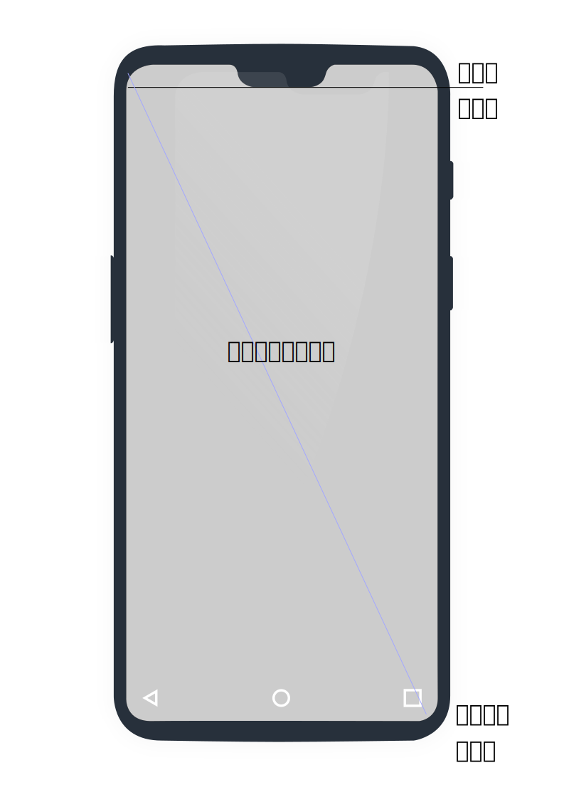

## 总览
[](https://juejin.im/post/6844903974294781965#heading-61)

      存储或交换应用时精简，使用上稳定，视觉上流畅美观，省电

## 界面
### 四大组件基础 - Context
Context作用
```
 ContextWrapper
       ^   Context
       |
       +
 ContextThemeWrapper
       ^   Theme,LayoutInflater,Resources,Configuration
       |
 Activity
       ^   Dialog,Cursor,Context,生命周期参数的NonConfigurationInstances
       |
ComponentActivity
       ^     LifecycleRegistry,ViewModelStore,SavedStateRegistryController
       |     OnBackPressedDispatcher,mContentLayoutId
 FragmentActivity
       ^     FragmentController,LifecycleRegistry
       |
AppCompatActivity
             ActionBar

应用包资源访问（loadapk,resource,pm），应用内存访问（cache,file,sp,db），四大组件通讯
+--------------------------------------------------------------------------------------------+
|   ContextImpl                                                                              |
+-----------------------------------------------------+--------------------------------------+
|     ActivityThread mMainThread                      |  File mDatabasesDir                  |
|                                                     |  File mPreferencesDir                |
|     LoadedApk mPackageInfo                          |  File mFilesDir                      |
|     Resources mResources                            |  File mNoBackupFilesDir              |
|     ResourcesManager mResourcesManager              |  File mCacheDir                      |
|     PackageManager mPackageManager                  |  File mCodeCacheDir                  |
|                                                     |                                      |
+-----------------------------------------------------+                                      |
|       Display mDisplay                              |  ArrayMap<String, File>              |
|       Theme mTheme                                  |   mSharedPrefsPaths                  | 
+-----------------------------------------------------+--------------------------------------+
|       Object[] mServiceCache                                                               |
|       ApplicationContentResolver mContentResolver                                          |
|       IBinder mActivityToken                                                               |
|       UserHandle mUser                                                                     |
+--------------------------------------------------------------------------------------------+
界面元素（actionbar，搜索，菜单，popup窗口，对话框），fragment管理，窗口与配置变动，生命周期
+--------------------------------------------------------------------------------------------+
|   Activity                                                                                 |
+-----------------------------------------------------+--------------------------------------+
|  ActivityThread mMainThread       Thread mUiThread  |  boolean mCalled                     |
|  Activity mParent                 Intent mIntent    |  boolean mResumed                    |
|  ComponentName mComponent         mResultData:Intent|  boolean mStopped                    |
|  Application mApplication         String mReferrer  |  boolean mFinished;                  |
|  mFragments:FragmentController                      |  boolean mStartedActivity            |
|  Instrumentation mInstrumentation mHandler:Handler  |  boolean mDestroyed;                 |
|  IBinder mToken                                     |  boolean mDoReportFullyDrawn         |
|  TaskDescription mTaskDescription                   |  boolean mRestoredFromBundle         |
|                                                     |                                      |
|  Window mWindow                                                                            |
|  WindowManager mWindowManager                       |  boolean mWindowAdded                |
|  Configuration mCurrentConfig                       |  boolean mVisibleFromServer          |
|  mLastNonConfigurationInstances                     |  boolean mVisibleFromClient          |
|                                                     |  boolean mCanEnterPictureInPicture   |
|  mDecor:View                                        |  boolean mEnableDefaultActionBarUp   |
|  mActionBar:ActionBar          CharSequence mTitle  |                                      |
|  mMenuInflater                                      |                                      |
|  mSearchManager                   mSearchEvent      |                                      |
|  mAutofillPopupWindow             mAutofillManager  |                                      |
|  SparseArray<ManagedDialog>  mManagedDialogs        |                                      |
|                                                     |                                      |
+-----------------------------------------------------+--------------------------------------+
|                                                                                            |
|  ArrayList<ManagedCursor> mManagedCursors                                                  |
|  TranslucentConversionListener mTranslucentCallback  SpannableStringBuilder mDefaultKeySsb |
|  VoiceInteractor mVoiceInteractor                                                          |
|                                                                                            |
+--------------------------------------------------------------------------------------------+

                                  PKMS
                                +------------------->  Permission/Pkginfo/HindAPI 
                                |                     
                                |  AMS                 Activity
                                |                      BrocastReceiver
                                |------------------->  ContentProvider
                  SystemServer  |                      Service
+------------------+            |
|                  | +----------+   WMS
|     context      |            +------------------->  Activity/Dialog/PopupWindow/Toast  ---->SurfaceFlipper
|                  |
+------------------+ +----------+
                                |
                ActivityThread  |   AssetManager
                                +------------------->  loadResource
```


## 4S (smooth，Stability，saving，streamline)快稳省简
稳定（编码/io问题），精简/包大小，续航/CPU占用率，流程/内存占用率-刷新率，
> <<Android High Performance Programming>>

[Android性能测试（内存、cpu、fps、流量、GPU、电量）——adb篇](https://www.jianshu.com/p/6c0cfc25b038)
稳定（monkey,bugreport），流畅（systrace，卡顿，动画，多线程，zxing），续航（battery historian 后台，发热，功耗），精简（apk），美观（布局layout inspector），安全（加固，插件化）
am_crash
 
性能（ the time taken to execute tasks）
 

## 精简
[参考](./知识体系-平台-Android-latency.md)


## 流畅/美观（每秒25帧，限时20毫秒内执行完）-界面开发系统
1. Activity，View，Window
   activity在attach时，创建PhoneWindow；onCreate创建DecorView；onResume后创建ViewRootImpl关联WindowManager

2. 绘制invalidate方法
   先申请绘画帧，然后再绘制；
3. 事件
   Activity dispatchTouchEvent；再传给ViewRootImpl的mView（DecorView）dispatchTouchEvent；当有接受事件时target；
   下次传递的时候，走ontouch，判断释放是longclick；或者是否是touch_up，click事件；

```
      +->  TextView  +-+-->   EditText
      |                |
      |                |
      |                +-->   Button    +------>  CompoundButton +--+>  CheckBox
      |                                                             |   RadioButton
View -+                                                             |
      |                                                             |   Switch
      |                                                             +>  ToggleButton
      |
      +->  ImageView  +---->  ImageButton +--->  VisibilityAwareImageButton  +->  FloatingActionButton
      |
      +->  SurfaceView +-+->  GLSurfaceView
      |    TextureView   |
      |                  +->  VideoView
      +->  Space
      |    ViewStub
      |
      +--> ViewGroup ++--->  AbsoluteLayout +->  WebView
                      |
                      +--->  LinearLayout +--+->  TableLayout
                      |                      |    AppBarLayout
                      |                      |
                      |                      |    TextInputLayout
                      |                      |    RadioGroup
                      |                      |    NumberPicker
                      |                      +->  ActionMenuView
                      |
                      +--->  RelativeLayout
                      +--->  GridLayout
                      |
                      +--->  FrameLayout +-+-->   ViewAnimator   +-+->  ViewFlipper
                      |                    |                       |
                      |                    |                       |
                      |                    |                       |
                      |                    |                       +--> ViewSwitcher +-+->  TextSwitcher
                      |                    |                                           |
                      |                    |      CardView                             +->  ImageSwitcher
                      |                    |
                      |                    |      ScrollView
                      |                    |      NestedScrollView
                      |                    |      HorizontalScrollView
                      |                    |
                      |                    |      ScrimInsetsFrameLayout +--> NavigationView
                      |                    |      BottomNavigationView
                      |                    |
                      |                    |      ActionBarContainer
                      |                    +-->   CollapsingToolbarLayout
                      |
                      |       ViewPager
                      |       PagerTitleStrip
                      |
                      |       RecyclerView
                      |       AdapterView  +--->  AbsListView  +------+-->   ListView  +--->  ExpandableListView
                      |                                               |
                      |       CoordinatorLayout                       +-->   GridView
                      |
                      |       Toolbar
                      |       DrawerLayout
                      |       SwipeRefreshLayout
                      |       SlidingPaneLayout
                      |       ConstraintLayout
                      |
                      +-->    FlowLayout

```
### 界面优化
优化LayoutInflater ：缓存避免重复解析（RecyclerView的四级缓存）；iReaderAndroid/X2C 生成Java代码，减少xml转化Java对象的解析时间；异步解析
优化DecorView onDraw/layout ：减少层级（使用merge、Viewstub标签优化）；使用默认背景减少绘制；Litho 异步layout/measure；开发者工具的绘制工具
flutter：不用解析xml，绘制图层
异步耗时业务代码：Handler，线程池，协程，动画

> 性能（ the time taken to execute tasks）

```shell 
#adb shell "getprop | grep heapgrowthlimit"
#adb shell "getprop|grep dalvik.vm.heapstartsize"
#adb shell "getprop|grep dalvik.vm.heapsize"

#adb shell getprop | grep product 获取手机型号

#adb shell "dumpsys meminfo -s <pakagename | pid>"
# while true;do adb shell procrank|grep <proc-keywords>; sleep 6;done


# adb shell "cat  /proc/cpuinfo" //查看cpu核心数
# adb shell "dumpsys cpuinfo | grep <package | pid>"
# adb shell "top -n 5 | grep <package | pid>" 

# adb shell "dumpsys gfxinfo com.example.proj" //GPU 帧数 fps


# adb shell "dumpsys batterystats < package | pid>" //电量采集
```
#### 官方定义
[识别与负载能力相关的卡顿](https://source.android.google.cn/devices/tech/debug/jank_capacity)
[识别与抖动相关的卡顿](https://source.android.google.cn/devices/tech/debug/jank_jitter)

systrace

离线获取systrace
adb shell "atrace -z -b 40000 gfx input view wm am camera hal res dalvik rs sched freq idle disk mmc -t 15 > /data/local/tmp/trace_output &"


```
+-------------+-------------------+----------------------+---------------------------+---------------+
|             |    info           |    tools             |  fix                      |  extension    |
+----------------------------------------------------------------------------------------------------+
|  memory     |                   |                      |                           |  keep alive   |
|             | gc time>frame rate|     profiler cpu     |  ResourceCanary           |               |
|             | leaks             |                      |  Bitmap&Activity          |               |
|             | Memory Churn      |    dumpsys meminfo   |  APKsize                  |    +----------+
+-----------------------------+---+-------------------------------------------------------+ network& |
|  battery    | wakelock time |                          |   Doze /standby           |    | secure   |
|             | gps time      |        battery-historian |   jobscheduler API        |    +----------+
|             | network time  |                          |AlarmManager、Syncs Adapter|+              |
+----------------------------------------------------------------------------------------------------+
|             |   vsync       |                          |                           |               |
|  draw       |               |                          |  canvas.quickreject()     |               |
|  (cpu)      |Refresh Rate/  +---------+----------------+                           |               |
|             |frame Rate     |         | gpu overdraw   |  canvas.cliprect()        | multiThread&  |
|             |               |on-device| gpu render     |  hierachy viewer          | mainThread    |
|             |               |  tools  | gup view update|                           |               |
|             | Activity      |         |                |                           | Webview       |
|             | LauchTime     +---------+----------------+                           |               |
|             | (am start)    |     profiler cpu/gpu     |                           |               |
|             |reportFullyDrawn|                         |                           |               |
+-------------+---------------+--------------------------+---------------------------+---------------+
|   secure    |    debug      |   apktool                |                           | drizzleDumper |  
|             |   https       |   smali                  |                           |               |
|             |               |   (reverse engineering)  |                           |   FDex2       |
+-------------+---------------+--------------------------+---------------------------+---------------+
+-------------+-----------------------+
|             network                 |
+-------------+-----------------------+
|   fast      |  compress data/charge |
+-------------------------------------+
| <60ms GOOD  | compress image        |
|             | serialize data        |
| <200ms OK   |                       |
|             | cache                 |
| other BAD   | jms                   |
+-------------+-----------------------+


[smali](https://blog.csdn.net/linchaolong/article/details/51146492)
```
[Android官网](https://developer.android.com/topic/performance/)
[RelativeLayout的性能损耗](https://zhuanlan.zhihu.com/p/52386900?utm_source=androidweekly.io&utm_medium=website)
[battery-history](https://www.cnblogs.com/jytian/p/5647798.html,https://yeasy.gitbooks.io/docker_practice/install/ubuntu.html)

[启动时间](https://developer.android.com/topic/performance/vitals/launch-time)

[Android 内存泄漏](https://android.jlelse.eu/9-ways-to-avoid-memory-leaks-in-android-b6d81648e35e)

[冷启动](开始记录跟踪数据的位置调用 Debug.startMethodTracing()，要停止跟踪的位置请调用 Debug.stopMethodTracing())
```
+-----------------------------------+
| memory leaks                      |
+-----------------------------------+
| unrelease                         |
+-----------------------------------+
| static Fields                     |
| (View,Context)                    |
|                                   |
| Inner Classes                     |
| That Reference                    |
| Outer Classes/LongLifecycle       |
| (Async Handler)                   |
| (WeakReference view)              |
|                                   |
| ThreadLocals                      |
|                                   |
| Unclosed Resources                |
|(unregisterReceiver)               |
|                                   |
+-----------------------------------+


```
 
>《Android开发艺术探索》
方法：布局，绘制，内存泄漏，响应速度，Listview及Bitmap，线程优化
- 渲染速度
  [https://developer.android.com/studio/profile/inspect-gpu-rendering](https://developer.android.com/studio/profile/inspect-gpu-rendering)
    1. GPU呈现模式(Swap Buffers,Command Issue,Draw,Sync&Upload,Measure&LayoutAnimation,Input Handling,Misc/Vsync Delay)
```
+--------------------+---------------------------------------------+
|  Swap Buffers      |  too much work on the GPU                   |
+------------------------------------------------------------------+
|  Command Issue     |  renderer issuing commands to OpenGL        |
|                    |  to draw and redraw display lists           |
+------------------------------------------------------------------+
|  Sync & Upload     |  take to upload bitmap information          |
|                    |  to the GPU                                 |
+------------------------------------------------------------------+
|  Draw              |   create and update the view's display lists|
+------------------------------------------------------------------+
|  Measure /         |  spent on onLayout and onMeasure callbacks  |
|  Layout            |  in the ^iew hierarchy                      |
+------------------------------------------------------------------+
|  Animation         |  evaluate all the animators that were       |
|                    |  running that frame                         |
+------------------------------------------------------------------+
|  Input Handling    |  spent executing code                       |
|                    |  inside of an input e^ent callback          |
+------------------------------------------------------------------+
|  Misc Time /       |  executing operations in                    |
|  VSync Delay       |  between two consecuti^e frames.            |
+--------------------+---------------------------------------------+

```
    2. 显示CPU使用情况(查看后台运行)，耗电
    3. 绘制优化(profiler) CPU/Memory/Network
控件边界图，绘制条状图
```
+---------+--------+-------------------+---------+--------+------+------+--------+--------+-------+--------+------+-------+--------+
|         |        | Wall clock time/  |         |        |      |      |        |        |       |        |      |       |        |
|         |        |  Thread time      |         |        |      |      |        |        |       |        |      |       |        |
| Call    | Flame  |---------+---------|         |  app   | image|zygote|        |        |       |        |      |       |        |
| Chart   | Chart  |Top down |Bottom up|         |--------+------+------|        |        |       |        |      |       |        |
|         |        |         |         |forece gc|      Dump javaHeap   |        |        |       |        |      |       |        |
+---------+--------+---------+------------------------------------------+        |        |       |        |      |       |        |
|             Threads                  | Image   | Zygote | app  |  JNI |        |        |       |        |      |       |        |
|                                      | Heap    | Heap   | Heap |  Heap| timing |        |       |        |      |       |        |
|                                      |         |        |      |      |        |        |       |        |      |       |        |
+---------+--------+---------+-------------------+--------+------+-----------------------------------------------------------------+
| sample  | Trac   | Sample  |  Trac   | Allocation                     |        |        |       |        |      |       |        |
| java    | java   | C/C++   |  System |  Java/Native/Graphic           |overview|Responce|Request|CallStak| CPU  |Network|Location|
| Method  | Method | Function|  Calls  |     /Stack/Code/other          |        |        |       |        |      |       |        |
+---------+--------+-------------------+--------------------------------+--------+--------+-------+--------+------+-------+--------+
|                                                               Activity Lifecyle                                                  |
+--------------------------------------+--------------------------------+----------------------------------+-----------------------+
|          recod CPU                   |          Memory                |               network            |        Energy         |
+--------------------------------------+--------------------------------+----------------------------------+-----------------------+


Flame chart:横轴不再表示时间轴，相反，它表示每个方法执行的相对时间

[Flame chart](https://blog.csdn.net/sinat_20059415/article/details/80584621)
```
    1. **Studio Inspect Code** Android-Lint-Performace 代码Review不必要不加载（include merge, viewstub），ConstaintLayout
    2. LayoutInspector 布局优化（include merge, viewstub）
    3. 动画硬件加速，勿滥用
    
    尽量用Drawable  
    1. ListView/RecycleView及Bitmap优化
    2. 线程优化 

 [动画大全](https://github.com/OCNYang/Android-Animation-Set)
#### 屏幕适配
[](./屏幕分辨率适配/屏幕分辨率适配.md)
#### 图片适配（density）
```java
显示屏幕信息
adb shell wm size
wm size 1080x1920
wm size reset

wm density

wm screen-capture

adb shell dumpsys window displays |head -n 3

导出view,layoutinspector
/system/bin/dumpsys -T 60000 activity -v all


``` 


### 图片闪动
滑动停止才进行显示图片
 
### 显示与窗口
Activity、Dialog、PopWindow、Toast

 popupwindow 与 Dialog
- popupwindow 非阻塞浮层，需要onResume后，view 关联窗口管理才能显示
      update()更新界面位置。触摸底部的控件容易导致popupwindow消失
- Dialog 阻塞式对话框，需要context还存活判断


```bash
adb shell dumpsys window w | findstr mCurrent
```

#### 图片适配（density）
### 编舞者 Choreographer
双缓冲机制、Choreographer的作用（vsync）、同步消息屏障
#### 遍历刷新(测量，布局，绘制) traversal

invalidate只会调onDraw方法且必须在UI线程中调用
      mPrivateFlags |= PFLAG_INVALIDATED;
postInvalidate只会调onDraw方法，可以再UI线程中回调
      mPrivateFlags |= PFLAG_INVALIDATED;
requestLayout会调onMeasure、onLayout和onDraw(特定条件下)方法
      mPrivateFlags |= PFLAG_FORCE_LAYOUT;
      mPrivateFlags |= PFLAG_INVALIDATED;

[Activity的显示之ViewRootImpl的预测量、窗口布局、最终测量、布局、绘制五大过程](http://segmentfault.com/a/1190000012018189)

#####  刷新 （绘制，局部重绘）View#invalite
VSynch 垂直同步
Triple Buffer 三重缓存
Choreographer 编舞者
```
* 001_androi1     54b6cfa9a9e5b861a9930af873580d6dc20f773c Initial Contribution
                  +---------------------------------------------------------------------------------------------+
                  |               View                                                                          |
                  |                  invalidate()                     measure()       mBGDrawable:Drawable      |
                  |                                                   layout()        onDraw()                  |
                  |                                                                   dispatchDraw()            |
                  |                                                                   onDrawScrollBars()        |
                  |---------------------------------------------------------------------------------------------|
                  |               ViewRoot:Handler:: ViewParent                                                 |
                  |                  mDirty:Rect                                                                |
                  |                  invalidateChild()                                                          |
                  |                                                                                             |
                  |                  mTraversalScheduled:boolean                                                |
                  |                  mWillDrawSoon:bool                                                         |
                  |                  scheduleTraversals()                                                       |
                  |                                                                                             |
                  |                   mView:View                                                                |
                  |                  performTraversals()                                                        |
                  |                                                                                             |
                  |                   mSurface:Surface                                                          |
                  |                  draw( canvas:canvas)                                                       |
                  |                                                                                             |
                  |---------------------------------------------------------------------------------------------|
  aosp-new/master 8283939cecfb5538e21ffc7adb017a995f099012 Merge "Create new Carrier configuration for separate MMTEL/RCS features"
                  +--------------------------------------------------------------------------------------------+
                  |                View                                                                        |
                  |                  invalidate()          postInvalidate()       updateDisplayListIfDirty()   |
                  |                                                                                            |
                  +--------------------------------------------------------------------------------------------+
                  |   ViewGroup:ViewParent                                                                     |
                  |    in^alidateChild()                                                                       |
                  +--------------------------------------------------------------------------------------------+
                  |   ViewRootImpl:ViewParent   dispatchInvalidateDelayed() mView:View                         |
                  |    invalidateChild()                                    doTraversal()                      |
                  |   invalidateChildInParent()                                                                |
                  |    invalidateRectOnScreen()                             performTraversals()                |
                  |    scheduleTraversals()                                                                    |
                  |                                                         measureHierarchy() performlayout() |
                  +------------------------------------------------+        performMeasure()   performDraw()   |
                  |   Choreographer                                |                                           |
                  |     postCallback()                             +-------------------------------------------+
                  |     postCallbackDelayedInternal()                                                          |
                  |     scheduleFrameLocked()                                                                  |
                  |     scheduleVsyncLocked()                                                                  |
                  |     mDisplayEventReceiver:FrameDisplayEventReceiver                                        |
                  |     doFrame()                                                                              |
                  +--------------------------------------------------------------------------------------------+
                  |  FrameDisplayEventReceiver :Runnable        CallbackRecord                                 |
                  |       scheduleVsync()                             run()                                    |
                  |       dispatchVsync()                                                                      |
                  |       run()                                 TraversalRunnable:Runnable                     |
                  |                                                                                            |
                  +--------------------------------------------------------------------------------------------+


```
##@ 事件相应 InputManager.getInstance().injectInputEvent
```
         +-----------------------------------------------------------------------------------------+
         |  ImputManager                                                                           |
         |       injectInputEvent()                                                                |
         |                                                                                         |
         |       mPtr:long                                                                         |
         |       injectInputE^ent()                                                                |
         |       injectInputEventInternal()                                                        |
         +-------------------------------------------------------------+---------------------------+
         | [platform_frameworks_base\services\core\jni]                |                           |
         |                                                             |                           |
         |             com_android_server_input_InputManagerService.cpp|                           |
         |                       NativeInputManager                    |                           |
         |                          getInputManager()                  |                           |
         +-------------------------------------------------------------+                           |
         | [platform_frameworks_native\services\inputflinger]          |                           |
         |     InputManager.cpp                                        |                           |
         |       mReaderThread :InputReaderThread(mReader);            |                           |
         |       mDispatcherThread:InputDispatcherThread(mDispatcher); |                           |
         |                                                             |                           |
         |       mDispatcher:InputDispatcher                           |                           |
         |       mClassifier:InputClassifier                           |                           |
         |       mReader:InputReader                                   |                           |
         |                                                             |                           |
         |                                                             |                           |
         |     InputDispatcher                                         |                           |
         |                                                             |                           |
         |       injectInputEvent()                                    |                           |
         |       enqueueInboundEventLocked()                           |                           |
         |                                                             |                           |
         |       dispatchOnce()//thread loop                           |                           |
         |                                                             |                           |
         |       mInboundQueue:Queue<EventEntry>                       |                           |
         |       dispatchOnceInnerLocked()                             |                           |
         |                                                             |                           |
         |       dispatchMotionLocked()                                |                           |
         |                                                             |                           |
         |       findTouchedWindowTargetsLocked()//touchscreen         |     WMS                   |
         |       checkWindowReadyForMoreInputLocked()               +----->                        |
         |                                                             |                           |
         |       mLooper:Looper                                        |                           |
         |       handleRecei^eCallback()                               |     //epoll socket channel|
         +-----------------------------------------------------------------------------------------+
         +-------------------------------------------------------------+                           |
         |      ViewRootImpl                                                                       |
         |                                         mFirstPostImeInputStage          mView:DecorView|
         |        mInputEventReceiver                        :InputStage                           |
         |             :WindowInputEventReceiver                                                   |
         |                                                                                         |
         |      WindowInputEventReceiver:                                                          |
         |              InputEventReceiver                                                         |
         |         enqueueInputEvent()                                                             |
         |                                                                                         |
         |    ViewPostImeInputStage                InputStage                                      |
         |         onProcess(q:QueuedInputEvent )      deliver(QueuedInputEvent q)                 |
         |                                             onProcess(QueuedInputEvent q)               |
         |                                                                                         |
         |                                         ViewPostImeInputStage :InputStage               |
         |                                             processPointerEvent()                       |
         |                                                                                         |
         +-----------------------------------------------------------------------------------------+
         |     DecorView:ViewGroup                                                                 |
         |           dispatchPointerEvent()               superDispatchTouchEvent()                |
         |           dispatchTouchEvent()                 //super.dispatchTouchEvent               |
         |                                                                                         |
         |     WindowCallbackWrapper                                                               |
         |     Activity                                                                            |
         |     PhoneWindow                                                                         |
         |          superDispatchTouchEvent()                                                      |
         |                                                                                         |
         +-----------------------------------------------------------------------------------------+
         |    ViewGroup :View                                                                      |
         |       mFirstTouchTarget:TouchTarget//not DownEvent, null not dispatch                   |
         |       dispatchTouchEvent()                                                              |
         |       onInterceptTouchEvent()                                                           |
         |       dispatchTransformedTouchE^ent()                                                   |
         +-----------------------------------------------------------------------------------------+
         |    View                                                                                 |
         |     mListenerInfo:ListenerInfo                                                          |
         |     performClickInternal();                                                             |
         |                                                                                         |
         |    ListenerInfo                                                                         |
         |         mViewFlags:int//ENABLED_MASK                                                    |
         |         mOnClickListener;OnClickListener                                                |
         +-----------------------------------------------------------------------------------------+


```

##### 布局与控件
LinearLayout（线性布局）、RelativeLayout（相对布局）、 FrameLayout（单帧布局）
AbsoluteLayout（绝对布局）和TableLayout（表格布局）
RecyclerView，ConstraintLayout（约束布局）
###### ConstraintLayout 布局创建复杂的大型布局
三个原则：
1. 每个视图都必须至少有两个**约束条件**：一个水平约束条件，一个垂直约束条件。

        app:layout_constraintStart_toStartOf="parent"
        app:layout_constraintTop_toTopOf="parent"
        或：
        app:layout_constraintBottom_toBottomOf="parent"
        app:layout_constraintEnd_toEndOf="parent"
        app:layout_constraintStart_toStartOf="parent"
        app:layout_constraintTop_toTopOf="parent" 

2. 只能在共用同一平面（垂直或水平方向）的**约束手柄**（constraint handle 圆圈）与**定位点**（anchor point 控件或父控件）之间创建约束条件。

      Bottom对Bottom或top
      top对Bottom或top
      start对start或end
      end对start或end

3. 每个**约束句柄**只能用于一个约束条件，但您可以在同一**定位点**上创建多个约束条件

约束条件：
1. RelativeLayout 约束
   1. 父级定位 parent
   2. 顺序定位（Start_toEnd ...）
   3. 对齐方式（Start_toStartOf ...）
   4. 基线对齐（基线属于BottomToBottom的特殊情况，基于文本对齐）
2. Chains约束（线性布局，app:layout_constraintHorizontal_chainStyle="spread"）
   1. spread ：默认，居中均匀分布，两侧有空隙
   2. spread inside ：居中均匀分布，两侧无空隙
   3. Weighted：约束方向0dp，并设置权重 layout_constraintHorizontal_weight，两侧无空隙
   4. packed：居中紧凑布局
3. Guidelines（作为**定位线**作用于全局，orientation="vertical" startToStart，endToEnd）
4. Placeholder 配合TransitionManager，移动选中控件
5. Helper（referenced_ids控件操作）
   1. Barrier （v1.1 一对多控件的屏障约束，控件位于两个内容长度可变控件的end ，避免嵌套）
      1. barrierDirection 屏障约束的方向 start,end,top,bottom
      2. app:constraint_referenced_ids="btn1,btn3" 共用屏障的控件
   2. Group v1.1 分组方便隐藏，referenced_ids 添加控件到分组
   3. Layer v2.0 referenced_ids的控件添加背景（背景根据绘制顺序，layer代码需要放在控件前）或动画
   4. VirtualLayout/Flow 三种flow_wrapMode模式，对referenced_ids内的控件快速横向/纵向布局
      1. wrap none 线性链，即使控件不够
      2. wrap chain 控件不够，换行显示，居中对齐
      3. wrap aligined 控件不够，换行显示，并左对齐
6. 边距，默认外边，距尺寸和约束比例（bias）
7.  自动创建约束
      1. Infer Constraints 会扫描布局，以便为所有视图确定最有效的约束集。
      2. Autoconnect to parent 。自动为每个视图创建两个或多个约束条件

```java
public class CoordinatorLayout extends ViewGroup implements NestedScrollingParent2 {

    private final List<View> mDependencySortedChildren = new ArrayList<>();
    private final DirectedAcyclicGraph<View> mChildDag = new DirectedAcyclicGraph<>();

    private final List<View> mTempList1 = new ArrayList<>();
    private final List<View> mTempDependenciesList = new ArrayList<>();
    private final int[] mTempIntPair = new int[2];
    private Paint mScrimPaint;

    private boolean mDisallowInterceptReset;

    private boolean mIsAttachedToWindow;

    private int[] mKeylines;

    private View mBehaviorTouchView;
    private View mNestedScrollingTarget;

    private OnPreDrawListener mOnPreDrawListener;
    private boolean mNeedsPreDrawListener;

    private WindowInsetsCompat mLastInsets;
    private boolean mDrawStatusBarBackground;
    private Drawable mStatusBarBackground;

    OnHierarchyChangeListener mOnHierarchyChangeListener;
    private android.support.v4.view.OnApplyWindowInsetsListener mApplyWindowInsetsListener;

    private final NestedScrollingParentHelper mNestedScrollingParentHelper =
            new NestedScrollingParentHelper(this);
}
```

中介者模式：
      ConstraintLayout 定位控件

TransitionManager 观察addOnPreDrawListener


装饰者模式:
      setProgress
###### ViewPager
transformPage
ViewPager2支持：
基于RecyclerView，DiffUtils计算差值，动画更新Viewpager。
垂直方向 setOrientation
离屏加载 setOffscreenPageLimit 默认0（v1.0默认1）
使用 viewpager2.FragmentStateAdapter 代替 RecyclerView.Adapter

###### RecyclerView 缓存
1. 缓存ViewHolder
2. 刷新控件 
3. 滑动停止加载数据 Glide.with(getContext()).resumeRequests();/Glide.with(getContext()).pauseRequests();
4. 预加载 addOnScrollListener/RecyclerViewPreloader
5. 销毁不可见图片 setRecyclerListener/Glide.with(this).clear()

```
+---------------------------------------------------------------------------------+
| [android 5.0]    RecyclerView                                                   |
|                       mRecycler:Recycler                                        |
|                       setAdapter()                                              |
|                       setAdapterInternal()                                      |
|                                                                                 |
|                       dispatchLayout()                                          |
|                                                                                 |
|  Adapter<ViewHolder>        ViewHolder            LayoutManager                 |
|      onCreateViewHolder()       itemView;View       mLayoutState:LayoutState    |
|      onBindViewHolder()                             onLayoutChildren()          |
|                                                     fill()                      |
|                                                     layoutChunk()               | 
+---------------------------------------------------------------------------------+
|                                                                                 |
|                                     LayoutState                                 |
|                                        next(recycler:Recycler )                 |
|                                    Recycler                                     |
|                                        getRecycledViewPool():RecycledViewPool   |
|                                        getViewForPosition() :View               |
|                                                                                 |
+---------------------------------------------------------------------------------+

```
#### 事件 
##### ViewDragHelper 滑动工具类和computeScroll()
移动控件方法： 
        1. layoutparam.margin 
        2. scrollx 
        3. canvas translate
ViewCompat.postInvalidateOnAnimation(Activity.this)
应用常见 DrawerLayout，SlidingPaneLayout

简单工厂 ViewDragHelper#create(ViewGroup, float,Callback)
        
桥接    滑动判断，滑动处理有ViewDragHelper处理；
静态代理  OverScroller

中介    子view滑动由ViewDrawHelper控制
观察者   Callback
模板方法 ViewDragHelper#shouldInterceptTouchEvent；ViewDragHelper#processTouchEvent
        ViewDragHelper#continueSettling
观察者   ViewDragHelper#smoothSlideViewTo

##### 
 [事件](http://gityuan.com/2016/12/31/input-ipc/)
 [事件子系统](https://blog.csdn.net/jscese/article/details/42099381)
- InputReader线程：通过EventHub从/dev/input节点获取事件，转换成EventEntry事件加入到InputDispatcher的mInboundQueue。EventHub采用INotify + epoll机制

- InputDispatcher线程：从mInboundQueue队列取出事件，转换成DispatchEntry事件加入到connection的outboundQueue队列。再然后开始处理分发事件，取出outbound队列，放入waitQueue.InputChannel.sendMessage通过socket方式将消息发送给远程进程；

- UI线程：创建socket pair，分别位于”InputDispatcher”线程和focused窗口所在进程的UI主线程，可相互通信。 
UI主线程：通过setFdEvents()， 监听socket客户端，收到消息后回调NativeInputEventReceiver();【见小节2.1】
“InputDispatcher”线程： 通过IMS.registerInputChannel()，监听socket服务端，收到消息后回调handleReceiveCallback；【见小节3.1】
```java

ViewRootImpl的setView()过程:
    创建socket pair，作为InputChannel: 
        socket服务端保存到system_server中的WindowState的mInputChannel；
        socket客户端通过binder传回到远程进程的UI主线程ViewRootImpl的mInputChannel；
    IMS.registerInputChannel()注册InputChannel，监听socket服务端： 
        Loop便是“InputDispatcher”线程的Looper;
        回调方法handleReceiveCallback。

```
ANR 事件 resetANRTimeoutsLocked


```C
struct RawEvent {
    nsecs_t when;
    int32_t deviceId;
    int32_t type;
    int32_t code;
    int32_t value;
};


``` 

#### 动画
https://dribbble.com/
##### 插值器
策略模式    TimeInterpolator#getInterpolation
      AccelerateDecelerateInterpolator
      LinearInterpolator
      AccelerateInterpolator
      DecelerateInterpolator
      OvershootInterpolator
      AnticipateInterpolator
      AnticipateOvershootInterpolator
      BounceInterpolator
      CycleInterpolator


##### TWeen Animation
修改matrix，刷新界面，等待下一帧时候，绘制界面，getInvalidateRegion更新父控件

```
+---------------------------------------------------------------------------------------------+
|  [Android 4.4]                                                                              |
|          View                                                                               |
|            mCurrentAnimation:Animation                ViewGroup:View                        |
|                                                          dispatchDraw()                     |
|            startAnimation(animation:Animation)           drawChild()                        |
|            clearAnimation()                              getChildTransformation()           |
|            onDetachedFromWindow()                                                           |
|                                                                                             |
|            draw()                                                                           |
|            drawAnimation():bool                                                             |
+---------------------------------------------------------------------------------------------+
|         ViewRootImpl:Parent                                                                 |
|           invalidateChild()                                                                 |
|          invalidateChildInParent()                                                          |
|           scheduleTraversals()                                                              |
|                                                                                             |
+---------------------------------------------------------------------------------------------+
|   Animation                                                            AlphaAnimation       |
|       mInterpolator:Interpolator                                       RotateAnimation      |
|       getTransformation():bool                                         ScaleAnimation       |
|       applyTransformation(interpolatedTime:float ,t:Transformation)    TranslateAnimation   |
|                                                                                             |
+---------------------------------------------------------------------------------------------+
|    Interpolator              //normalizedTime=dx/duration         Transformation            |
|             getInterpolation(normalizedTime:float):float                 mMatrix:Matrix     |
|                                                                                             |
|     LinearInterpolator :BaseInterpolator                                                    |
|     AccelerateInterpolator                                        Matrix //3x3              |
|     BounceInterpolator                                                                      |
+---------------------------------------------------------------------------------------------+

```
##### 帧动画 AnimationDrawable/ <animation-list>
模板方法 Animatable#start()/Animatable#stop
观察者   View#scheduleDrawable
命令     AnimationDrawable#run
状态    android.graphics.drawable.Drawable#scheduleSelf/

其他 :
      AnimatedImageDrawable/<animated-image>
      AnimatedVectorDrawable/<animated-vector>
##### 属性动画（PropertyValuesHolder） 
1. ValueAnimator 只对属性进行过渡
2. ObjectAnimator 因为属性有其归属的对象，可以通过反射内省设置对象的属性值 PropertyValuesHolder#setupSetter；不用设置监听修改过渡值
3. ViewPropertyAnimator 观察ValueAnimation回调事件AnimatorEventListener#onAnimationUpdate，更新invalidateViewProperty属性值
   
属性动画可以通过 ValueAnimator#ofPropertyValuesHolder对多个属性同时过渡， ValueAnimator#getAnimatedValue(String) 进行取值；

简单工厂  Keyframe#ofObject(float, Object):Keyframe
          PropertyValuesHolder#ofObject()
          ValueAnimator#ofObject()//ObjectProperty 
          ValueAnimator#ofPropertyValuesHolder()
          AnimationHandler#getInstance ThreadLocal线程单例
单例    AnimationHandler
        ArgbEvaluator
适配器  TypeEvaluator#evaluate():Object//ObjectAnimation返回对象的动画属性的值

装饰者 
        Keyframe装饰动画插值Object，添加mFraction，mValueType， mInterpolator；
        PropertyValuesHolder装饰KeyframeSet，保存属性现在的值 mAnimatedValue
        ObjectAnimator装饰ValueAnimator，需要设置 Property所属的Object
中介者
        AnimationHandler 统一管理所有的申请动画帧，如果mAnimationCallbacks有数据，就不断的申请动画帧
类迭代器
        KeyframeSet#getValue
观察者 
      AnimatorUpdateListener

###### ViewPropertyAnimator
```
+---------------------------------------------------------------------------------------------+
|  [Android 4.4]                                                                              |
|          View                                               mTransformationInfo             |
|            animate()                                        mRenderNode                     |
|            mAnimator:ViewPropertyAnimator                   in^alidate()                    |
|                                                             invalidateViewProperty()        |
|                                                                                             |
+---------------------------------------------------------------------------------------------+
|    ViewPropertyAnimator                        AnimatorEventListener                        |
|          mView:View                                  : Animator.AnimatorListener            |
|          mAnimationStarter:Runnable                                                         |
|                                                                                             |
|          mRTBackend:ViewPropertyAnimatorRT                                                  |
|                                                   onAnimationUpdate(ValueAnimator animation)|
|          onAnimationUpdate()                                                                |
|          setValue()                                                                         |
+---------------------------------------------------------------------------------------------+
|    ValueAnimator                                                                            |
|         addAnimationCallback()                                                              |
|         doAnimationFrame()                                                                  |
|         animateValue()                                                                      |
|                                                                                             |
+---------------------------------------------------------------------------------------------+
|    AnimationHandler               PropertyValuesHolder                                      |
|                                         calculateValue()                                    |
+---------------------------------------------------------------------------------------------+


```
##### beginDelayedTransition
##### GIF
Glide播放多个gif文件卡

android-gif-drawable性能好

android-1.6_r1\external\giflib 系统源码利用
##### Scroller
装饰者 
      mStartTime
      mMode
### 可拓展性/异步/多线程（Scalability：the number of tasks a system can execute at the same time.）

```shell
# pidof  system_server
1956

# cat /proc/1956/limits

```
### 自定义解析 flutter
- 第一代 ionic(webview),PhoneGap，Cordova      H5                语言：js/css      环境：webview

- 第二代 RN（v8,Hermes/jscore）> weex(js,vue)  jit运行时编译     语言：JavaScript  环境：nodejs/v8 
   [RN](https://www.reactnative.cn/docs/components-and-apis)
- 第三代 Flutter（Skia）                                     语言：dart
#### Flutter 路由，UI
#### dart
https://dart.dev/samples

https://dart.dev/guides/language/language-tour


[内部实现](https://github.com/dart-lang/sdk/blob/master/sdk/lib/_internal/vm/lib/)


调试JIT，发布AOT

```
+-----------------------------------------------------------------------+
|                     Object                                            |
|                        hashCode :int                                  |
|                        runtimeType:Type                               |
|                                                                       |
+-----------------------------------------------------------------------+

+-----------------------------------------------------------------------+ 
|                     num                                               |
+-----------------------------------------------------------------------+
|   int                               double                            |
|    bitLength:int                                                      |
|    isEven: bool                      sign:int                         |
|    isOdd:bool                                                         |
|    sign:int                                                           |
|                                                                       |
+-----------------------------------------------------------------------+
+-----------------------------------------------------------------------+
|                          StringBuffer :::StringSink                   |
|                                                                       |
|                               _parts:List<String>?                    |
|                                                                       |
|                               length:int                              |
+-----------------------------------------------------------------------+
|                                                                       |
|                  String :::Comparable<String>, Pattern                |
|                     codeUnits:List<int>  //UTF-16                     |
|                     runes:Runes                                       |
|                     length:length                                     |
|                     hashCode:int                                      |
|                    _isOneByte :bool                                   |
+-----------------------------------------------------------------------+
|                                                                       |
|                    Runes : Iterable<int>                              |
|                       string: String                                  |
+-----------------------------------------------------------------------+

+-----------------------------------------------------------------------+
|                        _GrowableList                                  | 
|                          _grow()                        _shrink()     |
|                          _nextCapacity()                              |
|                          _allocateData() //odd number                 |
|                                                                       |
|         _List            Lists                                        |
|          length:int         copy()                                    |
|                                                                       |
+-----------------------------------------------------------------------+ 


+-----------------------------------------------------------------------+
|                                                                       |
|            _InternalLinkedHashMap<K, V> : _HashVMBase                 |
|                        ::  MapMixin<K, V>,                            |
|                            _LinkedHashMapMixin<K, V>,                 |
|                            _HashBase,                                 |
|                            _OperatorEqualsAndHashCode                 |
|                        :::  LinkedHashMap                             |
|                                                                       |
+-----------------------------------------------------------------------+
|              _index   :int                                            |
|              _hashMask :int                                           |
|              _data     :List                                          |//偶数位放key,奇数放value
|              _usedData :int                                           |
|              _deletedKeys :int                                        |
|                                                                       |
+-----------------------------------------------------------------------+


+-----------------------------------------------------------------------+
|                                                                       |
|             _CompactLinkedHashSet<E> :_HashFieldBase                  |
|                 :: _HashBase, _OperatorEqualsAndHashCode, SetMixin<E> |
|                 ::: LinkedHashSet                                     |
|                                                                       |
+-----------------------------------------------------------------------+
|              _index   :int                                            |
|              _hashMask :int                                           |
|              _data     :List                                          |
|              _usedData :int                                           |
|              _deletedKeys :int                                        |
|                                                                       |
+-----------------------------------------------------------------------+


```


```
+-----------------------------------------------------------------------------+
|                                                                             |
|       _File : FileSystemEntity ::: File                                     |
|                                                                             |
|           readAsStringSync():String                                         |
|                                                                             |
|          _tryDecode(bytes:List<int> ,encoding):String                       |
|                                                                             |
|          readAsBytesSync(): Uint8List                                       |
|                                                                             |
|          openSync(): RandomAccessFile                                       |
|                                                                             |
|                                                                             |
+-----------------------------------------------+-----------------------------+
|                                               |                             |
|                                               |   BytesBuilder              |
|  _RandomAccessFile ::: RandomAccessFile       |                             |
|        _connectedResourceHandler:bool = false;|       add()                 |
|         path;String                           |                             |
|        _asyncDispatched; bool   = false       |  _CopyingBytesBuilder       |
|        _fileService;SendPort                  |        :BytesBuilder        |
|        _resourceInfo; _FileResourceInfo       |     _length ;  int          |
|        _ops;_RandomAccessFileOps              |     _buffer;  Uint8List     |
|                                               | _BytesBuilder               |
|        lengthSync()                           |       :BytesBuilder         |
|        readSync(int bytes):Uint8List          |     _length:int             |
|                                               |    _chunks:List<Uint8List>  |
|                                               |                             |
+-----------------------------------------------+-----------------------------+


```


### Input dispatching timed out

ANR Input dispatching timed out (Waiting because the touched window has not finished processing the input events that were previously delivered to it.)


## 屏幕适配
### 屏幕参数
> 屏幕尺寸：手机对角线的物理大小，单位为英寸（inch），1英寸=2.54cm，Android手机常见的尺寸有5寸、5.5寸、6寸等等

> 屏幕分辨率：屏幕图像的精密度，是指显示器所能显示的像素有多少。 

设备根据DPI，旋转分辨率文件夹
| :-------------: | :-------------: |
|0dpi   ~ 120dpi  | ldpi|
|120dpi ~ 160dpi  | mdpi|
|160dpi ~ 240dpi  | hdpi|
|240dpi ~ 320dpi  | xhdpi|
|320dpi ~ 480dpi  | xxhdpi|
|480dpi ~ 640dpi  | xxxhdpi|


正常手机设备
| 屏幕标准标准  |           |                         | 图标尺寸标准  | 比例    | 屏幕密度(dpi) | 边距(px) |
| :-: | :-: | :-: | :-: | :-: | :-: | :-: |
| xxxhdpi | 3840*2160 | 4K分辨率                   | 192*192 | 4     | 640       | 12-16  |
| xxhdpi  | 1920*1080 |                         | 144*144 | 3     | 480       | 8-12   |
| xhdpi   | 1280*720  |                         | 96*96   | 2     | 320       | 6-8    |
| hdpi    | 480*800   | 高分辨率<br/>WVGA (480x800) | 72*72   | 1.5   | 240       | 4-6    |
| mdpi    | 480*320   | 中等分辨率 <br/>HVGA         | 48*48   | 1     | 160       | 3-4    |
| ldpi    | 320*240   | 低分辨率 <br/>QVGA          | 36*36   | 0.75  | 120       | 2-3    |


中等分辨率（mdpi）1px 等于 1in/160 = 0.0157in =0.0157cm 
超高分辨率（xhdpi）1px 等于 1in/320 = 0.007in =0.008cm 

### 像素相关单位

> 像素即px，为视频显示的基本单位，每个这样的消息元素不是一个点或者一个方块，而是一个抽象的取样。

> 比特每像素：一个像素所能表达的不同颜色数取决于比特每像素。256色，亦称为“8位”；2<sup>16</sup>=65,536色，称为高彩色，亦称为“16位”；2<sup>24</sup>=16,777,216色，称为真彩色，通常的记法为“1670万色”，亦称为“24位色”；2<sup>24</sup> +2<sup>8</sup>，计算机领域较常见的32位色并不是表示2<sup>32</sup>种颜色，而是在24位色基础上增加了8位（2<sup>8</sup>=256级）的灰阶，因此32位的色彩总数和24位是相同的，32位也称为全彩；2<sup>48</sup>=281,474,976,710,656色，用于很多专业的扫描仪。


> 屏幕像素密度：每英寸的像素点数，单位dpi（dots per ich）

> 密度无关像素：dp/dip，保证在不同屏幕像素密度的设备上显示相同的效果

> 独立比例像素：区别于 *密度无关像素*，对字体大小首选项进行缩放

 


### 适配方案
1. dp适配
   ❌同样的分辨率可能dpi不同（同样1080p。480dpi时，1080/3=360dp占满屏幕宽度；有些是420dpi，360dp*2.625=946px，没有占满屏幕宽度）

2. 宽高限定符适配
   以mdpi为基准，准确适配宽高 value-480x320 ；
   ❌需要准确的宽高
3. 动态修改density值，从而保证(手机像素宽度)px/density这个值始终是屏幕宽度480dp
   [](https://mp.weixin.qq.com/s/d9QCoBP6kV9VSWvVldVVwA)
   ❌ 图片会拉伸现象
4. smallestWidth适配
   相比第2种方案，提高容错率

#### 屏幕分布
[流量研究院 - 移动设备分辨率排名](https://mtj.baidu.com/data/mobile/device)
[腾讯移动分析 - 设备分辨率排名](https://mta.qq.com/mta/data/device/resolution)

#### 控件字体尺寸适配 - 生成所有分辨率对应像素数列表

优点
- 进行90%的适配

缺点
- 如果有某个分辨率缺少，将无法完成该屏幕的适配
- 过多的分辨率像素描述xml文件会增加软件包的大小和维护的难度
- google的要求使用dp作为度量单位会有所背离


#### 图片适配 - 一套分辨率规格的图片资源


#### 横竖屏，还原界面初始状态
系统（unspecified,nosensor）
传感器（sensor,sensorLandscape,sensorPortrait）
应用（landscape,portrait,behind【webview或detail】）
用户(user【用户当前首选】)
优先生效：系统》传感器》应用》用户
最终生效：用户》应用》传感器》系统

Configuration.orientation 两个方向
Activity.getRequestedOrientation()包含ActivityInfo.screenOrientation 16个方向

网络错误默认页，页码，对话框，tab

锁定正向横屏，切换到反向横屏，不能成功

传感器window监听类
```java
./base/policy/src/com/android/internal/policy/impl/WindowOrientationListener.java

实现类
base/policy/src/com/android/internal/policy/impl/PhoneWindowManager.java:671:
```
#### 屏幕



## 续航
```
 pm.newWakeLock(PowerManager.SCREEN_DIM_WAKE_LOCK, "keep bright");


 adb shell dumpsys "power|grep -i wake" 
 查看
```

###  battery-historian

docker search battery-historian

go run setup.go 

 
docker run -it --user root --name battery -v /c/Users/docker:/share  -p 9995:9995 bhaavan/battery-historian /bin/bash -c "go run setup.go && go run cmd/battery-historian/battery-historian.go --port 9995"


[第三方 battery-historian （需代理访问）](https://bathist.ef.lc/)


到处文件
adb bugreport > bugreport.txt

### Battery Historian

AlarmManager/Timer
GPS

JobScheduler

## BlockCanary 检测界面卡顿
UETool 
GT 工具


## E-Paper
[Kindlepdfviewer/koreader](https://github.com/koreader/koreader)

https://libraries.io/github/koreader/koreader
https://www.unisystem-displays.com/en/news/interactive-epaper.html
http://www.xjishu.com/zhuanli/55/201510450954.html


## 绘制
### ViewTreeObserver 
```java
    private CopyOnWriteArrayList<OnGlobalFocusChangeListener> mOnGlobalFocusListeners;
    private CopyOnWriteArrayList<OnGlobalLayoutListener> mOnGlobalLayoutListeners;//无返回值
    private CopyOnWriteArrayList<OnPreDrawListener> mOnPreDrawListeners; //有返回值，谨慎！！！返回false，取消当前绘制，重新调用performTraversals
    private CopyOnWriteArrayList<OnTouchModeChangeListener> mOnTouchModeChangeListeners;
    private CopyOnWriteArrayList<OnComputeInternalInsetsListener> mOnComputeInternalInsetsListeners;
    private CopyOnWriteArrayList<OnScrollChangedListener> mOnScrollChangedListeners;
```
ViewTreeObserver在ViewRoot的performTraversals()执行，通过ViewRoot的属性attachInfo.mTreeObserver调用，
```
@startuml
Android_2_2->ViewRoot
ViewRoot -> mAttachInfo: performTraversals()
mAttachInfo -> mTreeObserver
mTreeObserver->mTreeObservable
activate ViewRoot
ViewRoot->ViewRoot:ensureTouchModeLocally()
ViewRoot->mTreeObserver
mTreeObserver->mTreeObserver:dispatchOnTouchModeChanged()
mTreeObserver->mTreeObserver:dispatchOnGlobalFocusChange()
mTreeObserver->ViewRoot
deactivate ViewRoot
ViewRoot->ViewRoot:host#measure
ViewRoot->ViewRoot:host#layout
mTreeObserver->mTreeObserver:dispatchOnGlobalLayout()
mTreeObserver->mTreeObserver:dispatchOnComputeInternalInsets()
mTreeObserver->ViewRoot:
ViewRoot->ViewRoot:imputmethod
ViewRoot->mTreeObserver


mTreeObserver->mTreeObserver:dispatchOnPreDraw()

mTreeObserver->ViewRoot

ViewRoot->ViewRoot:onDraw
activate ViewRoot
ViewRoot->mTreeObserver
mTreeObserver->mTreeObserver:dispatchOnScrollChanged()
mTreeObserver->ViewRoot
ViewRoot->ViewRoot:mView#draw()
deactivate ViewRoot
@enduml
``` 