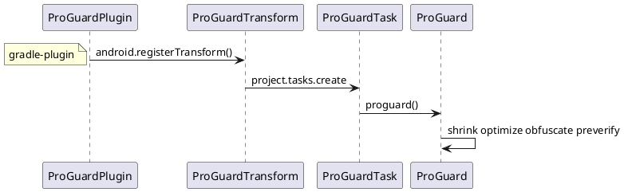

## 包内精简 - APK打包 （编译，打包，优化，签名，安装）
  [包大小](https://mp.weixin.qq.com/s/_gnT2kjqpfMFs0kqAg4Qig?utm_source=androidweekly.io&utm_medium=website)

gradle,Transform的应用
批量打包
```打包流程
G: gradle build tools
B: android build tools
J: JDK tools


+--------------------------------------------------------------------------------------+
| /META-INF                                                                            |
| /assets                                                                              |
| /res                                                                                 |
| /libs                                                                                |
| class.dex                                                                            |
| resources.arsc                                                                       |
| AndroidManifest.xml                                                                  |
+--------------------------------------------------------------------------------------+
|G                                                                                     |
|    multiple agent tool                                                               |
+--------------------------------------------------------------------------------------+
|B                                                                                     |
|   zipalign                                                                           |
+--------------------------------------------------------------------------------------+
|J                                                                                     |
|   javasigner  V1, V2(N), V3(P)                                                       |
+--------------------------------------------------------------------------------------+
|G                                                                                     |
|   ApkBuilder (so,FontCreator)                                                        |
+--------------------+                          +--------------------------------------+
|B                   |                          |B                                     |
|  linker            |                          |    dex                               |
+--------------------------------------------------------------------------------------+
|B                   |B                         |G             +-----------------------+
|  bcc compat        |   AAPT                   |    proguard  |          Preveirfy    |
|                    |  (Lint,TinyPNG,tintcolor)|              |          Obfuscate    |
|                    |  (WebP,svg)              |              |          Optimize     |
|                    |                          |              |          Shrink       |
|                    |                          |              +-----------------------+
+--------------------+                          +--------------------------------------+
|B                   |                          |        J                             |
|  llvm-rs-cc        |                          +-------+    javac                     |
|                    |                          | R.java|                              |
|                    +--------------------------+--------------------------------------+
|                    |G                                 |B                             |
|                    | menifest/assets/resource merger  |    aidl                      |
+--------------------+-----------------------------------------------------------------+

                                                                                              

```

walle
```
+---------------------------------------------------------------------------------------------+
|                                        walle-cli                                            |
|                                                                                             |
+---------------------------------------------------------------------------------------------+
|                         jcommander                                                          |
|                                                               Batch2Command                 |
|                                                                                             |
+---------------------------------------------------------------------------------------------+
|                                                                                             |
|                      ChannelReader                ChannelWriter                             |
|                                                                                             |
|                                                                                             |
|                      PayloadReader                                                          |
|                                                                                             |
+---------------------------------------------------------------------------------------------+
|                      ApkUtil                                                                |
|                         findApkSigningBlock()                                               |
+---------------------------------------------------------------------------------------------+

```

### 打包自动化
[gradle.build(ant-javacompiler;ivy;maven-repo;groovy-asm-parseclass;jetbrains-kotlin-gradle-plugin;android-gradle-plugin ) dex2jar,jd-gui,apktool)](..\问题优化与总结\知识体系-DSL-gradle.md)
### [gradle sdl ](https://source.codeaurora.cn/quic/la/platform/tools/base)
#### ProGuard
     代码混淆 -printmapping ，-applymapping
[ProGuard](https://github.com/Guardsquare/proguard.git)

#### 资源打包 AAPT
     [aapt2 适配之资源 id 固定](https://fucknmb.com/2017/11/15/aapt2%E9%80%82%E9%85%8D%E4%B9%8B%E8%B5%84%E6%BA%90id%E5%9B%BA%E5%AE%9A/)
          aapt  -p public.xml
          aapt2 --stable-ids ,--emit-ids

##
adb shell am start -n com.android.music/com.android.music.MusicBrowserActivity

adb shell pm dump com.tencent.weread.eink | findstr “versionName”


adb shell pm list package


```bash
adb shell dumpsys -T 60000 activity -v all


adb shell dumpsys activity---------------查看ActvityManagerService 所有信息
adb shell dumpsys activity activities----------查看Activity组件信息
adb shell dumpsys activity services-----------查看Service组件信息
adb shell dumpsys activity providers----------产看ContentProvider组件信息
adb shell dumpsys activity broadcasts--------查看BraodcastReceiver信息
adb shell dumpsys activity intents--------------查看Intent信息
adb shell dumpsys activity processes---------查看进程信息


adb shell dumpsys activity activities | sed -En -e '/Running activities/,/Run #0/p'
adb shell dumpsys activity activities | sed -En -e '/Stack/p' -e '/Running activities/,/Run #0/p'

adb shell dumpsys activity providers | sed -En -e '/Stack/p' -e '/Running activities/,/Run #0/p'


adb shell  dumpsys window windows |grep "Window #"


>>>>>>>>>>>>>>>>>>>>>>>>>>>>>>>>>>>>>>>>
adb shell am kill <packagename>

If you want to kill the Sticky Service,the following command NOT WORKING:

adb shell am force-stop <PACKAGE>
adb shell kill <PID>
The following command is WORKING:

adb shell pm disable <PACKAGE>
If you want to restart the app,you must run command below first:

adb shell pm enable <PACKAGE>
<<<<<<<<<<<<<<<<<<<<<<<<<<<<<<<<<<<<<<<
```