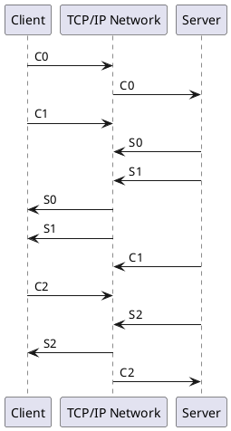
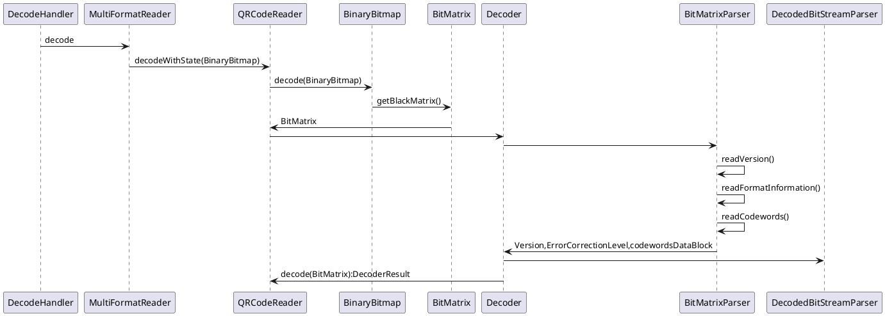

## 多媒体
color text image audio video
 
+----------------+-----------------------------------------------------------------+
|                |                                                                 |
|  data layer    |      Text         Image          Audio             Video        |
|                |                                                                 |
+----------------------------------------------------------------------------------+
|                |                                                                 |
| container layer|     TextView    ImageView                       SurfaceView     |
|                |                                                                 |
+----------------------------------------------------------------------------------+
|                |                                                                 |
|  driver layer  |                                                                 |
|                |                                                                 |
+----------------------------------------------------------------------------------+
|                |                                                                 |
| hardware layer |                                                                 |
+----------------+-----------------------------------------------------------------+

## 显卡
### freetyp2
### Agg
### skia

Canvas是一个2D的概念，是在Skia中定义的
Skia 2D和OpenGL/ES 3D

[skia api](https://skia.org/user/api?cl=9919)
```
SkCanvas - the drawing context.
SkPaint - color, stroke, font, effects
SkRect - rectangles
SkRegion - set operations with rectangles and paths
SkPath - contours of lines and curves
+--------------------------------------------------------------------+
|                                                                    |
| SkCanvas                        SkImageFilter                      |
| SkPaint                            SkAlphaThresholdFilter          |
| SkPath                             SkBlurImageFilter               |
| SkImage                            SkBitmapSource                  |
| SkSurface                          SkColorFilterImageFilter        |
| SkShader                           SkComposeImageFilter            |
|    SkComposeShader                 SkDisplacementMapEffect         |
|    SkPerlinNoiseShader             SkDownSampleImageFilter         |
|    SkGradientShader                SkDropShadowImageFilter         |
|    SkTransparentShader             SkLightingImageFilter           |
| SkColorFilter                      SkMagnifierImageFilter          |
|    SkColorMatrixFilter             SkMatrixConvolutionImageFilter  |
|    SkLumaColorFilter               SkMergeImageFilter              |
|    SkModeColorFilter               SkDilateImageFilter             |
|    SkPathEffect                    SkErodeImageFilter              |
|    SkPath2DPathEffect              SkOffsetImageFilter             |
|    SkLine2DPathEffect              SkPictureImageFilter            |
|    SkPath1DPathEffect              SkRectShaderImageFilter         |
|    SkArcToPathEffect               SkTileImageFilter               |
|    SkCornerPathEffect              SkXfermodeImageFilter           |
|    SkDashPathEffect             SkMaskFilter                       |
|    SkDiscretePathEffect            SkTableMaskFilter               |
|    SkComposePathEffect          SkDrawLooper                       |
|    SkSumPathEffect                 SkBlurDrawLooper                |
|                                                                    |
+--------------------------------------------------------------------+
```
## 音视频
- audio

- video
  +----------------------------------------------------------------------------------------------------------+
  +----------------------------------------------------------------------------------------------------------+
     +-------+  +-------+  +-------+ +-------+  +-------+  +-------+  +-------+  +-------+  +-------+ +-------+ 
     |       |  |       |  |       | |       |  |       |  |       |  |       |  |       |  |       | |       | 
     |       |  |       |  |       | |       |  |       |  |       |  |       |  |       |  |       | |       | 
     |       |  |       |  |       | |       |  |       |  |       |  |       |  |       |  |       | |       | 
     |       |  |       |  |       | |       |  |       |  |       |  |       |  |       |  |       | |       | 
     |       |  |       |  |       | |       |  |       |  |       |  |       |  |       |  |       | |       | 
     +-------+  +-------+  +-------+ +-------+  +-------+  +-------+  +-------+  +-------+  +-------+ +-------+ 
  +----------------------------------------------------------------------------------------------------------+
  +----------------------------------------------------------------------------------------------------------+
### 显卡
 freetyp2  Agg  skia
### 多媒体应用历史（多种媒介为一体）
5300-4300年期间，良渚刻画《良渚文化刻画符号》
公元前14世纪，殷商甲骨文（文字是人类用表义符号记录表达信息以传之久远的方式和工具）
            《甲骨文对照表》金文代表《静簋》
1839年，世界上第一台照相机是法国的达盖尔发明的。
1857年，法国发明家斯科特（Scott）发明了的声波振记器
1877年，爱迪生制造出人类史上第一部留声机，开始储存媒体的领域

1980年至90年代中期，模拟视频监控技术阶段
1990年代中期到21世纪初，半数字视频本地监控系统
21世纪初至今，全数字远程视频监控阶段
2004年，由Michael Niedermayer主要负责维护 FFMPEG
2005年，Youtube 让用户下载、观看及分享影片或短片
2008年，推出YY语音是一款游戏沟通的即时通讯软件，发展游戏互动
2011年，Google宣布向开发人员开放WebRTC架构的源代码
2011年，推出的一个为智能终端提供即时通讯服务的免费应用程序，微信
2011年，GIF快手用来制作和分享GIF图片
2012年，MPEG-DASH由ISO/IEC发表，正式成为国际标准，作为一种基于HTTP的自适应码率的流媒体传输解决方案
2014年，快手异军突起时也是收割了大批YY的头部主播
2017年，"今日头条"10亿美元收购北美音乐短视频社交平台Musical.ly
2017年，国外某ID名为“deepfakes”的Reddit论坛用户首次将自己制作的AI换脸视频

视频监控（）
网络视频（点播，视频回放。SRS流媒体服务器）
主播直播（1对多。游戏直播，移动直播。腾讯云，SRS流媒体服务器）
音视频通话（P2P，平等地位。WebRTC 视频会议）
短视频（后期处理）
人工智能


## 音视频概念
### 基础

#### 音频
[音频知识](https://blog.csdn.net/mandagod/article/details/77895472)

##### 声音三要素：音强，音调，音品
音频要素：bit(位宽)，采样率（每秒的采样 8000/44100）, channel(声道数)
Android 音频：位宽（sample format），采样率（bit rate），通道数（channels）
音频压缩 G.711 G.722 ...
1. 位深/位宽（很亮音高） 16bit
  声压 0.00002pa~0.63pa；声压和分贝换算公式：（声压级（分贝）= 20×lgP/P0）
      ```js
      模拟信号与音强
                              X           X                                  XX        XXX         XXX
                     XXX    XXXX         XXX                                XX XXX    XX XX       XXXXXX
         XX   XXXX  XXXXX  XXX X         XXX                               XX  XXX    X  XX       XX   X         XX
      X  XXXX   X  X  XX XX  X X X         X X                               XX   XX    X   X       XX   X      XXXXX
      X  XX X   X  X  XX X   X X X  XX    XX X                               X    XX   XX   X       XX    X     X XXX  X
      X  X  X   X  X  XX XX  XX  X  XX    XX X                               X    XXX  XX   X       XX    X     XX  X XXX
      X  XX X  XX  X  X  X   XX  X X XX   XX X XXXXXX                       XX    XXX  XX   X      XX     X     X   X X X
      X  XX X  X   X  X  XX  X   XXX XX   X  X XX  XXX              XXX     XX     XX  XX   X     X X     X     X   XXX X
      XXXX  X XX   XXXX  XX  XX      X   XX XX XX  X X            XXX X     XX     XX  XX   X     XXX     XX   XX   XXX  X
      XXX  XXXX   XXX   X X X       X   XX XX X    XXX         XXXX   XX   XX     XX  XX   X    X X      XX  XX     X
      X                             X   X  XX X    XXXX        XX      XX  XX     XX  XX   X    XXX      XXX XX
                                    X   X  XX X     XXXX      XXX       XXXX      XX XX    XX  X X       XXXXXX
                                    XX XX   XXX     XXXXXXXXXXXX         X         XXX      XXXXXX          X
                                    XXXXX            XXXXXXXXXX                    XXX       XX

      ```
2. 采样率（衡量音频）
人耳能听到的声波的频率范围通常? 20~20000Hz 为了保证声音不失真，奈奎斯特采样定理，采样频率应在40kHz以上。兼容电视采样44.1kHz（电视行*场*3）
常用的音频采样频率有：
      8,000 Hz - 电话所用采样率, 对于人的说话已经足够
      11,025 Hz - AM调幅广播所用采样率
      22,050 Hz和24,000 Hz - FM调频广播所用采样率
      32,000 Hz - miniDV 数码视频 camcorder、DAT (LP mode)所用采样率
      37,000 Hz -
      44,100 Hz - 音频 CD, 也常用于 MPEG-1 音频（VCD, SVCD, MP3）所用采样率
      47,250 Hz - 商用 PCM 录音机所用采样率
      48,000 Hz - miniDV、数字电视、DVD、DAT、电影和专业音频所用的数字声音所用采样率
      50,000 Hz - 商用数字录音机所用采样率
      96,000 或者 192,000 Hz - DVD-Audio、一些 LPCM DVD 音轨、BD-ROM（蓝光盘）音轨、和 HD-DVD （高清晰度 DVD）音轨所用所用采样率
      2.8224 MHz - Direct Stream Digital 的 1 位 sigma-delta modulation 过程所用采样率。

3. 通道 
      单声道(mono)
      双声道(stereo) 立体声
      2.1声道（增加低音声道）
      四声道立体声(quad)
      杜比声（5.1声道）源于4.1环绕，增加了一个中置单元负责传送低于80Hz的声音信号，有利于加强人声
      7.1声道
##### 音频帧
      音频帧：音频在量化得到二进制的码字后，需要进行变换，而变换（MDCT）是以块为单位（block）进行的，一个块由多个（120或128）样本组成。而一帧内会包含一个或者多个块。帧的常见大小有960、1024、2048、4096等。一帧记录了一个声音单元
##### 比特率

#### 视频 
视频：分辨率（resolution），帧率（frame rate），比特率等编码参数
视频要素：宽，高,像素格式
##### 监控分辨率
      Qcif（176×144）
      CIF（352×288）
      4CIF（704×576）
      HALF D1（704×288）
      D1（704×576）
[SIF、CIF、4CIF、D1](https://www.cnblogs.com/xkfz007/articles/2396343.html)

[视频开发基础知识](https://blog.csdn.net/yuqingzhude/article/details/78676906)
 
[标准视频测试序列地址](http://medialab.sjtu.edu.cn/resources/resources.html)
[标准视频测试序列地址](http://ultravideo.cs.tut.fi/#testsequences)
##### 图片压缩理论
      空间冗余
            人眼对灰度，蓝色和红色敏感（YBcRc），相差64度的灰度分辨不出。统一为一个颜色，方便行程编码
            只保存坐标，大小，方向 （运动矢量）
      时间冗余
            眼睛只能识别25张图片。相连没有变，0表示和前一个位置一直
```
压缩方法
有损                              无损
      变换编码                         Huffman编码
            离散余弦⭐                 行程编码
            离散小波                LZW编码
            离散傅里叶              算术编码
      混合编码
            JPEG
            MPEG
            H.264


```
##### [静态图像压缩技术： JPEG编码](https://www.youtube.com/watch?v=3U2xoiBrRi4)
对单个图片编码，只有帧内（Intraframe）压缩也称为空间压缩

mdct（改进余弦变换）                      -> 量化（不公平除法）                                         ->    霍夫曼编码  （DC系数，AC系数）
   低频到高频分布（可恢复，用矩阵倒置）  去掉干扰数据（创造更多0，方便压缩，不可恢复）                         每块DC系数作为预测，所有DC系数组合，差分脉冲编码
                                         第一位DC系数，其他AC系数                                               AC系数回顾行程编码（RLE）
                                                                                                                  最后用霍夫曼编码
[影像算法解析——JPEG 压缩算法 ](https://zhuanlan.zhihu.com/p/40356456)
##### 运动图像压缩 (What is MPEG Format)[https://www.youtube.com/watch?v=F0ZinF-gTrY]
增加帧间压缩(Interframe compression)也称为时间压缩(Temporal_compression)

      VCD                            DVD   DVB                        DVB+S2
      +                              +     +                          +
      |                              |     |                          |
      |                              |     |                          |
      v                              v     v                          |
                                     PS     TS                        |
                                     +     +                          |
                                     +---->-<-------------------------+
                                           v                          v
      MPEG-1                          MPEG-2                   MPEG-4 AVC

      VCD/MP3                      DVD（应用）
      CIF                           DI（空间分辨率）
      352x240                    720x480/1280x720
      30fps                        60fps（帧率）
      1.5Mbps                       15Mbps（码流）
      30                            40(压缩率)
      16x16（宏块）                  8x8（宏块）                 （基于内容宏块）
          
      （六层视频结构）          
      运动补偿序列（I/P/B帧）⭐     隔行扫描支持 ⭐              基于内容（分割算法）    
      GOP/Piture/Slide                                            （预测编码） 
      宏块（运动补偿基本单元）                                   slice 代替帧
      块（DCT操作的基本单元）                                    帧内预测

注：I/P/B帧是1/25s内的图片序列

      I    B    B    P    B    B    P    B    B    P    B    B    I
                     +              +              +
GOP   +--------------+--------------+--------------+--------------+


```

1.Motion-compensated sequence
|<----------------------------------------    GOP(M,N)（ M:I帧数量，N: GOP长度） ------------------------------------>|
+----------------------------------+   +----------------------------------+   +----------------------------------+ +----------------------------------+
|                                  |   |                                  |   |                                  | |                                  |
|       XXXXXX                     |   |            XXXXXX                |   |                                  | |                                  |
|    XXXX    XXXX                  |   |         XXXX    XXXX             |   |                 XXXXXX           | |                                  |
|    XX         XX                 |   |         XX         XX            |   |              XXXX    XXXX        | |                      XXXXXX      |
|    X           X                 |   |         X           X            |   |              XX         XX       | |                   XXXX    XXXX   |
|    XX         XX                 |   |         XX         XX            |   |              X           X       | |                   XX         XX  |
|    XXXXXXXX XXX               X  X   |         XXXXXXXX XXX          X  X   |              XX         XX    X  X |                   X           X  X
|     XXXXXXXXX        XX      XXXXX   |          XXXXXXXXX   XX      XXXXX   |              XXXXXXXXXXXX    XXXXX |                   XX XX      XXXXX
|                    XX XX XXXX    |   |                    XX XX XXXX    |   |               XXXXXXXXXX XXXX    | |                   XXXXXXXXXXXX   |
|                XXXX    XX  X     |   |                XXXX    XX  X     |   |                XXXX    XX  X     | |                XXXXXXXXXXXXX     |
|          XXX XX  X               |   |          XXX XX  X               |   |          XXX XX  X               | |          XXX XX  X               |
+---------XX-XX--------------------+   +---------XX-XX--------------------+   +---------XX-XX--------------------+ +---------XX-XX--------------------+
    
 2.picture                              3.slice (一个或多个联系宏块组成)               4.macro block                        5.block
+----------------------------------+   +----------------------------------+              +----------------+         +-------------+
|                                  |   |                                  |          +-------------+      |         |             |
|       XXXXXX                     |   |       XXXXXX                     |      +----+-----+      |      |         |             |
|    XXXX    XXXX                  |   +-----XXXX----XXXX-----------------+      |    |     |      |      |         |   16x16     |
|    XX         XX                 |   |    XX         XX                 |      |    |     |      |      |         |   (MPEG-1)  |
|    X           X                 |   |    X           X                 |      |  Y1| Y2  | U    |  V   |         |             |
|    XX         XX                 |   |    XX         XX                 |      |    |     |      |      |         |             |
|    XXXXXXXX XXX               X  X   +----XXXXXXXX-XXX---------------X--X      +----+-----+      +------+         |             |
|     XXXXXXXXX        XX      XXXXX   |     XXXXXXXXX        XX      XXXXX      |    |     |      |                +-------------+
|                    XX XX XXXX    |   |                    XX XX XXXX    |      |  Y3| Y4  +------+   
|                XXXX    XX  X     |   +-------------XXXX----XX--X--------+      |    |     |
|          XXX XX  X               |   |          XXX XX  X               |      +----+-----+
+---------XX-XX--------------------+   +---------XX-XX--------------------+  

```


[计算残差图像](https://www.jianshu.com/p/ed12e8340f6b)
首先将两张图片转化为Mat对象，然后计算两个Mat 矩阵对象之间的绝对值差，这个要求两个矩阵的长和宽要一样，所以需要将两个Mat先用resize函数重新设置长和宽。
absdiff函数将两个矩阵的绝对值差计算结果存在Mat中。
[运动补偿矢量](https://www.cnblogs.com/AndyJee/p/3724917.html)
https://wenku.baidu.com/view/30de74c789eb172ded63b7f0.html4

### 硬件采集
#### 前端设备
ip camera 内置rtsp服务

gb28181服务，开源库 PJSIP，
#### 硬件
[音视频](https://www.ibm.com/developerworks/cn/linux/l-ossapi/)
[Open-Sound-System](https://github.com/Open-Sound-System/Open-Sound-System.git)
[alsa-oss](https://github.com/alsa-project/alsa-oss.git)

### 编码
封装（mux)：复用，按一定格式组织原始音视频流

解封装（Demux）：按照一定格式解析出原始音视频流

视频：（一堆图片，需要编码压缩）
   YUV420/422->H264
   rgb888->H264
   YUV420->H263
音频：
   PCM(原始)->AAC
   PCM(原始)->G726
   PCM(原始)->G711
ES流 PES流 TS流 rtsp流 rtmp流 hls流
流媒体：采用流式传输方式
   推模式
   拉模式
   实时流
#### 音频

Uncompressed            Compressed - Lossless     Compressed - Lossy
Audio CD                Apple Lossless Audio       AMR/Mp3
Audio DVD               TTA                        AAC
PCM WAV and AIFF        FLAC                       WMA
Vinyl Record            Monkey's Audio             Mini Disc 
Cassette                Shorten
DAT                     WavPack


##### 算法
音频算法处理（去噪、静音检测、回声消除、音效处理、功放/增强、混音/分离，等等）

##### >1 无压缩

##### PCM编码/G.722
##### >2 有损压缩 
##### ~~MP3~~(MPEG/1 Audio Player3)
始于1980年代中期(1987)，在德国Erlangen的Fraunhofer研究所开始的) 
2017,
[MPEG-1 Audio 编码器](https://blog.csdn.net/liushuang95/article/details/74129757)

使用数据帧存储和传输
```
    TAG_V2（10byte ）
        head（3byte "ID3"）
        ver （1byte "3"）
        revision （1byte "0"）
        flag （1byte  ）
        size （4byte  ）
    TAG_Frame
        id（4byte）
        size（4byte）
        flags（2byte）
    Data_frame
        head（4byte）（第1帧数据：帧头为 FF FB 9004）
                ..

    TAG_V1（5byte ID3V1）
```
##### AAC 
1998年 提出 AMR(Adaptive Multi-Rate)标准, AMR被3gp替代

1997年，基于MPEG-2的音频编码技术。
2000年，MPEG-4标准出现后，加入了SBR技术和PS技术，MPEG-4 AAC ，取代mp3
2017年，Technicolor也已将授权即将终止的信息告知制造厂商
```
+--------------------+-------------------+-----------------+------------------+
|                    |                   |                 |                  |
|  ADTS_HEADER       |   AAC ES          |   ADTS_HEADER   |   AAC ES         |
|                    |                   |                 |                  |
+--------------------+-------------------+-----------------+-------------------

```
ADTS 头中有 采样率、声道数、帧长度

AAC专利有专利


##### Opus（取代Speex和Vorbi）
2012年7月2日，Opus被IETF批准用于标准化。

##### >3 无损压缩 
##### FLAC 
2001年6月FLAC发布了1.0版。
##### APE 
2011年4月16日发布，由软件Monkey's audio压制得到，开发者为Matthew T. Ashland，源代码开放
#### 视频

[视频编码历史](https://appleinsider.com/articles/12/03/14/mozilla_considers_h264_video_support_after_googles_vp8_fails_to_gain_traction/)
##### 播放时间
播放等待，pts,dts


##### 字幕
Teletext 20世纪70年代由英国制定的电视文本信息传送服务。   
Subtitles 是电影或电视节目中一种显示对话文本的字幕。
Closed Caption 一种字幕的标准。选择开启这项功能的人才能看到。
   CC主要遵循两个标准：EIA-608和EIA-708（CEA-708）标准。 
   EIA－608，由美国电子工业协会（EIA）制定，规定了PAL/NTSC模拟电视上Line21行所包含的caption信息。字幕在line21行一个肉眼看不见的视频数据区域来传输，采用固定带宽960bit/s。 

   EIA－708（CEA-708），由美国电子工业协会制定，在美国和加拿大是ATSC数字电视的CC字幕标准。不像DVB标准下的字幕，ECEA-708的字幕反而更接近于传统的line21线的文本字幕。不过，与传统line21线字幕不同的是，CEA-708的字幕包含大部分的Latin-1字符。能全面兼容西班牙与和法语，能够兼容大部分的其他西欧语种。在美国，FCC组织要求所有13”以上的数字电视都必须要支持CEA-708解码。
```java
switch (mimeType) {
    case MimeTypes.TEXT_VTT:
    return new WebvttDecoder();
    case MimeTypes.TEXT_SSA:
    return new SsaDecoder(format.initializationData);
    case MimeTypes.APPLICATION_MP4VTT:
    return new Mp4WebvttDecoder();
    case MimeTypes.APPLICATION_TTML:
    return new TtmlDecoder();
    case MimeTypes.APPLICATION_SUBRIP:
    return new SubripDecoder();
    case MimeTypes.APPLICATION_TX3G:
    return new Tx3gDecoder(format.initializationData);
    case MimeTypes.APPLICATION_CEA608:
    case MimeTypes.APPLICATION_MP4CEA608:
    return new Cea608Decoder(
        mimeType,
        format.accessibilityChannel,
        Cea608Decoder.MIN_DATA_CHANNEL_TIMEOUT_MS);
    case MimeTypes.APPLICATION_CEA708:
    return new Cea708Decoder(format.accessibilityChannel, format.initializationData);
    case MimeTypes.APPLICATION_DVBSUBS:
    return new DvbDecoder(format.initializationData);
    case MimeTypes.APPLICATION_PGS:
    return new PgsDecoder();
    default:
    break;
}
Webvtt、Tx3g、Subrip、Ssa、Dvb、Pgs、Ttml
```
##### 编码其他           
codecs
H.264(AVC) H.265(HEVC) VP9 AVI
MP3(MPEG-2),AAC,AC-3

formats
mp4(MP4 Container MPEG-4 part 14)
HLS
MPEG-DASh


container ,video codec ,Audio Codec ,Channels:             ,Sample Rate,  Aspect Ratio ,Frame Rate
mp4          H.264        AAC-LC     Stereo or Stero 5.1      96KHZ        16:9       60fps

video bitrates
resolution frame rate HDR
audio bitrate
Stereo 5.1 , stereo     ,Mono
512kbps     384 kbps    ,128kbps

##### MJPEG
MJPEG对每一帧（一张张分离的JPG数据）进行压缩，再随机储存每一帧。
##### H264/AVC 视频编码
MPEG-4针对Internet传送而设计，提供比MPEG-2更高的视频压缩效率，
视频会议希望有更进一步的压缩，才出现了H.264。
视频要在网络上进行传播的话，是需要经过编码将原本庞大的数据量进行压缩减少冗余信息，从而实现网络传输
+-------------------------------------------------------------------------------------+
|                                         h254         h265                           |
|                                         vp8          vp9                            |
|                                         h264         hevc                           |
+-------------------------------------------------------------------------------------+
[HEVC/H264编码格式]( https://caniuse.com/#feat=hevc)
[WEBM](http://caniuse.com/webm/embed/)
[](https://www.itu.int/ITU-T/recommendations/rec.aspx?rec=13189)

GOP 关键帧的周期
[H264 与 MPEG-4 区别](https://www.bdti.com/InsideDSP/2005/03/14/Idsp1)
[H264 结构](https://blog.csdn.net/doyzfly/article/details/103229018)

H.264 编码：

    1. VCL（帧图片编码为一片或多片，分片数据中是宏块）
       1.  帧间和帧内预测（Estimation）
       2.  变换（Transform）和反变换
       3.  量化（Quantization）和反量化
       4.  环路滤波（Loop Filter）
       5.  熵编码（Entropy Coding）
    2. NAL（编码后的数据存储和传输）
       1. slice（五种分片I，B，P，SP，SI）
       2. meta （SPS, PPS，SEI）

slice的目的是为了限制误码的扩散和传输，使编码片相互间保持独立
宏块的运动补偿
块用于DCT操作

图像分组
帧内压缩技术原理
帧间压缩技术原理
DCT
CABAC压缩原理
序列参数集SPS（Sequence Paramater Set），保存了一组编码视频序列(Coded video sequence)的**全局参数**。
图像参数集PPS，包含**一幅图像**所用的公共参数，即一幅图像中所有片段SS（Slice Segment）引用同一个PPS


获取h264
ffmpeg -i 8x8.png -pix_fmt yuv420p 8x8.h264

###### NAL结构 -H264网络传输
[ H.264视频的RTP有效负载格式](https://tools.ietf.org/html/rfc3984#section-5.2)
[H.264 : Advanced video coding for generic audiovisual services](https://www.itu.int/rec/dologin_pub.asp?lang=e&id=T-REC-H.264-201704-S!!PDF-E&type=items)
网络数据传输过程中H264的数据结构是以NALU（NAL单元）进行传输的，传输数据结构组成为[NALU Header]+[RBSP]，，每个 NALU可分为VCL 或非 VCL
两种打包 NALU方式：
1. Packet-Transport System （RTP）
2. Byte-Stream Format（每个NAL单元的开头添加一个三字节或四字节开始代码0x000001 或 0x00000001）

```js
NAL unit
    +---------------+
    |0|1|2|3|4|5|6|7|
    +-+-+-+-+-+-+-+-+
    |F|NRI|  Type   |
    +---------------+
```
1. 单一 NAL 单元模式 
```js
     0                   1                   2                   3
     0 1 2 3 4 5 6 7 8 9 0 1 2 3 4 5 6 7 8 9 0 1 2 3 4 5 6 7 8 9 0 1
    +-+-+-+-+-+-+-+-+-+-+-+-+-+-+-+-+-+-+-+-+-+-+-+-+-+-+-+-+-+-+-+-+
    |                          RTP Header                           |
    +-+-+-+-+-+-+-+-+-+-+-+-+-+-+-+-+-+-+-+-+-+-+-+-+-+-+-+-+-+-+-+-+
    |STAP-A NAL HDR |         NALU 1 Size           | NALU 1 HDR    |
    +-+-+-+-+-+-+-+-+-+-+-+-+-+-+-+-+-+-+-+-+-+-+-+-+-+-+-+-+-+-+-+-+
    |                         NALU 1 Data                           |
    :                                                               :
    +               +-+-+-+-+-+-+-+-+-+-+-+-+-+-+-+-+-+-+-+-+-+-+-+-+
    |               | NALU 2 Size                   | NALU 2 HDR    |
    +-+-+-+-+-+-+-+-+-+-+-+-+-+-+-+-+-+-+-+-+-+-+-+-+-+-+-+-+-+-+-+-+
    |                         NALU 2 Data                           |
    :                                                               :
    |                               +-+-+-+-+-+-+-+-+-+-+-+-+-+-+-+-+
    |                               :...OPTIONAL RTP padding        |
    +-+-+-+-+-+-+-+-+-+-+-+-+-+-+-+-+-+-+-+-+-+-+-+-+-+-+-+-+-+-+-+-+
```
2. 组合封包模式。即可能是由多个 NAL 单元组成一个 RTP 包. 分别有4种组合方式: STAP-A, STAP-B, MTAP16, MTAP24.   那么这里的类型值分别是 24, 25, 26 以及 27.
```js
     0                   1                   2                   3
     0 1 2 3 4 5 6 7 8 9 0 1 2 3 4 5 6 7 8 9 0 1 2 3 4 5 6 7 8 9 0 1
    +-+-+-+-+-+-+-+-+-+-+-+-+-+-+-+-+-+-+-+-+-+-+-+-+-+-+-+-+-+-+-+-+
    | FU indicator  |   FU header   |                               |
    +-+-+-+-+-+-+-+-+-+-+-+-+-+-+-+-+                               |
    |                         FU payload                            |
    |                               +-+-+-+-+-+-+-+-+-+-+-+-+-+-+-+-+
    |                               :...OPTIONAL RTP padding        |
    +-+-+-+-+-+-+-+-+-+-+-+-+-+-+-+-+-+-+-+-+-+-+-+-+-+-+-+-+-+-+-+-+
```
3. 分片封包模式。用于把一个 NALU 单元封装成多个 RTP 包. 存在两种类型 FU-A 和 FU-B. 类型值分别是 28 和 29.
###### VP8
 WebP，是以 VP8编码为基础的图片文件格式，目的是取代现有的 JPEG
##### H265/HEVC 视频编码
帧扫描

###### VP9
 WebP，是以 VP8编码为基础的图片文件格式，目的是取代现有的 JPEG
###### AV1
AV1的目标是在VP9/HEVC上基础上提高约30%的编码效率。
AV1完全是对标H.265去的。H.265目前有比较高的专利门槛，和H.265有关的有4大专利池，HEVC Advance，MPEG LA，Velos Media和Technicolor。而AV1完全免费，不管你是用于商业用途还是非商业用途。


#### qsv硬编码

### 文件或媒体流
视频格式有：mp4/m4v/3gp/mpg、flv/f4v/swf、avi、gif、wmv、rmvb、mov、mts/m2t、webm/ogg/mkv
音频：mp3、aac/mp4/M4A、ape/flac、wav、wma、amr、mid
图片——点阵：jpg、png、gif、bmp、ico、tif(tiff)、psd/psb、WebP、RAW、pdf、DCM、sai/rif
图片——矢量图：eps/ai/cdr、svg、ttf

[音视频格式分析](https://hexinator.com/)


[多媒体文件 Sample](https://filesamples.com/)
[分割视频](https://www.aconvert.com/cn/audio/split/)
#### 储存和传输图片的格式（PNG，JEPG，BMP，GIF）
真实性、透明性、矢量性
- 1967，模拟电视信号传输就采用了运行长度编码（RLE）方案
- 1977年和1978年，"LZ77"和"LZ78"无损压缩算法
- 1983年，LZW（LZ78变种），注册了专利，[ LZW 压缩算法专利已失效](https://www.gnu.org/philosophy/gif.html)
- 1986年，Microsoft开发 [~~BMP~~](https://en.wikipedia.org/wiki/BMP_file_format)，运行 Windows 操作系统的计算机。**支持有损位图，不支持透明动画**
- 1987年，设计一种新的、可移植的压缩图像格式，GIF，用于"图形交换格式"，使用LZW压缩方法（作者不知道LZW有版权）。**支持有损位图，支持动画，不支持全透明**
- 1992年，JPEG standard (ISO/IEC 10918) ，**有损位图，不支持透明，动图**
- 1994年底，由于Unysis公司宣布GIF拥有专利的压缩方法，要求开发GIF软件的作者须缴交一定费用
- 1995年，Tom将第一个PNG草稿——当时称为"PBF"，用于便携式位图格式，压缩算法使用LZ77。用于替代 GIF，**无损位图，支持透明，不支持动图**
- 2010年，WebP的开源图像格式，支持动图。**支持有损位图，支持透明动画，支持元数据和颜色配置**，高解码高消耗，解码时间是jpg的8倍？

##### JIFI
JFIF 是一个图片文件格式标准，它是一种使用 JPEG 图像压缩技术存储摄影图像的方法
##### BMP
RLE 压缩
##### JPEG

##### [PNG](http://www.libpng.org/pub/png/spec/1.2/PNG-Structure.html)
```
    PNG signature（8Byte： 89  50  4e  47  0d  0a  1a  0a）
    chunk
        Length（4byte）
        Chunk Type（4Byte）
            （Chunk Data）
                IHDR（4byte "IHDR"）
                    width（4Byte）
                    heigth（4Byte）
                    bit depth（1Byte）
                    ColorType（1Byte）
                    Compression method（1Byte 。0 lz77滑动窗口）
                    Filter method（1Byte ）
                    Interlace method（1Byte 0 非隔行扫描；1 Adam7；）
                PLTE（4byte "PLTE"。color type 等于3时，必须有；2 and 6 可选；0 and 4，灰度图没有）
                IDAT Image data（需要使用zlib压缩）
                IEND（4byte "IEND"）
        CRC（4Byte）
        （辅助区块）
        Transparency 
         Color space 
        Textual 
        Miscellaneous 

```
[Color Type](http://www.libpng.org/pub/png/spec/1.2/PNG-Chunks.html#C.Critical-chunks)  
    0 灰度；2 真彩；3 索引彩色；4 带a 通道灰度；6 带a通道真彩；


##### [WebP](https://developers.google.cn/speed/webp/docs/riff_container)
```js
 0                   1                   2                   3
 0 1 2 3 4 5 6 7 8 9 0 1 2 3 4 5 6 7 8 9 0 1 2 3 4 5 6 7 8 9 0 1
+-+-+-+-+-+-+-+-+-+-+-+-+-+-+-+-+-+-+-+-+-+-+-+-+-+-+-+-+-+-+-+-+
|                    WebP file header (12 bytes)                |
+-+-+-+-+-+-+-+-+-+-+-+-+-+-+-+-+-+-+-+-+-+-+-+-+-+-+-+-+-+-+-+-+
|                          VP8 chunk                            |
+-+-+-+-+-+-+-+-+-+-+-+-+-+-+-+-+-+-+-+-+-+-+-+-+-+-+-+-+-+-+-+-+
WebP file header：
 0                   1                   2                   3
 0 1 2 3 4 5 6 7 8 9 0 1 2 3 4 5 6 7 8 9 0 1 2 3 4 5 6 7 8 9 0 1
+-+-+-+-+-+-+-+-+-+-+-+-+-+-+-+-+-+-+-+-+-+-+-+-+-+-+-+-+-+-+-+-+
|      'R'      |      'I'      |      'F'      |      'F'      |
+-+-+-+-+-+-+-+-+-+-+-+-+-+-+-+-+-+-+-+-+-+-+-+-+-+-+-+-+-+-+-+-+
|                           File Size                           |
+-+-+-+-+-+-+-+-+-+-+-+-+-+-+-+-+-+-+-+-+-+-+-+-+-+-+-+-+-+-+-+-+
|      'W'      |      'E'      |      'B'      |      'P'      |
+-+-+-+-+-+-+-+-+-+-+-+-+-+-+-+-+-+-+-+-+-+-+-+-+-+-+-+-+-+-+-+-+

VP8 chunk ：
 0                   1                   2                   3
 0 1 2 3 4 5 6 7 8 9 0 1 2 3 4 5 6 7 8 9 0 1 2 3 4 5 6 7 8 9 0 1
+-+-+-+-+-+-+-+-+-+-+-+-+-+-+-+-+-+-+-+-+-+-+-+-+-+-+-+-+-+-+-+-+
|                      ChunkHeader('VP8 ')                      |
+-+-+-+-+-+-+-+-+-+-+-+-+-+-+-+-+-+-+-+-+-+-+-+-+-+-+-+-+-+-+-+-+
|                           VP8 data                            |
+-+-+-+-+-+-+-+-+-+-+-+-+-+-+-+-+-+-+-+-+-+-+-+-+-+-+-+-+-+-+-+-+

```

[VP8 data](https://tools.ietf.org/html/rfc6386#section-9)

#### FLV
2002年，SWF
2003年，Flash Player 7 开始支持FLV
2005年，Adobe 收购 Macromedia  
2006年，Google收购YouTube
2008年，FLV 已经非常普及
FLV文件=FLV头文件+ tag1+tag内容1 + tag2+tag内容2 + ...+... + tagN+tag内容N
[](https://www.cnblogs.com/leisure_chn/p/10662941.html)
[FLV支持的编码](https://helpx.adobe.com/flash/kb/supported-codecs-flash-player.html)
[FLV支持的编码2](https://en.m.wikipedia.org/wiki/Flash_Video)
```
FLV Format（格式分为Head和多个Tag）：
    HEAD
        Signature(3 Byte "FLV")
        Version(1 Byte)
        Flags(1 Bypte，00000b0a,a,b分别表示 video 与 audio 存在的情况)
        DataOffset(4 Byte，header长度为9)
    TAGs
        back-pointers （4个字节）
        TAG_CONTENT
            tag type（1个字节，8为Audio,9为Video,18为scripts）
            tag data size（3个字节）
            Timestamp（3个字节）
            TimestampExtended（1个字节）
            stream id（3个字节）
            tag data（ tag data size个字节 ）
                scripts tag data：
                    AMF（onMetaData）：TLV格式
                    AMF（ECMA array type）：TLV格式
                Video
                    VideoTagHeader
                        FrameType
                                FLV_STREAM_TYPE_VIDEO,
                                FLV_STREAM_TYPE_AUDIO,
                                FLV_STREAM_TYPE_SUBTITLE,
                                FLV_STREAM_TYPE_DATA,
                                FLV_STREAM_TYPE_NB,
                        codecid
                            1: JPEG (currently unused)
                            2: FLV_CODECID_H263
                            3: FLV_CODECID_SCREEN
                            4: FLV_CODECID_VP6
                            5: FLV_CODECID_VP6A
                            6: FLV_CODECID_SCREEN2
                            7: FLV_CODECID_H264
                    VideoTagBody
                Audio
                    AudioTagHeader
                    AudioTagBody 

```
tag 分三种类型，video、audio、scripts
TLV格式规范：
```
0	Number type	8 Bypte Double
1	Boolean type	1 Bypte bool
2	String type	后面2个字节为长度
3	Object type	
4	MovieClip type	
5	Null type	
6	Undefined type	
7	Reference type	
8	ECMA array type	数组,4个字节为数组长度，类似Map
10	Strict array type	
11	Date type	
12	Long string type	后面4个字节为长度
```
[FLV 格式](/res/doc/音视频格式.xlsx)
##### FLV AAC
[](https://blog.csdn.net/weiyuefei/article/details/70880919)
[](https://www.cnblogs.com/lidabo/p/9020423.html)
[FLV AAC TAG](https://www.cnblogs.com/lidabo/p/7205022.html)
音频Tag头一般由一个字节定义（AAC用两个字节），第一个字节的定义如下：
音频格式 4bits | 采样率 2bits | 采样精度 1bits | 声道数 1bits|

音频格式 4bits
0x00 = Linear PCM, platform endian
0x01 = ADPCM
0x02 = MP3
0x03 = Linear PCM, little endian
0x04 = Nellymoser 16-kHz mono
0x05 = Nellymoser 8-kHz mono
0x06 = Nellymoser
0x07 = G.711 A-law logarithmic PCM
0x08 = G.711 mu-law logarithmic PCM
0x09 = reserved
0x0A = AAC
0x0B = Speex
0x0E = MP3 8-Khz
0x0F = Device-specific sound

采样率 2bits
0 = 5.5-kHz
1 = 11-kHz
2 = 22-kHz
3 = 44-kHz
对于AAC总是3，这里看起来FLV不支持48K AAC，其实不是的，后面还是可以定义为48K。

采样精度 1bits
0 = snd8Bit
1 = snd16Bit
压缩过的音频都是16bit

声道数 1bits
0 = sndMono
1 = sndStereo
对于AAC总是1


#### MP4
1998年10月，公布第1版 MPEG-4[](ISO/IEC 14496)
1999年01月，成为国际标准

[MP4支持编码](https://en.m.wikipedia.org/wiki/MPEG-4_Part_14#Data_streams)
```js
html5文本格式 支持的视频格式

Ogg = 带有 Theora 视频编码和 Vorbis 音频编码的 Ogg 文件

MPEG4 = 带有 H.264 视频编码和 AAC 音频编码的 MPEG 4 文件

WebM = 带有 VP8 视频编码和 Vorbis 音频编码的 WebM 文件
```
[mp4在线分析](http://download.tsi.telecom-paristech.fr/gpac/mp4box.js/filereader.html)
[](https://www.onlinemp4parser.com/)
[mp4info](https://dl.pconline.com.cn/download/409348.html)

```
ftyp
free
mdat
moov
    mvhd
    trak（video）
        tkhd
        edts
        mdia
            mdhd
            edts
            mdia
                vmhd
                dinf
                stbl
                    stsd⭐（视频的编码类型、宽高、长度，音频的声道、采样等信息）
                    stts
                    stsc（sample of chunk 找到包含指定sample的chunk）
                    stsz（sample size）
                    stco（chunkoffset ，每个thunk在媒体流中的位置）
    trak（audio trak，同video trak）
    udat
```
sample是媒体数据存储的单位，存储在media的chunk中
[sample由多个NALU组成](《ISO/IEC 14496》5.2.3 AVC sample structure definition)。
```
结构：
    Length1+NALU1+Length2+NALU2+....
```
#### WEBM
AVI——采用的视频编码并不统一，但普遍相同，其内容体积比较大
MKV——是Matroska公司为取代avi所开发的视频格式
WebM——是谷歌的一个开放免费的视频格式，它是基于MKV格式开发的
####  MPEG-TS 流

1995年，MPEG-2第一部分
[mpeg2ts 分析](http://www.pjdaniel.org.uk/mpeg/)
TS流与PS流的区别在于TS流的包结构是固定长度的，而PS流的包结构是可变长度的。

```js
捕获的MEPG-TS
ISO/IEC 13818-1 PID=0xc8 CC=4
    Header: 0x4700c834
        0100 0111 .... .... .... .... .... .... = Sync Byte: Correct (0x47)
        .... .... 0... .... .... .... .... .... = Transport Error Indicator: 0
        .... .... .0.. .... .... .... .... .... = Payload Unit Start Indicator: 0
        .... .... ..0. .... .... .... .... .... = Transport Priority: 0
        .... .... ...0 0000 1100 1000 .... .... = PID: Unknown (0x00c8)⭐
        .... .... .... .... .... .... 00.. .... = Transport Scrambling Control: Not scrambled (0x0)
        .... .... .... .... .... .... ..11 .... = Adaptation Field Control: Adaptation Field and Payload (0x3)
        .... .... .... .... .... .... .... 0100 = Continuity Counter: 4
    [MPEG2 PCR Analysis]
    Adaptation Field Length: 120
    Adaptation Field
        0... .... = Discontinuity Indicator: 0
        .0.. .... = Random Access Indicator: 0
        ..0. .... = Elementary Stream Priority Indicator: 0
        ...0 .... = PCR Flag: 0
        .... 0... = OPCR Flag: 0
        .... .0.. = Splicing Point Flag: 0
        .... ..0. = Transport Private Data Flag: 0
        .... ...0 = Adaptation Field Extension Flag: 0
        Stuffing: ffffffffffffffffffffffffffffffffffffffffffffffff…
```
TS包中Payload所传输的信息包括两种类型：
    音视频的PES包以及辅助数据；
    节目专用信息PSI。
```
TS Header

Adaptation Field

Payload
    PSI
      PAT  
      PMT
      CAT
      NIT
    PES
        ES
    
```
[PSI](https://en.wikipedia.org/wiki/Program-specific_information)
 PSI 由四张表构成：PAT（PID=0），PMT（PID=22），CAT（PID=1）和NIT；
 TS的解码分两步进行，其一，是从PID为0 的TS包里，解析出PAT表，然后从PAT表里找到各个节目源的PID，一般此类节目源都由若干个ES流组成，并描述在PMT表里面，然后通过节目源的 PID，就可以在PMT表里检索到各个ES的PID。
##### PES
PES： 原始流 ES 创建 PES 数据包，然后将这些 PES 数据包封装在传输流 （TS） 数据包或程序流 （PS） 数据包中。
[](https://en.wikipedia.org/wiki/Packetized_elementary_stream)
```js
Packetized Elementary Stream
    prefix: 000001
    stream: audio-stream (0xc0)
PES extension
    length: 425
    1... .... must-be-one: True
    .0.. .... must-be-zero: False
    scrambling-control: not-scrambled (0)
    .... 0... priority: False
    .... .0.. data-alignment: False
    .... ..0. copyright: False
    .... ...0 original: False
    1... .... pts-flag: True
    .0.. .... dts-flag: False
    ..0. .... escr-flag: False
    ...0 .... es-rate-flag: False
    .... 0... dsm-trick-mode-flag: False
    .... .0.. additional-copy-info-flag: False
    .... ..0. crc-flag: False
    .... ...0 extension-flag: False
    header-data-length: 5
PES header data: 232499d419
    presentation time stamp (PTS): 13636.158711111 seconds
Moving Picture Experts Group Audio
    sync: ffe0 [bit length 11, 5 LSB pad bits, 1111 1111  111. .... decimal value 2047]
    version: mpeg-1 (3)
    layer: layer-2 (2)
    protection: none (1)
    bitrate: 8
    frequency: 0
    .... ..0. padding: False
    .... ...0 private: False
    channel-mode: stereo (0)
    mode-extension: 0
    .... 0... copyright: False
    .... .1.. original: True
    emphasis: none (0)
Data: 56443355443343232221110402400000000000000000abaa…

```
### 网络协议
比特流协议：TagLengthValue

文件格式 flv,mp4 ,mpegts,avi
音视频格式 H264,H265,AAC,G711

Bitmap（png,jpeg,gif）
### 点播协议（延时可忍受）-基于文件分片
[RTMP 测试地址](https://www.cnblogs.com/juanxincai/p/12900303.html)
#### ⭐HTTP-FLV（长连接 Http1.1 + flv分块/tag + Adobe_Flash_Player/flv.js）
CCTV1高清：http://ivi.bupt.edu.cn/hls/cctv1hd.m3u8
CCTV3高清：http://ivi.bupt.edu.cn/hls/cctv3hd.m3u8
CCTV5高清：http://ivi.bupt.edu.cn/hls/cctv5hd.m3u8
CCTV5+高清：http://ivi.bupt.edu.cn/hls/cctv5phd.m3u8
CCTV6高清：http://ivi.bupt.edu.cn/hls/cctv6hd.m3u8
苹果提供的测试源（点播）：http://devimages.apple.com.edgekey.net/streaming/examples/bipbop_4x3/gear2/prog_index.m3u8

HTTP断点续传下载FLV到本地缓存
 （断点续传下载是否支持：头Range字段和Content-Range字段；服务器返回206）


#### ⭐HLS（短连接 HTTP 传输 + HLS协议/.m3u8文件 + mp4分片/m4s或mpts/ts播放文件）
2009年，QuickTime和iPhone3GS的一个标准
2017年8月，RFC 8216发布，描述了HLS协议第7版的定义
2019年，国外年度视频行业调查，最流行的流媒体格式
HTTP Live Streaming，是Apple的开放标准，基于HTTP流。每下载一个分片都需要发生一次 HTTP 请求
[浏览器支持HLS情况](https://caniuse.com/?search=hls)
❌PC端只有Safari支持HLS，其他浏览器则需要借助hls.js


分割成磁盘ts文件，而不是像rtmp放在内存
ffmpeg -i D:\file\ffmpeg\big_buck_bunny.mp4 -vcodec copy -an -f hls D:\cache\video\test.m3u8


```js
http://ivi.bupt.edu.cn/hls/cctv1hd.m3u8
 wireshark捕获 M3U8 文本协议

#EXTM3U
#EXT-X-VERSION:3
#EXT-X-MEDIA-SEQUENCE:1332238
#EXT-X-TARGETDURATION:10
#EXTINF:10.000,
cctv1hd-1601050865000.ts
#EXTINF:10.000,
cctv1hd-1601050875000.ts
#EXTINF:10.000,
cctv1hd-1601050885000.ts
#EXTINF:10.000,
cctv1hd-1601050895000.ts
#EXTINF:10.000,
cctv1hd-1601050905000.ts
#EXTINF:10.000,
cctv1hd-1601050915000.ts
```

[实现文档](https://www.cnblogs.com/haibindev/p/8427503.html)


##### AMF 二进制数据编码格式

#### DASH （http协议 + dash协议 + 分片化的MP4）
Dynamic Adaptive Streaming ove HTTP的缩写，替换flash，dash.js拓展浏览器支持
YouTube使用

VR直播技术中
安卓平台上的ExoPlayer支持MPEG-DASH


### 流媒体协议（低延迟，监控/会议）
边缓冲边播放的媒体协议
流式文件（flv、rmvb、mov、asf）是可以边传边解的，开始不需要整个文件。 
容器格式（mpeg,avi,mpe）的文件的在线播放，必须要服务器支持流式播放接口，例如RTSP协议

[RTMP、WebRTC、UDP 三种互动直播方案的优劣比较](https://www.pttcn.net/a/zixun/guona/2018/0603/27205.html)
#### ⭐RTMP（TCP 传输 + RTMP 协议+  flv分块/f4v数据）
最初由Macromedia开发
[2012 年 12 月 21 日，Adobe 发布了协议版本 1.0 的规范](https://www.adobe.com/devnet/rtmp.html)


浏览器需要加载 ❌flash插件才能播放
RTMP 为 Adobe 私有协议
基于 TCP 传输，可能会被防火墙阻拦

Http方式是本地播放，而RTMP方式是服务器实时播放
任意选择视频播放点，并不象HTTP方式需要缓存完整个FLV文件到本地才可以任意选择播放点

集中式分发，RTMP服务器

[中文文档](https://www.cnblogs.com/Kingfans/p/7083100.html)


[抓包](rtmp://live.hkstv.hk.lxdns.com/live/hks)



```js
握手成功后
客户端：
Real Time Messaging Protocol (AMF0 Command connect('webcast'))
    Response to this call in frame: 23
    RTMP Header
    RTMP Body
        String 'connect'
            AMF0 type: String (0x02)
            String length: 7
            String: connect
        Number 1
            AMF0 type: Number (0x00)
            Number: 1
        Object (8 items)
            AMF0 type: Object (0x03)
            Property 'app' String 'webcast'
            Property 'flashVer' String 'LNX 9,0,124,2'
            Property 'tcUrl' String 'rtmp://202.69.69.180:443/webcast'
            Property 'fpad' Boolean false
            Property 'capabilities' Number 15
            Property 'audioCodecs' Number 4071
            Property 'videoCodecs' Number 252
            Property 'videoFunction' Number 1
            End Of Object Marker 
服务端：
Real Time Messaging Protocol (Window Acknowledgement Size 2500000)
Real Time Messaging Protocol (Set Peer Bandwidth 2500000,Dynamic)
Real Time Messaging Protocol (User Control Message Stream Begin 0)
Real Time Messaging Protocol (Set Chunk Size 4096)
Real Time Messaging Protocol (AMF0 Command _result('NetConnection.Connect.Success'))
客户端
Real Time Messaging Protocol (Window Acknowledgement Size 2500000)
Real Time Messaging Protocol (AMF0 Command createStream())
服务端：
Real Time Messaging Protocol (AMF0 Command _result())
客户端：
Real Time Messaging Protocol (AMF0 Command getStreamLength())
Real Time Messaging Protocol (AMF0 Command play('bshdlive-pc'))
Real Time Messaging Protocol (User Control Message Set Buffer Length 1,3000ms)
服务端：
Real Time Messaging Protocol (AMF0 Command _result())
Real Time Messaging Protocol (User Control Message Stream Begin 1)
Real Time Messaging Protocol (AMF0 Command onStatus('NetStream.Play.Reset'))
Real Time Messaging Protocol (AMF0 Command onStatus('NetStream.Play.Start'))
Real Time Messaging Protocol (AMF0 Data |RtmpSampleAccess())
Real Time Messaging Protocol (AMF0 Data onStatus('NetStream.Data.Start'))

Real Time Messaging Protocol (AMF0 Data onMetaData())
Real Time Messaging Protocol (Video Data)
Real Time Messaging Protocol (Video Data)
```

####  Smooth Streaming
微软下一代流媒体解决方案。 
#### ~~RTSP~~ +ts/mp4
~~RTSP~~ 是一种双向实时数据传输协议，它允许客户端向服务器端发送请求，如回放、快进、倒退等操作。

浏览器不能直接播放，只能通过插件或者转码
#### UDP传输+ RTP/RTCP + H264或MPEG-TS（MPEG2VIDEO）
##### RTP 传输协议
1996年，由IETF的多媒体传输工作小组在RFC 1889中公布的
[RTP在互联网上传递音频和视频的标准数据包格式。](https://tools.ietf.org/html/rfc3550)
RTCP的主要功能是为RTP所提供的服务质量（Quality of Service）提供反馈
[模拟 RTP](https://bogotobogo.com/VideoStreaming/VLC/How_to_Streaming_Live_Network_rtp.php)
[](https://wiki.wireshark.org/RTP)
[](https://wiki.wireshark.org/RTCP)
内存中进行，以固定的数据率在网络上发送数据，客户端也是按照这种速度观看影视文件
```js
RTP Fixed Header Fields 
    0                   1                   2                   3
    0 1 2 3 4 5 6 7 8 9 0 1 2 3 4 5 6 7 8 9 0 1 2 3 4 5 6 7 8 9 0 1
   +-+-+-+-+-+-+-+-+-+-+-+-+-+-+-+-+-+-+-+-+-+-+-+-+-+-+-+-+-+-+-+-+
   |V=2|P|X|  CC   |M|     PT      |       sequence number         |
   +-+-+-+-+-+-+-+-+-+-+-+-+-+-+-+-+-+-+-+-+-+-+-+-+-+-+-+-+-+-+-+-+
   |                           timestamp                           |
   +-+-+-+-+-+-+-+-+-+-+-+-+-+-+-+-+-+-+-+-+-+-+-+-+-+-+-+-+-+-+-+-+
   |           synchronization source (SSRC) identifier            |
   +=+=+=+=+=+=+=+=+=+=+=+=+=+=+=+=+=+=+=+=+=+=+=+=+=+=+=+=+=+=+=+=+
   |            contributing source (CSRC) identifiers             |
   |                             ....                              |
   +-+-+-+-+-+-+-+-+-+-+-+-+-+-+-+-+-+-+-+-+-+-+-+-+-+-+-+-+-+-+-+-+

捕获的RTP包
Real-Time Transport Protocol
    [Stream setup by HEUR RTP (frame 1)]
    10.. .... = Version: RFC 1889 Version (2)
    ..0. .... = Padding: False
    ...0 .... = Extension: False
    .... 0000 = Contributing source identifiers count: 0
    0... .... = Marker: False
    Payload type: MPEG-II transport streams (33)
    Sequence number: 27534
    [Extended sequence number: 93070]
    Timestamp: 77046605
    Synchronization Source identifier: 0x2aa129a2 (715205026)
```
RTP   
      1. [RTP 负载类型的格式并决定将如何去由应用程序加以解译](https://en.wikipedia.org/wiki/RTP_payload_formats)
      2. sequence number增量为 1，实现流同步
      3. timestamp的增量是 = 采样次数 / 帧率，提供时间信息同步
      4. SSRC和RTCP结合起来用在不同RTP流的同步


##### RTCP 会话层 
[会话层协议，定期在流多媒体会话参加者之间传输控制数据，为RTP所提供的服务质量（Qos）提供反馈](https://en.wikipedia.org/wiki/RTP_Control_Protocol)
五种类型的RTCP数据包：接收者报告（200 RR），发送者报告（201 SR），源描述（202 SDES），离开申明（203 BYE）和特殊应用包（204 APP）
```c++
ffmpeg/avformat  rtp.h

enum RTCPType {
    RTCP_FIR    = 192,
    RTCP_NACK, // 193
    RTCP_SMPTETC,// 194
    RTCP_IJ,   // 195
    RTCP_SR     = 200,
    RTCP_RR,   // 201
    RTCP_SDES, // 202
    RTCP_BYE,  // 203
    RTCP_APP,  // 204
    RTCP_RTPFB,// 205
    RTCP_PSFB, // 206
    RTCP_XR,   // 207
    RTCP_AVB,  // 208
    RTCP_RSI,  // 209
    RTCP_TOKEN,// 210
};

```
```js
    0                   1                   2                   3
    0 1 2 3 4 5 6 7 8 9 0 1 2 3 4 5 6 7 8 9 0 1 2 3 4 5 6 7 8 9 0 1
   +-+-+-+-+-+-+-+-+-+-+-+-+-+-+-+-+-+-+-+-+-+-+-+-+-+-+-+-+-+-+-+-+
   |V=2|P|reserved |   PT=XR=207   |             length            |
   +-+-+-+-+-+-+-+-+-+-+-+-+-+-+-+-+-+-+-+-+-+-+-+-+-+-+-+-+-+-+-+-+
   |                              SSRC                             |
   +-+-+-+-+-+-+-+-+-+-+-+-+-+-+-+-+-+-+-+-+-+-+-+-+-+-+-+-+-+-+-+-+
   :                         report blocks                         :
   +-+-+-+-+-+-+-+-+-+-+-+-+-+-+-+-+-+-+-+-+-+-+-+-+-+-+-+-+-+-+-+-+


Real-time Transport Control Protocol (Sender Report)
    [Stream setup by H245 (frame 51)]
        [Setup frame: 51]
        [Setup Method: H245]
    10.. .... = Version: RFC 1889 Version (2)
    ..0. .... = Padding: False
    ...0 0001 = Reception report count: 1
    Packet type: Sender Report (200)
    Length: 12 (52 bytes)
    Sender SSRC: 0xbcdc0094 (3168534676)
    Timestamp, MSW: 11 (0x0000000b)
    Timestamp, LSW: 22544384 (0x01580000)
    [MSW and LSW as NTP timestamp: Feb  7, 2036 06:28:27,0052 UTC]
    RTP timestamp: 49823528
    Sender's packet count: 166
    Sender's octet count: 9960
    Source 1
        Identifier: 0xf5e33db0 (4125310384)
        SSRC contents
            Fraction lost: 0 / 256
            Cumulative number of packets lost: 0
        Extended highest sequence number received: 28620
            Sequence number cycles count: 0
            Highest sequence number received: 28620
        Interarrival jitter: 0
        Last SR timestamp: 0 (0x00000000)
        Delay since last SR timestamp: 0 (0 milliseconds)
```

RTCP SR报文同步参数：RTP timestamp， NTP timestamp, SSRC of sender
      1. NTP timestamp 标示该SR发送时的绝对时间，这个时间来自RTCP发送者的系统时钟
      2. NTP timestamp对应的RTP timestamp，也就是跟RTP建立一个映射关系
      3. SSRC发送者的id，也是跟某发送源建立一个映射关系


##### RTP 音频传输 
[RFC 2733](https://tools.ietf.org/html/rfc5109#section-7)
[音视频同步](https://www.cnblogs.com/x_wukong/p/5827492.html)
AAC的RTP打包方式就是将ADTS帧取出ADTS头部，取出AAC数据，每帧数据封装成一个RTP包
[AAC的RTP打包](https://blog.csdn.net/huabiaochen/article/details/104576088)

#### ~~SIP~~
1996年，SIP最初由马克·汉德利、海宁·舒尔茨林、伊芙·舒纳和乔纳森·罗森博格设计
1999年，标准化为RFC 2543

已被扩展为视频会议，流媒体分发，即时通讯，状态信息，文件传输，互联网传真和网络游戏。
##### SDP 会话描述协议
将会话描述为一组基于文本的字段，每行一个字段。
可以认为是一种文本数据交换格式

SIP **INVITE** 中
    在 **Message Header** 设置 **Content-Type:application/sdp**；
    则**Messenge Body**，传输 SDP 数据交换格式
[](https://www.youtube.com/watch?v=2piTYxZOQJI)


####  WebRTC（DTLS传输+SRTP/SCTP）
2011年6月1日开源， WebRTC 比 SIP ，包括由于建立此类连接所需的系统复杂性降低。
```js
协议栈
会话协议（握手，协商）SDP；传输协议：RTP/RTCP
----------------------+    --------------------+------------+
|         SDP/ICE     |    |RTCPeerConnection  | DataChannel|
+----------------------    +--------------------------------+
| XHR | SSE |WebSocket|    |  SRTP             |   SCTP     |
+-----+----------+    |    |    +--------------+------------+
|   HTTP/1.x 2.0 |    |    |    |             DTLS          |
+----------------+----+    +----+---------------------------+
|       TLS(optional) |    |     ICE,STUN,TURN              |
+--------------------------+--------------------------------+
|         TCP         |            UDP                      |
+---------------------+-------------------------------------+
|                      NetWork(IP)                          |
+-----------------------------------------------------------+


```

```js
+--------------------------------------------+------------------------+
| Medida transport     |RTP,SRTP(o)          | SRTP,new RTP profiles  |
|                      |                     |                        |
+---------------------------------------------------------------------+
| Session negotioation |SDP,offer/answer     | SDP,trickle            |
|                      |                     |                        |
+---------------------------------------------------------------------+
| NAT traversal        |STUN(o)              | ICE(includes STUN,TURN)|
|                      |TURN(o)              |                        |
|                      |ICE(o)               |                        |
+---------------------------------------------------------------------+
| Media transport      |Separate:audio/video | Same path with all     |
| path/connection      |RTP vs RTCP          | media and control      |
|                      |                     |                        |
+---------------------------------------------------------------------+
| Security model       |                     |                        |
+---------------------------------------------------------------------+
| Audiao codec         |Typically G.711,Speex| Mandatory Opus and     |
|                      |                     | G.71                   |
+---------------------------------------------------------------------+
| VIdeo codec          |Typically H.261,3,4  | Undefined yet,likely   |
|                      |                     | VP8 and/or H.264       |
+----------------------+---------------------+------------------------+
| (o) means optional                                                  |
+---------------------------------------------------------------------+

```
[](https://webrtc.github.io/samples/)
[](https://appr.tc/)

[](https://www.cnblogs.com/upyun/p/9139634.html)

[5G WebRtc 架构](https://user-gold-cdn.xitu.io/2020/6/26/172eeb3308adeb5a?imageView2/0/w/1280/h/960/format/webp/ignore-error/1)
[RTSP以客户端方式工作，对流媒体提供播放、暂停、后退、前进等操作。](https://tools.ietf.org/html/rfc2326)
[RTP for H.264 Video](https://tools.ietf.org/html/rfc6184#section-5.1)
[WebRtc 基于 SRTP 和 UDP](https://tools.ietf.org/html/rfc7742)


[ProjectRTC](https://github.com/pchab/ProjectRTC)
[~~libjingle-android~~](https://github.com/dmonakhov/libjingle-android)
[webrtc-jingle-client](https://github.com/lukeweber/webrtc-jingle-client)

[](https://github.com/Red5/red5-server)
##### NAT 穿透
**路由器**具有一个WAN口及多个LAN口；WAN口对外，连接因特网，拥有公网IP；LAN口对内，构建本地网络，分配的是私网IP。

当处于LAN网下的本地主机想要访问因特网的时候，路由器就会通过NAT技术，将LAN 口的私网IP映射到WAN口的公网IP。
只能是私网机器主动连接公网机器，而不能是公网机器主动连接私网机器。

**NAT穿透**就是Alice主机向公网上的Carol服务器发送数据，Carol服务器就可以获得NAT对Alice主机的映射，会将 Alice IP 收到的数据转发至Alice主机。Bob主机可以
 
```js
NAT 类型：
完全锥型NAT(full cone nat):*
IP限制锥型NAT(adress restricted cone nat)
端口限制锥型NAT(port restricted cone nat)*
对称型NAT(sysmmetric nat)
```
STUN向请求端点提供私网的公共IP地址，一旦STUN为请求者提供了可公开访问的IP地址，它就不再参与对话了。
**NAT穿透**后，进行P2P会议
WebRTC内部会探测用户的 NAT 类型，采用不同的方法进行 NAT 穿越。如果双方都是 对称NAT 类型，是无法进行 P2P NAT 穿越的，此时只能使用中继了。

交互式连接创建（**ICE**），一种综合性的NAT穿越的技术。，可集成各种NAT穿透技术，如STUN、TURN（中继NAT实现的穿透）、RSIP（特定域IP）等。

[搭建 STUN/TURN](https://github.com/coturn/coturn)

Libjingle中采用的是ICE这种综合性的NAT穿越框架。
#####  
HTTP1.1升级协议，同WebSocket
[](https://webrtc.github.io/samples/src/content/getusermedia/gum/)

##### Skype
Skype是由Kazaa于2003年发明的基于P2P技术的VoIP客户端，用户可以通过Skype通过互联网进行语音和文本的传输。 

#####  CDN（1对多）

### 音频帧（frame） 
帧率（Frame rate）  采样率（Sample Rate） 码率（Bit Rate）：rate 都是以秒为单位，每秒有几帧，采样，bit。
取2.5ms~60ms为单位的数据量为一帧音频
```
+-------------------------------------------------------------------------------------------+
|AAC                                                                                        |
|      frame                   frame             frame             frame                    |
|     +------------------+  +-----------------+  +---------------+ +----------------+       |
|     |  1024 samples    |  |  1024 samples   |  |1024 samples   | |  1024 samples  |       |
|     +------------------+  +-----------------+  +---------------+ +----------------+       |
|                                                                                           |
|     <--------+  sample_rate   +----------------------------------------------->           |
|                 44100HZ(1s contain 4.41k samples)                                         |
+-------------------------------------------------------------------------------------------+

+-------------------------------------------------------------------------------------------+
|mp3                                                                                        |
|      frame                   frame             frame             frame                    |
|     +------------------+  +-----------------+  +---------------+ +----------------+       |
|     |  1152 samples    |  |  1152 samples   |  |1152 samples   | |  1152 samples  |       |
|     +------------------+  +-----------------+  +---------------+ +----------------+       |
|                                                                                           |
|     <--------+  sample_rate   +----------------------------------------------->           |
|                 44100HZ(1s contain 4.41k samples)                                         |
+-------------------------------------------------------------------------------------------+
+-------------------------------------------------------------------------------------------+
|ac3                                                                                        |
|      frame                   frame             frame             frame                    |
|     +--------------------+ +-----------------+ +---------------+ +----------------+       |
|     |6(block)*256 samples| |6*256  samples   | |6*256 samples  | |6*256  samples  |       |
|     +--------------------+ +-----------------+ +---------------+ +----------------+       |
|                                                                                           |
|     <--------+  sample_rate   +----------------------------------------------->           |
|                 44100HZ(1s contain 4.41k samples)                                         |
+-------------------------------------------------------------------------------------------+
+-------------------------------------------------------------------------------------------+
|H264                                                                                       |
|      frame                   frame                               frame                    |
|     +------------------+  +-----------------+                    +----------------+       |
|     |                  |  |                 |       ...          |                |       |
|     +------------------+  +-----------------+                    +----------------+       |
|                                                                                           |
|     <--------+  frame  rate   +----------------------------------------------->           |
|                 25HZ   (1s contain 25 frame )                                             |
+-------------------------------------------------------------------------------------------+


```


## FFMPEG 解封装与编解码
1. 解封装，分轨（音频 视频 字幕）
2. 编解码
3. 未压缩 YUV,PCM
### 架构
 
```
            （去掉头部，保留显示的数据）
+-----------+              +---------------+
|           |   Demuxer    |Encode         |
|Input FIle +------------> |data           |
|           |   (解封装)   |packets        |
+-----------+              +---------+-----+
                                     |
                                     |
                                     |Decoder
           +------------------+      |
           |                  | <----+
    +----+ | Decoded frames   |（显示在界面的bit流）
    |      +------------------+
    |
    v Encoder

+-----------+             +-----------------+
|Encoded    |   Muxer     |                 |
|data       +-----------> | Output File     |
|packet     |             |                 |
+-----------+             +-----------------+

```

```
                      
                    drawTxt           scale
                    filter            filter
+------+           +-------+         +-------+          +-------+
|      |     in    |       | out  in |       | out      |       |
|source| +----->   |       | +-----> |       | +----->  | Sink  |
+------+           +-------+         +-------+          +-------+


```
### so编译
硬件采集 libdevice
解封装 libformat
编解码 libcodec
工具类 libutil（摘要，认证，签名，密钥协商，密钥加密）

视频处理 libswscale
音频处理 libswresample
后期处理 libfilter
#### 编译
./configure --prefix=host --enable-shared --disable-static --disable-doc --disable-everything

ldd ffmpeg //缺失的依赖

export LD_LIBRARY_PATH=/share/ffmpeg-4.2.3/host/lib //添加缺失依赖


1. docker 编译
编译时，ln不兼容window ntfs文件系统，需要将ffmpeg拷贝ffmpeg到虚拟机
cp -r /share/ffmpeg/ffmpeg-4.3.1 /home/ffmpeg

2. strip 和系统冲突
strip: Unable to recognise the format of the input file`/opt/ffmpeg-1.2-arm/lib/libavdevice.so.54.3.103'
```
 --strip="$TOOLCHAIN/arm-linux-androideabi/bin/strip"
```


### 命令
1. 基础命令：-formats -protocals -devices; 
         -demuxers -muxers;-decodecs -codecs; 
         -filters -bsfs 
         -pix_fmts -colors 
         -sample_fmts -layouts
2. 录制命令（使用git bash，支持中文）：
          ffmpeg -devices//查看设备
```

```
          ffmpeg  -list_devices true -f dshow -i "" //查看所支持的硬件
```
[dshow @ 00000000025eb4e0] DirectShow video devices (some may be both video and audio devices)
[dshow @ 00000000025eb4e0]  "USB2.0 HD UVC WebCam"
[dshow @ 00000000025eb4e0]     Alternative name "@device_pnp_\\?\usb#vid_13d3&pid_56a2&mi_00#6&c91c3a9&0&0000#{65e8773d-8f56-11d0-a3b9-00a0c9223196}\global"
[dshow @ 00000000025eb4e0] DirectShow audio devices
[dshow @ 00000000025eb4e0]  "麦克风 (Realtek High Definition Audio)"
[dshow @ 00000000025eb4e0]     Alternative name "@device_cm_{33D9A762-90C8-11D0-BD43-00A0C911CE86}\wave_{06D41B18-A382-4D0E-8397-E62CACB5D2EB}"
[dshow @ 00000000025eb4e0]  "耳机 (MINISO-K66 Hands-Free AG Audio)"
[dshow @ 00000000025eb4e0]     Alternative name "@device_cm_{33D9A762-90C8-11D0-BD43-00A0C911CE86}\wave_{C8991957-01BD-4D88-A311-E3142F18507E}"

```
         ffmpeg -f dshow -i video="screen-capture-recorder" -pix_fmt yuv420p out.mp4 //ffmpeg 不支持录屏，需要开源软件Screen Capturer Recorder
         ffmpeg -f dshow -i audio="virtual-audio-capturer" out.mp3//录制音频
      //录制屏幕，声音，麦克风
      ffmpeg -f dshow -i audio="麦克风 (Realtek High Definition Audio)"
      -f dshow -i audio="virtual-audio-capturer"
      -filter_complex amix=inputs=2:duration=first:dropout_transition=0
      -f dshow -i video="screen-capture-recorder" -pix_fmt yuv420p
      out.mp4
3. 分解与复用
4. 处理原始数据
   pcm,yuv
5. 裁剪与合并
6. 图片/视频互换
7. 直播相关命令
8. 滤镜命令
### 日志系统，文件，目录
av_log,
文件：
avpriv_io_delete() 文件删除,avpriv_io_move() 重命名
目录
avio_open_dir(),avio_read_dir(),avio_close_dir()

### format,codec
抽取音视频，录屏截图，录音

ffmpeg -i .\8x8.png -s 320x240 -y -an  8x8.ts


### 重要**数据**结构
AVFormatContext
AVFrame
AVPacket
AVStream
AVCodecContext
 

#### 点播模型

select io模型
epool 模型


### 滤镜
VirtualDub滤镜

### FFmpeg Android 硬解码支持
[FFmpeg硬解码](https://blog.csdn.net/Tosonw/article/details/90178195)
### 源码

[视频书籍](http://yunxin.163.com/blog/zhuan-im3-6/)

```java
[](https://www.analog.com/en/design-center/landing-pages/001/beginners-guide-to-dsp.html)

yuv422  2行x4列
        yuyvyuyv
        yuyvyuyv
  001_initial      9aeeeb63f7e1ab7b0b7bb839a5f258667a2d2d78 Initial revision
                doc/ffmpeg.txt and doc/ffserver.txt
                +-------------------------------------------------------------------------------------------------------------+
                | [getopt.h]                                                                                                  |
                |     getopt_long_only():int //"s:f:r:b:t:hd:g:ic:L"                                                          |
                |     optarg:char*           //OPT_AR OPT_AB  OPT_AN  OPT_VN  OPT_AC                                          |
                |     optind, opterr, optopt:int                                                                              |
                +-------------------------------------------------------------------------------------------------------------+
                |   ffmpeg.c                                                                                                  |
                |     sizes:SizeEntry []  //+s             audio_freq:int     //OPT_AR      nb_frames:int          av_encode()|
                |     frame_rate:int      //+r             audio_bit_rate:int //OPT_AB      recording_time:float              |
                |     bit_rate:int        // +b  kbit/s    audio_disable:int // OPT_AN                                        |
                |     recording_time:float //+t            video_disable:int // OPT_VN                                        |
                |     v4l_device:char*    //+d             audio_channels:int //OPT_AC                                        |
                |     gop_size:int        //+g                                                                                |
                |     intra_only:int       //+i                                                                               |
                |     comment_string:char* //+c                                                                               |
                |                                                                                                             |
                +-------------------------------------------------------------------------------------------------------------+
                |   format.c                                       mpegmux.c                     ac3enc.c                     |
                |      first_format:AVFormat*  //linklist  +f        mpeg_mux_format:AVFormat       ac3_encoder:AVEncoder     |
                |      first_encoder:AVEncoder* //linklist                                                                    |
                |      guess_format():AVFormat*                    rmenc.c                                                    |
                |                                                     ra_format:AVFormat*        mpegaudio.c                  |
                |      mp2_format:AVFormat                            rm_format:AVFormat*            mp2_encoder:AVEncoder    |
                |      ac3_format:AVFormat                                                                                    |
                |      h263_format:AVFormat                        asfenc.c                     mpegvideo.c                   |
                |      mpeg1video_format:AVFormat                     asf_format:AVFormat*           mpeg1video_encoder       |
                |                                                                                    h263_encoder:AVEncoder   |
                |      init_put_byte(s:PutByteContext * )          jpegenc.c                         rv10_encoder:AVEncoder   |
                |      avencoder_find()                               jpeg_format:AVFormat           mjpeg_encoder:AVEncoder  |
                |      avencoder_open()                                                                                       |
                |                                                                                                             |
                +-------------------------------------------------------------------------------------------------------------+
                |   mpegenc.h                                          avcodec.h                                              |
                |     AVFormatContext:struct{                                                                                 |
                |         pb:PutByteContext                              AVEncodeContext:struct{     CodecID:enum{            |
                |         video_enc:AVEncodeContext *                        codec:AVEncoder *           CODEC_ID_NONE,       |
                |         audio_enc:AVEncodeContext *                        priv_data:void *            CODEC_ID_MPEG1VIDEO, |
                |         format:AVFormat *                              }                               CODEC_ID_H263,       |
                |         priv_data:void *//MpegMuxContext                                               CODEC_ID_RV10,       |
                |     }                                                                                  CODEC_ID_MP2,        |
                |                                                                                        CODEC_ID_AC3,        |
                |     AVFormat:struct{                                                                   CODEC_ID_MJPEG,      |
                |       audio_codec:CodecID                                                          }                        |
                |       video_codec:CodecID                                                                                   |
                |       write_header()//init priv_data                  AVEncoder:struct  {                                   |
                |                                                         encode()//init avencodecontext priv                 |
                |     }                                                                                                       |
                |                                                                                                             |
                |     PutByteContext:struct{                            }                                                     |
                |        buffer:uchar*                                                                                        |
                |                                                                                                             |
                |     }                                                                                                       |
                +-------------------------------------------------------------------------------------------------------------+
                |  grab.c                                                                                                     |
                |      audio_open():int// audio device   v4l_init()                                                           |
                |                                                                                                             |
                +-------------------------------------------------------------------------------------------------------------+
                |["/dev/dsp"]                           ["/dev/video"]                                                        |
                |     SNDCTL_DSP_SETFMT                     VIDIOCGCAP                                                        |
                |     SNDCTL_DSP_STEREO                     VIDIOCGAUDIO                                                      |
                |     SNDCTL_DSP_SPEED                      VIDIOCSAUDIO                                                      |
                |                                           VIDIOCSWIN                                                        |
                |     F_SETFL                               VIDIOCCAPTURE                                                     |
                |                                           VIDIOCGMBUF                                                       |
                |                                           VIDIOCMCAPTURE                                                    |
                +-------------------------------------------------------------------------------------------------------------+
                |  unistd.h                                                                                                   |
                |     read(int fd, void * buf, size_t count):ssize_t                                                          |
                |                                                                                                             |
                +-------------------------------------------------------------------------------------------------------------+
* 002_ffserver.txt de6d9b6404bfd1c589799142da5a95428f146edd Initial revision

                +-------------------------------------------------------------------------------------------+
                |                                     apiexample.c                                          |
                |                                         main()                                            |
                |                                                                                           |
                +-------------------------------------------------------------------------------------------+
  003_merge        85f07f223de9fbeb2b9d66db11f89091ac717926 merge
                +-------------------------------------------------------------------------------------------------------------+
                |[makefile]                                                                                                   |
                |         lib:                         PROG:                                                                  |
                |           libavcodec libav               ffmpeg ffserver                                                    |
                +-------------------------------------------------------------------------------------------------------------+
                |   ffmpeg.c                                                                                                  |
                |     opt_format()         //-f          opt_video_bitrate() //-b          opt_audio_bitrate() //-ab          |
                |                                        opt_frame_rate()   //- r  hz      opt_audio_rate()   //- ar          |
                |     opt_input_file()     //-i          opt_frame_size()    //-s  WxH     opt_audio_channels()//-ac channel  |
                |                                        opt_gop_size()     //-g           audio_disable:int    //-an         |
                |     opt_recording_time() //-t          intra_only:int    //- intra       opt_audio_device()  //- ad         |
                |     ...                                video_disable:int  //- vn         opt_audio_codec()    //-acodec     |
                |                                          ...                                                                |
                +-------------------------------------------------------------------------------------------------------------+
                |  libav/avio.c                      libav/utils.c                    libavcodec/utils.c                      |
                |      first_protocol:URLProtocol*     first_format:AVFormat*            first_avcodec:AVCodec *              |
                |     url_open()                       guess_format()                                                         |
                +-------------------------------------------------------------------------------------------------------------+
                |                                      mp2_format                     [libavcodec]                            |
                |  file.c                              ac3_format                         ac3_encoder         h263_decoder    |
                |     file_protocol                    mpeg_mux_format                    mp2_encoder         opendivx_decoder|
                |     pipe_protocol                    mpeg1video_format                  mpeg1video_encoder  msmpeg4_decoder |
                |                                      h263_format                        h263_encoder        mpeg_decoder    |
                |  audio.c                             rm_format                          h263p_encoder       h263i_decoder   |
                |     audio_protocol                   asf_format                         rv10_encoder        rv10_decoder    |
                |                                      avi_format                         mjpeg_encoder                       |
                |  grab.c                              mpjpeg_format                      opendivx_encoder                    |
                |     video_protocol                   jpeg_format                        msmpeg4_encoder                     |
                |                                      swf_format                         pcm_codec                           |
                |  udp.c                               wav_format                         rawvideo_codec                      |
                |    udp_protocol                      pcm_format                                                             |
                |                                      rawvideo_format                    mp3_decoder                         |
                |  http.c                              ffm_format                         ac3_decoder                         |
                |    http_protocol                     pgm_format                                                             |
                |                                      pgmyu^_format                                                          |
                |                                      imgyuv_format                                                          |
                |                                      pgmpipe_format                                                         |
                +-------------------------------------------------------------------------------------------------------------+

* 050_v0.5         f8429ed58cefea1669bc127cf2b1905b4893e3f2 Peg libswscale to the revision corresponding to the moment the branch was cut.
                +-------------------------------------------------------------------------------------------------------------+
                |   [makefile]                                                                               [doc]            |
                |                                                                                             ffmpeg-doc.texi |
                |       PROGS-yes:                     FFLIBS:                                  BASEHOOKS:                    |
                |         ffmpeg ffplay ffserver         avdevice avformat avcodec avutil          fish null watermark        |
                |                                                                                                             |
                |                                      FFLIBS-yes:                              HOOKS-yes:                    |
                |                                         a^filter  postproc  swscale              ppm  imlib2  drawtext      |
                +-------------------------------------------------------------------------------------------------------------+
                |                             ffmpeg.c                                                                        |
                |                                                                                                             |
                |                                            //subtitle                    //grab                      //muxer|
                |              add_frame_hooker()//- vhook   opt_subtitle_codec()//-scodec  opt_video_channel()//- vc         |
                |                                                                                                             |
                +-------------------------------------------------------------------------------------------------------------+
                |              framehook.c                                                                                    |
                |                  frame_hook_add()                                                                           |
                +-------------------------------------------------------------------------------------------------------------+
                |              allcodecs.c          alldevices.c     allformats.c                                             |
                |                                                                                                             |
                +-------------------------------------------------------------------------------------------------------------+
  100_n1.0         a74f292d4ab3e800853c3ab7536418e6eb584b27 tests/Makefile: fix ffprobe test dependancy
                +-------------------------------------------------------------------------------------------------------------+
                |   [makefile]                   [doc]                      [doc/examples]                                    |
                |                                    *.texi                       *.c                                         |
                +-------------------------------------------------------------------------------------------------------------+

  400_n4.0         ace829cb45cff530b8a0aed6adf18f329d7a98f6 Changelog: replace <next> by 4.0
                +-------------------------------------------------------------------------------------------------------------+
                |      [examples]            [ffbuild]           [doc]                                                        |
                |              *.c                                    indevs.texi                                             |
                |                                                                                                             |
                +-------------------------------------------------------------------------------------------------------------+
                |   [fftools]                                                                                                 |
                |              ffmpeg.c                                                                                       |
                |                                                                                                             |
                +-------------------------------------------------------------------------------------------------------------+


```
## SDL 渲染
configure --prefix=/share
sudo make -j 8 &&make install
### 渲染原理
SDL
内存图像 ->（渲染器） -> 纹理 ->（交换到显卡）->窗口
1
https://www.youtube.com/watch?v=gfowf3VKc68&list=PLfFz9jdZIa8d_KRUGnvKveKaL4UEZSY8H&index=86


 
### android 集成
1. 创建sdl文件夹，加入源码包以下文件
/src , /include , /cmake , CMakeLists.txt , SDL2Xxx.xx
2. Android项目下修改 CMakeLists.txt
add_subdirectory(sdl)
target_link_libraries( # Specifies the target library.
        ## sdl
        SDL2
}
需要c+11和cpufeature支持
21. 方法一，不行
include(AndroidNdkModules)
android_ndk_import_module_cpufeatures()
22. 直接將 **${ANDROID_NDK}/sources/android/cpufeatures**的 h,c文件加入到sdl下 

23. SDL窗口初始化源码
   surfaceView的SurfaceHolder 获取Surface，jni调用ANativeWindow_fromSurface 得到 ANativeWindow，对窗口进行绘制
   
24. 需要c层定义SDL_main方法，sdl初始化好，调用用户定义的方法。修改 org.libsdl.app.SDLActivity#getLibraries引用的libmain为前工程
   int SDL_main(int argc, char *argv[])
### 窗口，渲染，事件
## 流媒体服务器
[Red5 是一个采用 Java 开发的开源免费 Flash 流媒体服务器]()
```
Streaming Video (FLV, F4V, MP4, 3GP)
Streaming Audio (MP3, F4A, M4A, AAC)
Recording Client Streams (FLV and AVC+AAC in FLV container)
Shared Objects
Live Stream Publishing
Remoting
Protocols: RTMP, RTMPT, RTMPS, and RTMPE
```
## Calibre
 EPUB, MOBI, PDF, AZW3, and DOCX, but also PDB, RTF, SNB, LIT, and others.
 djvu,chm
## Zxing
zxing
支持 QRCodeReader，PDF417Reader，OneDReader，ByQuadrantReader，MaxiCodeReader，DataMatrixReader，AztecReader，MultiFormatReader


版本 1 （21×21）。内容："Ver1" 
版本 2 （25×25）。内容："版本 2" 
版本 3 （29×29）。内容："版本 3 QR 码"
版本 4 （33×33）。内容："版本 4 QR 码，高达 50 个字符"

Camera->Camera.PreviewCallback（rawdatas）->PlanarYUVLuminanceSource（从屏幕截图获取二维码的图片字节）->HybridBinarizer （获取矩阵的偏移量矩阵）->BitMatrixParser（解析codeblock字节。读取 FormatInformation，Version解析DataMask）->DataBlock->correctErrors
## Android
[](https://www.cnblogs.com/renhui/p/7452572.html)
数据源：文件，网络协议，硬件设备
多媒体信息，包括文字，图像，图形，音频，视频

主要解释视频

```
                                                                    +-------------------------+ +-----------------------------------------------+
                                                                    | Camera                  | | CameraManager                                 |
                                                                    |   setPreviewDisplay()   | |   CameraDevice                                |
                                                                    |   takePicture()         | |     CameraDevice.StateCallback                |
                                                                    |   startPreview()        | |     CameraCaptureSession                      |
                                                                    |                         | |          CameraCaptureSession.StateCallback   |
                                                                    |                         | |          setRepeatingRequest()//setPreviewDis |
                                                                    |   Camera.PreviewCallback| |          capture() //                         |
                                                                    |                         | |     CaptureRequest                            |
+--------------------------------------+--------------------------+ |                         | |          Builder.addTarget()                  |
|  AudioTrack/AudioRecorder            | MediaPlayer/MediaRecorder| |                         | |          CameraCaptureSession.CaptureCallback |
|  AudioSystem                         | VideoView                | |   CameraInfo            | |   CameraCharacteristics                       |
+-----------------------------------------------------------------+ +-------------------------+ +-----------------------------------------------+
+-----------------------------------------------------------------+ +---------------------------------------------------------------------------+
| mediaserver                                                     | | mediaserver                                                               |
|  +--------------------+                 +---------------------- | |                                                                           |
|  |                    |                 |  MediaPlayerService | | |                                                                           |
|  | AudioManager       | -------------+  |  AudioTrack         | | |                                                           +---------------+
|  | AudioPolicyService | |            |  |  AudioRecorder      | | |                                                           |               |
|  |                    | |AudioFlinger|  |                     | | |                                                           |  CameraService|
|  +--------------------+ +------------+  +---------------------+ | |                                                           +---------------+
+-----------------------------------------------------------------+ +---------------------------------------------------------------------------+
|      HAL                             |                                                                                        |  HAL          |
+--------------------------------------+                                                                                        +---------------+
+-----------------------------------------------------------------+ +---------------------------------------------------------------------------+
|                 tinyalsa audio driver                           | |                          v4l2 camera driver                               |
+-----------------------------------------------------------------+ +---------------------------------------------------------------------------+
```
### emoj✨❌⭐

### Palette
Median-cut
简单工厂
    Palette.Builder#generate()
量化
    ColorCutQuantizer，ColorCutQuantizer#approximateToRgb888(int)量化argb值，分块获取到值
### 多媒体控件
图表：走势图，圆盘刻度
多媒体：颜色，文本，图片，音视频；
#### Bitmap

Options
    inBitmap:Bitmap //重用
    inTempStorage:byte[]//编解码临时字节 64k
#### OpenGl
[教程](https://juejin.im/post/6844903877272158215)
[](https://learnopengl.com/Getting-started/Hello-Triangle)
1. 着色器
2. 向量与矩阵
3. 纹理
4. 顶点/片元着色器
5. 渲染图片
6. GLKit
7. 颜色，纹理，纹理与颜色
8. 分屏滤镜
#### View,Canvas,Paint
View 白板：
            绘制 颜色，点（弧，圆，路径），线，面（文本，位图）；
            saveLayer 创建新的画纸，savetocount时，绘制到画板
     画笔：
         1. 
            setARGB，Shader着色器（位图，渐变，。。。），颜色过滤器，遮罩，setShadowLayer阴影，
            setShader（BitmapShader，LinearGradient，RadialGradient，SweepGradient，ComposeShader）着色器
            setColorFilter 颜色过滤（LightingColorFilter、PorterDuffColorFilter ， ColorMatrixColorFilter）
            setBlendMode 颜色混合模式（CLEAR，SRC，DST，SRC_OVER，DST_OVER，SRC_IN，DST_IN，SRC_OUT，DST_OUT，SRC_ATOP，。。）
            setDither 颜色抗抖动/
            setMaskFilter（BlurMaskFilter模糊，EmbossMaskFilter浮雕）遮罩
            setShadowLayer（）/clearShadowLayer 阴影

         2. 
            setStyle（FILL，STROKE，FILL_AND_STROKE）填充样式
            setAntiAlias 弧形抗锯齿，
            setStrokeCap（BUTT，ROUND，SQUARE）线条端样式；
            setStrokeJoin（MITER尖角，ROUND，BEVEL）线条端连接；
            setStrokeWidth 线条宽度
            setPathEffect（CornerPathEffect，DiscretePathEffect，DashPathEffect，PathDashPathEffect，ComposePathEffect，SumPathEffect）路径特效，
         3. 文本大小，缩放，倾斜度，对齐字体，
            setStrikeThruText删除线，下划线，setFakeBoldText粗体，
            文本测量，文本截断，
         4. 
            setFilterBitmap 图片滤波/图片放大防止马赛克
            setXfermode （❌AvoidXfermode, ❌PixelXorXfermode和PorterDuffXfermode）图形混合模式/绘制重叠 DST（已经绘制），SRC（后绘制）； 16种
TextView,ImageView
SurfaceView,GlSurfaceView,TextureView,SurfaceTexture,VideoView

View 观察者模式onDraw 
     模板方法（drawBackground，onDraw，dispatchDraw，onDrawForeground，drawDefaultFocusHighlight）
     canvas#store备忘录，
TextView 桥接文本绘制 Layout(StaticLayout 构造器,DynamicLayout构造器,BoringLayout 简单工厂) 
         策略 BoringLayout (mHintLayout 单行纯文字文本)  
              Staticlayout (多行复杂文本）
              DynamicLayout (Spannable 多行可编辑复杂文本）
ImageView 
      桥接Drawable ImageView#mDrawable
      状态 Drawable#draw() 子类实现不同的策略
            ColorDrawable绘制 Canvas#drawRect
            BitmapDrawble绘制 canvas.drawBitmap和BitmapShader，setColorFilter
            ShapeDrawble 绘制 Shape，状态 PathShape，RectShape（ArcShape，OvalShape，RoundRectShape）
            StateListDrawable 


#### SurfaceView（Surface）,GLSurfaceView（）,TextureView（SurfaceTexture）
```java
+----------------+-----------------------------+-----------+
|                | own   Surface|   EGL/Render |  hard acc |
+----------------------------------------------------------+
| SurfaceView    |    √         |     x        |           |
+----------------------------------------------------------+
| GLSurfaceView  |    √         |     √        |           |渲染线程（Renderer）
+----------------------------------------------------------+
| TextureView    |    x         |              |     √     |不会创建新的窗口来显示内容。内容流直接投放到View中
+----------------+--------------+--------------+-----------+

```

SurfaceView
    独立窗口,可以放在单独线程渲染, 但不能变形和动画。
Surface
    内存中的一段绘图缓冲区。 EGL14.eglCreateWindowSurface关联OpenGLES
GLSurfaceView
    加入了EGL的管理，渲染线程（Renderer）

TextureView
    将纹理输出在TextureView, 需要是一个硬件加速层。
SurfaceTexture（ Android 3.0）
     camera读取到的预览（preview）在 SurfaceTexture，不需要显示出来，GL外部纹理，用于二次处理。
     SurfaceTexture创建可以传入GL的textureId


#### drawText
    工厂模式
    RView
    中介者
    RLayout，获取事件，分发给RView
    PFactory，读写文本

    桥接
    PLoad桥接PView的绘制功能，绘制textLinepages
    PAni桥接PView的白板，double buffer，刷新白板


    breakText/getTextSize
stream->textLinepages
Paint画笔
    breakText拆分行，返回行字数
    getTextSize 高度
和TextView同等大小是，字体太细，需要增加抗锯齿 


##### 段首空格, 防止Word在TextView中被破坏,&nbsp;
textView 使用Unicode "\00A0"
html/resource 使用 &#160;


&#160;，&nbsp;， &#xA0;，no-break space （普通的英文半角空格但不换行）
&#32;，普通的英文半角空格
&#8197;，四分之一em空格 （四分之一中文宽度）
&#8194;，&ensp;，en空格 （半个中文宽度）
&#8195;，&emsp;，em空格 （一个中文宽度）
&#12288;，中文全角空格 （一个中文宽度）

#### 图表主要组成
[](https://www.highcharts.com.cn/docs/basic-compose)
```java
Paint.Style style2 = mPaint.getStyle();
mPaint.setStyle(Paint.Style.STROKE);
canvas.drawRect(mCoordX,l,t,r,b, mPaint);
mPaint.setStyle(style2);
```
### 分离（MediaExtractor）合成轨道

MediaExtractor的作用是把音频和视频的数据进行分离。
    MediaExtractor设置文件路径  setDataSource
    指定类型的轨道              selectTrack
    创建解码器                  MediaCodec
    释放资源
MediaMuxer的作用是生成音频或视频文件；还可以把音频与视频混合成一个音视频文件。

### 音视频采集/播放（声卡 AudioRecord，摄像头 Camera，音视频MediaRecorder）
AudioRecord   采集/播放未压缩的PCM流（pcm格式，用于直播）
              frameworks\base\core\jni\android_media_AudioRecord.cpp
AudioTrack    只能播放已经解码的PCM流（如wav格式），提供了非常强大的控制能力，支持低延迟播放，适合流媒体和VoIP语音电话等场景。

Camera API 采集视频数据并保存到文件，
SurfaceView、TextureView 来预览 Camera 数据，取到 NV21 的数据回调

MediaRecorder 采集为压缩的音视频格式
MediaPlayer 结合Service，适合在后台长时间播放本地音乐文件或者在线的流式资源; 
SoundPool 则适合播放比较短的音频片段，比如游戏声音、按键声、铃声片段等等，它可以同时播放多个音频; 


android 设备信息
``` c
    // micdev input params
    44100,                      // mic_sample_rate
    1,                          // mic_channel_num

    // camdev input params
    (char*)"/dev/video0",       // cam_dev_name_0
    0,                          // cam_sub_src_0
    1920,                       // cam_frame_width_0
    1080,                       // cam_frame_height_0
    25,                         // cam_frame_rate_0

    // camdev input params
    (char*)"/dev/video2",       // cam_dev_name_1
    0,                          // cam_sub_src_1
    640,                        // cam_frame_width_1
    480,                        // cam_frame_height_1
    25,                         // cam_frame_rate_1

```

AudioRecord
构建器 AudioRecord.Builder
 
#### CameraX.PreviewView
PreviewView
装饰者：
    封装 PreviewViewImplementation（SurfaceViewImplementation，TextureViewImplementation），添加mPreviewStreamStateLiveData 使显示能观察生命周期

CameraSelector ，ImageAnalysis ，ImageCapture ，
#### 录屏 MediaProjection + MediaRecorder  组合
MediaRecorder
    MediaProjectionManager（API 21）申请，onActivityResult返回
    MediaProjection 关联 MediaRecorder    
    MediaRecorder 录制 


##### MediaRecorder
```
\frameworks\base\include\media\mediarecorder.h
start called in an invalid state
enum media_recorder_states {
    MEDIA_RECORDER_ERROR                 =      0,
    MEDIA_RECORDER_IDLE                  = 1 << 0,
    MEDIA_RECORDER_INITIALIZED           = 1 << 1,
    MEDIA_RECORDER_DATASOURCE_CONFIGURED = 1 << 2,
    MEDIA_RECORDER_PREPARED              = 1 << 3,
    MEDIA_RECORDER_RECORDING             = 1 << 4,
};

```
### MediaCodec/Lame（Android 硬编码）
#### 图片Bitmap
[bitmap管理](https://developer.android.com/topic/performance/graphics/manage-memory.html)

#### 音频驱动
- OSS
- ALSA（替代OSS）
- TinyAlsa,ALSA的缩减版本 
录音 
```
1. 调用录音应用 MediaStore.Audio.Media.RECORD_SOUND_ACTION
2. AudioRecorder 录制的是PCM格式的音频文件，需要用AudioTrack来播放，AudioTrack更接近底层。 
3. MediaRecorder 录制的音频文件是经过压缩后的，需要设置编码器。并且录制的音频文件可以用系统自带的Music播放器播放。 

```
播放 声音
```
soundPool 音效，播放比较短的音频片段，比如游戏声音、按键声、铃声片段等等，它可以同时播放多个音频
mediaplayer 背景音乐，播放多种格式的声音文件
AudioTrack 背景音乐，更接近底层。只能播放已经解码的PCM流，播放不需要解码的wav
```
AudioFlinger进行混音


#### Camera 驱动 
V4L2驱动程序就要为这些硬件设备提供音视频的合成以及编解码的功能接口

```
Camera2 CaptureRequest
TEMPLATE_RECORD 创建适合录像的请求。
TEMPLATE_PREVIEW 创建一个适合于相机预览窗口的请求。
TEMPLATE_STILL_CAPTURE 创建适用于静态图像捕获的请求
TEMPLATE_VIDEO_SNAPSHOT 在录制视频时创建适合静态图像捕获的请求。
```
 
1. 拍照： Camera+BitmapFactory或Camera2+ImageReader
2. [预览，保存图片](https://blog.csdn.net/foolish0421/article/details/77732140)
扫描二维码-zxing
3. 录视频：MediaRecorder+Camera


#### 播放视频及视频渲染

```
State Diagram                                            +----+                                                          +-------+
                                           reset()+----> |Idle|                                          release() +---->+ end   |
                                                         +-+--+                                                          +-------+
                        prepareAsync()     setDataSource() |  OnErrorListener.onError()  +-------------+
                                                           |    +------------------------>  error      |
          +-----------+                               +----v------+                      +-------------+
          | preparing <-------------------------------+Initialized|
          +---^---+---+                               +----+------+
              |   |                                        |
              |   | onPreparedListener.onPrepared()        |  prepare()
              |   |                               +--------v-------+
              |   +---------------------------->  |     prepared   <-----+
              |   +--------------------------->   |                |     |
              |   |             +--------------+  +--------+-------+     | seekTo()
              |   |             |                          |    +--------+
              |   |             |                          |
prepareAsync()|   |prepare()    |                          | start()
              |   |             <--------------------------v-----------------------+
              |   |             |     +---->|            started                   <---+
              |   |             |     |    ++--------------+--^------------^--+---++   |  Looping==true&&playback completes
              |   |             |     |     |              |  |            |  |   |    |
              |   |             |     +-----+       pause()|  |start()     |  |  -+----+
              |   |             |    seekTo()/start()      |  |            |  |
              |   |             |                          |  |            |  |
        +-----+---+-+           |                     +----v--+--+         |  | Looping==false&&OnCompletionListener.OnCompletion()
  +-->  |  stoped   |           <---------------------+  paused  <-----+   |  +-----------------+
  |     +-----+---^-+           |                     +---------++     |   +----------------+   |
  |           |   |             |              seekTo()/Pause() |      |                    |   |
  +-----------+   |             |                               +------+                    |   |
stop()            |      stop() |                +--------------------+              start()|   |
                  |             |                |                    +---------------------+   |
                  +-------------v----------------+ PlayBackCompleted  <-------------------------+
                                                 |                    <----+
                                                 +--------------+-----+    |
                                                                |          | seekTo()
                                                                +----------+

```


```
+------------------------------------------------------+
|        MediaPlayer.java                              |
+------------------------------------------------------+
|        android_media_player.cpp  (libmedia_jni.so)   |
+------------------------------------------------------+
|        MediaPlayer.cpp           (libmedia.so)       |
+------------------------------------------------------+
|        HTTP / RTSP / HTTPLive                        |
+------------------------------------------------------+
|                          +---------------------------+
|        Stagefright       |       NuPlayer            |
+--------------------------+---------------------------+

```
获取多媒体信息 使用系统应用
拍照/录像 /录音 （见前文） 
录屏 MediaProjection + MediaRecorder  组合，或 MediaProjection + MediaCodec + MediaMuxer

显示图片 ImageView
播放音视频 MediaRecorder

- MediaPlayer + SurfaceView
- VideoView
- FFmpeg
### MediaSync Android M同步音视频
[](https://www.cnblogs.com/renhui/p/10751755.html)
### ExoPlayer
[ExoPlayer](https://github.com/google/ExoPlayer) 支持 Android 的 MediaPlayer API 当前不支持的功能

library
    ui com.google.android.exoplayer2.ui.PlayerView 创建surfaceview
    extractor 解封装 amr flac flv mkv mp3 mp4 ogg rawcc ts wav
    core      渲染
    hls,dash,smotthstream
解码拓展

MediaCodec
音视频同步机制中的同步基准有两种选择：利用系统时间或audio playback position
视频同步
    MediaCodecVideoRenderer#shouldDropOutputBuffer 过早不显示，过晚丢弃。调用releaseOutputBuffer方法来将视频帧送显
音频
    AudioTrack的write方法，写入音频数据，同时还会调用AudioTrack的getTimeStamp、getPlaybackHeadPosition、getLantency方法来获得“Audio当前播放的时间”
#### 工作线程
```js
generic_x86_arm:/ $ ps -T  16050|grep -E 'exo|Exo|PID'
USER           PID   TID  PPID     VSZ    RSS WCHAN            ADDR S CMD
u0_a89       16050 16050  1709 1631268 166948 0                   0 S exoplayer2.demo
u0_a89       16050 16079  1709 1631268 166948 0                   0 S ExoPlayer:DownloadManager
u0_a89       16050 18251  1709 1631268 166948 0                   0 S ExoPlayer:FrameReleaseChoreographer
u0_a89       16050 18252  1709 1631268 166948 0                   0 S ExoPlayer:Playback
u0_a89       16050 18260  1709 1631268 166948 0                   0 S ExoPlayer:DrmRequestHandler
```
DrmRequestHandler 下载DRM
https://proxy.uat.widevine.com/proxy?provider=widevine_test
#### 渲染
buildVideoRenderers
buildAudioRenderers
buildTextRenderers
buildMetadataRenderers
buildCameraMotionRenderers
buildMiscellaneousRenderers 
### Android本地 NuPlayer 
5.0之后Android的音视频本地播放框架不使用AwesomePlayer，采用NuPlayer框架

## OpenGL
### 介绍
openGL定义的是协议，暴露给开发者使用，其实现是显卡生产商。
[http://docs.gl/](http://docs.gl/)
2003年    GL 1.5发布，支持Vertex Buffer Object (VBO)。glReadPixels读取颜色缓存耗时，会强制刷入渲染管线，然后读取颜色缓存
2006年    GL 2.1发布，不在维护glBegin(), glEnd()来绘制图形。用着色器(shader/GLSL)直接操作GPU。
          GLSL 1.2, Pixel Buffer Object (PBO),
2008年    GL 3.0发布，GLSL 1.3, Frame Buffer Object (FBO)
2009年    GL 3.2发布，废弃立即渲染模式，使用更高效的核心模式(Core-profile)，核心模式要求我们使用VAO
2008年    GL 4.5发布，GLSL 4.5, Direct State Access (DSA)

绘制（点线多边形 glBegin/gldrawelements）
    glVertex、显示列表(glCallList)：❌glBegin()-glEnd()中的代码放到一个显示列表中（通常在初始化阶段完成），然后每遍渲染都调用这个显示列表
    顶点数组(Vertex array)：❌，减少函数调用的次数（告别glVertex），提高绘制效率
    VBO：VA（Vertex Array）的升级版，直接把顶点数据交到流水线的第一步
    VAO：顶点信息放到GPU中，结合VBO使用
    VA，VBO 绘制方法：
    glDrawArrays传输或指定的数据是最终的真实数据,在绘制时效能更好
    glDrawElements指定的是真实数据的调用索引,在内存/显存占用上更节省
着色
    glColor❌
    着色器：顶点和一个片段着色器, uniform修改fragment着色器的颜色
纹理/贴图及纹理映射（gltexture*）

投影变换/摄像机（透视/glFrustumf，正交glOrthof）[线性代数本质](https://www.youtube.com/playlist?list=PLZHQObOWTQDPD3MizzM2xVFitgF8hE_ab)
    立方体，我们一共需要36个顶点(6个面 x 每个面有2个三角形组成 x 每个三角形有3个顶点)
坐标变换（❌glTranslate*()、glRotate*()和glScale*()，glViewPoint，⭐辅助库glm）

光照（glLight*() 、glLightModel*() ；高光/位置-方向-角度，环境光，散射光）
    辐射光（Emitted Light 物体发出）
    环境光（Ambient Light光的混合）：ambientStrength * lightColor* objectColor;
    漫射光（Diffuse Light 来自一个方向，各个方向上均匀地发散出去）
    镜面光（Specular Light 自特定方向并沿另一方向反射出去）

    冯氏光照模型：
        ambient材质向量定义了在环境光照下这个物体反射得颜色（物体颜色）
        diffuse材质向量定义了在漫反射光照下物体的颜色。（和环境光照一样）
        specular材质向量设置的是镜面光照对物体的颜色影响
        shininess影响镜面高光的散射/半径
    材质（glMaterial*）材料颜色也分成环境、漫反射和镜面反射成分

阴影（恒定，平滑）
模型与网络
曲线或曲面绘制（贝塞尔曲线）

粒子系统
混合特效（混合方式glBlendFunc,glHint,雾化glFog）

帧缓存（glclear, glStencilMask深度缓存，模板缓存，颜色缓存；片元测试：深度测试，裁剪测试，Alpha测试，模板测试）
查询（glGetString）
异常处理 glCall
堆栈

```
右手坐标
                     ▲  Y
                     │
                     │
                     │
                     │
                     │
─────────────────────┼─────────────────►
                    x│                    X
                  x  │
                x    │
              x      │
            x        │
          x          │
      | x
      . ——

    Z
```
### OpenGL ES
没有double类型
删除了低效绘制图元的函数glBegin/glEnd/glVertex2f，只能用gldrawarray，gldrawelements绘图
没有实时非压缩图片转化为贴图
ES只支持三角形
gles没有glDrawBuffer和glReadBuffer接口，没法直接操纵前后缓冲区。 

1997年1月    OpenGL ES 1.1 参考的是OpenGL 1.5。固定渲染管线。持FBO，gl变量和指令加OES后缀。
                Android 1.6支持（核心是窗口库，gl还是显卡驱动实现），Pixelflinger是Android系统中为OpenGL ES引擎提供的一套软件渲染器（renderer）。
                通过glTexSubImage2D函数直接将图像数据更新到颜色缓冲区中，功能跟glDrawPixels完全一致，避免走OpenGL流水线。
                着色器语言有着两套标准：CM和CL，其中CL只支持定点数，而CM既支持定点数又支持浮点数
2007年3月   OpenGl ES 2.0 可编程渲染管线，移除了很多固定管线的渲染流程，固定管线里那些材质参数、灯光参数都被shader所替代。
              由OpenGL 2.0裁剪，支持vertex,pixel shader。Android 2.2 底层渲染均由OpenGL负责
2012年8月   OpenGL ES 3.0 Android 4.3 ，WebGL2.0就是基于OpenGLES3.0
2014年3月   OpenGL ES 3.1 Android 5
2018年3月   Vulkan 1.1 正式版本，取代OpenGL和ES。Android 7.0。预编译Shaders

libagl：Android中通过软件方法实现的一套OpenGL动态库，只具有参考意义
libhgl：为区别libagl，自定义的一种叫法。特指GPU厂商提供的硬件实现的OpenGL

OpenGL中的gl库是核心库，glu是实用库，glut是实用工具库，
opengl 实用库 ： 43个函数，以glu开头，包括纹理映射、坐标变换、多边形分化
opengl辅助库： 31个函数，以aux 开头
### EGL
EGL是OpenGL ES和底层的native window system之间的接口

1998年    GLUT v3.7的废弃
2005年    Freeglut bug较多
2002年    GLFW v2版本。用于创建窗口，上下文和表面，接收输入和事件。替代freeGLUT，GLUT 
2002年    GLEW 是使用 OPENGL2.0 之后的一个工具函数。能使用gl, glu, glext, wgl, glx的全部函数。glew用来找openGL的函数。glad是glew的升级版
2009年    android egl 集成于 Android 1.6

https://blog.csdn.net/shimazhuge/article/details/24963633
docs.gl
https://www.youtube.com/watch?v=5W7JLgFCkwI&list=PLlrATfBNZ98foTJPJ_Ev03o2oq3-GGOS2&index=6

### GLSL

存储标识符：
    GLSL ES 1.00 ：const, uniform ，attribute, varying
    ❌attribute, varying关键字，GL3.x中，废弃了，分别用in/out作为前置关键字。
        Get某个attribute的location带来的开销。
       
变量gl_Position
变量gl_FragColor


### GLM 向量和矩阵数据结构
glm::mat4
glm::vec4

### IMGUI 控件
### Android 滤镜
[封装OpenGL](https://github.com/google/grafika)
[40多个滤镜](https://github.com/wuhaoyu1990/MagicCamera)
[70多个滤镜](https://github.com/cats-oss/android-gpuimage)

[opencv人脸识别，目标追踪](https://github.com/kongqw/OpenCVForAndroid)
[脸部识别](https://github.com/OAID/TengineKit)
[彩妆](https://github.com/DingProg/Makeup)
[磨皮，彩妆](https://github.com/msoftware/HighPassSkinSmoothing-Android)
[自动彩妆](https://github.com/msoftware/HighPassSkinSmoothing-Android)
 
脸部（粉底/祛斑/美白/磨皮），口红，腮红，眉毛，眼部（睫毛，眼影，双眼皮，眼线，美瞳，大眼）
瘦脸，瘦身，长腿，丰胸

[滤镜特效](https://www.photofilters.com/)

[](https://github.com/CainKernel/CainCamera)

opencv 脸部识别
    能识别出静态图片和视频上帧上的人脸，不能进行真实场景识别
mobilefacenets
insightface
facenet

### Opengl 介绍
OpenGl只是一个标准；实际的OpenGL库的开发者通常是显卡的生产商，Windows中的opengl32.dll，以及Unix /usr/lib/libGL.so，Android 实现是 platform_frameworks_native  agl;
EGL代替的是原先wgl/glx 管理context，Android 使用 egl。
GBM还是在Chromium的开源项目中，它和EGL功能类似，但是比EGL功能多一些。在XDC2014，Nvidia员工Andy Ritger提议增强EGL以取代GBM。

DRM(Direct Rendering Manager)由两个部分组成：
一是 Kernel 的子系统，这个子系统对硬件 GPU 操作进行了一层框架封装。
二是提供了一个 libdrm 库，里面封装了一系列 API，用来进行图像显示。


显示存储器简称显存，也称为帧缓存，顾名思义，其主要功能就是暂时储存显示芯片处理过或即将提取的渲染数据。帧缓冲可能是GPU专属内存，也可能是GPU和CPU共享内存，看硬件。手机一般是共享内存，PC独立显卡一般是专属内存，集成显卡是共享内存。
系统内存只是暂时存放数据的地方，不能处理数据；要想显示数据，还得把数据传输到显卡内存里。显卡内存（常见的有2、16、32、64、128MB）要存储FRONT和BACK缓冲区，Z 缓冲区，其他的顶点缓存、索引缓存、纹理缓存、模板缓存 [显存与纹理内存详解](https://blog.csdn.net/mmqqyyqqyyq/article/details/84001790)

Linux FrameBuffer 本质上只是提供了对图形设备的硬件抽象，在开发者看来，FrameBuffer 是一块显示缓存，往显示缓存中写入特定格式的数据就意味着向屏幕输出内容。
帧(frame)是指整个屏幕范围。


#### 显存与显示
glReadPixels，它可以直接把显存中的数据拷贝到内存中，读取帧缓存数据，效率慢。帧实时读取时，画面就会出现卡顿，需要使用更快的读取方式，比如通过内存映射。如果使用了双缓冲区，则默认是从正在显示的缓冲（即前缓冲）中读取，而绘制工作是默认绘制到后缓冲区的。如果需要读取已经绘制好的像素，往往需要先交换前后缓冲。其他glDrawPixels/glCopyPixels
#### 内存映射
glGenBuffers 创建顶点缓存（位于显存），glReadPixels 就可以将帧缓存数据（位于显存）读取到顶点缓冲，glMapBuffer 顶点缓存映射到内存。
PBO是OpenGL ES 3.0开始提供的一种方式，主要应用于从内存快速复制纹理到显存，或从显存复制像素数据到内存。由于现在Android的生态还有大部分只支持到OpenGL ES 2.0的硬件存在，所以通常需要跟glReadPixels配合使用。判断硬件api版本，如果是3.0就使用PBO，否则使用glReadPixels [Alimin利民](https://www.jianshu.com/p/3be97e897531)


渲染操作是将场景送至backbuffer
单缓冲区渲染，把渲染结果实际绘制到屏幕上，需要调用glFlush()或glFinsh()
双缓冲区渲染,GL_FRONT缓冲区（位于显存）和GL_BACK缓冲区（位于显存）。glDrawBuffer(GL_BACK); glReadBuffer(GL_BACK); 
立体渲染，左和右缓冲区以及辅助缓冲区。

 

### type
```
+-----------------------------------------------------------------------------------+
|  Suffix       Data Type        Typical Corresponding   OpenGL Type Definition     |
|                                  C-Language Type                                  |
+-----------------------------------------------------------------------------------+
|  b           8-bit integer      signed char             GLbyte                    |
|                                                                                   |
|  s          16-bit integer      short                   GLshort                   |
|                                                                                   |
|  i           32-bit integer     int or long            GLint, GLsizei             |
|                                                                                   |
|  f           32-bit                                                               |
|             floating-point      float                  GLfloat, GLclampf          |
|                                                                                   |
|  d          64-bit              double                 GLdouble, GLclampd         |
|              floating-point                                                       |
|                                                                                   |
|  ub         8-bit               unsigned char           GLubyte, GLboolean        |
|             unsigned integer                                                      |
|                                                                                   |
|  us         16-bit              unsigned short         GLushort                   |
|             unsigned integer                                                      |
|                                                                                   |
|  ui         32-bit              unsigned int           GLuint, GLenum, GLbitfield |
|             unsigned integer    or unsigned long                                  |
+-----------------------------------------------------------------------------------+


```
### 人脸检测 人脸跟踪
基于mtcnn人脸检测+onet人脸跟踪

OpenTLD

目标跟踪，使用CameShift算法
目标追踪之卡尔曼滤波
多目标跟踪方法：deep-sort


目标跟踪
1. Opencv
2. BoofCv
3. FastCv
## 去中心化