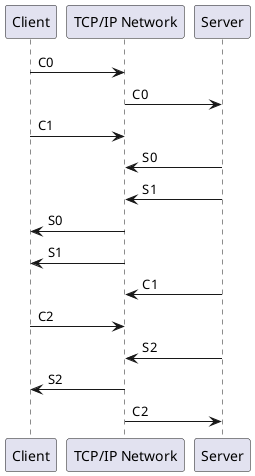

## 多媒体
color text image audio video
 
+----------------+-----------------------------------------------------------------+
|                |                                                                 |
|  data layer    |      Text         Image          Audio             Video        |
|                |                                                                 |
+----------------------------------------------------------------------------------+
|                |                                                                 |
| container layer|     TextView    ImageView                       SurfaceView     |
|                |                                                                 |
+----------------------------------------------------------------------------------+
|                |                                                                 |
|  driver layer  |                                                                 |
|                |                                                                 |
+----------------------------------------------------------------------------------+
|                |                                                                 |
| hardware layer |                                                                 |
+----------------+-----------------------------------------------------------------+

## 显卡
### freetyp2
### Agg
### skia

## 音视频
- audio

- video
  +----------------------------------------------------------------------------------------------------------+
  +----------------------------------------------------------------------------------------------------------+
     +-------+  +-------+  +-------+ +-------+  +-------+  +-------+  +-------+  +-------+  +-------+ +-------+ 
     |       |  |       |  |       | |       |  |       |  |       |  |       |  |       |  |       | |       | 
     |       |  |       |  |       | |       |  |       |  |       |  |       |  |       |  |       | |       | 
     |       |  |       |  |       | |       |  |       |  |       |  |       |  |       |  |       | |       | 
     |       |  |       |  |       | |       |  |       |  |       |  |       |  |       |  |       | |       | 
     |       |  |       |  |       | |       |  |       |  |       |  |       |  |       |  |       | |       | 
     +-------+  +-------+  +-------+ +-------+  +-------+  +-------+  +-------+  +-------+  +-------+ +-------+ 
  +----------------------------------------------------------------------------------------------------------+
  +----------------------------------------------------------------------------------------------------------+

### 多媒体应用
直播（腾讯云，SRS流媒体服务器）
短视频（）
网络视频（点播。SRS流媒体服务器）
音视频通话 （WebRTC 视频会议）
视频监控（）
人工智能


## 音视频概念
### 基础

#### 音频
[音频知识](https://blog.csdn.net/mandagod/article/details/77895472)

##### 声音三要素：音强，音调，音品
音频要素：bit(位宽)，采样率（每秒的采样 8000/44100）, channel(声道数)
Android 音频：位宽（sample format），采样率（bit rate），通道数（channels）
音频压缩 G.711 G.722 ...
1. 位深/位宽（很亮音高） 16bit
  声压 0.00002pa~0.63pa；声压和分贝换算公式：（。。。。）
      ```js
      模拟信号与音强
                              X           X                                  XX        XXX         XXX
                     XXX    XXXX         XXX                                XX XXX    XX XX       XXXXXX
         XX   XXXX  XXXXX  XXX X         XXX                               XX  XXX    X  XX       XX   X         XX
      X  XXXX   X  X  XX XX  X X X         X X                               XX   XX    X   X       XX   X      XXXXX
      X  XX X   X  X  XX X   X X X  XX    XX X                               X    XX   XX   X       XX    X     X XXX  X
      X  X  X   X  X  XX XX  XX  X  XX    XX X                               X    XXX  XX   X       XX    X     XX  X XXX
      X  XX X  XX  X  X  X   XX  X X XX   XX X XXXXXX                       XX    XXX  XX   X      XX     X     X   X X X
      X  XX X  X   X  X  XX  X   XXX XX   X  X XX  XXX              XXX     XX     XX  XX   X     X X     X     X   XXX X
      XXXX  X XX   XXXX  XX  XX      X   XX XX XX  X X            XXX X     XX     XX  XX   X     XXX     XX   XX   XXX  X
      XXX  XXXX   XXX   X X X       X   XX XX X    XXX         XXXX   XX   XX     XX  XX   X    X X      XX  XX     X
      X                             X   X  XX X    XXXX        XX      XX  XX     XX  XX   X    XXX      XXX XX
                                    X   X  XX X     XXXX      XXX       XXXX      XX XX    XX  X X       XXXXXX
                                    XX XX   XXX     XXXXXXXXXXXX         X         XXX      XXXXXX          X
                                    XXXXX            XXXXXXXXXX                    XXX       XX

      ```
2. 采样率（衡量音频）
人耳能听到的声波的频率范围通常? 20~20000Hz 为了保证声音不失真，奈奎斯特采样定理，采样频率应在40kHz以上。兼容电视采样44.1kHz（电视行*场*3）
常用的音频采样频率有：
      8,000 Hz - 电话所用采样率, 对于人的说话已经足够
      11,025 Hz - AM调幅广播所用采样率
      22,050 Hz和24,000 Hz - FM调频广播所用采样率
      32,000 Hz - miniDV 数码视频 camcorder、DAT (LP mode)所用采样率
      37,000 Hz -
      44,100 Hz - 音频 CD, 也常用于 MPEG-1 音频（VCD, SVCD, MP3）所用采样率
      47,250 Hz - 商用 PCM 录音机所用采样率
      48,000 Hz - miniDV、数字电视、DVD、DAT、电影和专业音频所用的数字声音所用采样率
      50,000 Hz - 商用数字录音机所用采样率
      96,000 或者 192,000 Hz - DVD-Audio、一些 LPCM DVD 音轨、BD-ROM（蓝光盘）音轨、和 HD-DVD （高清晰度 DVD）音轨所用所用采样率
      2.8224 MHz - Direct Stream Digital 的 1 位 sigma-delta modulation 过程所用采样率。

3. 通道 
      单声道(mono)
      双声道(stereo)
      2.1声道（增加低音声道）
      四声道立体声(quad)
      杜比声（5.1声道）
      7.1声道
##### 音频帧
      音频帧：音频在量化得到二进制的码字后，需要进行变换，而变换（MDCT）是以块为单位（block）进行的，一个块由多个（120或128）样本组成。而一帧内会包含一个或者多个块。帧的常见大小有960、1024、2048、4096等。一帧记录了一个声音单元
##### 比特率

#### 视频 
视频：分辨率（resolution），帧率（frame rate），比特率等编码参数
视频要素：宽，高,像素格式
- 分辨率
      Qcif（176×144）
      CIF（352×288）
      4CIF（704×576）
      HALF D1（704×288）
      D1（704×576）
[SIF、CIF、4CIF、D1](https://www.cnblogs.com/xkfz007/articles/2396343.html)

[视频开发基础知识](https://blog.csdn.net/yuqingzhude/article/details/78676906)
 
[标准视频测试序列地址](http://medialab.sjtu.edu.cn/resources/resources.html)
[标准视频测试序列地址](http://ultravideo.cs.tut.fi/#testsequences)
##### 图片压缩理论
      空间冗余
            人眼对灰度，蓝色和红色敏感（YBcRc），相差64度的灰度分辨不出。统一为一个颜色，方便行程编码
            只保存坐标，大小，方向 （运动矢量）
      时间冗余
            眼睛只能识别25张图片。相连没有变，0表示和前一个位置一直
```
压缩方法
有损                              无损
      变换编码                         Huffman编码
            离散余弦⭐                 行程编码
            离散小波                LZW编码
            离散傅里叶              算术编码
      混合编码
            JPEG
            MPEG
            H.264


```
##### [静态图像压缩技术： JPEG编码](https://www.youtube.com/watch?v=3U2xoiBrRi4)
对单个图片编码，只有帧内（Intraframe）压缩也称为空间压缩

mdct（改进余弦变换）                      -> 量化（不公平除法）                                         ->    霍夫曼编码  （DC系数，AC系数）
   低频到高频分布（可恢复，用矩阵倒置）  去掉干扰数据（创造更多0，方便压缩，不可恢复）                         每块DC系数作为预测，所有DC系数组合，差分脉冲编码
                                         第一位DC系数，其他AC系数                                               AC系数回顾行程编码（RLE）
                                                                                                                  最后用霍夫曼编码
[影像算法解析——JPEG 压缩算法 ](https://zhuanlan.zhihu.com/p/40356456)
##### 运动图像压缩 (What is MPEG Format)[https://www.youtube.com/watch?v=F0ZinF-gTrY]
增加帧间压缩(Interframe compression)也称为时间压缩(Temporal_compression)

      VCD                            DVD   DVB                        DVB+S2
      +                              +     +                          +
      |                              |     |                          |
      |                              |     |                          |
      v                              v     v                          |
                                     PS     TS                        |
                                     +     +                          |
                                     +---->-<-------------------------+
                                           v                          v
      MPEG-1                          MPEG-2                   MPEG-4 AVC

      VCD/MP3                      DVD（应用）
      CIF                           DI（空间分辨率）
      352x240                    720x480/1280x720
      30fps                        60fps（帧率）
      1.5Mbps                       15Mbps（码流）
      30                            40(压缩率)
      16x16（宏块）                  8x8（宏块）                 （基于内容宏块）
          
      （六层视频结构）          
      运动补偿序列（I/P/B帧）⭐     隔行扫描支持 ⭐              基于内容（分割算法）    
      GOP/Piture/Slide                                            （预测编码） 
      宏块（运动补偿基本单元）
      块（DCT操作的基本单元）  

注：I/P/B帧是1/25s内的图片序列

      I    B    B    P    B    B    P    B    B    P    B    B    I
                     +              +              +
GOP   +--------------+--------------+--------------+--------------+


```

1.Motion-compensated sequence
|<----------------------------------------    GOP(M,N)（ M:I帧数量，N: GOP长度） ------------------------------------>|
+----------------------------------+   +----------------------------------+   +----------------------------------+ +----------------------------------+
|                                  |   |                                  |   |                                  | |                                  |
|       XXXXXX                     |   |            XXXXXX                |   |                                  | |                                  |
|    XXXX    XXXX                  |   |         XXXX    XXXX             |   |                 XXXXXX           | |                                  |
|    XX         XX                 |   |         XX         XX            |   |              XXXX    XXXX        | |                      XXXXXX      |
|    X           X                 |   |         X           X            |   |              XX         XX       | |                   XXXX    XXXX   |
|    XX         XX                 |   |         XX         XX            |   |              X           X       | |                   XX         XX  |
|    XXXXXXXX XXX               X  X   |         XXXXXXXX XXX          X  X   |              XX         XX    X  X |                   X           X  X
|     XXXXXXXXX        XX      XXXXX   |          XXXXXXXXX   XX      XXXXX   |              XXXXXXXXXXXX    XXXXX |                   XX XX      XXXXX
|                    XX XX XXXX    |   |                    XX XX XXXX    |   |               XXXXXXXXXX XXXX    | |                   XXXXXXXXXXXX   |
|                XXXX    XX  X     |   |                XXXX    XX  X     |   |                XXXX    XX  X     | |                XXXXXXXXXXXXX     |
|          XXX XX  X               |   |          XXX XX  X               |   |          XXX XX  X               | |          XXX XX  X               |
+---------XX-XX--------------------+   +---------XX-XX--------------------+   +---------XX-XX--------------------+ +---------XX-XX--------------------+
    
 2.picture                              3.slice (一个或多个联系宏块组成)               4.macro block                        5.block
+----------------------------------+   +----------------------------------+              +----------------+         +-------------+
|                                  |   |                                  |          +-------------+      |         |             |
|       XXXXXX                     |   |       XXXXXX                     |      +----+-----+      |      |         |             |
|    XXXX    XXXX                  |   +-----XXXX----XXXX-----------------+      |    |     |      |      |         |   16x16     |
|    XX         XX                 |   |    XX         XX                 |      |    |     |      |      |         |   (MPEG-1)  |
|    X           X                 |   |    X           X                 |      |  Y1| Y2  | U    |  V   |         |             |
|    XX         XX                 |   |    XX         XX                 |      |    |     |      |      |         |             |
|    XXXXXXXX XXX               X  X   +----XXXXXXXX-XXX---------------X--X      +----+-----+      +------+         |             |
|     XXXXXXXXX        XX      XXXXX   |     XXXXXXXXX        XX      XXXXX      |    |     |      |                +-------------+
|                    XX XX XXXX    |   |                    XX XX XXXX    |      |  Y3| Y4  +------+   
|                XXXX    XX  X     |   +-------------XXXX----XX--X--------+      |    |     |
|          XXX XX  X               |   |          XXX XX  X               |      +----+-----+
+---------XX-XX--------------------+   +---------XX-XX--------------------+  

```


[计算残差图像](https://www.jianshu.com/p/ed12e8340f6b)
首先将两张图片转化为Mat对象，然后计算两个Mat 矩阵对象之间的绝对值差，这个要求两个矩阵的长和宽要一样，所以需要将两个Mat先用resize函数重新设置长和宽。
absdiff函数将两个矩阵的绝对值差计算结果存在Mat中。
[运动补偿矢量](https://www.cnblogs.com/AndyJee/p/3724917.html)
https://wenku.baidu.com/view/30de74c789eb172ded63b7f0.html4

### 硬件采集
#### 前端设备
ip camera 内置rtsp服务

gb28181服务，开源库 PJSIP，
#### 硬件
[音视频](https://www.ibm.com/developerworks/cn/linux/l-ossapi/)
[Open-Sound-System](https://github.com/Open-Sound-System/Open-Sound-System.git)
[alsa-oss](https://github.com/alsa-project/alsa-oss.git)

### 编码
封装（mux)：复用，按一定格式组织原始音视频流

解封装（Demux）：按照一定格式解析出原始音视频流

视频：（一堆图片，需要编码压缩）
   YUV420/422->H264
   rgb888->H264
   YUV420->H263
音频：
   PCM(原始)->AAC
   PCM(原始)->G726
   PCM(原始)->G711
ES流 PES流 TS流 rtsp流 rtmp流 hls流
流媒体：采用流式传输方式
   推模式
   拉模式
   实时流
#### 音频

Uncompressed            Compressed - Lossless     Compressed - Lossy
Audio CD                Apple Lossless Audio       Mp3
Audio DVD               TTA                        AAC
PCM WAV and AIFF        FLAC                       WMA
Vinyl Record            Monkey's Audio             Mini Disc 
Cassette                Shorten
DAT                     WavPack


##### 算法
音频算法处理（去噪、静音检测、回声消除、音效处理、功放/增强、混音/分离，等等）
##### PCM编码/G.722

##### Mp3(MPEG/1 Audio Player3)
始于1980年代中期(1987)，在德国Erlangen的Fraunhofer研究所开始的) 
[MPEG-1 Audio 编码器](https://blog.csdn.net/liushuang95/article/details/74129757)
##### AAC 
1997年，基于MPEG-2的音频编码技术。
2000年，MPEG-4标准出现后，加入了SBR技术和PS技术，MPEG-4 AAC
```
+--------------------+-------------------+-----------------+------------------+
|                    |                   |                 |                  |
|  ADTS_HEADER       |   AAC ES          |   ADTS_HEADER   |   AAC ES         |
|                    |                   |                 |                  |
+--------------------+-------------------+-----------------+-------------------

```
ADTS 头中有 采样率、声道数、帧长度

##### Opus
2012年7月2日，Opus被IETF批准用于标准化。
##### FLAC 
2001年6月FLAC发布了1.0版。
##### APE 
2011年4月16日发布，由软件Monkey's audio压制得到，开发者为Matthew T. Ashland，源代码开放
#### 视频
##### 播放时间
播放等待，pts,dts


##### 编码其他           
codecs
H.264(AVC) H.265(HEVC) VP9 AVI
MP3(MPEG-2),AAC,AC-3

formats
mp4(MP4 Container MPEG-4 part 14)
HLS
MPEG-DASh


container ,video codec ,Audio Codec ,Channels:             ,Sample Rate,  Aspect Ratio ,Frame Rate
mp4          H.264        AAC-LC     Stereo or Stero 5.1      96KHZ        16:9       60fps

video bitrates
resolution frame rate HDR
audio bitrate
Stereo 5.1 , stereo     ,Mono
512kbps     384 kbps    ,128kbps
##### H264/AVC 视频编码
MPEG-4针对Internet传送而设计，提供比MPEG-2更高的视频压缩效率，
视频会议希望有更进一步的压缩，才出现了H.264
+-------------------------------------------------------------------------------------+
|                                         h254         h265                           |
|                                         vp8          vp9                            |
|                                         h264         hevc                           |
+-------------------------------------------------------------------------------------+
[HEVC/H264编码格式]( https://caniuse.com/#feat=hevc)
[WEBM](http://caniuse.com/webm/embed/)
GOP 关键帧的周期
###### VP8
 WebP，是以 VP8编码为基础的图片文件格式，目的是取代现有的 JPEG
##### H265/HEVC 视频编码
帧扫描

###### VP9
 WebP，是以 VP8编码为基础的图片文件格式，目的是取代现有的 JPEG
###### AV1
AV1的目标是在VP9/HEVC上基础上提高约30%的编码效率。
AV1完全是对标H.265去的。H.265目前有比较高的专利门槛，和H.265有关的有4大专利池，HEVC Advance，MPEG LA，Velos Media和Technicolor。而AV1完全免费，不管你是用于商业用途还是非商业用途。


#### qsv硬编码

### 文件
#### FLV
2003年，Flash Player 7 开始支持FLV
2005年，Adobe 收购 Macromedia  
2006年，Google收购YouTube
2008年，FLV 已经非常普及
FLV文件=FLV头文件+ tag1+tag内容1 + tag2+tag内容2 + ...+... + tagN+tag内容N


### 网络协议
比特流协议：TagLengthValue

文件格式 flv,mp4 ,mpegts,avi
音视频格式 H264,H265,AAC,G711

Bitmap（png,jpeg,gif）
### 点播协议（延时可忍受）-基于文件分片
[RTMP 测试地址](https://www.cnblogs.com/juanxincai/p/12900303.html)
#### 长连接 Http1.1 传输 + flv文件
CCTV1高清：http://ivi.bupt.edu.cn/hls/cctv1hd.m3u8
CCTV3高清：http://ivi.bupt.edu.cn/hls/cctv3hd.m3u8
CCTV5高清：http://ivi.bupt.edu.cn/hls/cctv5hd.m3u8
CCTV5+高清：http://ivi.bupt.edu.cn/hls/cctv5phd.m3u8
CCTV6高清：http://ivi.bupt.edu.cn/hls/cctv6hd.m3u8
苹果提供的测试源（点播）：http://devimages.apple.com.edgekey.net/streaming/examples/bipbop_4x3/gear2/prog_index.m3u8

HTTP断点续传下载FLV到本地缓存
 （断点续传下载是否支持：头Range字段和Content-Range字段；服务器返回206）

#### 短连接 HTTP 传输 + HLS协议 + ts文件
2009年，QuickTime和iPhone3GS的一个标准
2017年8月，RFC 8216发布，描述了HLS协议第7版的定义
HTTP Live Streaming，是Apple的开放标准，基于HTTP流。

分割成磁盘ts文件，而不是像rtmp放在内存
ffmpeg -i D:\file\ffmpeg\big_buck_bunny.mp4 -vcodec copy -an -f hls D:\cache\video\test.m3u8


```js
http://ivi.bupt.edu.cn/hls/cctv1hd.m3u8
 wireshark捕获 M3U8 文本协议

#EXTM3U
#EXT-X-VERSION:3
#EXT-X-MEDIA-SEQUENCE:1332238
#EXT-X-TARGETDURATION:10
#EXTINF:10.000,
cctv1hd-1601050865000.ts
#EXTINF:10.000,
cctv1hd-1601050875000.ts
#EXTINF:10.000,
cctv1hd-1601050885000.ts
#EXTINF:10.000,
cctv1hd-1601050895000.ts
#EXTINF:10.000,
cctv1hd-1601050905000.ts
#EXTINF:10.000,
cctv1hd-1601050915000.ts
```
#### 连接TCP 传输 + RTMP 协议+ flv/f4v

Http方式是本地播放，而RTMP方式是服务器实时播放
任意选择视频播放点，并不象HTTP方式需要缓存完整个FLV文件到本地才可以任意选择播放点


[2012 年 12 月 21 日，Adobe 发布了协议版本 1.0 的规范](https://www.adobe.com/devnet/rtmp.html)
[中文文档](https://www.cnblogs.com/Kingfans/p/7083100.html)


[抓包](rtmp://live.hkstv.hk.lxdns.com/live/hks)



```js
握手成功后
客户端：
Real Time Messaging Protocol (AMF0 Command connect('webcast'))
    Response to this call in frame: 23
    RTMP Header
    RTMP Body
        String 'connect'
            AMF0 type: String (0x02)
            String length: 7
            String: connect
        Number 1
            AMF0 type: Number (0x00)
            Number: 1
        Object (8 items)
            AMF0 type: Object (0x03)
            Property 'app' String 'webcast'
            Property 'flashVer' String 'LNX 9,0,124,2'
            Property 'tcUrl' String 'rtmp://202.69.69.180:443/webcast'
            Property 'fpad' Boolean false
            Property 'capabilities' Number 15
            Property 'audioCodecs' Number 4071
            Property 'videoCodecs' Number 252
            Property 'videoFunction' Number 1
            End Of Object Marker 
服务端：
Real Time Messaging Protocol (Window Acknowledgement Size 2500000)
Real Time Messaging Protocol (Set Peer Bandwidth 2500000,Dynamic)
Real Time Messaging Protocol (User Control Message Stream Begin 0)
Real Time Messaging Protocol (Set Chunk Size 4096)
Real Time Messaging Protocol (AMF0 Command _result('NetConnection.Connect.Success'))
客户端
Real Time Messaging Protocol (Window Acknowledgement Size 2500000)
Real Time Messaging Protocol (AMF0 Command createStream())
服务端：
Real Time Messaging Protocol (AMF0 Command _result())
客户端：
Real Time Messaging Protocol (AMF0 Command getStreamLength())
Real Time Messaging Protocol (AMF0 Command play('bshdlive-pc'))
Real Time Messaging Protocol (User Control Message Set Buffer Length 1,3000ms)
服务端：
Real Time Messaging Protocol (AMF0 Command _result())
Real Time Messaging Protocol (User Control Message Stream Begin 1)
Real Time Messaging Protocol (AMF0 Command onStatus('NetStream.Play.Reset'))
Real Time Messaging Protocol (AMF0 Command onStatus('NetStream.Play.Start'))
Real Time Messaging Protocol (AMF0 Data |RtmpSampleAccess())
Real Time Messaging Protocol (AMF0 Data onStatus('NetStream.Data.Start'))

Real Time Messaging Protocol (AMF0 Data onMetaData())
Real Time Messaging Protocol (Video Data)
Real Time Messaging Protocol (Video Data)


```
##### AMF 二进制数据编码格式
### 流媒体协议（低延迟，监控/会议）
边缓冲边播放的媒体协议
####  MPEG-TS
1995年，MPEG-2第一部分
[mpeg2ts 分析](http://www.pjdaniel.org.uk/mpeg/)
TS流与PS流的区别在于TS流的包结构是固定长度的，而PS流的包结构是可变长度的。

```js
捕获的MEPG-TS
ISO/IEC 13818-1 PID=0xc8 CC=4
    Header: 0x4700c834
        0100 0111 .... .... .... .... .... .... = Sync Byte: Correct (0x47)
        .... .... 0... .... .... .... .... .... = Transport Error Indicator: 0
        .... .... .0.. .... .... .... .... .... = Payload Unit Start Indicator: 0
        .... .... ..0. .... .... .... .... .... = Transport Priority: 0
        .... .... ...0 0000 1100 1000 .... .... = PID: Unknown (0x00c8)
        .... .... .... .... .... .... 00.. .... = Transport Scrambling Control: Not scrambled (0x0)
        .... .... .... .... .... .... ..11 .... = Adaptation Field Control: Adaptation Field and Payload (0x3)
        .... .... .... .... .... .... .... 0100 = Continuity Counter: 4
    [MPEG2 PCR Analysis]
    Adaptation Field Length: 120
    Adaptation Field
        0... .... = Discontinuity Indicator: 0
        .0.. .... = Random Access Indicator: 0
        ..0. .... = Elementary Stream Priority Indicator: 0
        ...0 .... = PCR Flag: 0
        .... 0... = OPCR Flag: 0
        .... .0.. = Splicing Point Flag: 0
        .... ..0. = Transport Private Data Flag: 0
        .... ...0 = Adaptation Field Extension Flag: 0
        Stuffing: ffffffffffffffffffffffffffffffffffffffffffffffff…
```

[PSI](https://en.wikipedia.org/wiki/Program-specific_information)
 PSI 由四张表构成：PAT（PID=0），PMT（PID=22），CAT（PID=1）和NIT；
 TS的解码分两步进行，其一，是从PID为0 的TS包里，解析出PAT表，然后从PAT表里找到各个节目源的PID，一般此类节目源都由若干个ES流组成，并描述在PMT表里面，然后通过节目源的 PID，就可以在PMT表里检索到各个ES的PID。
##### PES
PES： 原始流 ES 创建 PES 数据包，然后将这些 PES 数据包封装在传输流 （TS） 数据包或程序流 （PS） 数据包中。
[](https://en.wikipedia.org/wiki/Packetized_elementary_stream)
```js
Packetized Elementary Stream
    prefix: 000001
    stream: audio-stream (0xc0)
PES extension
    length: 425
    1... .... must-be-one: True
    .0.. .... must-be-zero: False
    scrambling-control: not-scrambled (0)
    .... 0... priority: False
    .... .0.. data-alignment: False
    .... ..0. copyright: False
    .... ...0 original: False
    1... .... pts-flag: True
    .0.. .... dts-flag: False
    ..0. .... escr-flag: False
    ...0 .... es-rate-flag: False
    .... 0... dsm-trick-mode-flag: False
    .... .0.. additional-copy-info-flag: False
    .... ..0. crc-flag: False
    .... ...0 extension-flag: False
    header-data-length: 5
PES header data: 232499d419
    presentation time stamp (PTS): 13636.158711111 seconds
Moving Picture Experts Group Audio
    sync: ffe0 [bit length 11, 5 LSB pad bits, 1111 1111  111. .... decimal value 2047]
    version: mpeg-1 (3)
    layer: layer-2 (2)
    protection: none (1)
    bitrate: 8
    frequency: 0
    .... ..0. padding: False
    .... ...0 private: False
    channel-mode: stereo (0)
    mode-extension: 0
    .... 0... copyright: False
    .... .1.. original: True
    emphasis: none (0)
Data: 56443355443343232221110402400000000000000000abaa…

```
#### UDP传输+ RTP/RTCP + MPEG-TS

1996年，由IETF的多媒体传输工作小组在RFC 1889中公布的
[RTP在互联网上传递音频和视频的标准数据包格式。](https://tools.ietf.org/html/rfc3550)
RTCP的主要功能是为RTP所提供的服务质量（Quality of Service）提供反馈
[模拟 RTP](https://bogotobogo.com/VideoStreaming/VLC/How_to_Streaming_Live_Network_rtp.php)
[](https://wiki.wireshark.org/RTP)
[](https://wiki.wireshark.org/RTCP)
内存中进行，
以固定的数据率在网络上发送数据，客户端也是按照这种速度观看影视文件
```js
RTP Fixed Header Fields 
    0                   1                   2                   3
    0 1 2 3 4 5 6 7 8 9 0 1 2 3 4 5 6 7 8 9 0 1 2 3 4 5 6 7 8 9 0 1
   +-+-+-+-+-+-+-+-+-+-+-+-+-+-+-+-+-+-+-+-+-+-+-+-+-+-+-+-+-+-+-+-+
   |V=2|P|X|  CC   |M|     PT      |       sequence number         |
   +-+-+-+-+-+-+-+-+-+-+-+-+-+-+-+-+-+-+-+-+-+-+-+-+-+-+-+-+-+-+-+-+
   |                           timestamp                           |
   +-+-+-+-+-+-+-+-+-+-+-+-+-+-+-+-+-+-+-+-+-+-+-+-+-+-+-+-+-+-+-+-+
   |           synchronization source (SSRC) identifier            |
   +=+=+=+=+=+=+=+=+=+=+=+=+=+=+=+=+=+=+=+=+=+=+=+=+=+=+=+=+=+=+=+=+
   |            contributing source (CSRC) identifiers             |
   |                             ....                              |
   +-+-+-+-+-+-+-+-+-+-+-+-+-+-+-+-+-+-+-+-+-+-+-+-+-+-+-+-+-+-+-+-+

捕获的RTP包
Real-Time Transport Protocol
    [Stream setup by HEUR RTP (frame 1)]
    10.. .... = Version: RFC 1889 Version (2)
    ..0. .... = Padding: False
    ...0 .... = Extension: False
    .... 0000 = Contributing source identifiers count: 0
    0... .... = Marker: False
    Payload type: MPEG-II transport streams (33)
    Sequence number: 27534
    [Extended sequence number: 93070]
    Timestamp: 77046605
    Synchronization Source identifier: 0x2aa129a2 (715205026)
```
RTP   
      1. [RTP 负载类型的格式并决定将如何去由应用程序加以解译](https://en.wikipedia.org/wiki/RTP_payload_formats)
      2. sequence number增量为 1，实现流同步
      3. timestamp的增量是 = 采样次数 / 帧率，提供时间信息同步
      4. SSRC和RTCP结合起来用在不同RTP流的同步


##### RTCP
五种类型的RTCP数据包：接收者报告（200 RR），发送者报告（201 SR），源描述（202 SDES），离开申明（203 BYE）和特殊应用包（204 APP）
```c++
ffmpeg/avformat  rtp.h

enum RTCPType {
    RTCP_FIR    = 192,
    RTCP_NACK, // 193
    RTCP_SMPTETC,// 194
    RTCP_IJ,   // 195
    RTCP_SR     = 200,
    RTCP_RR,   // 201
    RTCP_SDES, // 202
    RTCP_BYE,  // 203
    RTCP_APP,  // 204
    RTCP_RTPFB,// 205
    RTCP_PSFB, // 206
    RTCP_XR,   // 207
    RTCP_AVB,  // 208
    RTCP_RSI,  // 209
    RTCP_TOKEN,// 210
};

```
```js
Real-time Transport Control Protocol (Sender Report)
    [Stream setup by H245 (frame 51)]
        [Setup frame: 51]
        [Setup Method: H245]
    10.. .... = Version: RFC 1889 Version (2)
    ..0. .... = Padding: False
    ...0 0001 = Reception report count: 1
    Packet type: Sender Report (200)
    Length: 12 (52 bytes)
    Sender SSRC: 0xbcdc0094 (3168534676)
    Timestamp, MSW: 11 (0x0000000b)
    Timestamp, LSW: 22544384 (0x01580000)
    [MSW and LSW as NTP timestamp: Feb  7, 2036 06:28:27,0052 UTC]
    RTP timestamp: 49823528
    Sender's packet count: 166
    Sender's octet count: 9960
    Source 1
        Identifier: 0xf5e33db0 (4125310384)
        SSRC contents
            Fraction lost: 0 / 256
            Cumulative number of packets lost: 0
        Extended highest sequence number received: 28620
            Sequence number cycles count: 0
            Highest sequence number received: 28620
        Interarrival jitter: 0
        Last SR timestamp: 0 (0x00000000)
        Delay since last SR timestamp: 0 (0 milliseconds)
```

RTCP SR报文同步参数：RTP timestamp， NTP timestamp, SSRC of sender
      1. NTP timestamp 标示该SR发送时的绝对时间，这个时间来自RTCP发送者的系统时钟
      2. NTP timestamp对应的RTP timestamp，也就是跟RTP建立一个映射关系
      3. SSRC发送者的id，也是跟某发送源建立一个映射关系

#### ~~RTSP~~ +ts/mp4
~~RTSP~~ 是一种双向实时数据传输协议，它允许客户端向服务器端发送请求，如回放、快进、倒退等操作。
#### SIP
1996年，SIP最初由马克·汉德利、海宁·舒尔茨林、伊芙·舒纳和乔纳森·罗森博格设计
1999年，标准化为RFC 2543

已被扩展为视频会议，流媒体分发，即时通讯，状态信息，文件传输，互联网传真和网络游戏。

#### DTLS传输+SRTP/SCTP (WebRTC) 
2011年6月1日开源， WebRTC 比 SIP ，包括由于建立此类连接所需的系统复杂性降低。
```js
协议栈
                           --------------------+------------+
                           |RTCPeerConnection  | DataChannel|
+-----+---------------+    +--------------------------------+
| XHR | SSE |WebSocket|    |  SRTP             |   SCTP     |
+-----+----------+    |    |    +--------------+------------+
|   HTTP/1.x 2.0 |    |    |    |             DTLS          |
+----------------+----+    +----+---------------------------+
|       TLS(optional) |    |     ICE,STUN,TURN              |
+--------------------------+--------------------------------+
|         TCP         |            UDP                      |
+---------------------+-------------------------------------+
|                      NetWork(IP)                          |
+-----------------------------------------------------------+

```
### 音频帧（frame） 
帧率（Frame rate）  采样率（Sample Rate） 码率（Bit Rate）：rate 都是以秒为单位，每秒有几帧，采样，bit。
取2.5ms~60ms为单位的数据量为一帧音频
```
+-------------------------------------------------------------------------------------------+
|AAC                                                                                        |
|      frame                   frame             frame             frame                    |
|     +------------------+  +-----------------+  +---------------+ +----------------+       |
|     |  1024 samples    |  |  1024 samples   |  |1024 samples   | |  1024 samples  |       |
|     +------------------+  +-----------------+  +---------------+ +----------------+       |
|                                                                                           |
|     <--------+  sample_rate   +----------------------------------------------->           |
|                 44100HZ(1s contain 4.41k samples)                                         |
+-------------------------------------------------------------------------------------------+

+-------------------------------------------------------------------------------------------+
|mp3                                                                                        |
|      frame                   frame             frame             frame                    |
|     +------------------+  +-----------------+  +---------------+ +----------------+       |
|     |  1152 samples    |  |  1152 samples   |  |1152 samples   | |  1152 samples  |       |
|     +------------------+  +-----------------+  +---------------+ +----------------+       |
|                                                                                           |
|     <--------+  sample_rate   +----------------------------------------------->           |
|                 44100HZ(1s contain 4.41k samples)                                         |
+-------------------------------------------------------------------------------------------+
+-------------------------------------------------------------------------------------------+
|ac3                                                                                        |
|      frame                   frame             frame             frame                    |
|     +--------------------+ +-----------------+ +---------------+ +----------------+       |
|     |6(block)*256 samples| |6*256  samples   | |6*256 samples  | |6*256  samples  |       |
|     +--------------------+ +-----------------+ +---------------+ +----------------+       |
|                                                                                           |
|     <--------+  sample_rate   +----------------------------------------------->           |
|                 44100HZ(1s contain 4.41k samples)                                         |
+-------------------------------------------------------------------------------------------+
+-------------------------------------------------------------------------------------------+
|H264                                                                                       |
|      frame                   frame                               frame                    |
|     +------------------+  +-----------------+                    +----------------+       |
|     |                  |  |                 |       ...          |                |       |
|     +------------------+  +-----------------+                    +----------------+       |
|                                                                                           |
|     <--------+  frame  rate   +----------------------------------------------->           |
|                 25HZ   (1s contain 25 frame )                                             |
+-------------------------------------------------------------------------------------------+


```


## FFMPEG 解封装与编解码
1. 解封装，分轨（音频 视频 字幕）
2. 编解码
3. 未压缩 YUV,PCM
### 架构
 
```
            （去掉头部，保留显示的数据）
+-----------+              +---------------+
|           |   Demuxer    |Encode         |
|Input FIle +------------> |data           |
|           |   (解封装)   |packets        |
+-----------+              +---------+-----+
                                     |
                                     |
                                     |Decoder
           +------------------+      |
           |                  | <----+
    +----+ | Decoded frames   |（显示在界面的bit流）
    |      +------------------+
    |
    v Encoder

+-----------+             +-----------------+
|Encoded    |   Muxer     |                 |
|data       +-----------> | Output File     |
|packet     |             |                 |
+-----------+             +-----------------+

```

```
                      
                    drawTxt           scale
                    filter            filter
+------+           +-------+         +-------+          +-------+
|      |     in    |       | out  in |       | out      |       |
|source| +----->   |       | +-----> |       | +----->  | Sink  |
+------+           +-------+         +-------+          +-------+


```
### so编译
硬件采集 libdevice
解封装 libformat
编解码 libcodec
工具类 libutil

视频处理 libswscale
音频处理 libswresample
后期处理 libfilter
#### 编译
./configure --prefix=host --enable-shared --disable-static --disable-doc --disable-everything

ldd ffmpeg //缺失的依赖

export LD_LIBRARY_PATH=/share/ffmpeg-4.2.3/host/lib //添加缺失依赖


1. docker 编译
编译时，ln不兼容window ntfs文件系统，需要将ffmpeg拷贝ffmpeg到虚拟机
cp -r /share/ffmpeg/ffmpeg-4.3.1 /home/ffmpeg

2. strip 和系统冲突
strip: Unable to recognise the format of the input file`/opt/ffmpeg-1.2-arm/lib/libavdevice.so.54.3.103'
```
 --strip="$TOOLCHAIN/arm-linux-androideabi/bin/strip"
```


### 命令
1. 基础命令：-formats -protocals -devices; 
         -demuxers -muxers;-decodecs -codecs; 
         -filters -bsfs 
         -pix_fmts -colors 
         -sample_fmts -layouts
2. 录制命令（使用git bash，支持中文）：
          ffmpeg -devices//查看设备
```

```
          ffmpeg  -list_devices true -f dshow -i "" //查看所支持的硬件
```
[dshow @ 00000000025eb4e0] DirectShow video devices (some may be both video and audio devices)
[dshow @ 00000000025eb4e0]  "USB2.0 HD UVC WebCam"
[dshow @ 00000000025eb4e0]     Alternative name "@device_pnp_\\?\usb#vid_13d3&pid_56a2&mi_00#6&c91c3a9&0&0000#{65e8773d-8f56-11d0-a3b9-00a0c9223196}\global"
[dshow @ 00000000025eb4e0] DirectShow audio devices
[dshow @ 00000000025eb4e0]  "麦克风 (Realtek High Definition Audio)"
[dshow @ 00000000025eb4e0]     Alternative name "@device_cm_{33D9A762-90C8-11D0-BD43-00A0C911CE86}\wave_{06D41B18-A382-4D0E-8397-E62CACB5D2EB}"
[dshow @ 00000000025eb4e0]  "耳机 (MINISO-K66 Hands-Free AG Audio)"
[dshow @ 00000000025eb4e0]     Alternative name "@device_cm_{33D9A762-90C8-11D0-BD43-00A0C911CE86}\wave_{C8991957-01BD-4D88-A311-E3142F18507E}"

```
         ffmpeg -f dshow -i video="screen-capture-recorder" -pix_fmt yuv420p out.mp4 //ffmpeg 不支持录屏，需要开源软件Screen Capturer Recorder
         ffmpeg -f dshow -i audio="virtual-audio-capturer" out.mp3//录制音频
      //录制屏幕，声音，麦克风
      ffmpeg -f dshow -i audio="麦克风 (Realtek High Definition Audio)"
      -f dshow -i audio="virtual-audio-capturer"
      -filter_complex amix=inputs=2:duration=first:dropout_transition=0
      -f dshow -i video="screen-capture-recorder" -pix_fmt yuv420p
      out.mp4
3. 分解与复用
4. 处理原始数据
   pcm,yuv
5. 裁剪与合并
6. 图片/视频互换
7. 直播相关命令
8. 滤镜命令
### 日志系统，文件，目录
av_log,
文件：
avpriv_io_delete() 文件删除,avpriv_io_move() 重命名
目录
avio_open_dir(),avio_read_dir(),avio_close_dir()

### format,codec
抽取音视频，录屏截图，录音
### 重要**数据**结构
AVFormatContext
AVFrame
AVPacket
AVStream
AVCodecContext
 

#### 点播模型

select io模型
epool 模型


### 滤镜
VirtualDub滤镜

### FFmpeg Android 硬解码支持
[FFmpeg硬解码](https://blog.csdn.net/Tosonw/article/details/90178195)
### 源码

[视频书籍](http://yunxin.163.com/blog/zhuan-im3-6/)

```java
[](https://www.analog.com/en/design-center/landing-pages/001/beginners-guide-to-dsp.html)

yuv422  2行x4列
        yuyvyuyv
        yuyvyuyv
  001_initial      9aeeeb63f7e1ab7b0b7bb839a5f258667a2d2d78 Initial revision
                doc/ffmpeg.txt and doc/ffserver.txt
                +-------------------------------------------------------------------------------------------------------------+
                | [getopt.h]                                                                                                  |
                |     getopt_long_only():int //"s:f:r:b:t:hd:g:ic:L"                                                          |
                |     optarg:char*           //OPT_AR OPT_AB  OPT_AN  OPT_VN  OPT_AC                                          |
                |     optind, opterr, optopt:int                                                                              |
                +-------------------------------------------------------------------------------------------------------------+
                |   ffmpeg.c                                                                                                  |
                |     sizes:SizeEntry []  //+s             audio_freq:int     //OPT_AR      nb_frames:int          av_encode()|
                |     frame_rate:int      //+r             audio_bit_rate:int //OPT_AB      recording_time:float              |
                |     bit_rate:int        // +b  kbit/s    audio_disable:int // OPT_AN                                        |
                |     recording_time:float //+t            video_disable:int // OPT_VN                                        |
                |     v4l_device:char*    //+d             audio_channels:int //OPT_AC                                        |
                |     gop_size:int        //+g                                                                                |
                |     intra_only:int       //+i                                                                               |
                |     comment_string:char* //+c                                                                               |
                |                                                                                                             |
                +-------------------------------------------------------------------------------------------------------------+
                |   format.c                                       mpegmux.c                     ac3enc.c                     |
                |      first_format:AVFormat*  //linklist  +f        mpeg_mux_format:AVFormat       ac3_encoder:AVEncoder     |
                |      first_encoder:AVEncoder* //linklist                                                                    |
                |      guess_format():AVFormat*                    rmenc.c                                                    |
                |                                                     ra_format:AVFormat*        mpegaudio.c                  |
                |      mp2_format:AVFormat                            rm_format:AVFormat*            mp2_encoder:AVEncoder    |
                |      ac3_format:AVFormat                                                                                    |
                |      h263_format:AVFormat                        asfenc.c                     mpegvideo.c                   |
                |      mpeg1video_format:AVFormat                     asf_format:AVFormat*           mpeg1video_encoder       |
                |                                                                                    h263_encoder:AVEncoder   |
                |      init_put_byte(s:PutByteContext * )          jpegenc.c                         rv10_encoder:AVEncoder   |
                |      avencoder_find()                               jpeg_format:AVFormat           mjpeg_encoder:AVEncoder  |
                |      avencoder_open()                                                                                       |
                |                                                                                                             |
                +-------------------------------------------------------------------------------------------------------------+
                |   mpegenc.h                                          avcodec.h                                              |
                |     AVFormatContext:struct{                                                                                 |
                |         pb:PutByteContext                              AVEncodeContext:struct{     CodecID:enum{            |
                |         video_enc:AVEncodeContext *                        codec:AVEncoder *           CODEC_ID_NONE,       |
                |         audio_enc:AVEncodeContext *                        priv_data:void *            CODEC_ID_MPEG1VIDEO, |
                |         format:AVFormat *                              }                               CODEC_ID_H263,       |
                |         priv_data:void *//MpegMuxContext                                               CODEC_ID_RV10,       |
                |     }                                                                                  CODEC_ID_MP2,        |
                |                                                                                        CODEC_ID_AC3,        |
                |     AVFormat:struct{                                                                   CODEC_ID_MJPEG,      |
                |       audio_codec:CodecID                                                          }                        |
                |       video_codec:CodecID                                                                                   |
                |       write_header()//init priv_data                  AVEncoder:struct  {                                   |
                |                                                         encode()//init avencodecontext priv                 |
                |     }                                                                                                       |
                |                                                                                                             |
                |     PutByteContext:struct{                            }                                                     |
                |        buffer:uchar*                                                                                        |
                |                                                                                                             |
                |     }                                                                                                       |
                +-------------------------------------------------------------------------------------------------------------+
                |  grab.c                                                                                                     |
                |      audio_open():int// audio device   v4l_init()                                                           |
                |                                                                                                             |
                +-------------------------------------------------------------------------------------------------------------+
                |["/dev/dsp"]                           ["/dev/video"]                                                        |
                |     SNDCTL_DSP_SETFMT                     VIDIOCGCAP                                                        |
                |     SNDCTL_DSP_STEREO                     VIDIOCGAUDIO                                                      |
                |     SNDCTL_DSP_SPEED                      VIDIOCSAUDIO                                                      |
                |                                           VIDIOCSWIN                                                        |
                |     F_SETFL                               VIDIOCCAPTURE                                                     |
                |                                           VIDIOCGMBUF                                                       |
                |                                           VIDIOCMCAPTURE                                                    |
                +-------------------------------------------------------------------------------------------------------------+
                |  unistd.h                                                                                                   |
                |     read(int fd, void * buf, size_t count):ssize_t                                                          |
                |                                                                                                             |
                +-------------------------------------------------------------------------------------------------------------+
* 002_ffserver.txt de6d9b6404bfd1c589799142da5a95428f146edd Initial revision

                +-------------------------------------------------------------------------------------------+
                |                                     apiexample.c                                          |
                |                                         main()                                            |
                |                                                                                           |
                +-------------------------------------------------------------------------------------------+
  003_merge        85f07f223de9fbeb2b9d66db11f89091ac717926 merge
                +-------------------------------------------------------------------------------------------------------------+
                |[makefile]                                                                                                   |
                |         lib:                         PROG:                                                                  |
                |           libavcodec libav               ffmpeg ffserver                                                    |
                +-------------------------------------------------------------------------------------------------------------+
                |   ffmpeg.c                                                                                                  |
                |     opt_format()         //-f          opt_video_bitrate() //-b          opt_audio_bitrate() //-ab          |
                |                                        opt_frame_rate()   //- r  hz      opt_audio_rate()   //- ar          |
                |     opt_input_file()     //-i          opt_frame_size()    //-s  WxH     opt_audio_channels()//-ac channel  |
                |                                        opt_gop_size()     //-g           audio_disable:int    //-an         |
                |     opt_recording_time() //-t          intra_only:int    //- intra       opt_audio_device()  //- ad         |
                |     ...                                video_disable:int  //- vn         opt_audio_codec()    //-acodec     |
                |                                          ...                                                                |
                +-------------------------------------------------------------------------------------------------------------+
                |  libav/avio.c                      libav/utils.c                    libavcodec/utils.c                      |
                |      first_protocol:URLProtocol*     first_format:AVFormat*            first_avcodec:AVCodec *              |
                |     url_open()                       guess_format()                                                         |
                +-------------------------------------------------------------------------------------------------------------+
                |                                      mp2_format                     [libavcodec]                            |
                |  file.c                              ac3_format                         ac3_encoder         h263_decoder    |
                |     file_protocol                    mpeg_mux_format                    mp2_encoder         opendivx_decoder|
                |     pipe_protocol                    mpeg1video_format                  mpeg1video_encoder  msmpeg4_decoder |
                |                                      h263_format                        h263_encoder        mpeg_decoder    |
                |  audio.c                             rm_format                          h263p_encoder       h263i_decoder   |
                |     audio_protocol                   asf_format                         rv10_encoder        rv10_decoder    |
                |                                      avi_format                         mjpeg_encoder                       |
                |  grab.c                              mpjpeg_format                      opendivx_encoder                    |
                |     video_protocol                   jpeg_format                        msmpeg4_encoder                     |
                |                                      swf_format                         pcm_codec                           |
                |  udp.c                               wav_format                         rawvideo_codec                      |
                |    udp_protocol                      pcm_format                                                             |
                |                                      rawvideo_format                    mp3_decoder                         |
                |  http.c                              ffm_format                         ac3_decoder                         |
                |    http_protocol                     pgm_format                                                             |
                |                                      pgmyu^_format                                                          |
                |                                      imgyuv_format                                                          |
                |                                      pgmpipe_format                                                         |
                +-------------------------------------------------------------------------------------------------------------+

* 050_v0.5         f8429ed58cefea1669bc127cf2b1905b4893e3f2 Peg libswscale to the revision corresponding to the moment the branch was cut.
                +-------------------------------------------------------------------------------------------------------------+
                |   [makefile]                                                                               [doc]            |
                |                                                                                             ffmpeg-doc.texi |
                |       PROGS-yes:                     FFLIBS:                                  BASEHOOKS:                    |
                |         ffmpeg ffplay ffserver         avdevice avformat avcodec avutil          fish null watermark        |
                |                                                                                                             |
                |                                      FFLIBS-yes:                              HOOKS-yes:                    |
                |                                         a^filter  postproc  swscale              ppm  imlib2  drawtext      |
                +-------------------------------------------------------------------------------------------------------------+
                |                             ffmpeg.c                                                                        |
                |                                                                                                             |
                |                                            //subtitle                    //grab                      //muxer|
                |              add_frame_hooker()//- vhook   opt_subtitle_codec()//-scodec  opt_video_channel()//- vc         |
                |                                                                                                             |
                +-------------------------------------------------------------------------------------------------------------+
                |              framehook.c                                                                                    |
                |                  frame_hook_add()                                                                           |
                +-------------------------------------------------------------------------------------------------------------+
                |              allcodecs.c          alldevices.c     allformats.c                                             |
                |                                                                                                             |
                +-------------------------------------------------------------------------------------------------------------+
  100_n1.0         a74f292d4ab3e800853c3ab7536418e6eb584b27 tests/Makefile: fix ffprobe test dependancy
                +-------------------------------------------------------------------------------------------------------------+
                |   [makefile]                   [doc]                      [doc/examples]                                    |
                |                                    *.texi                       *.c                                         |
                +-------------------------------------------------------------------------------------------------------------+

  400_n4.0         ace829cb45cff530b8a0aed6adf18f329d7a98f6 Changelog: replace <next> by 4.0
                +-------------------------------------------------------------------------------------------------------------+
                |      [examples]            [ffbuild]           [doc]                                                        |
                |              *.c                                    indevs.texi                                             |
                |                                                                                                             |
                +-------------------------------------------------------------------------------------------------------------+
                |   [fftools]                                                                                                 |
                |              ffmpeg.c                                                                                       |
                |                                                                                                             |
                +-------------------------------------------------------------------------------------------------------------+


```
## SDL 渲染
configure --prefix=/share
sudo make -j 8 &&make install
### 渲染原理
SDL
内存图像 ->（渲染器） -> 纹理 ->（交换到显卡）->窗口
1
https://www.youtube.com/watch?v=gfowf3VKc68&list=PLfFz9jdZIa8d_KRUGnvKveKaL4UEZSY8H&index=86


 
### android 集成
1. 创建sdl文件夹，加入源码包以下文件
/src , /include , /cmake , CMakeLists.txt , SDL2Xxx.xx
2. Android项目下修改 CMakeLists.txt
add_subdirectory(sdl)
target_link_libraries( # Specifies the target library.
        ## sdl
        SDL2
}
需要c+11和cpufeature支持
21. 方法一，不行
include(AndroidNdkModules)
android_ndk_import_module_cpufeatures()
22. 直接將 **${ANDROID_NDK}/sources/android/cpufeatures**的 h,c文件加入到sdl下 

23. SDL窗口初始化源码
   surfaceView的SurfaceHolder 获取Surface，jni调用ANativeWindow_fromSurface 得到 ANativeWindow，对窗口进行绘制
   
24. 需要c层定义SDL_main方法，sdl初始化好，调用用户定义的方法。修改 org.libsdl.app.SDLActivity#getLibraries引用的libmain为前工程
   int SDL_main(int argc, char *argv[])
### 窗口，渲染，事件
## 流媒体服务器
[Red5 是一个采用 Java 开发的开源免费 Flash 流媒体服务器]()
```
Streaming Video (FLV, F4V, MP4, 3GP)
Streaming Audio (MP3, F4A, M4A, AAC)
Recording Client Streams (FLV and AVC+AAC in FLV container)
Shared Objects
Live Stream Publishing
Remoting
Protocols: RTMP, RTMPT, RTMPS, and RTMPE
```
## WebRtc
[5G WebRtc 架构](https://user-gold-cdn.xitu.io/2020/6/26/172eeb3308adeb5a?imageView2/0/w/1280/h/960/format/webp/ignore-error/1)
[RTSP以客户端方式工作，对流媒体提供播放、暂停、后退、前进等操作。](https://tools.ietf.org/html/rfc2326)
[RTP for H.264 Video](https://tools.ietf.org/html/rfc6184#section-5.1)
[WebRtc 基于 SRTP 和 UDP](https://tools.ietf.org/html/rfc7742)


[ProjectRTC](https://github.com/pchab/ProjectRTC)
[~~libjingle-android~~](https://github.com/dmonakhov/libjingle-android)
[webrtc-jingle-client](https://github.com/lukeweber/webrtc-jingle-client)

[](https://github.com/Red5/red5-server)
## Android
[](https://www.cnblogs.com/renhui/p/7452572.html)
数据源：文件，网络协议，硬件设备

### 多媒体控件
图表：走势图，圆盘刻度
多媒体：颜色，文本，图片，音视频；
View 白板：
            绘制 颜色，点，线，弧，圆，路径，文本，位图；
            saveLayer 创建新的画纸，savetocount时，绘制到画板
     画笔：
         1. 
            setARGB，Shader着色器（位图，渐变，。。。），setShadowLayer阴影，，颜色过滤器
            setBlendMode 颜色混合模式（CLEAR，SRC，DST，SRC_OVER，DST_OVER，SRC_IN，DST_IN，SRC_OUT，DST_OUT，SRC_ATOP，。。）
            setColorFilter 颜色过滤（LightingColorFilter、PorterDuffColorFilter ， ColorMatrixColorFilter）
            setMaskFilter（BlurMaskFilter模糊，EmbossMaskFilter浮雕）遮罩
            setShader（BitmapShader，LinearGradient，RadialGradient，SweepGradient，ComposeShader）着色器
            setDither 颜色抗抖动/渐变防止出现层次线条
            setShadowLayer（）/clearShadowLayer 阴影

         2. 
            setStyle（FILL，STROKE，FILL_AND_STROKE）填充样式
            setAntiAlias 弧形抗锯齿，
            setStrokeCap（BUTT，ROUND，SQUARE）线条端样式；
            setStrokeJoin（MITER尖角，ROUND，BEVEL）线条端连接；
            setStrokeWidth 线条宽度
            setPathEffect（CornerPathEffect，DiscretePathEffect，DashPathEffect，PathDashPathEffect，ComposePathEffect，SumPathEffect）路径特效，
         3. 文本大小，缩放，倾斜度，对齐字体，
            setStrikeThruText删除线，下划线，setFakeBoldText粗体，
            文本测量，文本截断，
         4. 
            setFilterBitmap 图片滤波/图片放大防止马赛克
            setXfermode （）图形混合模式/绘制重叠 DST（已经绘制），SRC（后绘制）； 16种
TextView,ImageView
SurfaceView,GlSurfaceView,TextureView,SurfaceTexture,VideoView

View 观察者模式onDraw 
     模板方法（drawBackground，onDraw，dispatchDraw，onDrawForeground，drawDefaultFocusHighlight）
     canvas#store备忘录，
TextView 桥接文本绘制 Layout(StaticLayout 构造器,DynamicLayout构造器,BoringLayout 简单工厂) 
         策略 BoringLayout (mHintLayout 单行纯文字文本)  
              Staticlayout (多行复杂文本）
              DynamicLayout (Spannable 多行可编辑复杂文本）
ImageView 
      桥接Drawable ImageView#mDrawable
      状态 Drawable#draw() 子类实现不同的策略
            ColorDrawable绘制 Canvas#drawRect
            BitmapDrawble绘制 canvas.drawBitmap和BitmapShader，setColorFilter
            ShapeDrawble 绘制 Shape，状态 PathShape，RectShape（ArcShape，OvalShape，RoundRectShape）
            StateListDrawable 

#### Bitmap
#### OpenGl
[教程](https://juejin.im/post/6844903877272158215)
[](https://learnopengl.com/Getting-started/Hello-Triangle)
1. 着色器
2. 向量与矩阵
3. 纹理
4. 顶点/片元着色器
5. 渲染图片
6. GLKit
7. 颜色，纹理，纹理与颜色
8. 分屏滤镜
### 分离合成轨道

MediaExtractor的作用是把音频和视频的数据进行分离。
MediaMuxer的作用是生成音频或视频文件；还可以把音频与视频混合成一个音视频文件。

### 音视频采集/播放（声卡 AudioRecord，摄像头 Camera，音视频MediaRecorder）
AudioRecord   采集/播放未压缩的PCM流
              frameworks\base\core\jni\android_media_AudioRecord.cpp
AudioTrack    只能播放已经解码的PCM流，提供了非常强大的控制能力，支持低延迟播放，适合流媒体和VoIP语音电话等场景。

Camera API 采集视频数据并保存到文件，分别使用 SurfaceView、TextureView 来预览 Camera 数据，取到 NV21 的数据回调

MediaRecorder 采集为压缩的音视频格式
SoundPool 则适合播放比较短的音频片段，比如游戏声音、按键声、铃声片段等等，它可以同时播放多个音频; 
MediaPlayer 结合Service，适合在后台长时间播放本地音乐文件或者在线的流式资源; 


android 设备信息
``` c
    // micdev input params
    44100,                      // mic_sample_rate
    1,                          // mic_channel_num

    // camdev input params
    (char*)"/dev/video0",       // cam_dev_name_0
    0,                          // cam_sub_src_0
    1920,                       // cam_frame_width_0
    1080,                       // cam_frame_height_0
    25,                         // cam_frame_rate_0

    // camdev input params
    (char*)"/dev/video2",       // cam_dev_name_1
    0,                          // cam_sub_src_1
    640,                        // cam_frame_width_1
    480,                        // cam_frame_height_1
    25,                         // cam_frame_rate_1

```

AudioRecord
构建器 AudioRecord.Builder
 

### MediaCodec/Lame（Android 硬编码）

