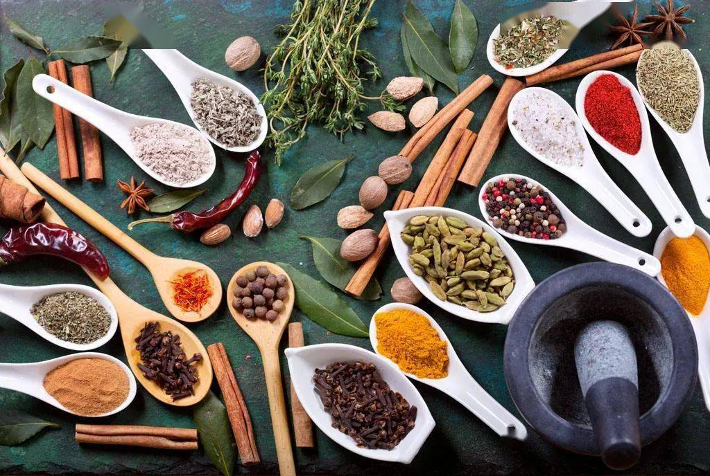
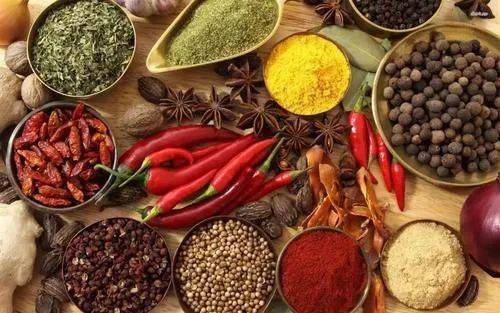
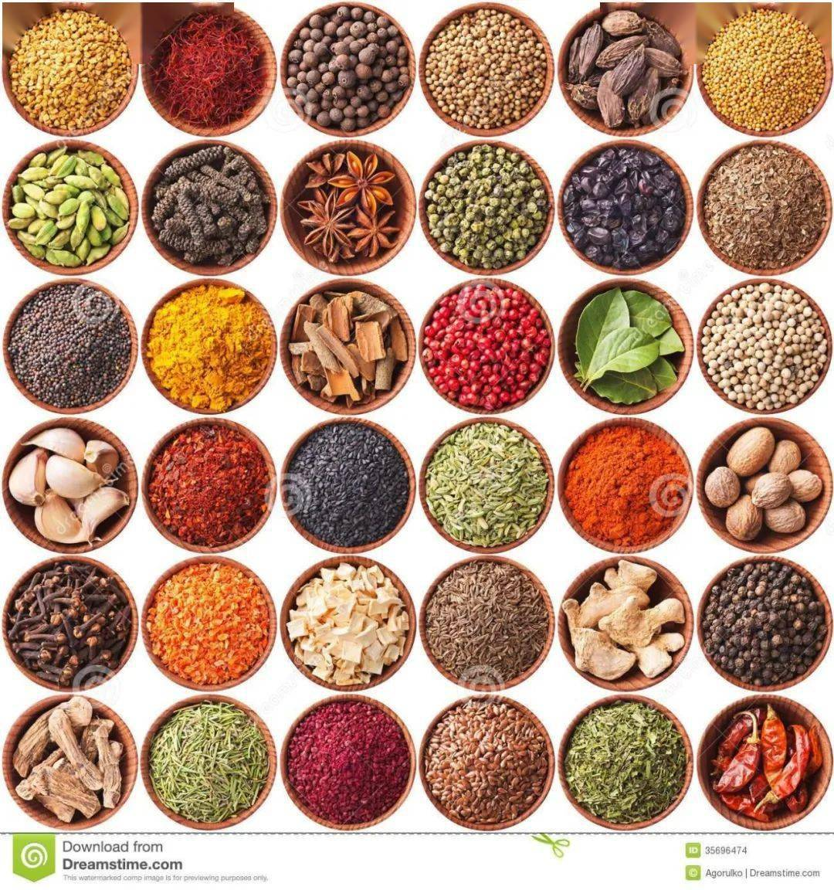

## 总结
六艺 礼（法律道德）、乐（llms ,吉他）、射（格斗）、御（C1驾照）、书（楷书）、数（数学）

## 香料

### 香水
12世纪，阿拉伯人发明了大规模的植物蒸馏法。阿拉伯人发现将香精以酒精溶解，便可缓缓释放出香味。提取玫瑰油和玫瑰水

花露水其主要成分為：橙花油，玫瑰香葉油，檸檬油，安息香酸，香檸檬油，酒精。
花露水與香水的主要區別是：花露水香精用量少，在5％(含5％)以下，酒精用量多，但濃度低，且要加入少量桂皮油、藿香油等原料；香水香精用量大，在5％以上，酒精用量少，但濃度高。
### 檀香木
驱瘟辟疫，去邪、防虫、防蛀等，还可以安抚神经，提神静心。檀香提神，沉香安神。
檀香属于半寄生性树种，在种植檀香的同时，要种植中期和终生伴生寄主树种，最好选择粗生、生长发达、适应性强、根系浅、萌芽力强、具根瘤菌的树种作为寄主。灌木类的寄主可选择飞机草、山毛豆等;乔木类寄主主要有南洋楹、木麻黄、儿茶、相思等植株高大、长势快的树木，一般在18个月后插种为宜。
### 沉香（树脂）

沉香木其实是橄榄科、樟树科、瑞香枓、大戟科的四种特定科属的植物树汁的异化物，要其产生结香的效果
分类惠安沉、星洲沉、奇楠沉，越南的奇楠沉为最上等沉香

檀香木主要包括白檀香和黄檀香两种，白檀香表面呈黄白色或淡黄色；黄檀香表面呈淡棕色。
檀香紫檀主要分为金星紫檀、牛毛紫檀、鸡血紫檀、花梨紫檀等品种

### 琥珀（树脂）
汉朝时期，琥珀就从哀牢国流入到中原。不透明的琥珀，传统上习惯称之为 “密蜡”。

成分主要含树脂、挥发油．尚含琥珀氧松香酸（Succoxyabietic acid）、琥珀松香酸（Succinoabietinolic acid）、琥珀银松酸（Succinosilvic acid）、琥珀脂醇（Succinoresinol）、琥珀松香醇（Succinoabietol）、琥珀酸（Succinic acid）等。
分布波罗的海沿岸国家（如俄罗斯、波兰），缅甸，多米尼加共和国、中国、墨西哥

## 皮料/皮革
经脱毛和鞣制等物理、化学加工所得到的已经变性不易腐烂的动物皮

## 绳
