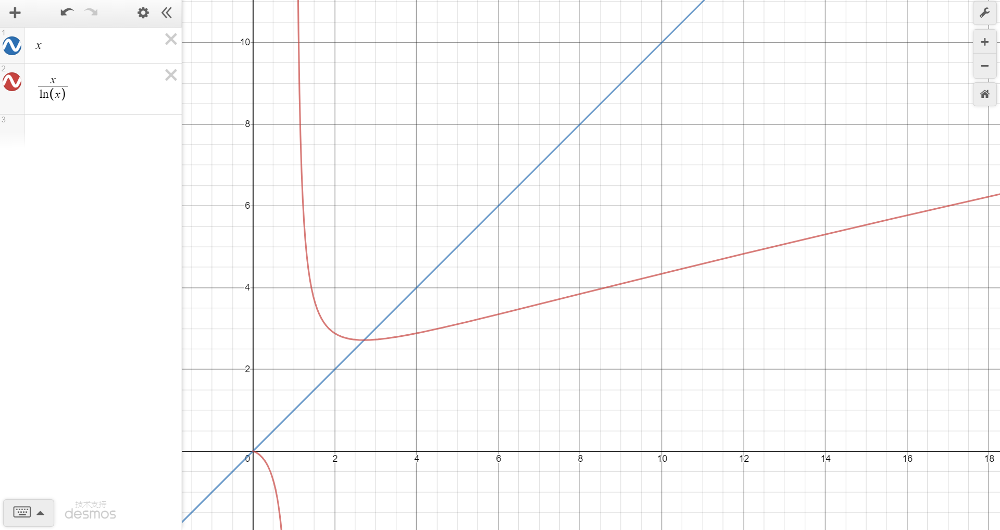

# 知识体系-数学
```
+-------------------------------------------------------------------------+
|        《 统 计 学 习 理 论 的 本 质 》                                   |
+-------------------------------------------------------------------------+
|        《 高 数 》                                                       |
|        《 微 积 分 》                                                    |
+-------------------------------------------------------------------------+
|        《 几 何 》                                                       |
+-------------------------------------------------------------------------+
|        《 数 论 》                                                       |
|        《 组 合 数 学 》 / 《 离 散 数 学 》      《 图 论 》              |
|        《 线 性 代 数 》   《 线 性 代 数 应 该 这 样 学 》                |
+-------------------------------------------------------------------------+
|        《 数 系 ——从 自 然 数 到 复 数 》                                 |
+-------------------------------------------------------------------------+
|        《 数 学 原 理 》                                                 |
|        《 集 合 论 》    《 数 理 逻 辑 》                                |
+-------------------------------------------------------------------------+


```
[图灵数学](http://alumni.newsmth.net/bbstcon.php?board=DataScience&gid=14207)
[数学书](https://www.cnblogs.com/xitingxie/p/5684254.html)

[公式生成](https://www.desmos.com/calculator?lang=zh-CN)
《数学之旅附：数学历史长廊》
[The Map of Mathematics](./res/The%20Map%20of%20Mathematics.jpg)
[mathematics_trench_chinese](./res/mathematics_trench_chinese.jpg)
## 绘图
https://webdemo.myscript.com/views/math/index.html#
manim
## 集合（基础）
集合的三要素. 分别有确定性、互异性、无序性。
## 数集
自然数 N，整数Z（包括负数），有理数Q（整数的“比率”/ratio，包括小数），实数R（定义为与数轴上点相对应的数。包括无理数,也称为无限不循环小数）,复数C（包括虚数I）


常数 ：
普朗克常数 h
普朗克长度 1.6x10 -35
引力常量G
光速 c
静电力常数k 真空介电常数ε0
阿伏伽德罗常数NA
气体普适常数R
玻尔兹曼常量k（kB）
三个宇宙速度
元电荷e 法拉第常数F
史瓦西半径

### 七大实数理论互推
确界存在定理、单调有界定理、有限覆盖定理、聚点定理、致密性定理、闭区间套定理和柯西收敛准则
### 无理数常量
无理数：
    非完全平方数的平方根、π和e（其中后两者均为超越数）黄金比例φ
√2 1.4142 勾股定理
φ 黄金比例是一个定义为 (√5-1)/2的无理数，约为0.618
π 圆周率：3.141592654
e 数学常数，是自然对数函数的底数。


㏒₂ ㏑ lg  
虚数单位 √(-1)
### 数列
定义：以正整数集（或它的有限子集）为定义域的函数，是一列有序的数。

著名的数列有斐波那契数列，三角函数，卡特兰数，杨辉三角等。

### 大数操作
只要你的计算机的内存足够大，可以有无限位的。

常见构造大数方法：指数，阶乘，高德纳箭头，葛立恒数和Tree(3)
3^3=3

- BigInteger、BigDecimal
[-2^(2147483647*32-1) ，2^(2147483647*32-1)-1]

## 群论 （结构）
群是数论的基石
### 概念
**循环群**是指能由单个元素所生成的群。
**整数模 n 乘法群**在同余理论中，模 n 的互质同余类组成一个乘法群 
### 定理
卡迈克尔函数

### 阿贝尔群

## 数论（结构）
《初等数论》
《数论导引》
[函数图](https://www.geogebra.org/3d)
https://c3d.libretexts.org/CalcPlot3D/index.html
### 概念
**欧拉函数φ(n)**：对正整数n，欧拉函数 ⊙ (n)是小于或等于n的正整数中与n互质的数的数目。
**数论倒数/模逆元**：一整数a对同余n之模逆元是指满足以下公式的整数 b
    ab≡1 (mod n)

质数

数论就是一门研究整数性质的学科。质数、和数、约数、倍数
研究方法来说，可以分成初等数论、解析数论、代数数论和几何数论四个部分
费尔马大定理、孪生素数问题、歌德巴赫猜想、圆内整点问题、完全数问题
### 定理
数论四大定理：
    [威尔逊定理](由于阶乘是呈爆炸增长的，其结论对于实际操作意义不大)：
        p可整除(p-1)!+1是p为质数的充要条件
        (p-1)!≡-1 (mod p)
    [欧拉定理]()：
        若n,a为正整数，且n,a互素，即gcd(a,n) = 1 则 
        a^φ(n) ≡ 1 (mod n)
    [费马小定理](欧拉定理的一个特殊情况)
        1. 定义：假如a是一个整数，p是一个质数，那么a^{p}-a是p的倍数
        2. 结论：a^{p}≡a (mod p)    
    [孙子定理（中国余数定理）](https://zh.wikipedia.org/wiki/%E4%B8%AD%E5%9B%BD%E5%89%A9%E4%BD%99%E5%AE%9A%E7%90%86)：
        1. 定义：整数m1, m2, ... , mn其中任两数互质；求 x≡ai(mod mi)
        2. M=∏mi，Mi=M/mi
        3. ti是Mi的模逆元（即 **ti*Mi≡1 (mod mi)**）
        4. 结论： x=M+k*∑(ai*ti*Mi)，其中k是整数

Lagrange素数定理
    定义：π(x) 为素数计数函数，小于等于x 的质数个数
    x->∞，π(x)/(x/㏑x)=1；即x越大，素数的密度逐渐降低
    
## 代数 （结构）
代数基本定理

二项式定理
多项式定理

因式定理
刘维尔定理 (微分代数)

### 复数与向量
### 线性代数
```java
https://www.youtube.com/watch?v=v2uHiBH85mk

  代数（数的关系）
    线性（匀速累积）
        标量x标量（单因素累积单因素）
            （累积速度，除法）
            （累积总量，乘法）
        向量x向量（多因素累积单因数）
        矩阵x向量（多因素累积多因素）
        矩阵x矩阵（批量多因素累积多因素）
    非线性（变速累积）
        单因素
             （累积速度：微分）
             （累积总量：积分分）
        多因素
            偏导数
```

[代数](./res/linear.png)

 矩阵 x 列向量, 相当于矩阵的列向量的线性组合. 矩阵是数据集合，列向量是代数的系数。
 矩阵 x 矩阵（多个列向量), 相当于矩阵的多个列向量的线性组合. 左矩阵是数据集合，右矩阵（多个列向量)是多个代数的系数。

行列式
|1 0|
|0 1|  二维意义：面积 1

## 几何（空间），代数具象化
几何是低维的代数，代数是高维的几何


 [几何公式](https://www.geogebra.org/classic)
弦切角定理 
中線定理 
勾股定理 
托勒密定理 
欧拉定理 (几何) 
正切定理
正弦定理 
海伦公式 
牛顿定理 
餘弦定理

## 微积分（变化），非线性


## 统计学
离散分布：
伯努利实验
二项分布 负二项分布
几何分布 超几何分布

泊松分布