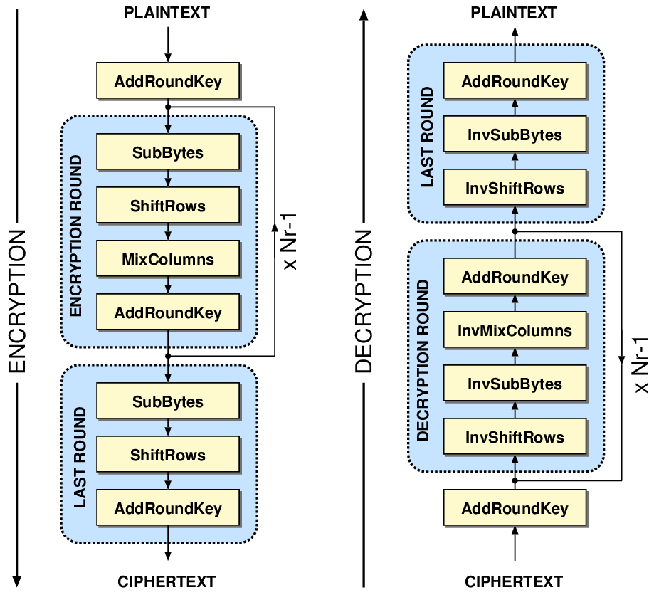
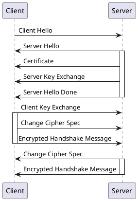

## 数据结构与算法

数据结构三要素：数据逻辑结构、数据存储结构和数据的运算

逻辑结构（节点整体关系）：
    集合结构：节点互斥（HashSet，TreeSet）
    线性结构：1对1
        普通：（String，ArrayList，Vector，LinkedList，HashMap，HashTable，LinkedHashMap）
        受限：队列和栈，串
        拓展：广义表，二维数组
    树形结构：1对多（TreeMap，堆，huffman树）
    图形结构：多对多环状
        （Dagger，DAG 有向无环依赖；Gradle 依赖）
        无向
存储结构（节点和下个节点的关系）：    
    顺序存储结构
    散列存储结构：顺序存储+散列（HashMap）
    索引存储结构：顺序存储+索引（tlv格式，Serizable，protoBuffer，flatBuffer）
    链式存储结构（单链，双链，跳跃列表）

操作：
    增删改，索引遍历，查找排序，销毁

### 可视化
[](https://www.cs.usfca.edu/~galles/visualization/Algorithms.html)
《Intruduce arthrigsim》
KNUTH -《The Art of Computer Programming》基本算法，排序与搜索，半数值计算，
组合算法（枚举与回溯-图论-最优化与递归），造句算法

### 逻辑数据结构
Array
String (装饰 char array)
time/Date （装饰 long）
collection
Concurrent access

```text
                                            +--------------+                                          +----------------+
                                            |              |                                          |                |
                                            |   Collection |                                          |     Map        |
                                            +------+-------+                                          +-------^--------+
                                                   ^                                                     +-----------------------+------------+
                           +---------------------------------------------+                               +                       +            |
                           |                       |                     |                             .....                  ......          |
                   +-------+-------+        +------+------+       ++-----+-----+                 +--+---------+-+         ++-----------+      |    +---------------+
                   |unsort,no repeat        | sortable ,repeatable +                 +              +         +            +                  |    |               |
                   |   Set         +        |   List      +       +    Queue   +                 + HashMap      +         +  SortMap   +      |    |  Dictionary   |
                   +------+--------+        +-----+-------+       +-------+----+                 +-------+------+         +-------+----+      |    +---------------+
                          ^                       ^                       ^                              ^                        ^           |
       +--------------->  +                       + <---------------------+                              |                        |           |            ^
    .......           .......                   ....                      |                              |                        |           |            |
+--------------+   +---------------+  +-----------+  +---------+    +-----+-----------+         +--------+--------+        +------+------+    |  . +-------+--------+
|              |   |               |  |           |  |         |    |                 |         |                 |        |             |    |  . |                |
|  TreeSet     |   |   HashSet     |  | ArrayList |  | Vector  |    |   LinkedList    |         |   LinkedHashMap |        |   TreeMap   |    +--.-+   HashTable    |
+--------------+   +---------------+  +-----------+  +---------+    +-----------------+         +-----------------+        +-------------+       . +----------------+


```


#### ArrayList
```java
            +----------------------------------------------------------------------------------+
            |           ArrayList:AbstractList     AbstractList                                |
            |              elementData:Object[]     modCount:int        DEFAULT_CAPACITY = 10; |
            |              size:int                                                            |
            |                                                                                  |
            |              add(e:E)                   remove(index:int )                       |
            |              add(index:int ,element:E)  remove(o:Object )                        |
            |              ensureCapacityInternal()                                            |
            |                                                                                  |
            |              grow()                                                              |
            |              hugeCapacity()//OutOfMemoryError()                                  |
            +----------------------------------------------------------------------------------+


```
初始容量 0
加载因子 首次扩容DEFAULT_CAPACITY=10，超过容量1.5倍//适用非线程安全，效率高，

#### Vector

```java
            +----------------------------------------------------------------------------------+
            |                      VectorvEv:AbstractList                                      |
            |                                                                                  |
            |                          elementData:Object[]                                    |
            |                                                                                  |
            |                          elementCount: int                                       |
            |                                                                                  |
            |                          capacityIncrement:int //custom                          |
            |                                                                                  |
            +----------------------------------------------------------------------------------+

```

初始容量 默认10，超过容量，执行扩容
扩容增量 增加一倍，或者自定义capacityIncrement。ArrayList比较省空间。 //同步方法，效率慢，需要扩容大，保证并发时，不用频繁扩容

与ArrayList区别是，所有方法都加Synchronized，性能没有ArrayList高
#### LinkedList
```java
            +----------------------------------------------------------------------------------+
            |           LinkedList:AbstractSequentialList                                      |
            |               last:Node<E>         first:Node<E>    size:int                     |
            |                                                                                  |
            |               add(e:E ):boolean                                                  |
            |               linkLast( e:E)                                                     |
            +----------------------------------------------------------------------------------+
            |               Queue                Deque:Queue      AbstractSequentialList:      |
            |                offer(e:E)            push(e:E )               AbstractList       |
            |                linkLast()            addFirst()          modCount :int           |
            |                                                                                  |
            |                poll()                pop()                                       |
            |                unlinkFirst()         removeFirst()                               |
            |                                      peek()                                      |
            +----------------------------------------------------------------------------------+
            |              Node                                                                |
            |                item: E                                                           |
            |                next:Node^E^                                                      |
            |                pre^:Node<E>                                                      |
            +----------------------------------------------------------------------------------+
```


#### HashMap
JDK7中HashMap采用的是位桶+链表的方式，即我们常说的散列链表的方式，而JDK8中采用的是位桶+链表/红黑树
```
            +----------------------------------------------------------------------------------+
            |                      HashMap:AbstractMap                AbstractMap:Map          |
            |                      entrySet:Set<Map.Entry<K,V<>        keySet:Set<K>           |
            |      put(K,V )       table:Node<K,V>[]                   values:Collection<V>    |
            |                      loadFactor:float=0.75f                                      |
            |      resize()        modCount:int                                                |
            |                      size:int                                                    |
            |                      threshold:int                                               |//threshold 容量*加载因子
            |           treeifyBin()                                                           |
            +----------------------------------------------------------------------------------+
            |         TreeNode: LinkedHashMap.LinkedHashMapEntry:.Node         .Node:Map.Entry |
            |            parent;TreeNode       before, after                           hash    |
            |            left;  TreeNode                                               key     |
            |            right; TreeNode                                               value   |
            |            prev;  TreeNode                                               next    |
            |            red;   boolean                                                        |
            |                                                                                  |
            |            balanceDeletion()               removeTreeNode()                      |
            |                                            untreeify()                           |
            |                                            split()                               |
            +----------------------------------------------------------------------------------+
    static class Node<K,V> implements Map.Entry<K,V> {
        final int hash;
        final K key;
        V value;
        Node<K,V> next;
```
MIN_TREEIFY_CAPACITY = 64
TREEIFY_THRESHOLD = 8;
UNTREEIFY_THRESHOLD = 6

**tab扩容**
初始容量 table默认0，默认加载因子0.75（泊松分布有关）//tab长度不是质数或奇数，hash在tab上的分布不确定是否分散，需要用泊松分布来保证分散分布到tab位置
扩容增量（扩容hash表）  
    put 首次16（如果oldThr>0，优先取oldThr），Map阈值为table乘上加载因子；//2的幂次方，Boolean的hash 1101(2) 11
    putAll 首次设置 expect/0.75+1，阈值是最接近容量的2次幂
    Map阈值和 table扩容2倍（减少扩容后重新hash）//2的幂次方，容易位运算取tabindex=i = (n - 1) & hash；位运算代替取模效率高
红黑树链表化
    扩容，拆分红黑树，节点小于等于6
    remove，当前红黑树满足一定条件 (root.right == null  || root.left == null,|| root.left.left == null )

取消树化：table小于64


- 哈希碰撞
```java
    static final int hash(Object key) {
        int h;
        return (key == null) ? 0 : (h = key.hashCode()) ^ (h >>> 16);//浮点型低位放位置有可能是0（SEEEEEEEEMMMMMMMMMMMMMMMMMMMMMMM）hash容易为0，hash冲突
    }

    class Map.Entry{
        public final int hashCode() {
            return Objects.hashCode(key) ^ Objects.hashCode(value);
        }
    }
```
hash bucket 大小设置为 length=2^n。
2^n-1对应的二进制 1111...111，hash bucket的索引值是通过 hash & (tab.length - 1)，设置为2^n，减少哈希碰撞

- 链地址过长，（红黑树）树化
  TREEIFY_THRESHOLD = 8时，对哈希冲突链地址树化

```
哈希碰碰撞时的解决方法
1. 开放地址法（HashTable），包括 线性探测再散列，二次探测再散列，伪随机探测再散列
2. 链地址法（HashMap 用红黑树代替链表，加快搜索）
3. 再哈希法
4. 建立一个公共溢出区
```
[xorshift](http://csuncle.com/2018/08/03/梅森旋转安全性分析及改进/)


红黑树插入，根据hash值，找节点，若没找到，找到叶子节点


#### HashTable
开放地址法解决Hash冲突

```
            +----------------------------------------------------------------------------------+
            |Hashtable:Dictionary,Map                                                          |
            |   put(K, V):V                count:int                table:HashtableEntry<?,?>[]|
            |    addEntry(hash,K,V,index)  entrySet:Set<Map.Entry>  threshold:int              |
            |   rehash()                   keySet:Set               values:Collection<V>       |
            |                              loadFactor:float                                    |
            |                              modCount:int                                        |
            |                                                                                  |
            |                                                                                  |
            +----------------------------------------------------------------------------------+


```
初始容量 默认11，加载因子0.75，（Android 首次Map阈值和table容量一样）//默认初始化tab长度为奇数，保证分散分布到tab的位置
扩容增量  2倍+1，保证奇数，有可能是质数//质数，奇数 hash的值在tab上更分散 index = (hash & 0x7FFFFFFF) % tab.length

```java

int newCapacity = (oldCapacity << 1) + 1;

    class HashTableEntry{
        public int hashCode() {
            return hash ^ Objects.hashCode(value);//减少key的hash计算
        }
    }
```


#### LinkedHashMap

LinkedHashMap节点类 LinkedHashMapEntry 包含 before, after;
HashMap节点类 Node 包好 next;
```
            +----------------------------------------------------------------------------------+
            |                      LinkedHashMap:HashMap, MapbleMap                            | 
            |                          head:LinkedHashMapEntry<K,V>                            | 
            |                          tail:LinkedHashMapEntry<K,V>                            |
            |                          accessOrder:boolean                                     |
            |                                                                                  |   
            +----------------------------------------------------------------------------------+
            |         TreeNode: LinkedHashMap.LinkedHashMapEntry                               |
            |            parent;TreeNode                                                       |
            |            left;  TreeNode                                                       |
            |            right; TreeNode                                                       |
            |            prev;  TreeNode                                                       |
            |            red;   boolean                                                        |
            |                                                                                  |
            |                                                                                  |
            |                                                                                  |
            |                                                                                  |
            +----------------------------------------------------------------------------------+


```
初始容量（继承Hashmap）  16
加载因子（0.0~1.0）  0.75f
扩容增量（扩容hash表）  一倍
```

newCap = oldCap << 1
```


#### TreeMap
？父红，旋转，黑色子节点数量不变
？父黑子红，换红色，需要旋转才能保证黑色子节点数量不变
```java
            +----------------------------------------------------------------------------------+
            |                      TreeMap:AbstractMap,NavigableMap                            |
            |                                                                                  |
            |  descendingMap:NavigableMap<K,V>                   AbstractMap                   |
            |   size:int                                            values :Collection<V>      |
            |   root:TreeMapEntry<K,V>                              keySet :Set<K>             |
            |     comparator:Comparator<? super K>                                             |
            |                                                                                  |
            |  entrySet:EntrySet                                                               |
            |  navigableKeySet: KeySet<K>                                                      |
            |   modCount:int                                                                   |
            |                                                                                  |
            +----------------------------------------------------------------------------------+
            |    TreeMapEntryvK,Vv : Map.EntryvK,Vv                                            |
            |         K key;                                                                   |
            |         V value;                                                                 |
            |         left:  TreeMapEntry                                                      |
            |         right: TreeMapEntry                                                      |
            |         parent:TreeMapEntry                                                      |
            |         color:  boolean= BLACK                                                   |
            +----------------------------------------------------------------------------------+

```
⤷ 不平衡点
🔴 红色
🅟父节点
🅠叔节点
🅖祖父
🅐 当前节点
🅑 兄弟节点
🅝 近侄节点
🅜 远侄节点
🅒 第一子节点
🅓 第二子节点
fixAfterInsertion/fixAfterDeletion删除如果黑色需要平衡
 插入默认红色，如果父节点是红色需要平衡。（解析：不允许两个子父节点是红色，需要平衡）
 删除节点是黑色，且**替换**删除节点位置的**节点是黑色**，需要平衡操作（解析：替换节点的分支少了一个黑色节点，根节点到每个叶节点的黑色节点不一样了，需要改平衡）

- fixAfterInsertion：红黑树平衡调整（循环条件：非空，非跟节点，父节点非红色）（不允许null节点。先查找节点替换，如果不存在，则变红插入再平衡）:
叔父红色
    1. 祖父叔三角变色（父叔黑，祖红，父叔红色传递到祖父；并以祖父节点继续平衡； 解析：不平衡原因，红色相邻；平衡处理，红色向上传递）
    2. 祖节点继续转换
```
               🅖                   🔴 
             🔴  🔴            🅟      🅠      
          ⤷🔴         ⇢    ⤷🔴  
                            
```

叔父黑色，
    1. 祖父子节点不是直线（否则进行步骤2），往子父直线方向，父节点转换。以转换后的父节点，继续步骤2。（解析：直线原因，后续旋转后，避免红色节点再次相连）
```
                 🅖                 🅖 
             🔴     🅠          🔴      🅠      
          🅑   ⤷🔴a     ⇢   ⤷🔴p       
                            🅑
```


    2. 变父祖两色（父黑祖红），父祖节点方向，祖节点旋转。（解析：红色向上传递，并旋转，分支到叶节点的黑色节点数不变）

```
               🅖                  🅟 
             🔴   🅠         ⤷🔴       🔴      
          ⤷🔴  🅑     ⇢              🅑    🅠     
                            
```

    3. 继续步骤1，直到根节点或父节点不是红色（解析：当前子节点是红色，父节点也红色，则需要平衡操作）
平衡后根节点设置为黑色hong


- 删除（概念：前驱节点，删除节点，替换节点）（解析：删除黑色叶子节点；删除节点有一个是黑色子节点。这两种情况会导致当前分支少一个黑色节点；需要找到一个红色节点，涂黑）
  概念：子节点，少一个黑色节点分支的不平衡节点；兄，父，近侄，远侄都是根据定义的子节点的最新状态相对位置节点。
    1. 如果删除节点有两个子节点。找到前驱节点（右节点的最小子节点），前驱节点的数据复制到删除节点，转而前驱节点作为删除节点。步骤3（解析：靠近叶子节点，删除比较好平衡；情况如下，黑色少一个或红色无影响）
    2. 如果一个子节点或零个子节点，执行步骤3
    3. 用左右子节点作为替换节点，替换删除节点。
    4. 如果删除节点是黑色，需要对替换节点做平衡操作（没有子节点且删除节点是黑色节点，需要先平衡在unlink）
fixAfterDeletion删除平衡（循环条件：不是根节点并且当前是黑色节点）（解析：如果删除和替换叶节点都是黑色节点，则分支少了一个黑色节点；或无子节点，删除黑色节点，导致少一个黑色节点）
    1. 兄弟节点为红色，父红兄黑，兄父方向旋转父节点。重新设置兄弟节点（解析：转化缺少黑节点的分支为红色，为了后续涂黑增加黑色节点。转化父兄颜色，通过旋转，各分支黑色节点数不变）
```
               🅟                   🅑
          ⤷🅐      🔴  ⇢       🔴      
                            ⤷🅐
```

    1. 兄弟节点子节点都是黑色，兄弟节点变红色。以父节点作为新节点，并重复步骤1。否步骤3（解析：红色节点向上传递，左右节点都少了黑色节点，即父节点少了一个节点，需要继续下个循环）

```
                🅟/🔴             ⤷🅟/🔴
           ⤷🅐      🅑     ⇢   🅐      🔴  
                  🅒  🅓              🅝  🅜 
```
    1. **距离远的侄节点**是黑色，变兄红近侄黑，且按照侄兄方向旋转兄弟节点。重新设置兄节点。到3.2（解析：变色后，近侄黑色数不变，远侄多了少了一个，通过旋转平衡数量；）
```
                🅟/🔴              🅟/🔴                 
           ⤷🅐      🅑     ⇢     ⤷🅐     🅒  ⇢        （3.2） 
                  🔴 🅜                    🔴       
                                             🅜
```
    3.2 兄备份父节点颜色，父和远侄变黑，侄父方向旋转。根节点赋值给当前节点，跳出循环（解析：当前兄黑远侄红，对调兄父颜色，旋转增加子节点黑色；旋转后兄少了黑色节点，当前兄为红色，变黑节点，）
```
                🅟/🔴                 🅑/🔴
            ⤷🅐      🅑     ⇢      🅟      🅜      
                  🅝   🔴        🅐  🅒               
```                                            


    跳出循环，设置x为黑色


```java
    private void fixAfterInsertion(TreeMapEntry<K,V> x) {
        x.color = RED;

        while (x != null && x != root && x.parent.color == RED) {
            if (parentOf(x) == leftOf(parentOf(parentOf(x)))) {
                TreeMapEntry<K,V> y = rightOf(parentOf(parentOf(x)));
                if (colorOf(y) == RED) {
                    setColor(parentOf(x), BLACK);
                    setColor(y, BLACK);
                    setColor(parentOf(parentOf(x)), RED);
                    x = parentOf(parentOf(x));
                } else {
                    if (x == rightOf(parentOf(x))) {
                        x = parentOf(x);
                        rotateLeft(x);
                    }
                    setColor(parentOf(x), BLACK);
                    setColor(parentOf(parentOf(x)), RED);
                    rotateRight(parentOf(parentOf(x)));
                }
            } else {
                TreeMapEntry<K,V> y = leftOf(parentOf(parentOf(x)));
                if (colorOf(y) == RED) {
                    setColor(parentOf(x), BLACK);
                    setColor(y, BLACK);
                    setColor(parentOf(parentOf(x)), RED);
                    x = parentOf(parentOf(x));
                } else {
                    if (x == leftOf(parentOf(x))) {
                        x = parentOf(x);
                        rotateRight(x);
                    }
                    setColor(parentOf(x), BLACK);
                    setColor(parentOf(parentOf(x)), RED);
                    rotateLeft(parentOf(parentOf(x)));
                }
            }
        }
        root.color = BLACK;
    }
```
二叉树搜索

Charset#availableCharsets():SortedMap
#### HashSet
```
            +----------------------------------------------------------------------------------+
            |                      HashSet: AbstractSet, Set                                    |
            |                               map :HashMap<E,Object>                             |
            +----------------------------------------------------------------------------------+

```
#### TreeSet
```


            +----------------------------------------------------------------------------------+
            |                      TreeSet: AbstractSet,NavigableSet                           |
            |                                                                                  |
            |                               m:NavigableMap<E,Object>                           |
            |                                                                                  |
            +----------------------------------------------------------------------------------+

```

#### SparseArray
dirty flag模式

remove时候，设置为true
插入，索引，查找，size

int不用计算hash效率高
#### ArrayMap
cache模式
缓存长度为8，16数组
缓存arrayamp


## 比特串/字节数组结构（二进制编码）
### 基本数据类型与字节（固定长度二进制代表数据类型）

boolean,byte,char,short,int,long,float,double

创建对象
    简单工厂 valueof

- Char
  jdk 9采用压缩字符串，Iso-8891，使用一个字节，否则用 UTF-16 编码。


#### 浮点型 IEEE-754格式标准
Float
```
第一步：[176.0625换成二进制数](https://blog.csdn.net/k346k346/article/details/50487127)，
        整数部分采用"除2取余，逆序排列"法：
        小数点前:176 / 2 = 88  
        余数为 088 / 2=44 余数为 0                             
        44 / 2 =22    余数为 0                       
        22 / 2= 11    余数为 0                              
        11 / 2 =5     余数为 1        
        5 / 2=2       余数为 1                             
        2/ 2  =1      余数为 0                                                                             
        1/ 2=0        余数为 1    商为0，结束。                                                                       
        小数点前整数转换为二进制:10110000    
        ---------------------  
        
        小数部分采用 "乘2取整，顺序排列"法部分：
        0.0625 * 2 = 0.125   整数为0                 
        0.125 * 2 = 0.25     整数为0             
        0.25* 2 = 0.50       整数为0             
        0.5* 2 = 1.0         整数为1，小数部分为0,结束
        小数点后整数转换为二进制:0001 

        得到二进制位：10110000.0001

第二步：在换算成内存格式（IEEE-754格式标准）  SEEEEEEE    EMMMMMMM    MMMMMMMM    MMMMMMMM
      S 0正数，1负数
      E 第一位（1：大于1的十进制，0：0~1之间的十进制），第2到8位（减法后的值： [占1位；小数点移位至到个位1.若右移0，否则1][占7位，小数点移位的二进制] −1）
      M 小数点移位到个位1后，截取后面23二进制
      即 0 10000110 0110000 00010000 00000000

```
-Float.MAX_VALUE ~ Float.MAX_VALUE
=[-3.40282346638528860e+38 , -1.40129846432481707e-45] ∪ [1.40129846432481707e-45 ~ 3.40282346638528860e+38]
正负是对称的，看下正数部分
Float.MIN_VALUE ~ Float.MAX_VALUE
=2^(-126) ~~ 2(1-2^(-24)) * 2^(2^7-1)
=2^(-126) ~~ 2(1-2^(-24)) * 2^(127)
=1.1754943508223e-38 ~ 3.4e+38
= （已知e-24位 涅槃寂静，暂时找不到可以衡量的计数单位） ~ 3.4*(10^38)(计数单位约等于34涧)

- Double
内存里的存储结构（IEEE-754格式标准）：SEEE EEEE EEEE MMMM MMMM MMMM MMMM MMMM MMMM MMMM MMMM MMMM MMMM MMMM MMMM MMMM
正数范围：
2^(-1022-52) ~~ 2-2^-52)*(2^((2^10)-1))
#### 时间戳封装 - 日期Date/Canadar
装饰 long时间戳
懒加载 

Calendar.HOUR 圆盘时钟 1~12，凌晨0点即早上12点，中午12点即下午12点
Calendar.HOUR_OF_DAY 数字手表0~23

####  字符串结构及字符编码

数据与二进制
- 字长
  [字长](http://www.cnblogs.com/chakyu/p/7405275.html)
  [进制转化](https://www.branah.com/ascii-converter)
- 字节，编码，字符集 
sun.jnu.encoding是指操作系统的默认编码，
file.encoding是指JAVA文件的编码
```java
javac -encoding utf-8 TextFileEncoding.java  //必须设置和文件编码一直的编码

java -Dfile.encoding=utf-8 TextFileEncoding

```
[java -h 相关启动参数帮助文档](https://docs.oracle.com/javase/7/docs/technotes/tools/windows/java.html)

《The Unicode® Standard Version 9.0 》
BCD->ASCII（128）->ISO/IEC8859-1，又称Latin-1（256）->Unicode(1_114_112)
```
                            256
                   128
              16
            +------+---------+------------+
        16  | 128  |         |            |
            | 0xf  |         |            |
            +------+         |            |
            |       256      |            |
    128     |      0xff      |            |
256         +----------------+            |
            |               65536         |Redundancy
            |               0xffff        |
            |                             |
            +-----------------------------+
 
       +--------------------------------+ colomns 256  +--------------------------------+

 +    +---------------------------------------------------------------------------------+    +
 |    |             ascii                 |                   latin1                    |BMP |
 |    +---------------------------------------------------------------------------------+    |
 |    |                                                                           .     |    +
 |    |                                                                           .     |   rows 256
 |    |                                                                           .     |    +
 |    +---------------------------------------------------------------------------------+    +
 |                                                                                       SMP
 |                                           .                                           SIP  
                                             .
planes 0x10                                  .                                           SSP
 +                                                                                       SPUA-A
 |    +---------------------------------------------------------------------------------+
 |    |                                                                                 |SPUA-B
 |    |                                                                                 |
 +    +---------------------------------------------------------------------------------+
 
1字节 0xxxxxxx 
2字节 110xxxxx 10xxxxxx 
3字节 1110xxxx 10xxxxxx 10xxxxxx 
4字节 11110xxx 10xxxxxx 10xxxxxx 10xxxxxx 
5字节 111110xx 10xxxxxx 10xxxxxx 10xxxxxx 10xxxxxx 
6字节 1111110x 10xxxxxx 10xxxxxx 10xxxxxx 10xxxxxx 10xxxxxx 
```
[unicode 及位置](https://unicode-table.com/en/#control-character)
 [emoji位置](https://unicode-table.com/en/#emoticons)  80个字符(1F600— 1F64F)
UCS-4 第1个字节2^7=128个group，第2个字节2^8=256个平面（plane）,第3个字节分为256行 （row），第4个字节代表每行有256个码位（cell）
unicode 有0x10FFFF个cell，分为 17平面，(2^8=256)行，(2^8=256)单元
 
- 涉及类
  1. [Character.UnicodeBlock](https://en.wikipedia.org/wiki/Unicode_block)
- [Unicode与UTF-8转化](https://zh.wikipedia.org/wiki/UTF-8)
- [UTF-16](https://en.wikipedia.org/wiki/UTF-16) 
  UTF-16编码（二进制）就是：xxxxxxxx xxxxxxxx（0区）
  或110110yy yyyyyyyy 110111xx xxxxxxxx（超过三个字节 Unicode 用四个字节的UTF-16编码）
  
```java
  System.out.println("a".getBytes(StandardCharsets.UTF_16).length);//结果为4，是因为加上BOM(字节顺序标记(ByteOrderMark))大端序，用FEFF表示，FEFF占用两个字节。
```

  BOM大端，高位字节存储在内存地址的低位地址

```
    0x CC AA 88 66

   Big-Endian
   +--------+--------+-------+--------+
   |  CC    |  AA    |  88   |  66    |
   |        |        |       |        |
   +--------+--------+-------+--------+

   Little-Endian
   +--------+--------+-------+--------+
   |  66    |  88    |  AA   |  CC    |
   |        |        |       |        |
   +--------+--------+-------+--------+
```
##### 字符串-字符数组
stringbuilder 
```
+----------------------------------------------------------------------------+
|                 StringBuilder                StringBuffer                  |
|                                                                            |
+----------------------------------------------------------------------------+
|                                                                            |
|                      AbstractStringBuilder                                 |
|                            value:char[]                                    |
|                            count:int                                       |
|                                                                            |
+----------------------------------------------------------------------------+


```
初始 默认16
扩容 插入时，期望数组长度大于value数组长度，(value.length << 1) + 2，如果不够直接用期望数组长度。[(value.length << 1) + 2](https://stackoverflow.com/questions/45094521/java-stringbuilderstringbuffers-ensurecapacity-why-is-it-doubled-and-incre)
    （保证初始化长度为0，也能扩容。并且可能JVM内存结构有关，不考虑markword和clazz，数组长度 4byte+（16*2+2)*2byte(char) 有概率能被8整除，内存对齐）
Arrays.copyof 扩容空间，拷贝源数组
System.arraycopy 拷贝到新数据 
```
+---------------+----------+----------+
|               |  final   |  synchro |
+-------------------------------------+
| String        |   √      |          |
+-------------------------------------+
| StringBuffer  | char[]   |    √     |
+-------------------------------------+
| StringBuilder | char[]   |    x     |
+---------------+----------+----------+

```

#### 指令 - 运算符（算术，位运算，赋值，比较，逻辑）
Byte通过加法实现加减，移位和加法实现乘除法

- 原码，反码，补码
  正数：原码，反码，补码一致
  负数：反码符号位不变其他位按位取反，补码为反码加1（取反加一，两个过程符号位都不变）
```
或者换成时钟，0，1，2，3，4，5，-6，-1，-2，-3，-4，-5
3bit有符号二进制
+--------+-----------+-----------+---------+--------+---------+----------+---------+--------+
|        |           |           |         |        |         |          |         |        |
| Decimal|  -3       |    -2     |   -1    |  -4    |   3     | 2        | 1       |    0   |
+-------------------------------------------------------------------------------------------+
|        |           |           |         |        |         |          |         |        |
| 原码    |  111      |    110    |  101    |  100   |  011    |  010     |  001    | 000    |
+--------+-----------+-----------+---------+--------+---------+----------+---------+--------+

负数反码，相当与在负数范围换下位置。 
+--------+-----------+-----------+---------+--------+---------+----------+---------+--------+
|        |           |           |         |        |         |          |         |        |
| Decimal|   -4      |    -1     |   -2    |  -3    |   3     | 2        | 1       |    0   |
+-------------------------------------------------------------------------------------------+
|        |           |           |         |        |         |          |         |        |
| 反码    |  111      |    110    |  101    |  100   |  011    |  010     |  001    | 000    |
+--------+-----------+-----------+---------+--------+---------+----------+---------+--------+
 
负数补码，整个数变得有序
+--------+-----------+-----------+---------+--------+---------+----------+---------+--------+
|        |           |           |         |        |         |          |         |        |
| Decimal|   -1      |    -2     |   -3    |  -4    |   3     | 2        | 1       |    0   |
+-------------------------------------------------------------------------------------------+
|        |           |           |         |        |         |          |         |        |
| 反码    |  111      |    110    |  101    |  100   |  011    |  010     |  001    | 000    |
+--------+-----------+-----------+---------+--------+---------+----------+---------+--------+


```
  原码：加负数，不是预期值（1-1= 00000001^1000001（原码）=10000010=-2）
  反码：正数原码加负数的原码，计算的结果不是想要的值（1-1= 00000001（反）^11111110（反码）=11111111（反）=10000000（原））。
  补码：正数加负数的反码，符号位不对，用补码可以正确（1-1= 00000001（补）^11111111(补码)=00000000=0）
- [补码原理：同余](https://www.cnblogs.com/baiqiantao/p/7442907.html)
  负数取模：A mod b= A-B*Math.floor（A/B）
  
  1. 反码，实际上是这个数对于一个膜的同余数；而这个膜并不是我们的二进制，而是所能表示的最大值
  2. 反码的基础上+1，只是相当于增加了膜的值
```
byte （byte范围 -128~127）取反求值，相当于值 (a+b) mod 127
    取补求值，相当于（a+b） mod 128，保证不会溢出
```

- 位运算 **& | ~ ^**
 
### Hex（用于打印字符）/Base16（用于编码比特流），Base32
### URL（安全字符+非安全字符Base16编码）
```java
Apache-codec
    static {
        // alpha characters
        for (int i = 'a'; i <= 'z'; i++) {
            WWW_FORM_URL_SAFE.set(i);
        }
        for (int i = 'A'; i <= 'Z'; i++) {
            WWW_FORM_URL_SAFE.set(i);
        }
        // numeric characters
        for (int i = '0'; i <= '9'; i++) {
            WWW_FORM_URL_SAFE.set(i);
        }
        // special chars
        WWW_FORM_URL_SAFE.set('-');
        WWW_FORM_URL_SAFE.set('_');
        WWW_FORM_URL_SAFE.set('.');
        WWW_FORM_URL_SAFE.set('*');
        // blank to be replaced with +
        WWW_FORM_URL_SAFE.set(' ');

        // Create a copy in case anyone (ab)uses it
        WWW_FORM_URL = (BitSet) WWW_FORM_URL_SAFE.clone();
    }
```
非安全字符
```java
        buffer.write(ESCAPE_CHAR);
        final char hex1 = Utils.hexDigit(b >> 4);
        final char hex2 = Utils.hexDigit(b);
        buffer.write(hex1);
        buffer.write(hex2);
```
### Base64
> Base64是一种基于64个可打印字符来表示二进制数据的表示方法。log{2}64=6 。[](https://zh.wikipedia.org/wiki/Base64)
```java 
Apache-codec

    //1. 邮件内容 MINE；
    //2. 图片传输 data:image/png;base64 ；
    private static final byte[] STANDARD_ENCODE_TABLE = {
            'A', 'B', 'C', 'D', 'E', 'F', 'G', 'H', 'I', 'J', 'K', 'L', 'M',
            'N', 'O', 'P', 'Q', 'R', 'S', 'T', 'U', 'V', 'W', 'X', 'Y', 'Z',
            'a', 'b', 'c', 'd', 'e', 'f', 'g', 'h', 'i', 'j', 'k', 'l', 'm',
            'n', 'o', 'p', 'q', 'r', 's', 't', 'u', 'v', 'w', 'x', 'y', 'z',
            '0', '1', '2', '3', '4', '5', '6', '7', '8', '9', '+', '/'
    };

    /**
     * This is a copy of the STANDARD_ENCODE_TABLE above, but with + and /
     * changed to - and _ to make the encoded Base64 results more URL-SAFE.
     * This table is only used when the Base64's mode is set to URL-SAFE.
     */
    private static final byte[] URL_SAFE_ENCODE_TABLE = {
            'A', 'B', 'C', 'D', 'E', 'F', 'G', 'H', 'I', 'J', 'K', 'L', 'M',
            'N', 'O', 'P', 'Q', 'R', 'S', 'T', 'U', 'V', 'W', 'X', 'Y', 'Z',
            'a', 'b', 'c', 'd', 'e', 'f', 'g', 'h', 'i', 'j', 'k', 'l', 'm',
            'n', 'o', 'p', 'q', 'r', 's', 't', 'u', 'v', 'w', 'x', 'y', 'z',
            '0', '1', '2', '3', '4', '5', '6', '7', '8', '9', '-', '_'
    };
```
Simple： A-Za-z0-9+/（.用来填充）
URL： A-Za-z0-9+_（.用来填充）
MIME： A-Za-z0-9+/（=用来填充）


## 算法 - 七大（逻辑结构）查找
1. 线性表查找：
     1. 顺序查找（String.contains()，），
     2. 二分法/折半有序查找 log₂(n) ，**int mid = low+(high-low)/2;**
     3. 插值有序查找：优化折半查找 **int mid = low+(value-a[low])/(a[high]-a[low])*(high-low);**
         适合均匀分布的有序表，时间：O(㏒₂n)
     4. 斐波那契有序查找： 函数估值次数最少的最优搜索方法**int mid = low+F(k-1)-1;**

        ```java
            while (arrLength > fb[k] - 1){k++;} //初始化k，即斐波那契大于数组长度的最小值
        
            int mid = low+F(k-1)-1;
            expect=arr[mid]，查找对
            expect>arr[mid]，则low=mid+1，k-=2；
            expect<arr[mid]，则high=mid-1，k-=1。
        ```
     5. 哈希存储查找
         1. 以空间换时间，复杂度O(1)
         2. 变形：位图，布隆过滤         
     6. 索引表顺序查找/分块查找（优化顺序查找）

2. 树形查找：
        二叉搜索树（AVL/红黑树），
        多叉树（b树，b+，b*），
3. 图形查找：
        深度优先，广度优先

### 排序
3个维度：时间复杂度（最好，平均，最坏），空间复杂度，稳定性
[](问题优化与总结\知识体系-理论-DSA.md)
[排序算法](https://en.wikipedia.org/wiki/Sorting_algorithm)

|--|--|--|--|空间|稳定|~~复杂~~|
|--|--|--|--|--|--|--|
**比较排序**| | | | | | | |
冒泡交换|   没有交换O(N)|O(n²)         |       |O(1)      |    稳定|简单             
快速交换|               |  O(N*㏒₂N)|全交换O(n²)| O(㏒₂n)|   不稳定|复杂
| | | | | | | |
归并排序|               |O(N*㏒₂N)     |       |    O(n)  |   稳定|复杂       
| | | | | | | |
插入：  |    没有插入O(N) |O(N²)       |         |  O(1)    | 稳定|简单
希尔：  |            O(N) |O(N^1.3)   | O(N^1.5)|  O(1)    | 不稳定|复杂
| | | | | | | |
直接选择|                 |O(N²)       |        |  O(1)     | 不稳定|    
堆排序  |                 |   O(N*㏒₂N) |       |   O(1)    |不稳定|复杂
**非比较排序**|分布排序<br>n：关键字个数；k：桶数；<br>r：桶里数字范围；d：关键字长度；<br>|||||n<<2^k
计数|               -   | O(n+r)|            | O(n+r)|稳定|是
桶|                   - |O(n+r)|            | O(n+r) |稳定|是
基数|               -   |O(n*k/d)|  |O(n+2^d)|稳定|不

**其他排序**|并发排序，<br>混合排序


计数排序：每个桶只存储单一键值；
桶排序：每个桶存储一定范围的数值；
基数排序：根据键值的每位数字来分配桶；

计算复杂性理论
    常量时间 O(1)
    线性时间  Ο(n)
    指数时间

1954年由 Harold H. Seward 提出 计数排序


#### TimSort
Arrays.sort
https://blog.csdn.net/bryansun/article/details/105182778?utm_medium=distribute.pc_relevant.none-task-blog-BlogCommendFromMachineLearnPai2-7.nonecase&depth_1-utm_source=distribute.pc_relevant.none-task-blog-BlogCommendFromMachineLearnPai2-7.nonecase

### 平衡树

1. AVL平衡树
    1.1 其根的左右子树高度之差的绝对值不能超过1

2. 红黑平衡树
    2.1 每一个节点不是红色的就是黑色的
    2.2. 根总是黑色的
    2.3. 如果节点是红色的，则它的子节点必须是黑色的（反之不一定成立）
    2.4. 从根到叶节点或空子节点的每条路径，必须包含相同数目的黑色节点。
### 哈希表存储
[散列表](https://zh.wikipedia.org/wiki/%E5%93%88%E5%B8%8C%E8%A1%A8)

##### 哈希值生成函数
1. 直接定址法：取关键字或关键字的某个线性函数值为散列地址。
2. 数字分析法 ：关键字的若干数位组成哈希地址
3. 折叠法：将关键字分割成位数相同的几部分，叠加和（去除进位）作为散列地址
4. 平方取中法：取关键字平方后，扩大差异，取中间几位为哈希地址。
5. 除留余数法（变种：乘法溢出）
6. 随机法，关键字长度不同的场合

- 字符串 （自然溢出来等效取模）
1. 最主要的，移位和减法来代替乘法，溢出低位关键字**s[0]*31^(n-1) + s[1]*31^(n-2) + ... + s[n-1]**
2. 奇素数，如果乘数是偶数，并且乘法溢出的话，信息就会丢失，与2相乘等价于移位运算（低位补0）。
    偶数会在乘法运算中产生溢出，导致数值信息丢失。
    质数不能太大，计算量大，小质数有 2，3，5，7，11，13，19，17，23，29，31，统计分布情况
 [《Effective Java》 ]()
##### Hash 冲突
 开放地址法（闭散列）
    线行探查法（ArrayMap）、平方探查法、双散列函数探查法/再哈希法。
 链地址法（开散列HashMap）
 建立公共溢出区
 其他方法

产生的冲突少，查找效率就高。影响产生冲突多少有以下三个因素：
    散列函数是否均匀；
    处理冲突的方法；
    散列表的载荷因子（开放定址法，荷载因子是特别重要因素，应严格限制在0.7-0.8以下）
##### JDK 14
[experimental(intx, hashCode, 5,...)](src\hotspot\share\runtime\globals.hpp)
[get_next_hash()](src\hotspot\share\runtime\synchronizer.cpp)
[](src\hotspot\share\runtime\thread.cpp)
```java
  _hashStateX = os::random();
  _hashStateY = 842502087;
  _hashStateZ = 0x8767;    // (int)(3579807591LL & 0xffff) ;
  _hashStateW = 273326509;

```
### 随机数
基本数据类型缓存与equals()，hashCode()，toString()
一致性hash
SecureRandom 
BigInteger.probablePrime() 质数
#### 伪随机数生成器（PRNG）
[wiki](https://en.wikipedia.org/wiki/List_of_random_number_generators)
1946年，冯诺依曼平方取中法：产生伪随机数的方法，
1951年，Lehmer 生成器（aXn mode m）。 又称为 MLCG或MCG
1958年，LCG（(aXn+c) mode m），相比Lehmer增加常量c
1958年，斐波那契生成器（Lagged Fibonacci generator），改进“标准” 线性同余生成器。
1965年，线性反馈移位寄存器(LFSR)
1988年，Park-Miller生成器。Park 和 Miller建议乘法同余的参数（a = 7⁵ = 16807；m = 2³¹ + 1= 2,147,483,647 ），称为 MINSTD

1997年，梅森旋转算法（Mersenne twister），基于有限二进制字段上的矩阵线性递归
2003年，乔治·马萨利亚的线性递归xorshift
2006年，WELL系列生成器，提高了 Mersenne Twister 的质量

混乱法，线性同余（Java Random），单向散列（SecureRandom SHA1PRNG），加密，ANSI X9.17
3. 其他 乘以携带，减去借，KISS和母亲方法 

#### 斐波那契
ffmpeg
优：无乘法运算
劣：序列随机性不高
#### 乘法同余
2.  [基于线性同余方法 (LCG)来实现PRNG](src\hotspot\share\runtime\os.cpp)
    [Park-Miller RNG](https://en.wikipedia.org/wiki/Lehmer_random_number_generator)
    《计算机程序设计的艺术：卷2》

    X(n + 1) = (a * X(n) + c) % m，当LCG的c = 0，称为乘法一致生成器 （MCG）或**Lehmer RNG**/**Park-Miller RNG**
    ```java
        os::random()
        static int random_helper(unsigned int rand_seed) {
        /* standard, well-known linear congruential random generator with
        * next_rand = (16807*seed) mod (2**31-1)// 16807 100000110100111；(2**31-1) 保留低位所有信息
        * see
        * (1) "Random Number Generators: Good Ones Are Hard to Find",
        *      S.K. Park and K.W. Miller, Communications of the ACM 31:10 (Oct 1988),
        * (2) "Two Fast Implementations of the 'Minimal Standard' Random
        *     Number Generator", David G. Carta, Comm. ACM 33, 1 (Jan 1990), pp. 87-88.
        */
    ```

 周期越大越混乱

#### 线性同余
1. Random
```java
    protected int next(int bits) {
        long oldseed, nextseed;
        AtomicLong seed = this.seed;
        do {a
            oldseed = seed.get();
            nextseed = (oldseed * multiplier + addend) & mask;
        } while (!seed.compareAndSet(oldseed, nextseed));
        return (int)(nextseed >>> (48 - bits));
    }
```

#### xorshift - 对象hash

基于线性递归。xorshift 生成器的运行速度非常快，再结合非线性操作，通过了强有力的统计测试。

```java
//src\hotspot\share\runtime\thread.cpp
        // thread-specific hashCode stream generator state - Marsaglia shift-xor form
    _hashStateX = os::random();
    _hashStateY = 842502087;//110010001101111000111111000111
    _hashStateZ = 0x8767;    // (int)(3579807591LL & 0xffff) ; 3579807591LL ->11010101010111111000011101100111
    _hashStateW = 273326509;// 273326509->10000010010101010000110101101
    
//src\hotspot\share\runtime\synchronizer.cpp
    // Marsaglia's xor-shift scheme with thread-specific state
    // This is probably the best overall implementation -- we'll
    // likely make this the default in future releases.
    unsigned t = self->_hashStateX;
    t ^= (t << 11);
    self->_hashStateX = self->_hashStateY;
    self->_hashStateY = self->_hashStateZ;
    self->_hashStateZ = self->_hashStateW;
    unsigned v = self->_hashStateW;
    v = (v ^ (v >> 19)) ^ (t ^ (t >> 8));
    self->_hashStateW = v;
    value = v;
```
 

#### SecureRandom
内置两种随机数算法，NativePRNG和SHA1PRNG
[](class sun.security.provider.SHA)
[SHA1PRNG，对 seed 消息摘要生成128bit伪随机数，扩大差异性](src\java.base\unix\classes\sun\security\provider\NativePRNG.java)
[](src\java.base\share\classes\sun\security\provider\DRBG.java)
[](src\jdk.crypto.mscapi\windows\classes\sun\security\mscapi\PRNG.java)

linux：/dev/urandom
##### UUID
简单工厂
    randomUUID()
单例（内部类）
```java
java.util.UUID.Holder#numberGenerator
```

装饰
```java
    /*
     * The most significant 64 bits of this UUID.
     *
     * @serial
     */
    private final long mostSigBits;

    /*
     * The least significant 64 bits of this UUID.
     *
     * @serial
     */
    private final long leastSigBits;

```


## 密码学家6个重要的工具
《图解密码技术》
伪随机数生成器
单向散列函数/消息摘要算法
    验证数据完整性的算法
对称密码
公钥密码
消息认证码（MAC，Message Authentication Code）
     完整性、可认证性消息（持有共享密钥，可以验证Alice发送）、认证码无法防止否认（接收方 Bob 持有共享密钥，可能否认）
    单向散列函数实现：HMAC-MD5（MD5加salt）
    AES的CBC模式：AES-CMAC
数字签名
    完整性、可认证性和不可否认性（接收方 Bob 持有公钥，不可否认）
    公钥密码体制都可以单独作为一种数字签名方案使用，MD5withRSA

认证分为实体认证和消息认证：
    消息源认证只表示Bob收到消息的来源是可靠的
消息认证码只能实现消息认证，数字签名则同时可以实现实体认证和消息认证。

消息认证分为两部分，消息源认证（即消息的来源不是冒充的）和消息完整性（即消息未被恶意篡改）。


1949年，香农发表《保密系统的通信理论》标志着现代密码学的真正开始（第一次质的飞跃）。
1972年，美国IBM公司研制的对称密码体制加密算法DES
1976年，Diffie和Hellman发表《密码学的新方向》，标志着公钥密码体制的诞生（第二次质的飞跃）。
1977年，Rivest、Shamir和Adleman提出了RSA公钥密码体制
1981年，IBM发布了IBM个人计算机
1987年，RC4由李维斯特（Ronald Rivest）设计
1999年，distributed.net与电子前哨基金会合作，在22小时15分钟内即公开破解了一个DES密钥。3DES即通过增加DES的密钥长度来避免类似的攻击。
1992年，MD5 用以取代MD4算法
1996年，HMAC结构的定义和分析
2000年，Camellia由三菱和日本电信电话（NTT）共同发明
2001年，AES（Rijndael加密法）发布于FIPS PUB 197。DES标准和3DES标准已逐渐被高级加密标准（AES）所取代
2004年，证实MD5算法无法防止碰撞攻击，因此不适用于安全性认证
2008年，Chacha20由伯恩斯坦发布流加密算法，作为OpenSSL中RC4的替代品
2015年，SHA-3（Keccak）发布。RC4算法存在弱点，所发布的 RFC 7465 规定禁止在TLS中使用RC4加密算法。


现代密码学的三大基础：1、大素数的引入；3、算法的不可逆性；2、基于计算机运算而非手算
 

## 单向散列函数/数字摘要
数据完整性与安全
    单向性，散列值称为 摘要 或者 数字签名（加密的摘要）
    抗修改，为任何文件（不管其大小、格式、数量）产生一个独一无二的“数字指纹”
报文摘要，确保消息的完整性（没有被篡改）
MD5需要注意编码格式，使用new String("str".getBytes("UTF-8"), "UTF-8");需要设置编码格式

 
```java
Apache-Codec
new String[] {
            MD2, MD5, 
            SHA_1, //SHA1 已发现碰撞
            SHA_224, SHA_256, SHA_384,SHA_512, SHA_512_224, SHA_512_256,//SHA-2 安全，算法同SHA1
             SHA3_224, SHA3_256, SHA3_384, SHA3_512//SHA-3 安全，算法不同SHA1
        }
```
其他：RIPEMD
### ~~MD5~~ 初始化4个字，128个字为1块，循环64次
[JDK sun impl](jdk\src\share\classes\sun\security\provider\MD5.java)
[FFmpeg impl](libavutil\md5.c)
[freebsd MD5](https://svnweb.freebsd.org/base/stable/12/lib/libcrypt/crypt-md5.c?view=markup)
字，填充，块，遍历，拼接
1. initial val word h0(32bit),h1,h2,h3
2. Value+padding0+length（64bit）
3. chunk (512bit)
        words (32bit)
        loop 64
        右移轮换h0,h1,h2,h3
4. h0 append h1 append h2 append h3
### ~~SHA-1~~ 初始化4个字，128个字为1块，循环80次
2017年 谷歌在 2^64 复杂度（约 110 GPU年的计算量）内完成了第一次 SHA-1 碰撞
[ffmpeg impl](libavutil\sha.c#av_sha_init)
1. initial h0(32bit),h1,h2,h3,h4
1. Value+padding0+length（64bit）
2. chunk (512bit)
        words (32bit)
        loop 80
        右移轮换h0,h1,h2,h3,h4
4. h0 append h1 append h2 append h3 append h4

### SHA-2
```
SHA-224和SHA-256基本上是相同的，除了：
    h0到h7的初始值不同，以及
    SHA-224输出时截掉h7的函数值。

SHA-512和SHA-256的结构相同，但：
    SHA-512所有的数字都是64位，
    SHA-512运行80次加密循环而非64次，
    SHA-512初始值和常量拉长成64位，以及
    二者比特的偏移量和循环位移量不同。

SHA-384和SHA-512基本上是相同的，除了：
    h0到h7的初始值不同，以及
    SHA-384输出时截掉h6和h7的函数值。
```

### SHA-3（Keccak算法）
抗碰撞 hash 函数

### BLAKE2
2008，BLAKE1，基于丹尼尔·J·伯恩斯坦ChaCha流密码的密码散列函数，于2012输给了Keccak
2012，BLAKE2 目的是取代广泛使用但破损的MD5和SHA-1算法。
2020，宣布推出BLAKE3
#### DSA
RSA和DH，DSA安全性都是基于整数有限域离散对数来实现；
1991年NIST提出将DSA用于其数字签名标准（DSS），并于1994年将其作为FIPS 186采用


## 对称密钥
[JDK 14 Des](src\java.security.jgss\share\classes\sun\security\krb5\internal\crypto\Des.java)
[JDK 14 3Des](src\java.security.jgss\share\classes\sun\security\krb5\internal\crypto\Des3.java)

### 分组加密
[jdk 14 AES 加密方式](src\java.base\share\classes\com\sun\crypto\provider\AESCipher.java)
|[分组密码加密方式](https://en.wikipedia.org/wiki/Block_cipher_mode_of_operation#Common_modes)|
|--|
    ECB（电子密码本，相同的明文块就会生成相同的密文块，不建议使用）
    CBC（密码块链接，不能并行加密）
    CFB（密文反馈，数据段）
    OFB（输出反馈，不用填充，输出块作为下一个块加密的输入块）
    CTR（计数器模式，不用填充）
    
    GCM （CTR 和 GMAC（GHASH） 的复杂组合）
    PCBC
|填充有六种|
|--|
    NoPadding  （填充0，丢失原数据末尾的 '\0'）
    PKCS7Padding
        填充n(n>0)个字节才对齐，则一直填充字节n
        （java 不支持PKCS7Padding，只支持PKCS5Padding，需要用到bouncycastle）
    PKCS5Padding（PKCS7Padding子集，限定了块大小，可以16bit）
    ISO 10126（填随机数，后一个字节是填充的字节数）
    ANSI X9.23（填0，后一个字节是填充的字节数）
    ZerosPadding
### ~~DES/3DES~~

### ~~RC4~~
[](https://zh.wikipedia.org/wiki/RC4)


### AES
[JDK 1.8 krb5 Aes128.java](jdk\src\share\classes\sun\security\krb5\internal\crypto\Aes128.java)

 
AES-256 是伪随机函数

可逆原理：
a ⊕ b ⊕ a = b
[可视化](http://www.formaestudio.com/rijndaelinspector/archivos/Rijndael_Animation_v4_eng-html5.html)

初始化：

      1. 初始化替换表<br>
      2. 填充<br>
      3. 密钥生成 Main Round 和 Final Round 的 10 个 Round key<br>

加密：

      1. Initial Round（密钥加密）
      2. Main Round（9轮计算 替换/移位/混合，密钥加密）
      3. Final Round（替换/移位，密钥加密）



1. Initial Round（密钥加密）
2. Main Round（9轮计算 移位，密码表替换，混合，密钥加密）
3. Final Round（移位，密码表替换，密钥加密）
   
AES-123 可靠性：
    破解需要尝试2^127 ≈ 1.7*10^38个128bit的随机数作为密钥进行加解密运算，方能找到正确的密钥。


对称加密算法需要指定算法名称、工作模式和填充模式
```java
//java 支持
// various modes
//     ECB,  CFB,  OFB,  CBC,PCBC
// padding 
//     PKCS5Padding， NoPadding，ISO10126Padding

        byte[] seed = "seed".getBytes();//
        byte[] byteContent = "content".getBytes("utf-8");//需要注意加密/解密的编码要一样

        KeyGenerator kgen = KeyGenerator.getInstance("AES");//算法
        kgen.init(128, new SecureRandom(seed));//密钥长度；  通过传入 SecureRandom的seed，经 SHA-1 伪随机器（不同平台而异），生成 128 bit密钥

        //1. 必须要设置 算法/工作模式/填充模式
        Cipher cipher = Cipher.getInstance("AES");//windows 默认 "AES/ECB/PKCS5Padding"
        //2. 必须要设置对应长度的密钥
        cipher.init(Cipher.ENCRYPT_MODE, new SecretKeySpec( kgen.generateKey().getEncoded(), "AES"));//传入 密钥字节，选择加密实现。init 从 provider挑选实现类，并初始化 spi
        byte[] result = cipher.doFinal(byteContent);
```
### Camellia
### ChaCha20
 

## 公钥密码/密钥协商机制
[密钥协商机制 wiki](https://zh.wikipedia.org/wiki/%E5%82%B3%E8%BC%B8%E5%B1%A4%E5%AE%89%E5%85%A8%E6%80%A7%E5%8D%94%E5%AE%9A)
### 身份验证 -RSA非对称加密
早期的 SSLv2 只支持一种密钥协商机制RSA，最古老的密钥协商方式
#### RSA

##### 理论：
欧拉函数：给定任意正整数 n ,在小于等于 n 的正整数中，能与 n 构成互质关系的正整数个数
欧拉定理：如果两个正整数 m 和 n 互质，那么 m 的 φ(n) 次方 减去 1，可以被 n 整除
费马小定理：欧拉定理基础上，n 为质数时，φ(n) 等于 n-1
模逆元：ed mod n=1

公式推导： 
        m 的 φ(n)    次方对 n 求余等于1；
        m 的 kφ(n)   次方对 n 求余等于1；
        m 的 kφ(n)+1 次方对 n 求余等于 m；
        m 的 e*d     次方对 n 求余等于 m；


安全性是基于极其困难的大整数的分解（两个素数的乘积）；
[质数列表](https://www.shuxuele.com/numbers/prime-numbers-to-10k.html)
[在线欧拉函数计算](https://www.dcode.fr/euler-totient)
[在线欧拉函数计算(大于1000000000)](http://www.javascripter.net/math/calculators/eulertotientfunction.htm)
```java
首选取两个互素数 p和q, 乘法计算p * q 得到 N。

然后计算出欧拉φ(N)： φ函数φ(N)是小于或等于N的正整数中与N互质的数的数目。 根据欧拉公式，由于p和q都是素数，故 φ(N) = (p-1)*(q-1)

随机选择一个整数e，条件是1< e < φ(n)，且e与φ(n) 互质。
 接着我们计算e对φ(n)的模逆元得到d： e*d ≡ 1 (mod φ(n)) 这个公式简单的说就是 e*d除以φ(N)得到的余数为1，
这个公式可以转换成 ed%((p-1)(q-1))=1 => ed=k(p-1)(q-1)+1

public KeyPair generateKeyPair() {
        // accommodate odd key sizes in case anybody wants to use them
        int lp = (keySize + 1) >> 1;
        int lq = keySize - lp;
        if (random == null) {
            random = JCAUtil.getSecureRandom();
        }
        BigInteger e = publicExponent;
        while (true) {
            // generate two random primes of size lp/lq
            BigInteger p = BigInteger.probablePrime(lp, random);
            BigInteger q, n;
            do {
                q = BigInteger.probablePrime(lq, random);
                // convention is for p > q
                if (p.compareTo(q) < 0) {
                    BigInteger tmp = p;
                    p = q;
                    q = tmp;
                }
                // modulus n = p * q
                n = p.multiply(q);
                // even with correctly sized p and q, there is a chance that
                // n will be one bit short. re-generate the smaller prime if so
            } while (n.bitLength() < keySize);

            // phi = (p - 1) * (q - 1) must be relative prime to e
            // otherwise RSA just won't work ;-)
            BigInteger p1 = p.subtract(BigInteger.ONE);
            BigInteger q1 = q.subtract(BigInteger.ONE);
            BigInteger phi = p1.multiply(q1);
            // generate new p and q until they work. typically
            // the first try will succeed when using F4
            if (e.gcd(phi).equals(BigInteger.ONE) == false) {//不是互质，重新找p,q
                continue;
            }

            // private exponent d is the inverse of e mod phi
            BigInteger d = e.modInverse(phi);  //e*d 与phi欧拉函数互质

            // 1st prime exponent pe = d mod (p - 1)
            BigInteger pe = d.mod(p1);
            // 2nd prime exponent qe = d mod (q - 1)
            BigInteger qe = d.mod(q1);

            // crt coefficient coeff is the inverse of q mod p
            BigInteger coeff = q.modInverse(p);

            try {
                PublicKey publicKey = new RSAPublicKeyImpl(n, e);
                PrivateKey privateKey =
                        new RSAPrivateCrtKeyImpl(n, e, d, p, q, pe, qe, coeff);
                return new KeyPair(publicKey, privateKey);
            } catch (InvalidKeyException exc) {
                // invalid key exception only thrown for keys < 512 bit,
                // will not happen here
                throw new RuntimeException(exc);
            }
        }
    }
```
##### java-sun
[JDK1.8 RSA key生成过程](openjdk/jdk/src/share/classes/sun/security/rsa/RSAKeyPairGenerator.java)
[JDK 14](src\java.base\share\classes\sun\security\rsa\RSAKeyPairGenerator.java)

##### 可靠性-大整数质因子分解
```wiki
       Alice                         Bob
+----------------+             +---------------+
|      p,q,n,e,d |             |               |
|                |             |               |
|m^(e*d)≡m(mod n)| -- e,n ---> |   e,n         |
|                |             |               |
|                |             |               |
|   m^d≡c (mod n)| ----c-----> |  c^e ≡m (mod n)|
|                |             |               |
|                |             |               |
+----------------+             +---------------+

```
d泄露，就等于私钥泄露
1. ed ≡ 1(mod φ(n)) 只有知道e和φ(n)，才能算出d 
2. φ(n)=(p-1)(q-1) 只有知道p和q,才能算出φ(n）
3. n=pq,只有将n分解才能算出p和q
##### 慢
幂模运算


### 密钥交换 DH（离散对数问题）、ECDH/ECDSA（ “椭圆曲线离散对数问题”）
[ECKeyPairGenerator](jdk\src\share\classes\sun\security\ec\ECKeyPairGenerator.java)
不支持认证，为避免遭遇 MITM 攻击，须靠签名算法帮忙来进行身份认证，即如使用RSA，需要走RSA的CA流程
SSLv3开始支持DH-RSA，ECDH-RSA
#### DH
模p下 **g^{ab}** 和  **g^{ba}**  相等，都等于 **K**

```wiki
       Alice                         Bob
+----------------+             +---------------+
|      a,g,p     |             |     b         |
|                |             |               | 
|   A=g^a mod  p | --g,p,A---> |  B=g^b  mod  p|
|                |             |               |
|   K=B^a  mod  p| <----B----- |  K=A^b  mod  P|
|                |             |               |
|                |             |               |
+----------------+             +---------------+

```

已知Alice的 A, g, p，很难求得a
#### ECDH
[椭圆曲线](https://zh.wikipedia.org/wiki/%E6%A4%AD%E5%9C%86%E6%9B%B2%E7%BA%BF)
[ECC](https://zhuanlan.zhihu.com/p/101907402)
```wiki
共享曲线参数（椭圆曲线E、阶N、基点G）
       Alice                         Bob
+----------------+             +---------------+
|    a           |             |     b         |
|                |             |               |
|   A=a*G        | -----A----> |  B=b*G        |
|                |             |               | 
|  (xk,yk)=a*B   | <----B----- |  (xk,yk)=b*A  |
|                |             |               |
|  xk as secret  |             |  xk as secret |
+----------------+             +---------------+

``` 

椭圆曲线乘法满足以下性质：
    对于任意正整数k和j，
    k*(j*P)=(kj)*P=(jk)*P=j*(k*P)
椭圆曲线加密（ECC）：
    y²=x³+ax+b (mod p)；
    其中 p 是素数，a 和 b 为两个小于 p 的非负整数，
    满足 4a³+27b²(mod p)≠0

##### 可靠性 - 椭圆曲线上的离散对数问题：
    给定素数p和椭圆曲线E，对 Q=kP,在已知P,Q的情况下求出小于p的正整数k。
    已知k和P计算Q比较容易，而由Q和P计算k则比较困难，至今没有有效的方法来解决这个问题
##### 抓包
```java
        try {
            Socket socket = new Socket("14.215.177.38",80);//ping www.baidu.com tls_1.2_ECDH
            InputStream inputStream = socket.getInputStream();
            OutputStream outputStream = socket.getOutputStream();
            outputStream.write("hello".getBytes());
            socket.close();
        } catch (IOException e) {
            e.printStackTrace();
        }
```

### 依靠共享的密钥 PSK，SRP等
TLS 1.0开始支持PSK-RSA，SRP。不需要部属 CA 证书

## bit串 错误检测/数据校验
简便、速度快，检测或校验数据传输/保存后出现的错误。
没有抗数据篡改的能力

[](https://en.wikipedia.org/wiki/Error_detection_and_correction)
奇偶校验
    变体有纵向冗余校验、垂直冗余检查，以及双或对角奇偶
校验和
循环冗余校验（CRC）
加密散列函数
错误纠正码

整数加法校验和，One’s complement “checksum”，Fletcher Checksum

Adler Checksum，ATN Checksum (AN/466)，模 2 除法


error correction:
1949  汉明码
1950  香农信息论
1960 里德-所罗门码
1990 涡轮码
1991 量子纠错码 shor codes quantum
#### 校验和
[](https://www.youtube.com/watch?v=ga_1YP7HExw)
发送方 Alice：
1. 分段
2. 段与段求和。溢出时，放在低位
3. 求反，得到checksum

接收方 Bob：
1. 分段
2. 段与段求和。溢出时，放在低位
2. 最总与checksum求和。溢出时，放在低位
3. 求反。得到0，数据的校验成功

#### CRC 循环冗余校验
[](http://www.ip33.com/crc.html)
基于伽罗华域(Galois Field) GF(2)（即除以 2 的同余）

需要设置：位宽（bits），多项式（poly）
```c++
ffmpeg/avutil crc.h
参数模型
typedef enum {
    AV_CRC_8_ATM,
    AV_CRC_16_ANSI,
    AV_CRC_16_CCITT,
    AV_CRC_32_IEEE,
    AV_CRC_32_IEEE_LE,  /*< reversed bitorder version of AV_CRC_32_IEEE */
    AV_CRC_16_ANSI_LE,  /*< reversed bitorder version of AV_CRC_16_ANSI */
    AV_CRC_24_IEEE,
    AV_CRC_8_EBU,
    AV_CRC_MAX,         /*< Not part of public API! Do not use outside libavutil. */
}AVCRCId;
```
[](http://www.sunshine2k.de/articles/coding/crc/understanding_crc.html)
[](http://www.xjtudll.cn/Exp/273/)
查表法实际上利用的是XOR运算的交换律和结合律，即（A XOR B ）XOR C = A XOR （B XOR C） 
    直接计算多项式N次，查表法只需要计算一次，减少计算次数。
初始化：参数模型（忽略最高位）
        根据参数模型的位数，填充 0 数据
1. 直接计算（除法/异或）或索引表法，得到余数
2. 余数与填充的位数亦或/替换，得到最总数据流

校验：
1. 直接计算（除法/异或）或索引表法，得到余数。余数 0 ，代表校验成功

## bit串 比特压缩

无损
    熵类型   霍夫曼编码
    字典类型 LZ77（滑动窗口压缩）/LZ78，LZW，DEFLATE（同时使用LZSS和霍夫曼编码）
    行长编码（RLE 运用JPEG）
有损
    转换类型 离散余弦变换 
    预测类型 运动补偿/估计/向量，心理声
音频
    奈奎斯特-香农采样定理
图片
    宏块像素，量化
固定位长算法
1928，哈里·奈奎斯《Certain topics in telegraph transmission theory》中就已隐含了采样定理
1949，香农在《Communication in the presence of noise》中提出采样定理
1952, Huffman coding, "A Method for the Construction of Minimum-Redundancy Codes"
1967，模拟电视信号传输就采用了运行长度编码（RLE）方案
1972，纳西尔·艾哈迈德首次提出的DCT是信号处理和数据压缩中广泛使用的转换技术。
1977，LZ77
1982，LZSS
1987, MDCT
1996，Deflate （ RFC 1951）

### RLE
Length（1byte）+重复数据（1byte）
特殊：length等于0
Length（等于0）+num（逐字编码数量，大于2）+重复数据（逐字编码）
Length（等于0）+num（逐字编码数量，小于等于2，结束） 
### LZ77
滑动窗口
    查询缓冲区
    先行缓冲区
编码：
    offset（查询缓冲区与先行缓冲区重复时的偏移量）,length（重复字符长度）,char_after_length（重复后第一个不同字符）

#### 字节压缩
##### 可变长度编码（VLC）

##### CABAC压缩
## 数据学习 - 人工智能
[见 知识体系-人工智能.md](知识体系-人工智能.md)


## guava
Collection
