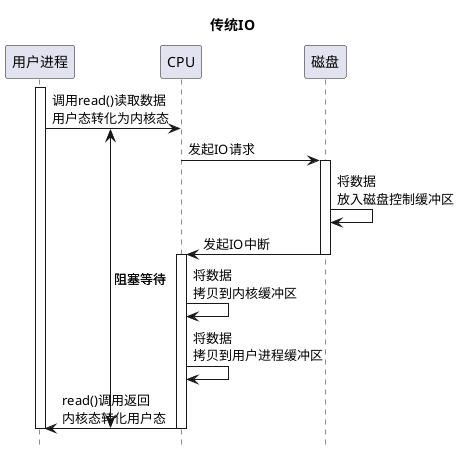
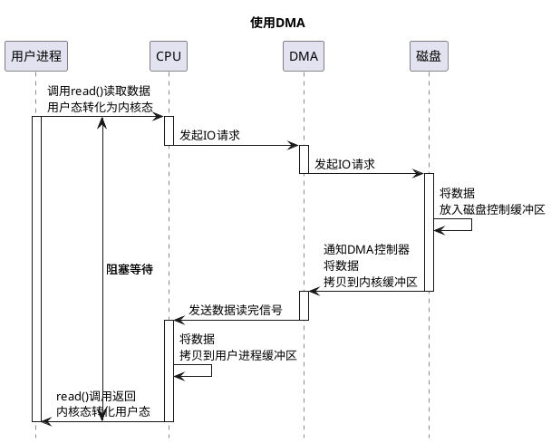

## Cache
### heap manager

### GC
[](https://www.jianshu.com/p/8592ea9a408c)
在JIT编译时，在安全点(safe point)记录栈和寄存器中的引用和对应的位置。
安全点时，才可以GC：方法调用、执行跳转、异常跳转等处。

#### Reference 
```
+--------------------------------------------------------------------------------------------+
|       ReferenceProcessor:CHeapObj                                                          |
|                                                                                            |
|                                                                                            |
|        _disco^eredSoftRefs:   Disco^eredList*                                              |
|        _discoveredWeakRefs:   DiscoveredList*                                              |
|        _discoveredFinalRefs:  DiscoveredList*                                              |
|        _discoveredPhantomRefs:DiscoveredList*                                              |
|                                                                                            |
|                                                                process_discovered_reflist()|
|         process_discovered_references()                                                    |
|                                                                                            |
|         DiscoveredList                                                                     |
|               _len:  size_t                                                                |
|               _head:  oop                                                                  |
|                                                                                            |
|       RefProcPhase1Task  RefProcPhase2Task   RefProcPhase3Task                             |
+--------------------------------------------------------------------------------------------+
|                                                                                            |
|     PSRefProcTaskExecutor:AbstractRefProcTaskExecutor                                      |
|                                                                                            |
|     CMSRefProcTaskExecutor: AbstractRefProcTaskExecutor                                    |
|                                                                                            |
|                                                                                            |
|       GCTaskQueue           PSRefProcTaskProxy                                             |
|                                                                                            |
+--------------------------------------------------------------------------------------------+

```

## 


## io（同步、异步、阻塞、非阻塞）

MMU/MMAP

bio
   InputStream  、OutputStream基于字节操作的 IO
        ByteArray,-StringBuffer,Filter(Buffered,Data,PushBack   ),File,Object,     Piped ,Sequence 
        ByteArray,              Filter(Buffered,Data,PrintStream),File,Object,     Piped                       

    Reader、 Writer基于字符操作的 IO
        CharArray,String,      Buffered,Filter/PushBack ,       InputStream/File ,Piped 
        CharArray,String,      Buffered,Filter          ,       OutputStream/File,Piped,Print 

    File 基于磁盘操作的 IO
    Socket 基于网络操作的 IO

nio jdk1.4

aio jdk7

### Unix 5种I/O模型
```
+---------------+------------------+--------------------------+--------------------+-----------------+
|   blocking IO | nonblocking IO   |    IO multiplexing       |  signal driven IO  | asynchronous IO |
|               |                  | select poll epoll(Linux) |                    |                 |
|  Socket       |           | SocketServer,javaNIO , javaRAF  |                    |    Datagram     |
+----------------------------------------------------------------------------------------------------+   +
|               |                  |                          |                    |                 |   |
|initiate       |  initiate        |   check                  |                    |  initiate       |   |
| |             |  check           |     +                    |                    |                 |   | wait data
| |             |  check           |     |  block             |                    |                 |   |
| |             |  check           |     |                    |                    |                 |   |
| |             |    +             |     v                    |                    |                 |
| | block       |    |  block      |  ready                   |    notification    |                 |   + recvfrom block
| |             |    |             |  initiate                |    initiate        |                 |   |
| |             |    |             |     +                    |         +          |                 |   | copy from kernel
| |             |    |             |     |  block             |         | block    |                 |   | to user
| |             |    |             |     |                    |         |          |                 |   |
| v complete    |    v complete    |     v  complete          |         v complete |  notification   |   +
|               |                  |                          |                    |                 |
+---------------+------------------+--------------------------+--------------------+-----------------+
|               |                  | select    poll   epoll   |                    |                 |
|               |                  | fd-limit   x      x      |                    |                 |
|               |                  | poll-ready √ notify-ready|                    |                 |
+---------------+------------------+--------------------------+--------------------+-----------------+
```

```
+---------+----------------------------------+----------------------+----------------------+
|         | fd-limit      |copy_kernel_user  |  event               |  event handle        |
+-------------------------------------------------------------------+----------------------+
|  select | Polling       |  copy fd         | polling fd structure |  sync handle  fd     |
+-------------------------------------------------------------------+----------------------+
|  poll   | linklist      |  copy fd         | polling fd structure |   sync handle fd     |
+-------------------------------------------------------------------+----------------------+
|  epoll  | epoll_create()|  epoll_ctl()     | epoll_wait()         |   epoll_wait() /1 fd |
+---------+----------------------------------+----------------------+----------------------+

```
docker设置plantumlserver
docker run -d -p 8080:8080 plantuml/plantuml-server:jetty
ctrl+,设置plantumlserver
- BIO 同步阻塞

- 使用DMA


Linux零拷贝指的是 减少CPU拷和写的系统调用，一次系统调用两个上下文切换。
```java
拷贝方式	               CPU拷贝	DMA拷贝	系统调用	上下文切换  应用
传统方式(read + write)	     2	    2	read / write	4
内存映射(mmap + write)    	 1	    2	mmap / write	4       MappedByteBuffer   
sendfile	                1	    2	sendfile    	2      FileChannel.transferTo()
sendfile + DMA gather copy	0	    2	sendfile    	2      //硬件支持，软件无法实现
splice	                    0	    2	splice      	2 

jdk/src/java.base/windows/native/libnio/ch/FileChannelImpl.c
```


```
bio 同步（用户进程等待系统处理完io）阻塞（切换系统态，用户进程阻塞）
select 数组结构，有限制，轮询
poll   链表结构，无文件描述符限制，轮询
epoll 红黑树结构，没有文件描述符限制，有数据加到epoll_event数组
src/java.base/linux/native/libnio/ch/EPoll.c:59:Java_sun_nio_ch_EPoll_create
+---------------------------------------------------------------------------------------+
|      epoll_create(size:int ):int //return epfd                                        |
+---------------------------------------------------------------------------------------+
|      epoll_ctl(epfd:int,op:int,fd:int,event:epoll_event*):int                         |
|                                                                                       |
|                                                                                       |
|      //op             //fd         //event                                            |
|      //EPOLL_CTL_ADD  //socket fd  //poll to event array                              |
|      //EPOLL_CTL_MOD                                                                  |
|      //EPOLL_CTL_DEL                                                                  |
|                                                                                       |
+---------------------------------------------------------------------------------------+
|     epoll_event:struct                                                                |
|       events:__uint32_t                                                               |
|       data  :epoll_data_t                                                             |
|                                                                                       |
|   //events                                                                            |
|   //EPOLLIN  EPOLLOUT EPOLLERR                                                        |
|                                                                                       |
|                                                                                       |
+---------------------------------------------------------------------------------------+
|   int epoll_wait(int epfd,events: epoll_event * , int maxevents, int timeout)         |
|                                                                                       |
+---------------------------------------------------------------------------------------+

```
### Bio 分类
```java

            +--------------------------------------------------------------------------------------------------------------------------+
            |  [InputStream]                                                                                                           |
            |       ByteArrayInputStream   FilterInputStream           FileInputStream               PipedInputStream                  |
            |           buf[]:byte               in:InputStream           fd:FileDescriptor             buffer :byte[]                 |
            |           pos:int                                           channel:FileChannel           readSide:Thread                |
            |           count:int          BufferedInputStream            path:String                   writeSide:Thread               |
            |           mark:int                 :FilterInputStream       closeLock:Object              in:int                         |
            |                                buf[]:byte                                                 out:int                        |
            |                                count:int                                                  connected:boolean              |
            |                                marklimit: int            ObjectInputStream                closedByWriter:boolean         |
            |                                markpos:int                  bin:BlockDataInputStream      closedByReader:boolean         |
            |                                pos:int                      handles:HandleTable           connect(src:PipedOutputStream) |
            |                               getInIfOpen():InputStream     vlist:ValidationList          receive()                      |
            |                                                             enableOverride:bool                                          |
            |                                                                                                                          |
            |                                                                                                                          |
            +--------------------------------------------------------------------------------------------------------------------------+
            | [OutputStream]                                                                                                           |
            |                                                                                        PipedOutputStream                 |
            |                                                                                           sink:PipedInputStream          |
            +--------------------------------------------------------------------------------------------------------------------------+
            | [Reader]                                                                                                                 |
            |     CharArrayReader:Reader   BufferedReader               InputStreamReader            PipedReader                       |
            |         buf:char[]             cb:char[]                      sd:StreamDecoder            buffer:char []                 |
            |         pos:int                in:Reader                                                  connected: boolean             |
            |         count:int              markedChar: int                                            in:int                         |
            |         markedPos:int          markedSkipLF:boolean       FileReader:InputStreamReader    out:int                        |
            |     StringReader               nChars, nextChar:int                                       closedByWriter :boolean        |
            |         str:String             readAheadLimit:int                                         closedByReader:boolean         |
            |         length:int             skipLF:bool                                                 readSide:Thread               |
            |         next:int                                                                           writeSide:Thread              |
            |         mark:int                                                                                                         |
            +--------------------------------------------------------------------------------------------------------------------------+
            | [Writer]                                                                                                                 |
            +--------------------------------------------------------------------------------------------------------------------------+

```

磁盘控制器，块，512字节
    磁盘是基于块存储的硬件设备，一次只能操作固定大小的数据块
    字节数组时，指定的大小为块的2倍数

### NIO中的直接缓存和非直接缓存

 cache 是高速缓存，用于 CPU 和内存之间的缓冲；
buffer是 I/O 缓存，用于内存和硬盘的缓冲。
cache 是加速 读，而 buffer 是缓冲 写

```
+--------------------------------------------------------------------------------------------+
|                                                                                            |
|                                               [Selectors]                                  |
|                                                //window iocp;linux epoll                   |
|                                                                                            |
| [Channel]                                                                                  |
|   Files     FileOutputStream                   SelectableChannel        SinkChannel        |
|    copy()      getChannel():FileChannel                                                    |
|             RandomAccessFile                    SocketChannel           SourceChannel      |
|                getChannel():                                                               |
|             FileChannel                         ServerSocketChannel                        |
|                 transferTo()//sendfile                                                     |
|                 map()                           DatagramChannel                            |
|                 transferFrom()                                                             |
|                 open(path:Path)                                                            |
|                                                                                            |
| [Buffer]                                                                                   |
|             HeapByteBuffer     DirectByteBuffer           MappedByteBuffer//mmap           |
|                                     //non-heap                                             |
+--------------------------------------------------------------------------------------------+


```
selector 不好直接管理socket，使用channel做适配