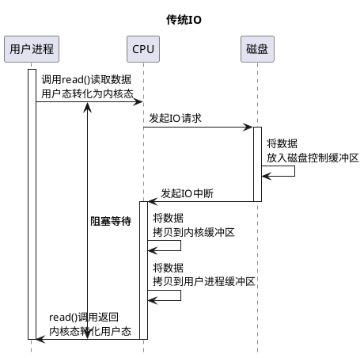
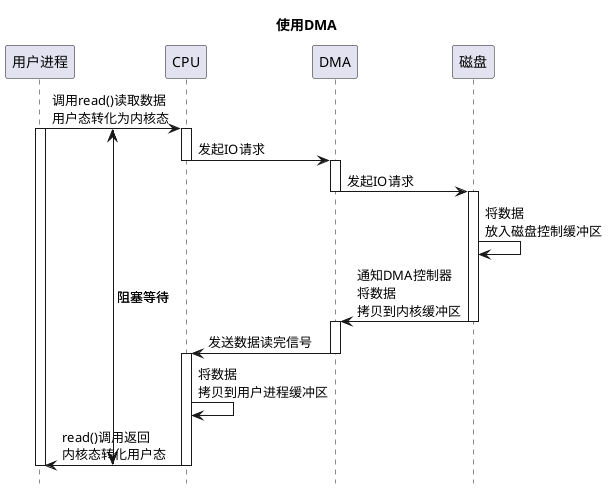

## JVM HotSpot
[类](https://docs.oracle.com/javase/specs/jvms/se7/html/jvms-5.html)
[类加载器（日文）](http://fits.hatenablog.com/entry/2016/05/06/200824)
[OpenJDK备忘录（日文）](http://hsmemo.github.io/index.html)
[jclasslib 查看类结构]()

 
  Java Bytecode Editor 
### OpenJDK地址

1.打开地址 jdk.java.net/java-se-ri/11
2.选择左侧选项
REference Implementation <Java版本号> 

-或者
hg clone http://hg.openjdk.java.net/jdk9/jdk9/
chmod u+x ./get_source.sh
./get_source.sh


3.下载
RI Source Code
The source code of the RI binaries is available under the GPLv2 in a single [zip file](https://download.java.net/openjdk/jdk11/ri/openjdk-11+28_src.zip) (sha256) 178.1 MB.


#### 下载 Oracle jdk 作为编译的jdk
- 下载Oracle jdk
jdk下载地址，搜索 **archive** 
[Oracle jdk](https://link.zhihu.com/?target=http%3A//www.oracle.com/technetwork/java/javase/downloads/java-archive-javase8-2177648.html)

- configure

根据提示安装需要依赖库
sudo apt-get install  libxext-dev libxrender-dev libxtst-dev libxt-dev
sudo apt-get install libcups2-dev
sudo apt-get install libfreetype6-dev
sudo apt-get install ccache

sudo ./configure --with-boot-jdk=/home/anshu/workspace/jdk1.7.0_80


- make
[常见问题](http://www.jackieathome.net/archives/395.html)
```
 ‘check_os_version’ failed


 make时添加参数 DISABLE_HOTSPOT_OS_VERSION_CHECK=ok

```
### JVM编译，加载，执行器执行，内存管理
```
JVM
                                                                          +-------------------------------------------------+
                                                                          |  Thread                                         |
+--------------------------------------------------------------------+    | +--------------+ +-------------+                |
| Structure of JVM          | Run-Time Data Areas                    |    | | Native Method| |  Program    |                |
|                           |                                     +-----> | | Stacks       | |  Couter     |                |
|                           |                                        |    | |              | |  Register   |                |
|                           |                                        |    | +--------------+ +-------------+                |
+-----------+--------------------------------------------------------+    | +---------------------------------------------+ |
|           | Initialization|                                        |    | | JVM Stacks      +-------------------------+ | |
|           +------------------------------+-------------------------+    | |                 | Frame                   | | |
|           |               | Resolution   |                         |    | |                 |   LVT                   | | |
|Continuity |               +--------------+                         |    | |                 |   Operand Stack         | | |
|Complete   | linking       | Preparation  |                         |    | |                 |   Frame Data            | | |
|           |               +--------------+                         |    | |                 |   method  return addr   | | |
|           |               | Verification |                         |    | |                 |   dynamic addr          | | |
|lifetime of+--------------------------------------------------------+    | |                 +-------------------------+ | |
|class      | loaders       |  ClassLoader | Application ClassLoader |    | +---------------------------------------------+ |
|           |               |              | Extension ClassLoader   |    +-------------------------------------------------+
|           |               |              | BootstrapClassLoader    |    | +-------------+     +-------------------------+ |
+-----------+------------------------------+-------------------------+    | | Heap        |     |Method Area              | |
|     class File Format     |                                        |    | |             |     | +-----------------------+ |
+--------------------------------------------------------------------+    | |             |     | | Runtime Constant Pool | |
|     JVM  Instruction Set  |                javap (java bytecode)   |    | +-------------+     | +-----------------------+ |
+--------------------------------------------------------------------+    |                     | | Constant Pool Table   | |
|     Compiling             |                javac                   |    |                     +-------------------------+ |
+---------------------------+----------------------------------------+    +-------------------------------------------------+

                                                                          executor

                                                                          +----------+------+------------+       +---------------+
                                                                          |          |      |collector   |       |               |
                                                                          |          |      |            |       |               |
                                                                          |interpret | jit  |memory alloc|       |    jni        |
                                                                          |          |      |GC          |       |               |
                                                                          +----------+------+------------+       +---------------+

CMS（physical region）/G1（logic region）
                    heap                      method zone
+---------------------+----------------+------------------------+
|                     |                |                        |
|      Eden           |                |                        |
|                     |                |                        |
+-----------+---------+                |                        |
|           |         |                |                        |
|  s0       |   s1    |                |                        |
|           |         |                |                        |
+-----------+---------+----------------+------------------------+

       yuang/new           tunure/old           permanent


-xx:+PrintGCDetials 打印堆空间信息
```


jni方法 通过 宏**DT_RETURN_MARK_DECL** 注册方法
```cpp
DT_RETURN_MARK_DECL(SomeFunc, int);
JNI_ENTRY(int, SomeFunc, ...) int return_value = 0;
DT_RETURN_MARK(SomeFunc, int, (const int&)return_value);
foo(CHECK_0)
return_value = 5;
return return_value;
JNI_END

```

### 编译
 常量传播(constant propagation) 常量折叠(constant folding)


[《Compilers-Principles, Techniques, & Tools》, Second Edition  # 9.4 Constant Propagation ](https://www.slideshare.net/kitocheng/ss-42438227)

静态编译：在编译时确定类型，绑定对象
反射动态编译：运行时确定类型，绑定对象

####  类的相关概念（数据封装，信息结构，复杂数据 - 面向对象）
高级特性：强类型，静态语言，混合型语言（编译，解释）
动态类型语言是指在运行期间才去做数据类型检查的语言，说的是数据类型，动态语言说的是运行是改变结构，说的是代码结构。
强类型语言，一旦一个变量被指定了某个数据类型，如果不经过强制类型转换，那么它就永远是这个数据类型。
静态语言的数据类型是在编译其间确定的或者说运行之前确定的，编写代码的时候要明确确定变量的数据类型。
[oops](https://www.javatpoint.com/java-oops-concepts)
```
---------+---------------------------------------------------------------------------------+
|        |  Design patterns    | SOLID and GRASP guidelines                                |
|        |(cohesion & coupling)|  Gof                                                      |
|        +---------------------------------------------------------------------------------+
|        |  reference variable| this                                                       |
|        +---------------------------------------------------------------------------------+
|        | (memory management)| Variable Method  Block Nested class                        |
|        |     static         |                                                            |
|        +-----------------+--+------------------------------------------------------------+
|        |  Encapsulation  |  package                                                      |
|        |                 |  Access Modifiers                                             |
|        |                 |   member, method, constructor or class                        |
|        +---------------------------------------------------------------------------------+
|        |  Abstraction    |  Abstract class                                               |
|        |                 |  Interface                                                    |
|        +---------------------------------------------------------------------------------+
|        |                 |  +--------------------+  Overloading   Overriding             |
|        |                 |  |final      variable |  Covariant Return Type ,    Super     |
|        |                 |  |           method   |  instance initializer block           |
|        |  Polymorphism   |  |           class    |  Runtime polymorphism, Dynamic Binding|
|        |                 |  +--------------------+  instanceof operator                  |
|        +---------------------------------------------------------------------------------+
|        |  Inheritance    |  Method Overriding                                            |
|        |  ( IS-A )       |  Code Reusability                                             |
|        +---------------------------------------------------------------------------------+
| OOPs   |                 |                              +----------------------------+   |
|        |  Class          | Fields    Methods  Blocks    |             |default       |   |
|        |                 |                              |Constructors |Parameterized |   |
|        |                 | Nested class and interface   +----------------------------+   |
|        +-----------------+---------------------------------------------------------------+
|        |  Object  (data and functions)                                                   |
+--------+---------------------------------------------------------------------------------+
| ooad   |                                                                                 |
+--------+---------------------------------------------------------------------------------+

```


《Effect java》
- Object方法

equals()，hashcode()，toString()
##### [hashcode() 基础知识](https://www.cnblogs.com/mengfanrong/p/4034950.html)
混合hash （MD5）
 
JDK Hash算法
1. Map.hash: Austin Appleby's MurmurHash3

2. String.hashCode
```
public int hashCode() {
    int h = hash;
    if (h == 0 && value.length > 0) {
        char val[] = value;

        for (int i = 0; i < value.length; i++) {
            h = 31 * h + val[i];
        }
        hash = h;
    }
    return h;
}
```

3. Object.hashCode
```
 java -XX:+PrintFlagsFinal -version|grep hashCode

static inline intptr_t get_next_hash(Thread * Self, oop obj) {
}
```

Redis
1. Thomas Wang's 32 bit Mix Function
2. Austin Appleby's MurmurHash2
3. DJB Hash


面向对象的三大特性，五大原则，23个设计模式
- 封装
    1. 枚举类,内部类（静态，成员，局部，匿名）
    2. 自动装箱和拆箱
    3. 日期
- 继承
     1. 抽象类，接口
- 多态 
    1. 继承
    2. 重写
    3. 父类引用指向子类对象
- 重载（面向方法特性）

```

匿名函数接口可以有多个抽象方法，不能有默认方法；lambda实现接口时对应的函数接口只能有一个抽象方法，但是可以有多个默认方法

函数式接口指的是只定义了唯一的抽象方法的接口（除了隐含的Object对象的公共方法）， 因此最开始也就做SAM类型的接口（Single Abstract Method）

```

```java
public enum NumEnum {
 ONE;
 }
public final class NumEnum extends java.lang.Enum<NumEnum> {
  public static final NumEnum ONE;
  public static NumEnum[] values();
  public static NumEnum valueOf(java.lang.String);
  static {};
} 

```
#### APT - 编译时增强，代码编译时处理注解
Dagger2, ButterKnife, EventBus3

##### 2.字节码增强
- 加载时
ASM
cglib
javassist

####  泛型 - 编译时校验
1. 泛型：Generics in Java is similar to templates in C++.
特点：泛型编译时验证；运行时擦除
优点：加强类型安全及减少類转换的次数，提高性能；避免创建类，复用代码
集合容器和网络请求经常用到

泛型是一种多态技术。而多态的核心目的是为了消除重复，隔离变化，提高系统的正交性。
```
+----------------------------------------------------------------------------------------------------------+
|                                                                                                          |
| GenericArrayType            ParameterizedType          TypeVariable            WildcardType         Class|
|   getGenericComponentType()   getActualTypeArguments()  getBounds()              getUpperBounds()        |
|                               getRawType()              getGenericDeclaration()  getLowerBounds()        |
|                               getOwnerType()            getName()                                        |
|                                                         getAnnotatedBounds()                             |
+----------------------------------------------------------------------------------------------------------+
|                                      Type  (reflect)                                                     |
+----------------------------------------------------------------------------------------------------------+

```
```
javax annotation apt/serviceloader
+-------------------------------------------------------------------------+------------------+
|         VariableElement           ExecutableElement:Parameterizable     |                  |
|TypeElement:Parameterizable,QualifiedNameable    TypeParameterElement    |                  |
|                    PackageElement:QualifiedNameable                     |                  |
+-------------------------------------------------------------------------+------------------+
|                        Element                                          | AnnotationMirror |
+-------------------------------------------------------------------------+------------------+
|                        AnnotatedConstruct                                                  |
+--------------------------------------------------------------------------------------------+

```
1. 泛型类（参数化类型ParameterizedType）和泛型接口及其子类
   1. 子类是泛型，必须和父类泛型一致。
   2. 子类不是泛型，父类泛型必须声明泛型的具体类型，默认是Object
   3. 参数化类型获取泛型：ParameterizedType#getActualTypeArguments()
2. 泛型方法：
   调用时设置类型； 支持静态方法
3. 参数化类型变量与通配符 ？（WildcardType）
   extends 上限，约束具体类型必须是某个类及其子类，默认Object。supper 形参下限制
   WildcardType.getUpperBounds()
4. 泛型变量（TypeVariable）与类型擦除
5. 泛型数组（GenericArrayType）
   Array.newInstance(tClass, 2)
   GenericArrayType#
6. 泛型与反射
#### 反射
>计算机程序在运行时（runtime）可以访问、检测和修改它本身状态或行为的一种能力。[](https://zh.wikipedia.org/wiki/%E5%8F%8D%E5%B0%84_(%E8%AE%A1%E7%AE%97%E6%9C%BA%E7%A7%91%E5%AD%A6))

反射机制的优点就是可以实现动态创建对象（动态代理ProxyGenerator#defineClass0(loader, proxyName, proxyClassFile:byte[], 0, proxyClassFile.length)）

RTTI，即Run-Time Type Identification，运行时类型识别。RTTI能在运行时就能够自动识别每个编译时已知的类型。
反射机制就是识别未知类型的对象。
##### 注解 - 元数据访问
**@interface**

Java 8拓宽了注解的应用场景。现在，注解几乎可以使用在任何元素上：局部变量、接口类型、超类和接口实现类，甚至可以用在函数的异常定义上。

##### 内省（Introspector）
内省机制仅指程序在运行时对自身信息（称为元数据）的检测
```java
try {
    BeanInfo beanInfo = Introspector.getBeanInfo(WebSocketTest.class);
    String name = beanInfo.getPropertyDescriptors()[0].getName();
    Method readMethod = beanInfo.getPropertyDescriptors()[0].getReadMethod();
} catch (IntrospectionException e) {
    e.printStackTrace();
}
```

##### 动态代理 - 修改状态或行为
```java
public class Proxy implements java.io.Serializable {
         /**
     * the invocation handler for this proxy instance.
     * @serial
     */
    protected InvocationHandler h;
}

sun.misc.ProxyGenerator#generateProxyClass(java.lang.String, java.lang.Class<?>[], int)//类信息转化为字节数组，在转化为代理Class对象。


```

```java
    static interface Animal{

    }
    static class Dog implements Animal{
        @Override
        public String toString() {
            return "dog tostring()";
        }
    }
    public static void main(String[] args) {
        Dog dog = new Dog();
        Animal proxy = (Animal) Proxy.newProxyInstance(ClassLoader.getSystemClassLoader(), new Class[]{Animal.class}, new InvocationHandler() {
            @Override
            public Object invoke(Object proxyMethodNameLabel, Method method, Object[] args) throws Throwable {
                System.out.println("before");
                Object invoke = method.invoke(dog, args);
                System.out.println(invoke);
                System.out.println("after");
                return invoke;
            }
        });
//        System.out.println(proxy.toString());
        proxy.toString();
        System.out.println();
    }

```

```java
@Retention(RetentionPolicy.RUNTIME)
public @interface A {
}

编译后：

public interface A extends java.lang.annotation.Annotation {
}

```


### 对象分配（创建与内存分配）
####  对象创建的方法
``
1. new（RTTI）
2. clone
3. 反射（Class#newInstance，Constructor#newInstance)：将类型绑定到现有对象，或从现有对象中获取类型。
4. 反序列化：流转换为对象


类创建（类加载，初始化），JMM，栈帧
```java
运行时数据区

        JavaStack  Heap
            ^     ^
            |     |  Method Zone
            |     |     ^     
            |     |     |     cinit/init
            +     +     +     ^   
        Object o = new Object()    +-----------> ProgramCounter//放执行当前指令的地址


      int    i = 0
                 +
                 |
                 v
                 JavaStack


      Object.java
          public final native void notify();
                          +
                          |
                          |
                          |
                          +------------------> nativeStack

```
##### 序列化Serializable
>将数据结构或对象状态转换成可取用格式（例如存成文件，存于缓冲，或经由网络中发送），以留待后续在相同或另一台计算机环境中，能恢复原先状态的过程。[](https://zh.wikipedia.org/wiki/%E5%BA%8F%E5%88%97%E5%8C%96#Java)


字节码分析：序列化后，存储java信息，类信息，字段信息
[透过byte数组简单分析Java序列化、Kryo、ProtoBuf序列化](https://www.cnblogs.com/softlin/archive/2015/07/17/4653168.html)

ObjectInputStream，ObjectOputStream

1. 可以存储磁盘

2. 反射，效率低
3. 产生中间对象，占用内存，可能触发GC


#### 对象访问方式
1. 句柄访问：维护一个句柄池，栈访问句柄池，再访问对象和类信息。这种方法栈维护堆引用稳定
2. 直接指针（Hotspot）：直接访问对象，对象持有类信息
[OOP-KLASS模型](知识体系-程序-java.md)

#### 类加载器与双亲委派模型(Parents Dlegation Mode)
```
                 C++
 +-----------------------+
 | Bootstrap ClassLoader |  <JAVA_HOME>\lib,-Xbootclasspath
 +----------^------------+
            |    java,parentclass=null
 +----------+-----------+
 | Extension ClassLoader|  <JAVA_HOME>\lib\ext,java.ext.dirs
 +----------^-----------+
            |
+-----------+-------------+
| Application ClassLoader | ClassPath
+-----------^-------------+
            |
+-----------+------------+
|   Custom ClassLoader   |
+------------------------+


```

##### 加载，连接（校验，准备，解析），初始化
1.加载：查找并加载Class文件。(五种主动加载)
2.链接：验证、准备、以及解析。
  验证：确保被导入类型的正确性。
  准备：为类的静态字段分配字段，并用默认值初始化这些字段。（heap开辟空间）
  解析：将类型的符号引用转化为直接引用。根据运行时常量池的符号引用来动态决定具体值得过程。（查找接口，父类，其他符号）
3.初始化：将类变量初始化为正确初始值。
```java
dx --dex --output=Hello.dex Hello.class

javap -c  Hello.class

javap –verbose Hello.class 可以看到更加清楚的信息

[在线查看java字节码](https://javap.yawk.at/)
```
[**Jasmin**](http://jasmin.sourceforge.net/guide.html) 是一种免费的开源的 JAVA 汇编器 ，它将使用**Java虚拟机指令集**以人类容易阅读方式编写的类汇编语法文件编译成class文件，注意jasmin并不是Java语言的汇编器。
[Dalvik寄存器指令](http://pallergabor.uw.hu/androidblog/dalvik_opcodes.html)，有64k个寄存器，只用到前256个
 smali - An assembler/disassembler for Android's dex format

[ **初始化**](https://blog.csdn.net/sujz12345/article/details/52590095/)
 ```
<clinit>与 <init>对象和类字段初始化

1. 父类静态变量/语句块 （代码顺序执行）
3. 子类静态变量/语句块 
5. 父类变量/语句块 
7. 父类构造函数 
8. 子类变量/语句块 
10. 子类构造函数
 ```


##### JVM 内存分区
OOP-KLASS模型

[jol查看内存结构](http://hg.openjdk.java.net/code-tools/jol/file/tip/jol-samples/src/main/java/org/openjdk/jol/samples/)
- 数组 
  
Arrays.sort 双轴快排算法（包含归并排序算法，经典快速排序算法，插入排序算法混用，及**jdk 1.7**废弃掉的归并排序和插入排序混用）

```java
数组
                        ObjectHeader64Coops
          +-            +------------------------+
          |             |     Mark Word          |   8Byte
Header    |             +------------------------+
          |             |     Klass Pointer      |   4Byte
          ++            +------------------------+
                        |     Array Length       |   4Byte
                        +------------------------+
                        |                        |   //基本数据类型或每个对象的引用
                        +------------------------+
                        |                        |   //基本数据类型或每个对象的引用
                        +------------------------+

字符串32位
java.lang.String object internals:
 OFFSET  SIZE     TYPE DESCRIPTION                               VALUE
      0     4          (object header)                           01 00 00 00 (00000001 00000000 00000000 00000000) (1)
      4     4          (object header)                           00 00 00 00 (00000000 00000000 00000000 00000000) (0)
      8     4   char[] String.value                              [我, 4]
     12     4      int String.hash                               0
     16     8          (loss due to the next object alignment)
Instance size: 24 bytes
Space losses: 0 bytes internal + 8 bytes external = 8 bytes total
```

- [类的内存大小](https://segmentfault.com/a/1190000007183623)

```java
                        ObjectHeader64Coops
          +-            +------------------------+
          |             |     Mark Word          |   8Byte
Header    |             +------------------------+
          |             |     Klass Pointer      |   4Byte
          ++            +------------------------+
                        |                        |
                        +------------------------+
                        |                        |
                        +------------------------+


```

[内存占用查看工具](https://segmentfault.com/a/1190000007183623)

以下是 64bit电脑，打印的信息。markword 8bytes,
```java
edu.ptu.java.lib.RefType object internals:
 OFFSET  SIZE   TYPE DESCRIPTION                               VALUE
      0    12        (object header)                           N/A
     12     4        (loss due to the next object alignment)
Instance size: 16 bytes
Space losses: 0 bytes internal + 4 bytes external = 4 bytes total

16
Footprint{Objects=1, References=0, Primitives=[]}
```

[ObjectHeader64Coops 内存结构](https://gist.github.com/arturmkrtchyan/43d6135e8a15798cc46c)
```java
ObjectHeader32
|----------------------------------------------------------------------------------------|--------------------|
|                                    Object Header (64 bits)                             |        State       |
|-------------------------------------------------------|--------------------------------|--------------------|
|                  Mark Word (32 bits)                  |      Klass Word (32 bits)      |                    |
|-------------------------------------------------------|--------------------------------|--------------------|
| identity_hashcode:25 | age:4 | biased_lock:1 | lock:2 |      OOP to metadata object    |       Normal       |
|-------------------------------------------------------|--------------------------------|--------------------|
|  thread:23 | epoch:2 | age:4 | biased_lock:1 | lock:2 |      OOP to metadata object    |       Biased       |
|-------------------------------------------------------|--------------------------------|--------------------|
|               ptr_to_lock_record:30          | lock:2 |      OOP to metadata object    | Lightweight Locked |
|-------------------------------------------------------|--------------------------------|--------------------|
|               ptr_to_heavyweight_monitor:30  | lock:2 |      OOP to metadata object    | Heavyweight Locked |
|-------------------------------------------------------|--------------------------------|--------------------|
|                                              | lock:2 |      OOP to metadata object    |    Marked for GC   |
|-------------------------------------------------------|--------------------------------|--------------------|

 
```
- 字符串

```java

java.lang.String object internals:
 OFFSET  SIZE     TYPE DESCRIPTION                               VALUE
      0    12          (object header)                           N/A
     12     4   char[] String.value                              N/A
     16     4      int String.hash                               N/A
     20     4          (loss due to the next object alignment)
Instance size: 24 bytes
Space losses: 0 bytes internal + 4 bytes external = 4 bytes total


----------------------------------

java.lang.String object internals:
 OFFSET  SIZE     TYPE DESCRIPTION                               VALUE
      0     4          (object header)                           01 00 00 00 (00000001 00000000 00000000 00000000) (1)
      4     4          (object header)                           00 00 00 00 (00000000 00000000 00000000 00000000) (0)
      8     4          (object header)                           c2 02 00 f8 (11000010 00000010 00000000 11111000) (-134217022)
     12     4   char[] String.value                              [a]
     16     4      int String.hash                               0
     20     4          (loss due to the next object alignment)
Instance size: 24 bytes
Space losses: 0 bytes internal + 4 bytes external = 4 bytes total

```
##### 内存模型
[](知识体系-程序-java-throughput.md)
### 执行器（JIT与hotspot）
##### Class文件格式及指令
[jvms Instruction Set ](https://docs.oracle.com/javase/specs/jvms/se11/html/jvms-2.html#jvms-2.11)
[jvms Instruction Set ](https://docs.oracle.com/javase/specs/jvms/se11/html/jvms-6.html)
``` bytecode instruction operator
+-----------------+---------------------------------------+
|  misc           | athrow   monitorenter,monitorexit     |
+---------------------------------------------------------+
|                 |-load_<n>  -store_<slot>               |lvt -> OperandStack; lvt <- OperandStack
|  stack operator |-const_<num>  -push  -ldc              |constant ->OperandStack     
|                 | -pop   dup                            |OperandStack     
+---------------------------------------------------------+
|  type conversion|  i2b, i2c,f2i                         |
+----------------------------+----------------------------+
|  object operator|    field |  getstatic  putstatic      |
|                 |          |  getfield   putfield       |
|                 +---------------------------------------+
|                 |    invoke|invokevirtual invokestatic  |
|  Creation       |    method|invokeinterface invokespecial|
|    &            |          |invokedynamic               |
| Manipulation    +---------------------------------------+
|                 |    method|  ireturn  lreturn   freturn|
|                 |    return|  dreturn   areturn         |
|                 +---------------------------------------+
|                 | object   |  new  newarray anewarray   |
|                 |          |           multianewarray   |
|                 |          |  -aload   -astore          |
|                 |          |  arraylength               |
|                 |          |  instanceof  checkcast     |
+----------------------------+----------------------------+
|  decision       |          ifeq,iflt,ifnull,ifnonnull   |
|                 |          tableswitch,lookupswitch     |
|                 |          goto,goto_w,jsr,jsr_w,ret    |
+---------------------------------------------------------+
|  alth           | -add -sub -mul -div -rem -neg         |
|                 |  -shl,-shr，-ushl,-ushr  iinc         |
|                 |  -or,-and , -xor                      |
|                 |  -cmpg,-cmpl,-cmp                     |
+-----------------+---------------------------------------+
-代表类型
+--------------------------------------------------------------+
|opcode| byte| short| int| long| float| double|char| reference |
+--------------------------------------------------------------+
|      | b   | s    | i  | l   | f    | d     |c   | a         |
+------+-----+------+----+-----+------+------------+-----------+

```
**Jasmin** 是一种免费的开源的 JAVA 汇编器 ，它将使用Java虚拟机指令集以人类容易阅读方式编写的类汇编语法文件编译成class文件，注意jasmin并不是Java语言的汇编器。
 
#### 执行器与JNI
> [知识体系-C&CPP程序.md](./知识体系-C&CPP程序.md)
##### jni注册本地方法的两种方式
1. 动态注册
```
+-------------------------------------------------------------------------------------------+
|                                      add();//invokevirtual #7   // Method add:()I         |
+-------------------------------------------------------------------------------------------+
|                               public native int add();                                    |
+-------------------------------------------------------------------------------------------+
| [jni]                          System                                                     |
|                                    loadLibrary()                                          |
|                                JNI_OnLoad()                                               |
|                                                                                           |
|                                JavaEnv                                                    |
|                                    RegisterNatives()                                      |
+-------------------------------------------------------------------------------------------+
```
2. JNI签名
**JNICALL**表示调用约定，相当于C++的stdcall，说明调用的是本地方法
**JNIEXPORT**表示函数的链接方式，当程序执行的时候从本地库文件中找函数
```java
import java.lang.String;
public class A{ 
   public native void m1();
   public native void m2(String s);
   public native String m3(String s);
   public native String m3(String s,String s1);
   public native String m3(String s,String[] s1);
   public native String[] m4(String s,String[] s1);
}

>javah -jni A
```
```c++
/*
 * Class:     A
 * Method:    m1
 * Signature: ()V
 */
JNIEXPORT void JNICALL Java_A_m1
  (JNIEnv *, jobject);

/*
 * Class:     A
 * Method:    m2
 * Signature: (Ljava/lang/String;)V
 */
JNIEXPORT void JNICALL Java_A_m2
  (JNIEnv *, jobject, jstring);

/*
 * Class:     A
 * Method:    m3
 * Signature: (Ljava/lang/String;)Ljava/lang/String;
 */
JNIEXPORT jstring JNICALL Java_A_m3__Ljava_lang_String_2
  (JNIEnv *, jobject, jstring);

/*
 * Class:     A
 * Method:    m3
 * Signature: (Ljava/lang/String;Ljava/lang/String;)Ljava/lang/String;
 */
JNIEXPORT jstring JNICALL Java_A_m3__Ljava_lang_String_2Ljava_lang_String_2
  (JNIEnv *, jobject, jstring, jstring);

/*
 * Class:     A
 * Method:    m3
 * Signature: (Ljava/lang/String;[Ljava/lang/String;)Ljava/lang/String;
 */
JNIEXPORT jstring JNICALL Java_A_m3__Ljava_lang_String_2_3Ljava_lang_String_2
  (JNIEnv *, jobject, jstring, jobjectArray);

/*
 * Class:     A
 * Method:    m4
 * Signature: (Ljava/lang/String;[Ljava/lang/String;)[Ljava/lang/String;
 */
JNIEXPORT jobjectArray JNICALL Java_A_m4
  (JNIEnv *, jobject, jstring, jobjectArray);


extern "C" JNIEXPORT jstring JNICALL
Java_edu_ptu_java_myapplication_MainActivity_stringFromJNI(
        JNIEnv* env,
        jobject /* this */) 
```
####### 数据类型定义：
[JNI Types and Data Structures](https://docs.oracle.com/javase/7/docs/technotes/guides/jni/spec/types.html#wp9502)
- jdk/src/share/javavm/export/jni.h:

```
+----------------------------------------------------------------------------+
| Primitive Types                                                            |
|                                                                            |
|     Java Type    Native Type     Description                               | Type Signatures
|                                                                            |
|     boolean      jboolean        unsigned 8 bits      #define JNI_FALSE  0 |z
|                                                       #define JNI_TRUE   1 |
|     byte         jbyte           signed 8 bits                             |b
|     char         jchar           unsigned 16 bits                          |c
|     short        jshort          signed 16 bits                            |x
|     int          jint            signed 32 bits                            |i
|     long         jlong           signed 64 bits                            |j
|     float        jfloat          32 bits                                   |f
|     double       jdouble         64 bits                                   |d
|     void         void            N/A                                       |
+----------------------------------------------------------------------------+//other
|  Reference Types                                                           |
|     jobject                                                                |L fully-qualified-class ; fully-qualified-class
|         jclass                                                             |
|         jstring                                                            |
|         jarray                                                             |[ type type[]
|              jobjectArray                                                  |
|              jbooleanArray                                                 |
|              jbyteArray                                                    |
|              jshortArray                                                   |
|              jcharArray                                                    |
|              jintArray                                                     |
|              jlongArray                                                    |
|              jfloatArray                                                   |
|              jdoubleArray                                                  |
|         jthrowable                                                         |
+----------------------------------------------------------------------------+( arg-types ) ret-type method type


```


[jni methods](https://docs.oracle.com/javase/7/docs/technotes/guides/jni/spec/functions.html)
```
JavaVM *jvm;       /* denotes a Java VM */
JNIEnv *env;       /* pointer to native method interface */ 当前线程有效
(*env)->GetFieldID
+---------------------------------------------------------------------+-------------------------------------------------------------------------------------------+
|  Weak Global   jweak NewWeakGlobalRef(JNIEnv *env, jobject obj);    |                                                                                           |
|  References    void DeleteWeakGlobalRef(JNIEnv *env, jweak obj);    |   Java VM Interface   GetJavaVM                                                           |
|                                                                     |   Reflection Support  FromReflectedMethod     FromReflectedField                          |
+---------------------------------------------------------------------+                                                                                           |
|               jobject NewGlobalRef(JNIEn^ *en^, jobject obj);       |                       ToReflectedMethod       ToReflectedField                            |
|               void DeleteGlobalRef(JNIEnv *env, jobject globalRef); |                                                                                           |
|                                                                     |                                                                                           |
|  Global\      void DeleteLocalRef(JNIEnv *en^, jobject localRef);   |  NIO Support         NewDirectByteBuffer    GetDirectBufferAddress                        |
| Local         jint EnsureLocalCapacity(JNIEnv *env, jint capacity); |                      GetDirectBufferCapacity                                              |
| References    jint PushLocalFrame(JNIEnv *env, jint capacity);      |                                                                                           |
|               jobject PopLocalFrame(JNIEnv *env, jobject result);   |  Monitor             MonitorEnter           MonitorExit                                   |
|               jobject NewLocalRef(JNIEnv *env, jobject ref);        |                                                                                           |
|                                                                     |  Registering        RegisterNatives        UnregisterNatives                              |
+---------------------------------------------------------------------+  Native Methods                                                                           |
| Exceptions     ExceptionClear         Throw         ThrowNew        |                                                                                           |
|                FatalError             ExceptionOccurred             |                    GetArrayLength            Get<PrimitiveType>ArrayElements Routines     |
|                ExceptionCheck         ExceptionDescribe             |  Array Operations  SetObjectArrayElement                                                  |
|                                                                     |                    NewObjectArray            Release<PrimitiveType>ArrayElements Routines |
+---------------------------------------------------------------------+                    GetObjectArrayElement                                                  |
| Accessing          GetFieldID                                       |                    GetPrimitiveArrayCritical      Get<PrimitiveType>ArrayRegion Routines  |
| Fields of Objects  Get^type^Field Routines  Set^type^Field Routines |                    ReleasePrimitiveArrayCritical                                          |
+---------------------------------------------------------------------+                                                   Set<PrimitiveType>ArrayRegion Routines  |
|  Object        GetObjectClass            AllocObject                |                    New<PrimitiveType>Array Routines                                       |
|  Operations    GetObjectRefType          NewObject                  |                                                                                           |
|                IsInstanceOf              NewObjectA                 |                     GetStaticMethodID                CallStatic<type>Method Routines      |
|                IsSameObject              NewObjectV                 |  Calling                                                                                  |
+---------------------------------------------------------------------+  Static Methods     SetStatic<type>Field Routines    CallStatic<type>MethodA Routines     |
|                                                                     |                                                                                           |
|               GetMethodID      Call<type>Method Routines            |                                                      CallStatic<type>MethodV Routines     |
|                               CallNonvirtual<type>Method Routines   |                                                                                           |
| Calling                       CallNonvirtual<type>MethodA Routines  |  Accessing           GetStaticFieldID      GetStatic<type>Field Routines                  |
| Instance                                                            |  Static Fields                                                                            |
|  Methods                      CallNonvirtual<type>MethodV Routines  |                      NewStringUTF                                                         |
|                               Call<type>MethodA Routines            |                      GetStringUTFLength         GetStringRegion                           |
|                                         Call<type>MethodV Routines  |                      GetStringUTFChars                                                    |
|                                                                     |   String             ReleaseStringUTFChars      GetStringUTFRegion                        |
|               jclass DefineClass                                    |   Operations                                                                              |
| Class         jclass FindClass(JNIEnv *env, const char *name);      |                      NewString                  GetStringCritical                         |
| Operations    jclass GetSuperclass(JNIEnv *en^, jclass clazz);      |                      GetStringLength            ReleaseStringCritical                     |
|               jboolean IsAssignableFrom                             |                      GetStringChars                                                       |
| Version                                                             |                      ReleaseStringChars                                                   |
| Information   jint GetVersion(JNIEn^ *en^);                         |                                                                                           |
+---------------------------------------------------------------------+-------------------------------------------------------------------------------------------+

```

##### 引用
局部引用、全局引用、弱全局引用

[](https://docs.oracle.com/javase/7/docs/technotes/guides/jni/spec/functions.html)
弱全局引用是一种特殊的全局引用。

[](https://docs.oracle.com/javase/8/docs/technotes/guides/jni/spec/design.html)
## 内存管理

- oop-klass模型
- JMM模型
- Unix 5种I/O模型

### heap manager
分配内存：指针碰撞，空闲列表

### 垃圾回收（GC）
[](https://www.jianshu.com/p/8592ea9a408c)
在JIT编译时，在安全点(safe point)记录栈和寄存器中的引用和对应的位置。
安全点时，才可以GC：方法调用、执行跳转、异常跳转等处。
#### 可达性分析
  JVM可回收对象判定方法 : 标记根节点+对象回收判定(可达性分析算法&对象引用) 

#### GC Roots
[mat gc root](https://www.cnblogs.com/set-cookie/p/11069748.html)

GC Roots 的对象包括下面几种： 
1. 虚拟机栈（栈帧中的本地变量表）中引用的对象
2. 方法区中类静态属性引用的对象
3. 方法区中常量引用的对象
4. 本地方法栈中 JNI （即一般说的 Native 方法）引用的对象
 

#### 引用数据类型回收
##### 垃圾收集器
[Java版本歷史](https://zh.wikipedia.org/wiki/Java%E7%89%88%E6%9C%AC%E6%AD%B7%E5%8F%B2)
2009年05月28日，Java SE 6 Update 14发布。G1（Garbage First）低暂停的垃圾回收器的支持。Java 9 成为默认的垃圾回收器
2018年09月25日，发布JDK 11，添加ZGC（一个可扩展的低延迟垃圾收集器）
2020年05月17日 ，移除CMS垃圾回收器

    新生代
        Serial，ParNew, Paralle Scavenge
    老年代
        Serial Old，Paralle Old，CMS(这三个都是老年代)
    G1

##### 垃圾回收算法
   标记-清除算法(mark-sweep), dalvikvm；标记可达对象，线性扫描堆，回收不可达对象
        x遍历两遍，效率不高；STW 体验不好；碎片化。
        x空闲列表分配内存
   复制算法(copying)  hotspot：分配两个内存，每次使用一块，赋值存活对象，到另一块。交替两块内存区间的角色
        没有标记清除遍历两遍，相对高效；
        指针碰撞分配对象
        x浪费一个空闲空间
        x引用对象需要调整
   标记-压缩算法(mark-compact),
        标记清除增加一个压缩过程，碎片整理
        指针碰撞分配对象
   分代收集算法（Generational Collection）
        朝生夕死，复制算法，存活率较高，标记清除或标记整理

>《Inside the Java Virtual Machine》 ,Wiley (1996)《Garbage Collection- Algorithms for Automatic Dynamic Memory Management》 
JVM给了三种选择收集器：串行收集器、并行收集器、并发收集器

[垃圾回收概念Thread，Root Set of References，Reachable and Unreachable Objects，garbage collection](https://www.javarticles.com/2016/09/java-garbage-collector-reachable-and-unreachable-objects.html)

```

+----------+-----------+----------------+---------------------------+
|(generation collection)Minor GC/Full GC                            |
+----------+-----------+----------------+---------------------------+
|safepoint/Safe Region                                              |
+----------+-----------+----------------+---------------------------+
|          |           | G1             |                           |
|          | concurrent| CMS            |                           |
|          +----------------------------+                           |
|          | parallel                   |                           |
|Collector +----------------------------+                           |
|          | ParallelOld                |                           |
|          +----------------------------+                           |
|          | Serial                     |                           |
+-------------------------------------------------------------------+
|Collection| mark-compact               |  reference counting       |
|Algorithms| copying                    |                           |
|          | mark-sweep                 |                           |
+-------------------------------------------------------------------+
| Garbage  |Reachability Analysis(java) |  Reference Counting       |
|          | GC Roots Tracing           |  (objc,Python)            |
+----------+----------------------------+---------------------------+

Generational Collection
+---------------------------------------------------------------------+
|  new gen       copying        copying           copying             |
| (Minor GC)     +--------+    +--------+     +------------------+    |
|                | Serial |    | ParNew |     | Parallel Scavenge|    |
|                +--+--+--+    +--+-+---+     +-----+----+-------+    |
|                   |  |          | |               |    |            |
|                +--+  +-----+    | |   +-----------+    |            |
|                |           |    | |   |                |    +-----+ |
+---------------- ----------- ---- - --- ---------------- ----+ G1  +-| mark-compact+copying
| old gen        | +---------+----+ |   |                |    +-----+ |
|                | |         |      |   |                |            |
|            +---+-+        ++------+---+--+    +--------+-----+      |
|            | CMS +--------+ Parallel Old |    | Serial Old   |      |
|            +-----+        +--------------+    +--------------+      |
|          mark-compact        mark-compact       mark-compact        |
+---------------------------------------------------------------------+
| Permanet Generation                                                 |
+---------------------------------------------------------------------+
并行（Parallel）：指多条垃圾收集线程并行工作，但此时用户线程仍然处于等待状态。
并发（Concurrent）：指用户线程与垃圾收集线程同时执行（但不一定是并行的，可能会交替执行），用户程序在继续运行。而垃圾收集程序运行在另一个CPU上。
```
Reference Counting：难解决对象之间循环引用的问题

[“长时间执行”](https://crowhawk.github.io/2017/08/10/jvm_2/)的最明显特征就是指令序列复用;
例如方法调用、循环跳转、异常跳转等，所以具有这些功能的指令才会产生Safepoint。
在GC发生时让所有线程（这里不包括执行JNI调用的线程）都“跑”到最近的安全点上再停顿下来。
**安全区域**是指在一段代码片段之中，引用关系不会发生变化。在这个区域中的任意地方开始GC都是安全的。

[HotSpot 虚拟机](http://openjdk.java.net/groups/hotspot/docs/HotSpotGlossary.html)
[官方文档 Hotspot](https://openjdk.java.net/groups/hotspot/docs/RuntimeOverview.html)


Generational Collection（分代收集）算法
  1. 新生代都采取Copying算法
  2. 老年代的特点是每次回收都只回收少量对象，一般使用的是Mark-Compact算法
  3. 永久代（Permanet Generation），它用来存储class类、常量、方法描述等。对永久代的回收主要回收两部分内容：废弃常量和无用的类。


《如何监控Java GC》中已经介绍过了jstat

JVM性能调优监控工具jps、jstack、jmap、jhat、jstat、hprof


#### Reference 
##### WeakHashMap

```
+--------------------------------------------------------------------------------------------+
|       ReferenceProcessor:CHeapObj                                                          |
|                                                                                            |
|                                                                                            |
|        _disco^eredSoftRefs:   Disco^eredList*                                              |
|        _discoveredWeakRefs:   DiscoveredList*                                              |
|        _discoveredFinalRefs:  DiscoveredList*                                              |
|        _discoveredPhantomRefs:DiscoveredList*                                              |
|                                                                                            |
|                                                                process_discovered_reflist()|
|         process_discovered_references()                                                    |
|                                                                                            |
|         DiscoveredList                                                                     |
|               _len:  size_t                                                                |
|               _head:  oop                                                                  |
|                                                                                            |
|       RefProcPhase1Task  RefProcPhase2Task   RefProcPhase3Task                             |
+--------------------------------------------------------------------------------------------+
|                                                                                            |
|     PSRefProcTaskExecutor:AbstractRefProcTaskExecutor                                      |
|                                                                                            |
|     CMSRefProcTaskExecutor: AbstractRefProcTaskExecutor                                    |
|                                                                                            |
|                                                                                            |
|       GCTaskQueue           PSRefProcTaskProxy                                             |
|                                                                                            |
+--------------------------------------------------------------------------------------------+

```
 softwareReference，内存不够的时候回收
    保存注解，反射信息
 弱引用，没有被引用，GC发现即回收
    Glide以及缓存；Activity内存管理；weakHashMap；值动画WeakReference
 虚引用    堆外内存管理，FinalizableReferenceQueue
 
#### 永久代的垃圾收集
永久代的垃圾收集主要回收两部分内容：废弃常量和无用的类
## ⭐ 删除是最糟糕的体验
## io（同步、异步、阻塞、非阻塞）

MMU/MMAP

bio（面向流，阻塞）
输入             内存             文件(各种数据交换格式)   网络                 成对       优化
    字节输入
                ByteArray        File/Object             Socket                Piped     Filter(Buffered,Data,PushBack)   
                System.in 
    字符输入
                CharArray        File                                         Piped        
                String                                                    
                         
输出
    字节输出
                                                                                          Filter(PrintStream/System.out)
    字符输出 
                                                                                          PrintWriter（封装PrintStream）
new io jdk1.4(面向缓存Buffer，非阻塞Selector)
                                RandomAccessFile        ServerSocketChannel  pipe.sink()
                                /FileChannel            DatagramChannel       pipe.source()
                                Path/Files               
aio(jdk7加入nio)
                             AsynchronousChannel/
                             CompletionHandler
### Unix 5种I/O模型
```
+---------------+------------------+--------------------------+--------------------+-----------------+
|   blocking IO | nonblocking IO   |    IO multiplexing       |  signal driven IO  | asynchronous IO |
|               |                  | select poll epoll(Linux) |                    |                 |
|  Socket       |           | SocketServer,javaNIO , javaRAF  |                    |    Datagram     |
+----------------------------------------------------------------------------------------------------+   +
|               |                  |                          |                    |                 |   |
|initiate       |  initiate        |   check                  |                    |  initiate       |   |
| |             |  check           |     +                    |                    |                 |   | wait data
| |             |  check           |     |  block             |                    |                 |   |
| |             |  check           |     |                    |                    |                 |   |
| |             |    +             |     v                    |                    |                 |
| | block       |    |  block      |  ready                   |    notification    |                 |   + recvfrom block
| |             |    |             |  initiate                |    initiate        |                 |   |
| |             |    |             |     +                    |         +          |                 |   | copy from kernel
| |             |    |             |     |  block             |         | block    |                 |   | to user
| |             |    |             |     |                    |         |          |                 |   |
| v complete    |    v complete    |     v  complete          |         v complete |  notification   |   +
|               |                  |                          |                    |                 |
+---------------+------------------+--------------------------+--------------------+-----------------+
|               |                  | select    poll   epoll   |                    |                 |
|               |                  | fd-limit   x      x      |                    |                 |
|               |                  | poll-ready √ notify-ready|                    |                 |
+---------------+------------------+--------------------------+--------------------+-----------------+
```

```
+---------+----------------------------------+----------------------+----------------------+
|         | fd-limit      |copy_kernel_user  |  event               |  event handle        |
+-------------------------------------------------------------------+----------------------+
|  select | Polling       |  copy fd         | polling fd structure |  sync handle  fd     |
+-------------------------------------------------------------------+----------------------+
|  poll   | linklist      |  copy fd         | polling fd structure |   sync handle fd     |
+-------------------------------------------------------------------+----------------------+
|  epoll  | epoll_create()|  epoll_ctl()     | epoll_wait()         |   epoll_wait() /1 fd |
+---------+----------------------------------+----------------------+----------------------+

```
docker设置plantumlserver
docker run -d -p 8080:8080 plantuml/plantuml-server:jetty
ctrl+,设置plantumlserver
- BIO 同步阻塞

- 使用DMA


Linux零拷贝指的是 减少CPU拷和写的系统调用，一次系统调用两个上下文切换。
```java
拷贝方式	               CPU拷贝	DMA拷贝	系统调用	上下文切换  应用
传统方式(read + write)	     2	    2	read / write	4
内存映射(mmap + write)    	 1	    2	mmap / write	4       MappedByteBuffer   
sendfile	                1	    2	sendfile    	2      FileChannel.transferTo()
sendfile + DMA gather copy	0	    2	sendfile    	2      //硬件支持，软件无法实现
splice	                    0	    2	splice      	2 

jdk/src/java.base/windows/native/libnio/ch/FileChannelImpl.c
```


```
bio 同步（用户进程等待系统处理完io）阻塞（切换系统态，用户进程阻塞）
select 数组结构，有限制，轮询
poll   链表结构，无文件描述符限制，轮询
epoll 红黑树结构，没有文件描述符限制，有数据加到epoll_event数组
src/java.base/linux/native/libnio/ch/EPoll.c:59:Java_sun_nio_ch_EPoll_create
+---------------------------------------------------------------------------------------+
|      epoll_create(size:int ):int //return epfd                                        |
+---------------------------------------------------------------------------------------+
|      epoll_ctl(epfd:int,op:int,fd:int,event:epoll_event*):int                         |
|                                                                                       |
|                                                                                       |
|      //op             //fd         //event                                            |
|      //EPOLL_CTL_ADD  //socket fd  //poll to event array                              |
|      //EPOLL_CTL_MOD                                                                  |
|      //EPOLL_CTL_DEL                                                                  |
|                                                                                       |
+---------------------------------------------------------------------------------------+
|     epoll_event:struct                                                                |
|       events:__uint32_t                                                               |
|       data  :epoll_data_t                                                             |
|                                                                                       |
|   //events                                                                            |
|   //EPOLLIN  EPOLLOUT EPOLLERR                                                        |
|                                                                                       |
|                                                                                       |
+---------------------------------------------------------------------------------------+
|   int epoll_wait(int epfd,events: epoll_event * , int maxevents, int timeout)         |
|                                                                                       |
+---------------------------------------------------------------------------------------+

```
### Bio 分类
```java

            +--------------------------------------------------------------------------------------------------------------------------+
            |  [InputStream]                                                                                                           |
            |   ByteArrayInputStream       FilterInputStream           FileInputStream               PipedInputStream                  |
            |      buf[]:byte                in:InputStream               fd:FileDescriptor             buffer :byte[]                 |
            |      pos:int                                                channel:FileChannel           readSide:Thread                |
            |      count:int               BufferedInputStream            path:String                   writeSide:Thread               |
            |      mark:int                      :FilterInputStream       closeLock:Object              in:int                         |
            |                                buf[]:byte                                                 out:int                        |
            |                                count:int                 SocketInputStream                connected:boolean              |
            |   ObjectInputStream            marklimit: int                                             closedByWriter:boolean         |
            |     bin:BlockDataInputStream   markpos:int                                                closedByReader:boolean         |
            |     handles:HandleTable        pos:int                                                    connect(src:PipedOutputStream) |
            |     vlist:ValidationList       getInIfOpen():InputStream                                  receive()                      |
            |     enableOverride:bool                                                                                                  |
            |                               Gzip,Base64,Chiper...                                                                      |
            |                                                                                                                          |
            +--------------------------------------------------------------------------------------------------------------------------+
            | [OutputStream]                                                                                                           |
            |                                                                                        PipedOutputStream                 |
            |                                                                                           sink:PipedInputStream          |
            +--------------------------------------------------------------------------------------------------------------------------+
            | [Reader]                                                                                                                 |
            |     CharArrayReader:Reader   BufferedReader               InputStreamReader            PipedReader                       |
            |         buf:char[]             cb:char[]                      sd:StreamDecoder            buffer:char []                 |
            |         pos:int                in:Reader                                                  connected: boolean             |
            |         count:int              markedChar: int                                            in:int                         |
            |         markedPos:int          markedSkipLF:boolean       FileReader:InputStreamReader    out:int                        |
            |     StringReader               nChars, nextChar:int                                       closedByWriter :boolean        |
            |         str:String             readAheadLimit:int                                         closedByReader:boolean         |
            |         length:int             skipLF:bool                                                 readSide:Thread               |
            |         next:int                                                                           writeSide:Thread              |
            |         mark:int                                                                                                         |
            +--------------------------------------------------------------------------------------------------------------------------+
            | [Writer]                                                                                                                 |
            +--------------------------------------------------------------------------------------------------------------------------+

```

磁盘控制器，块，512字节
    磁盘是基于块存储的硬件设备，一次只能操作固定大小的数据块
    字节数组时，指定的大小为块的2倍数

### NIO中的直接缓存和非直接缓存

cache 是高速缓存，用于 CPU 和内存之间的缓冲；
buffer是 I/O 缓存，用于内存和硬盘的缓冲。
cache 是加速 读，而 buffer 是缓冲 写

```
+--------------------------------------------------------------------------------------------+
|                                                                                            |
|                                               [Selectors]                                  |
|                                                //window iocp;linux epoll                   |
|                                                                                            |
| [Channel]                                                                                  |
|   Files     FileOutputStream                   SelectableChannel        SinkChannel        |
|    copy()      getChannel():FileChannel                                                    |
|             RandomAccessFile                    SocketChannel           SourceChannel      |
|                getChannel():                                                               |
|             FileChannel                         ServerSocketChannel                        |
|                 transferTo()//sendfile                                                     |
|                 map()                           DatagramChannel                            |
|                 transferFrom()                                                             |
|                 open(path:Path)                                                            |
|                                                                                            |
| [Buffer]                                                                                   |
|             HeapByteBuffer     DirectByteBuffer           MappedByteBuffer//mmap           |
|                                     //non-heap                                             |
+--------------------------------------------------------------------------------------------+


```
selector 不好直接管理socket，使用channel做适配
### 文件的创建
```java
文件名不能包含下列任何字符：
\/:*?"<>|

    1.文件名在操作系统中不允许出现  / \ " : | * ? < > 故将其以空替代
      　　Pattern pattern = Pattern.compile("[\\s\\\\/:\\*\\?\\\"<>\\|]");
      　　Matcher matcher = pattern.matcher(fileName);

      　　fileName= matcher.replaceAll(""); // 将匹配到的非法字符以空替换

　　2.在创建文件前，对文件名进行合法性校验

      　　fileName.matches("[^\\s\\\\/:\\*\\?\\\"<>\\|](\\x20|[^\\s\\\\/:\\*\\?\\\"<>\\|])*[^\\s\\\\/:\\*\\?\\\"<>\\|\\.]$");   

```  
### 文件格式
#### Properties, JSON, ProBuff , FlatBuff
##### gson
[google](https://github.com/google?q=java&type=&language=)

#### EBK，TXT，PDF ，EPUB，MOBI，UMD

PML       [Palm Markup Language ](https://wiki.mobileread.com/wiki/EReader#History)
Textile   [Textile Markup Language](https://textile-lang.com/)
PDB Standard Palm extension, Fictionwise 使用
开放电子书格式(epub/oeb,mobi,lit,imp)

OCR     1929年由德国科学家Tausheck最先提出来的，后来美国科学家Handel也提出了利用技术对文字进行识别的想法
TCR     20世纪90年代开发的老Psion公司系列3掌上型装置
rtf     1992年, 1.0规范。格式化文本。
PDF     1992年， 发布版本 1.0
Djuv    1996年起由AT&T实验室开发的一种图像压缩技术
PlamDoc 1996, 扩展名.pdb，.prc。mobi格式是这种格式的超集，也可以读取这种格式
CHM     1998年微软推出的基于HTML文件特性的帮助文件系统。http://www.jedrea.com/chmlib/{filename}
RB      1998年，NuvoMedia的 Rocket eBook。1997年马丁与马克相遇并共同创业了一个电子阅读器公司（Nuvo Media)。
        在2000年1月“电子书三巨头”的Gemstar公司，收购了生产第一款阅读器 Rocket eBook 。2003年合作创办的了特斯拉（Tesla）。马丁任公司CEO，马克担任CFO。
EPub    1999年，David Ornstein 发布 HTML-based早期的epub格式oeb规范 ，基于HTML格式。2007年9月成为国际数位出版论坛([IDPF](http://idpf.org/epub/dir/))的正式标准
mobi    2000年，Mobipocket Reader发布基于OEB标准的HTML文件（PRC 格式），支持不同屏幕。2005，Amazon 终结PRC文件。MOBI基于XHTML支持DRM版权.
        （mobi7变种kf6/7后缀名mobi或azw；2011 年 mobi8变种kf8拓展名azw3，支持更丰富排版.AZW4用于教科书的新版本（类似于PDF）;AZW8是KFX的扩展,KFX是ios版本）
LIT     2000年，微软创建和发布的.lit文件类型电子书格式。
Textile 2002年,[Textile Markup Language](https://textile-lang.com/)
CBZ/CBR 2003年, CDisplay支持的格式
lrf     2004年，Sony Librie支持的文件格式。在2010年停产之前,索尼关联的电子书阅读器文件
fb2     2004年，FictionBook发布的扩展名，基于XML的开放的电子书格式，无DRM， 
ODT     2006年，基于XML的文件格式（OpenDocument Text），Libreoffice和Openoffice等开元办公自动化软件的默认格式
docx    2006年，office 2007使用docx（microsoft office open Xml），文件本质上是一个XML文件的zip包。doc则是二进制zip包，二进制存储一旦破坏很难修复
caj     2007年，杂志阅读格式
snb     2011年,三星snote 应用保存格式

源电子书格式可以是
1 纯文本或格式化文本（顺序结构） ：
TXT，FB2，RTF，PML，LRF，HTML
2 文本索引（索引结构）：
TCR，DJVU，PDF，LIT，
3 zip包+html/二进制文件 （多文件压缩）：
CBZ，CBR，CBC，DOC，ODT，DOCX，CHM，PRC，EPUB，MOBI，PDB，AZW，SNB
 

calibre支持格式转化：
txt,fb2,rtf,lrf
tcr,pdf,rb,lit（CHM文件的简单扩展）,
zip,txtz,htmlz,pmlz,docx,epub,mobi,pdb,azw3


TXT、EPUB、EBK2、EBK3、PDF、UMD、MOBI、AZW3、TTF、TTC、OTF、
MP3、M4A、WAV、AAC、FLAC、
DOC、PPT、XLS、DOCX、XLSX、PPTX、DJVU、ZIP、AZW3
JPG、JPEG、PNG、

[PDF, EPUB, MOBI, DjVu, FB2, TXT, RTF, AZW, AZW3, HTML, CBZ, CBR, and OPDS](https://github.com/foobnix/LibreraReader)
[txt,chm,htm,epub/opub,pdb,ebk2,ebk3,pdf/djvu,mobi,doc/xls/ppt,comic/picture/CBZ/CBR,azw3,umd]()
[kobo-ereader](https://github.com/topics/kobo-ereader)
#### PDF

https://github.com/PDFium/PDFium.git
https://github.com/mshockwave/PdfiumAndroid PDFium Android版本

https://github.com/KnIfER/LibPDFium

[pdf格式](https://www.cnblogs.com/alita/p/12070677.html)
[TABLE G.2 Objects in simple text string example](https://www.adobe.com/devnet/pdf/pdf_reference_archive.html)

https://resources.infosecinstitute.com/topic/pdf-file-format-basic-structure/

``` 
pdfium:
    Document(open close)
        Page(load pagecount close  widthpixel heightpixel widthpoint heightpoint renderpage renderpagePitmap)
            link(uri rect)
        Metatext
        Bookmark(firstchildBookmark title )
```
#### DjVuLibre
http://djvu.sourceforge.net/
https://github.com/barak/djvulibre

https://www.cuminas.jp/docs/techinfo/DjVu3Spec.pdf

https://djvu.com/djvu-technology/

#### office
https://github.com/07101994/LibreOffice-Core-android
https://docs.libreoffice.org/android.html
https://cgit.freedesktop.org/libreoffice/core/

#### comic
rar,7z,zip,tar
##### 压缩方式deflate,gzip,snappy,xz,lz4,bzip2

#### 重排
https://github.com/koreader/libk2pdfopt
https://github.com/joniks/Android-MuPDF
https://hub.fastgit.org/barteksc/AndroidPdfViewer
https://www.jianshu.com/p/1bf49af6584d
https://hub.fastgit.org/geometer/FBReader-Android-2/tree/master/fbreader/text-formats/src/main/jni/NativeFormats/common/fbreader/formats


⭐https://github.com/kkspeed/orion-mod

```
CPU架构	ABI	
ARMv5	armeabi	32位，从2010年
ARMv7	armeabi-v7a	32位，从2010年
x86	x86	32位，从2011年
MIPS	mips	32位，从2012年
ARMv8	arm64-v8a	64位，从2014年
MIPS64	mips64	64位，从2014年
x86_64	x86_64	64位，从2014年
```
