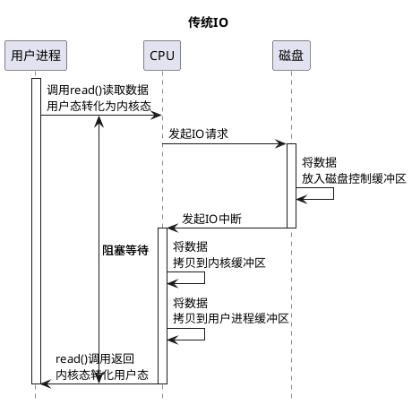
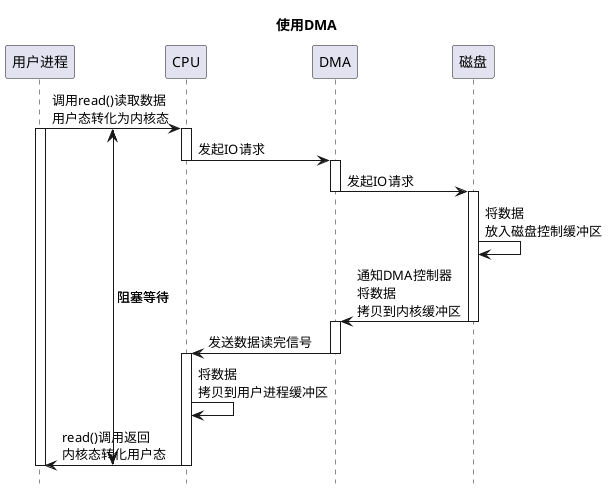

## Cache

- oop-klass模型
- JMM模型
- Unix 5种I/O模型

### heap manager

### GC
[](https://www.jianshu.com/p/8592ea9a408c)
在JIT编译时，在安全点(safe point)记录栈和寄存器中的引用和对应的位置。
安全点时，才可以GC：方法调用、执行跳转、异常跳转等处。

分配内存：指针碰撞，空闲列表
#### GC Roots
```
GC Roots 的对象包括下面几种： 
虚拟机栈（栈帧中的本地变量表）中引用的对象
方法区中类静态属性引用的对象
方法区中常量引用的对象
本地方法栈中 JNI （即一般说的 Native 方法）引用的对象

```
#### 可达性分析

#### 引用数据类型回收（虚拟机，垃圾回收器，回收算法）
 [mat gc root](https://www.cnblogs.com/set-cookie/p/11069748.html)
3. Java垃圾回收算法及垃圾收集器
   标记-清除算法(mark-sweep), dalvikvm；标记可达对象，线性扫描堆，回收不可达对象
        x遍历两遍，效率不高；STW 体验不好；碎片化。
        x空闲列表分配内存
   复制算法(copying)  hotspot：分配两个内存，每次使用一块，赋值存活对象，到另一块。交替两块内存区间的角色
        没有标记清除遍历两遍，相对高效；
        指针碰撞分配对象
        x浪费一个空闲空间
        x引用对象需要调整
   标记-压缩算法(mark-compact),
        标记清除增加一个压缩过程，碎片整理
        指针碰撞分配对象
   分代收集算法（Generational Collection）
        朝生夕死，复制算法，存活率较高，标记清除或标记整理
4. JVM可回收对象判定方法 : 对象回收判定(可达性分析算法&对象引用) 
>《Inside the Java Virtual Machine》 ,Wiley (1996)《Garbage Collection- Algorithms for Automatic Dynamic Memory Management》 
JVM给了三种选择收集器：串行收集器、并行收集器、并发收集器

[垃圾回收概念Thread，Root Set of References，Reachable and Unreachable Objects，garbage collection](https://www.javarticles.com/2016/09/java-garbage-collector-reachable-and-unreachable-objects.html)

```

+----------+-----------+----------------+---------------------------+
|(generation collection)Minor GC/Full GC                            |
+----------+-----------+----------------+---------------------------+
|safepoint/Safe Region                                              |
+----------+-----------+----------------+---------------------------+
|          |           | G1             |                           |
|          | concurrent| CMS            |                           |
|          +----------------------------+                           |
|          | parallel                   |                           |
|Collector +----------------------------+                           |
|          | ParallelOld                |                           |
|          +----------------------------+                           |
|          | Serial                     |                           |
+-------------------------------------------------------------------+
|Collection| mark-compact               |  reference counting       |
|Algorithms| copying                    |                           |
|          | mark-sweep                 |                           |
+-------------------------------------------------------------------+
| Garbage  |Reachability Analysis(java) |  Reference Counting       |
|          | GC Roots Tracing           |  (objc,Python)            |
+----------+----------------------------+---------------------------+

Generational Collection
+---------------------------------------------------------------------+
|  new gen       copying        copying           copying             |
| (Minor GC)     +--------+    +--------+     +------------------+    |
|                | Serial |    | ParNew |     | Parallel Scavenge|    |
|                +--+--+--+    +--+-+---+     +-----+----+-------+    |
|                   |  |          | |               |    |            |
|                +--+  +-----+    | |   +-----------+    |            |
|                |           |    | |   |                |    +-----+ |
+---------------- ----------- ---- - --- ---------------- ----+ G1  +-| mark-compact+copying
| old gen        | +---------+----+ |   |                |    +-----+ |
|                | |         |      |   |                |            |
|            +---+-+        ++------+---+--+    +--------+-----+      |
|            | CMS +--------+ Parallel Old |    | Serial Old   |      |
|            +-----+        +--------------+    +--------------+      |
|          mark-compact        mark-compact       mark-compact        |
+---------------------------------------------------------------------+
| Permanet Generation                                                 |
+---------------------------------------------------------------------+
并行（Parallel）：指多条垃圾收集线程并行工作，但此时用户线程仍然处于等待状态。
并发（Concurrent）：指用户线程与垃圾收集线程同时执行（但不一定是并行的，可能会交替执行），用户程序在继续运行。而垃圾收集程序运行在另一个CPU上。
```
Reference Counting：难解决对象之间循环引用的问题

[“长时间执行”](https://crowhawk.github.io/2017/08/10/jvm_2/)的最明显特征就是指令序列复用;
例如方法调用、循环跳转、异常跳转等，所以具有这些功能的指令才会产生Safepoint。
在GC发生时让所有线程（这里不包括执行JNI调用的线程）都“跑”到最近的安全点上再停顿下来。
**安全区域**是指在一段代码片段之中，引用关系不会发生变化。在这个区域中的任意地方开始GC都是安全的。

[HotSpot 虚拟机](http://openjdk.java.net/groups/hotspot/docs/HotSpotGlossary.html)
[官方文档 Hotspot](https://openjdk.java.net/groups/hotspot/docs/RuntimeOverview.html)


Generational Collection（分代收集）算法
  1. 新生代都采取Copying算法
  2. 老年代的特点是每次回收都只回收少量对象，一般使用的是Mark-Compact算法
  3. 永久代（Permanet Generation），它用来存储class类、常量、方法描述等。对永久代的回收主要回收两部分内容：废弃常量和无用的类。


《如何监控Java GC》中已经介绍过了jstat

JVM性能调优监控工具jps、jstack、jmap、jhat、jstat、hprof


#### Reference 

##### 对象访问方式：
1. 句柄访问：维护一个句柄池，栈访问句柄池，再访问对象和类信息。这种方法栈维护堆引用稳定
2. 直接指针（Hotspot）：直接访问对象，对象持有类信息
[OOP-KLASS模型](知识体系-程序-java.md)

```
+--------------------------------------------------------------------------------------------+
|       ReferenceProcessor:CHeapObj                                                          |
|                                                                                            |
|                                                                                            |
|        _disco^eredSoftRefs:   Disco^eredList*                                              |
|        _discoveredWeakRefs:   DiscoveredList*                                              |
|        _discoveredFinalRefs:  DiscoveredList*                                              |
|        _discoveredPhantomRefs:DiscoveredList*                                              |
|                                                                                            |
|                                                                process_discovered_reflist()|
|         process_discovered_references()                                                    |
|                                                                                            |
|         DiscoveredList                                                                     |
|               _len:  size_t                                                                |
|               _head:  oop                                                                  |
|                                                                                            |
|       RefProcPhase1Task  RefProcPhase2Task   RefProcPhase3Task                             |
+--------------------------------------------------------------------------------------------+
|                                                                                            |
|     PSRefProcTaskExecutor:AbstractRefProcTaskExecutor                                      |
|                                                                                            |
|     CMSRefProcTaskExecutor: AbstractRefProcTaskExecutor                                    |
|                                                                                            |
|                                                                                            |
|       GCTaskQueue           PSRefProcTaskProxy                                             |
|                                                                                            |
+--------------------------------------------------------------------------------------------+

```
 softwareReference，内存不够的时候回收
    保存注解，反射信息
 弱引用，没有被引用，GC发现即回收
    Glide以及缓存；Activity内存管理；weakHashMap；值动画WeakReference
 虚引用，观察加入引用队列
    堆外内存管理
 
#### 永久代的垃圾收集
永久代的垃圾收集主要回收两部分内容：废弃常量和无用的类

## io（同步、异步、阻塞、非阻塞）

MMU/MMAP

bio
   InputStream  、OutputStream基于字节操作的 IO
        ByteArray,-StringBuffer,Filter(Buffered,Data,PushBack   ),File,Object,     Piped ,Sequence 
        ByteArray,              Filter(Buffered,Data,PrintStream),File,Object,     Piped                       

    Reader、 Writer基于字符操作的 IO
        CharArray,String,      Buffered,Filter/PushBack ,       InputStream/File ,Piped 
        CharArray,String,      Buffered,Filter          ,       OutputStream/File,Piped,Print 

    File 基于磁盘操作的 IO
    Socket 基于网络操作的 IO

nio jdk1.4

aio jdk7

### Unix 5种I/O模型
```
+---------------+------------------+--------------------------+--------------------+-----------------+
|   blocking IO | nonblocking IO   |    IO multiplexing       |  signal driven IO  | asynchronous IO |
|               |                  | select poll epoll(Linux) |                    |                 |
|  Socket       |           | SocketServer,javaNIO , javaRAF  |                    |    Datagram     |
+----------------------------------------------------------------------------------------------------+   +
|               |                  |                          |                    |                 |   |
|initiate       |  initiate        |   check                  |                    |  initiate       |   |
| |             |  check           |     +                    |                    |                 |   | wait data
| |             |  check           |     |  block             |                    |                 |   |
| |             |  check           |     |                    |                    |                 |   |
| |             |    +             |     v                    |                    |                 |
| | block       |    |  block      |  ready                   |    notification    |                 |   + recvfrom block
| |             |    |             |  initiate                |    initiate        |                 |   |
| |             |    |             |     +                    |         +          |                 |   | copy from kernel
| |             |    |             |     |  block             |         | block    |                 |   | to user
| |             |    |             |     |                    |         |          |                 |   |
| v complete    |    v complete    |     v  complete          |         v complete |  notification   |   +
|               |                  |                          |                    |                 |
+---------------+------------------+--------------------------+--------------------+-----------------+
|               |                  | select    poll   epoll   |                    |                 |
|               |                  | fd-limit   x      x      |                    |                 |
|               |                  | poll-ready √ notify-ready|                    |                 |
+---------------+------------------+--------------------------+--------------------+-----------------+
```

```
+---------+----------------------------------+----------------------+----------------------+
|         | fd-limit      |copy_kernel_user  |  event               |  event handle        |
+-------------------------------------------------------------------+----------------------+
|  select | Polling       |  copy fd         | polling fd structure |  sync handle  fd     |
+-------------------------------------------------------------------+----------------------+
|  poll   | linklist      |  copy fd         | polling fd structure |   sync handle fd     |
+-------------------------------------------------------------------+----------------------+
|  epoll  | epoll_create()|  epoll_ctl()     | epoll_wait()         |   epoll_wait() /1 fd |
+---------+----------------------------------+----------------------+----------------------+

```
docker设置plantumlserver
docker run -d -p 8080:8080 plantuml/plantuml-server:jetty
ctrl+,设置plantumlserver
- BIO 同步阻塞

- 使用DMA


Linux零拷贝指的是 减少CPU拷和写的系统调用，一次系统调用两个上下文切换。
```java
拷贝方式	               CPU拷贝	DMA拷贝	系统调用	上下文切换  应用
传统方式(read + write)	     2	    2	read / write	4
内存映射(mmap + write)    	 1	    2	mmap / write	4       MappedByteBuffer   
sendfile	                1	    2	sendfile    	2      FileChannel.transferTo()
sendfile + DMA gather copy	0	    2	sendfile    	2      //硬件支持，软件无法实现
splice	                    0	    2	splice      	2 

jdk/src/java.base/windows/native/libnio/ch/FileChannelImpl.c
```


```
bio 同步（用户进程等待系统处理完io）阻塞（切换系统态，用户进程阻塞）
select 数组结构，有限制，轮询
poll   链表结构，无文件描述符限制，轮询
epoll 红黑树结构，没有文件描述符限制，有数据加到epoll_event数组
src/java.base/linux/native/libnio/ch/EPoll.c:59:Java_sun_nio_ch_EPoll_create
+---------------------------------------------------------------------------------------+
|      epoll_create(size:int ):int //return epfd                                        |
+---------------------------------------------------------------------------------------+
|      epoll_ctl(epfd:int,op:int,fd:int,event:epoll_event*):int                         |
|                                                                                       |
|                                                                                       |
|      //op             //fd         //event                                            |
|      //EPOLL_CTL_ADD  //socket fd  //poll to event array                              |
|      //EPOLL_CTL_MOD                                                                  |
|      //EPOLL_CTL_DEL                                                                  |
|                                                                                       |
+---------------------------------------------------------------------------------------+
|     epoll_event:struct                                                                |
|       events:__uint32_t                                                               |
|       data  :epoll_data_t                                                             |
|                                                                                       |
|   //events                                                                            |
|   //EPOLLIN  EPOLLOUT EPOLLERR                                                        |
|                                                                                       |
|                                                                                       |
+---------------------------------------------------------------------------------------+
|   int epoll_wait(int epfd,events: epoll_event * , int maxevents, int timeout)         |
|                                                                                       |
+---------------------------------------------------------------------------------------+

```
### Bio 分类
```java

            +--------------------------------------------------------------------------------------------------------------------------+
            |  [InputStream]                                                                                                           |
            |   ByteArrayInputStream       FilterInputStream           FileInputStream               PipedInputStream                  |
            |      buf[]:byte                in:InputStream               fd:FileDescriptor             buffer :byte[]                 |
            |      pos:int                                                channel:FileChannel           readSide:Thread                |
            |      count:int               BufferedInputStream            path:String                   writeSide:Thread               |
            |      mark:int                      :FilterInputStream       closeLock:Object              in:int                         |
            |                                buf[]:byte                                                 out:int                        |
            |                                count:int                 SocketInputStream                connected:boolean              |
            |   ObjectInputStream            marklimit: int                                             closedByWriter:boolean         |
            |     bin:BlockDataInputStream   markpos:int                                                closedByReader:boolean         |
            |     handles:HandleTable        pos:int                                                    connect(src:PipedOutputStream) |
            |     vlist:ValidationList       getInIfOpen():InputStream                                  receive()                      |
            |     enableOverride:bool                                                                                                  |
            |                               Gzip,Base64,Chiper...                                                                      |
            |                                                                                                                          |
            +--------------------------------------------------------------------------------------------------------------------------+
            | [OutputStream]                                                                                                           |
            |                                                                                        PipedOutputStream                 |
            |                                                                                           sink:PipedInputStream          |
            +--------------------------------------------------------------------------------------------------------------------------+
            | [Reader]                                                                                                                 |
            |     CharArrayReader:Reader   BufferedReader               InputStreamReader            PipedReader                       |
            |         buf:char[]             cb:char[]                      sd:StreamDecoder            buffer:char []                 |
            |         pos:int                in:Reader                                                  connected: boolean             |
            |         count:int              markedChar: int                                            in:int                         |
            |         markedPos:int          markedSkipLF:boolean       FileReader:InputStreamReader    out:int                        |
            |     StringReader               nChars, nextChar:int                                       closedByWriter :boolean        |
            |         str:String             readAheadLimit:int                                         closedByReader:boolean         |
            |         length:int             skipLF:bool                                                 readSide:Thread               |
            |         next:int                                                                           writeSide:Thread              |
            |         mark:int                                                                                                         |
            +--------------------------------------------------------------------------------------------------------------------------+
            | [Writer]                                                                                                                 |
            +--------------------------------------------------------------------------------------------------------------------------+

```

磁盘控制器，块，512字节
    磁盘是基于块存储的硬件设备，一次只能操作固定大小的数据块
    字节数组时，指定的大小为块的2倍数

### NIO中的直接缓存和非直接缓存

 cache 是高速缓存，用于 CPU 和内存之间的缓冲；
buffer是 I/O 缓存，用于内存和硬盘的缓冲。
cache 是加速 读，而 buffer 是缓冲 写

```
+--------------------------------------------------------------------------------------------+
|                                                                                            |
|                                               [Selectors]                                  |
|                                                //window iocp;linux epoll                   |
|                                                                                            |
| [Channel]                                                                                  |
|   Files     FileOutputStream                   SelectableChannel        SinkChannel        |
|    copy()      getChannel():FileChannel                                                    |
|             RandomAccessFile                    SocketChannel           SourceChannel      |
|                getChannel():                                                               |
|             FileChannel                         ServerSocketChannel                        |
|                 transferTo()//sendfile                                                     |
|                 map()                           DatagramChannel                            |
|                 transferFrom()                                                             |
|                 open(path:Path)                                                            |
|                                                                                            |
| [Buffer]                                                                                   |
|             HeapByteBuffer     DirectByteBuffer           MappedByteBuffer//mmap           |
|                                     //non-heap                                             |
+--------------------------------------------------------------------------------------------+


```
selector 不好直接管理socket，使用channel做适配

## 网络
### 数据交换格式
Gson
工厂方法： com.google.gson.Gson#factories用来创建TypeAdapter
适配器模式：com.google.gson.internal.bind.TypeAdapters适配类型解析
装饰模式：com.google.gson.reflect.TypeToken装饰class