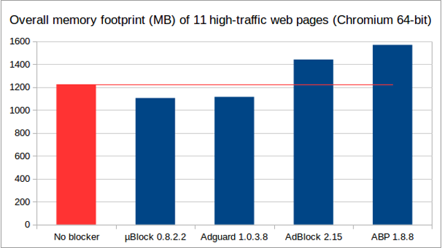
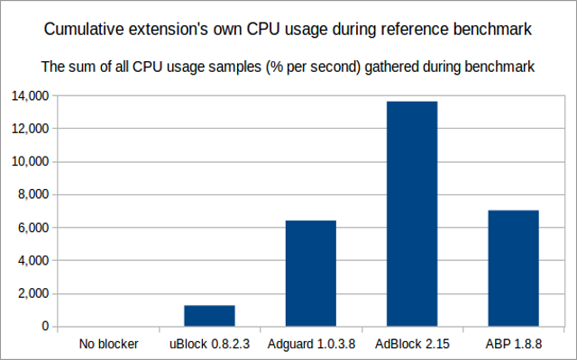
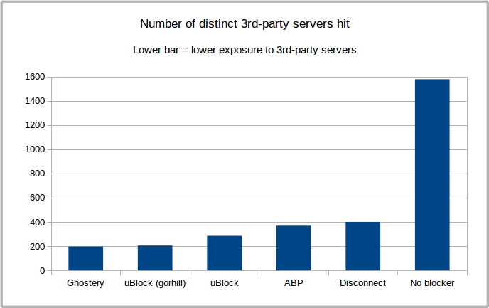
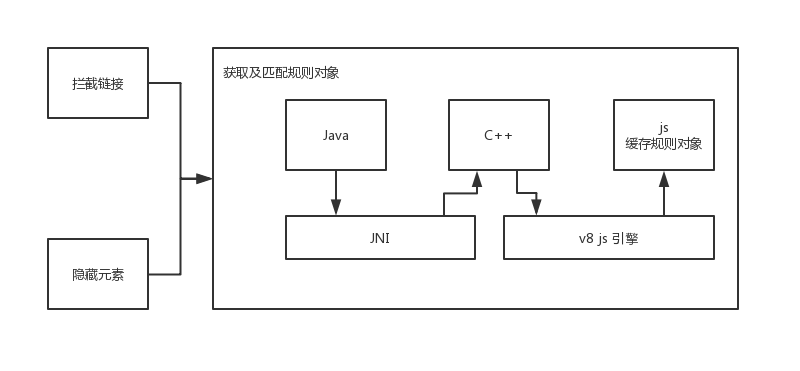
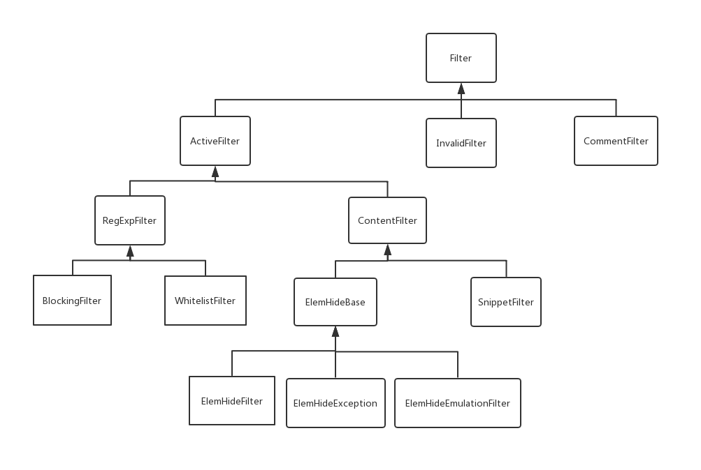

# AdBlock_Android(Adblock Plus实现)

#### 介绍
[广告拦截 v1.0（文档）](./README_v1.md)
这是android平台的一个webView广告过滤SDK，支持debug调试，总开关，以及上报需要过滤的具体网站等等；

#### 软件架构

工程目录包括以下模块：

- AbpLib：广告拦截核心模块，包含规则解析代码。
- abpaar：适配 Android，依赖AbpLib。模块包含规则文件的数据库压缩包，掩藏页面元素的 JS脚本。
- abpapp：应用测试模块
- TestAbpJava：单元测试模块
- AbpLib：广告拦截 v1.0 Java 库
- app：   广告拦截 v1.0 测试模块

#### 安装教程&使用说明

1. 初始化配置，调用 **AbpConfig.init(android.app.Context);** ，异步初始化配置。

2. 使用方需要将 android.webwiket.WebView 继承 **com.ly.abp.AbpWebView**

3. 退出应用时，调用 **AbpConfig.destory();** ，销毁资源

#### Adblock Plus 介绍
> [Adblock Plus](https://adblockplus.org/zh_CN/about) 可让您屏蔽烦人的广告、跟踪、恶意软件及其他您不想在浏览器中看到的东西。

常用的广告拦截应用有 [Adblockplus](https://github.com/adblockplus)，[uBlock](https://github.com/gorhill/uBlock)，[cloudopt](https://github.com/cloudoptlab/cloudopt-adblocker)。以下三张图，通过广告插件执行时的内存，CPU及屏蔽能力三方面进行对比。





[其他广告拦截性能对比](https://whotracks.me/blog/adblockers_performance_study.html)

[规则订阅文件介绍](http://www.jiangyiqun.cn/?p=2616)
[规则订阅文件（英文）介绍](https://easylist.to/)
[uBlock₀ 规则订阅文件](https://www.yiclear.com/filterlists/)

GitHub上有 [Adblockplus 源代码](https://github.com/adblockplus)及对应的 [Android 项目](https://github.com/adblockplus/libadblockplus-android)，其中 Android 的版本要求 API 19 以上（包含 19）。

Adblock Plus 项目中代码主要的调用结构：


Adblock Plus 广告拦截规则列表是以 TXT 文本文件存储，规则列表的每行文本被抽象为 **Filter** 对象及其子类。



```
CommentFilter:（注释文本，包含!）
格式：!注释内容
 ! Checksum: Z5CwsZg8Z8oioygwsmTblA


ElemHideFilter: （元素隐藏匹配规则，包含##）                         数据管理类：ElemHide#filtersByDomain，filterBySelector
格式：主机名（可选）##CSS元素选择器
hk.yahoo.com###mntl1 
hk.yahoo.com##li[class="js-stream-content Cf Pos-r RevealNested      "][data-uuid]:not([data-uuid*="-"])

ElemHideException:（可接受元素隐藏匹配规则，包含#@#）       数据管理类：ElemHideExceptions#exceptionsBySelector [selector,domain]
格式：主机名（可选）#@#CSS元素选择器
comicbookmovie.com#@#.skyscraperAd


ElemHideEmulationFilter:（未使用，需调用js模板文件，包含#?#）
格式：主机名（可选）#?#CSS元素选择器
aliexpress.com#?#.list-item:-abp-has(span.sponsored)   

SnippetFilter: （未使用，包含#$#）
格式：主机名（可选）#$#CSS元素选择器
abpchina.org#$#log Hello


BlockingFilter: （广告链接匹配规则）数据管理类：AdMatcher:filterByKey
格式：部分URL（可能包含起始标识||,或结束标识^）$过滤类型（可选，包含‘contentType’，match-case,domain,third-party,collapse,sitekey,rewrite）；
其中，‘contentType’可以是OTHER，SCRIPT，IMAGE，STYLESHEET，OBJECT，SUBDOCUMENT，DOCUMENT，WEBSOCKET，WEBRTC，CSP，XBL，PING，XMLHTTPREQUEST，OBJECT_SUBREQUEST，DTD，MEDIA，FONT，BACKGROUND，POPUP，GENERICBLOCK，ELEMHIDE，GENERICHIDE
/adsfooter
||imagebam.com/image/  

WhitelistFilter:（可接受广告链接的匹配规则，包含@@）    数据管理类：AdMatcher:filterByKey
格式：@@部分URL）$过滤类型（可选，包含‘contentType’，match-case,domain,third-party,collapse,sitekey,rewrite）；
其中，‘contentType’可以是OTHER，SCRIPT，IMAGE，STYLESHEET，OBJECT，SUBDOCUMENT，DOCUMENT，WEBSOCKET，WEBRTC，CSP，XBL，PING，XMLHTTPREQUEST，OBJECT_SUBREQUEST，DTD，MEDIA，FONT，BACKGROUND，POPUP，GENERICBLOCK，ELEMHIDE，GENERICHIDE
@@|blob:$script,domain=dato.porn

```

白名单列表配置
```
主机名
如：h5.m.taobao.com，taobao.com
```


#### 结尾

欢迎大家来补充该SDK，共同去完善好；

开发人员：

[Arthur R Wong] anshu.wang@qq.com