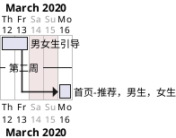

## 高效编程
接口数据 
```java
TestDatas
```
排期


[阅读源码结构图](http://asciiflow.com/)
gitk,git extensions或sourcetree
## 考虑不稳定情况
```
网络不稳定 Fiddler模拟；重启清空；旧版本兼容；多重情况单元测试；解决lint警告
```

## 看源码就可以了吗？为什么要代码片段
```

源码有多个版本，代码片段提升效率
```


## 前端服务
启动第二个服务关掉，已经无效
[unfortunately it has been patched in Android 7.1](https://stackoverflow.com/questions/26576872/how-do-i-remove-a-foreground-notification-in-android-lollipop)
## 个人信息刷新

```java
    /**
     * 1. 登录刷新，RxBus接收
     * 2. 每次点击都展示（考虑超时刷新 setUserVisiable和onCreateView），同步服务器数据
     * 3. onResume ，个人信息可以有修改，需要更新我的中心。
     */
```
## 权限申请
不能在OnResume申请；不然会一只调用onResume

## RelativeLayout
```
    +----------------------------+
    |                            |
    |                            |
    |                     +----+ |
    |                     |    | |
    |                     +----+ |
+-------------------------+      |
|   |                     |      |
|   |                     |      |
|   |                     |      |
|   |                     |      |
|   |                     |      |
|   |                     |      |
|   |                     |      |
|   |                     |      |
|   |      vgContent      |      |
|   |                     |      |
|   |                     |      |
|   |                     |      |
|   |                     |      |
|   |                     |      |
|   |                     |      |
|   |                     |      |
|   |                     |      |
+-------------------------+      |
    |                            |
    |                            |
    |                            |
    +----------------------------+

右上角的图标如果相对于 底部ViewGrouop布局，就会发生整体偏移

    <ImageView
        android:id="@+id/iv_finish"
        android:layout_width="39dp"
        android:layout_height="39dp"
        android:layout_marginRight="7dp"
        android:layout_toRightOf="@+id/vgContent"
        android:layout_alignTop="@+id/vgContent"/>
```

### RelativeLayout

```

<RelativeLayout xmlns:android="http://schemas.android.com/apk/res/android"
    android:layout_width="match_parent"
    android:layout_height="match_parent"
    android:gravity="center"
    android:background="#80000000">


    <RelativeLayout
        android:id="@+id/rl_innner"
        android:layout_width="250dp"
        android:layout_height="wrap_content"
        android:layout_centerHorizontal="true">
        </RelativeLayout>
</RelativeLayout>

外部设置了 gravity; rl_innner 不能居中
```
## Drawable
```xml
<gradient android:type="linear"
            android:startColor="#ffff0000"
            android:endColor="#ffff4808"
            android:angle="270" />
    java.lang.IllegalArgumentException: Linear gradient requires 'angle' attribute to be a multiple of 45
        at android.graphics.drawable.GradientDrawable$GradientState.updateGradientStateOrientation(GradientDrawable.java:2208)
        at android.graphics.drawable.GradientDrawable$GradientState.getOrientation(GradientDrawable.java:2196)
        at android.graphics.drawable.GradientDrawable.ensureValidRect(GradientDrawable.java:1273)
        at android.graphics.drawable.GradientDrawable.buildPathIfDirty(GradientDrawable.java:869)
        at android.graphics.drawable.GradientDrawable.getOutline(GradientDrawable.java:1864)
```
### Seekbar 需要设置高度和gravity,不然代码setProgressDrawable不然不会居中 android:height="4dp"  android:gravity="center"
```
<?xml version="1.0" encoding="utf-8"?>
<layer-list xmlns:android="http://schemas.android.com/apk/res/android">

    <item android:id="@android:id/background" android:height="4dp"  android:gravity="center">
        <shape >
            <size android:height="4dp" />
            <corners android:radius="2dp" />
            <gradient
                android:endColor="#FF8E9598"
                android:startColor="#FF8E9598" />
        </shape>
    </item>
    <item android:id="@android:id/progress" android:height="4dp" android:gravity="center">
        <clip>
            <shape>
                <size android:height="4dp" />
                <corners android:bottomLeftRadius="2dp"
                    android:topLeftRadius="2dp"/>
                <gradient
                    android:endColor="#FFB50101"
                    android:startColor="#FFD93800" />
            </shape>
        </clip>
    </item>

</layer-list>


```
## TextView 的 DrawableLeft 会自动垂直居中


## TextView 单个数字没法居中
```
android:includeFontPadding="false"
```
 
## RecyclerView
### 没有走Adapter
 要设置Layoutmanager
### 宽度没有填充
 inflater.inflate(R.layout.award_item, parent, false);
### 间隙分割线
```java
    new RecyclerView.ItemDecoration() {
        @Override
        public void getItemOffsets(Rect outRect, View view, RecyclerView parent, RecyclerView.State state) {
            super.getItemOffsets(outRect, view, parent, state);
            outRect.bottom = dp2px(8);

        }
    }


```

### 绘制分割綫
```java
参考
android.support.v7.widget.DividerItemDecoration

new RecyclerView.ItemDecoration() {
                int space6 = ScreenUtils.dpToPxInt(6);
                private final Rect mBounds = new Rect();
            @Override
            public void onDrawOver(Canvas canvas, RecyclerView parent, RecyclerView.State state) {
                super.onDrawOver(canvas, parent, state);

                    Paint mPaint = new Paint();
                    mPaint.setAntiAlias(true);
                    mPaint.setColor(0xffececec);

                    canvas.save();
                    final int left;
                    final int right;
                    //noinspection AndroidLintNewApi - NewApi lint fails to handle overrides.
                    if (parent.getClipToPadding()) {
                        left = parent.getPaddingLeft();
                        right = parent.getWidth() - parent.getPaddingRight();
                        canvas.clipRect(left, parent.getPaddingTop(), right,
                                parent.getHeight() - parent.getPaddingBottom());
                    } else {
                        left = 0;
                        right = parent.getWidth();
                    }

                    final int childCount = parent.getChildCount();
                    for (int i = 0; i < childCount; i++) {
                        if (i==childCount-1)
                            continue;
                        final View child = parent.getChildAt(i);
                        parent.getDecoratedBoundsWithMargins(child, mBounds);
                        final int bottom = mBounds.bottom + Math.round(child.getTranslationY());
                        final int top = bottom - ScreenUtils.dpToPxInt(.5f);

                        canvas.drawRect(left, top, right, bottom,mPaint);
                    }
                    canvas.restore();
                }

                @Override
                public void getItemOffsets(Rect outRect, View view, RecyclerView parent, RecyclerView.State state) {
                    super.getItemOffsets(outRect, view, parent, state);
                    if ( parent.getChildAdapterPosition(view)==0){
                        outRect.bottom=space6;
                    }else if (parent.getChildAdapterPosition(view)==parent.getAdapter().getItemCount()-1){
                        outRect.top=space6;
                    }else {
                        outRect.top=space6;
                        outRect.bottom=space6;
                    }
                }
            });
        }
```

### GridLayoutManager 平均间隙
```java

    /**
        *
        * @param outRect
        * @param view
        * @param parent
        * @param rcyToScreenMargin  RecyclerView左右的外边距
        * @param contentWidth       不包含任何空白区域的item宽度
        * @param leftmarginOfFirstCol 第一列item左边到RecyclerView空隙
        * @param rightmarginOfLastCol 最后一列item，右边与RecyclerView空隙
        */
    private void setSpanGap(Rect outRect, View view, RecyclerView parent,float rcyToScreenMargin,float contentWidth,float leftmarginOfFirstCol,float rightmarginOfLastCol) {
        float leftmarginOfFirstColVal = DensityUtil.dip2px(view.getContext(), leftmarginOfFirstCol);//leftmargin
        float rightmarginOfLastColVal = DensityUtil.dip2px(view.getContext(), rightmarginOfLastCol);//rightmargin
        int spanCount = ((GridLayoutManager) parent.getLayoutManager()).getSpanCount();
        int spanIndex = ((GridLayoutManager.LayoutParams) view.getLayoutParams()).getSpanIndex();
        int rcyContentWidth = DensityUtil.getScreenWidth(view.getContext()) - DensityUtil.dip2px(view.getContext(), rcyToScreenMargin) * 2;
        float cellWidth = DensityUtil.dip2px(view.getContext(), contentWidth)+leftmarginOfFirstColVal+rightmarginOfLastColVal;
        float offsetOfFirstCell = ((rcyContentWidth - cellWidth * spanCount) / spanCount) / (spanCount - 1);
        outRect.left = (int) (offsetOfFirstCell * spanIndex+ leftmarginOfFirstColVal);
    }
```
### Grid RecyclerView item按压效果
```java
android:background="?android:attr/selectableItemBackground"
```
### RecyclerView 没有拖动阴影
```java
 android:overScrollMode="never"
```
### NestedScrollView内嵌多个RecyclerView流畅问题
```java
recyclerView.setNestedScrollingEnabled(false)
```

### 上拉加载
```xml
    <android.support.v4.widget.SwipeRefreshLayout
        android:id="@+id/sr_bind_game"
        android:layout_width="match_parent"
        android:layout_height="wrap_content">
```

### recyclerView加载更多
```java
new RecyclerView.OnScrollListener() {

            @Override
            public void onScrollStateChanged(RecyclerView recyclerView, int newState) {
                LinearLayoutManager manager = (LinearLayoutManager) recyclerView.getLayoutManager();
                // 当不滚动时
                if (newState == RecyclerView.SCROLL_STATE_IDLE) {
                    //获取最后一个完全显示的ItemPosition
                    int lastVisibleItem = manager.findLastCompletelyVisibleItemPosition();
//                    int pos=manager.findFirstVisibleItemPosition();
                    int totalItemCount = manager.getItemCount();
                    // 判断是否滚动到底部，并且是向下滚动
                    if (mPresenter.isLoading)
                        return;
                    if (lastVisibleItem >= (totalItemCount - 5) && mPresenter.hasMore) {
                        //加载更多功能的代码
                        mPresenter.isLoading = true;
                        mPresenter.getActiveList(++mPresenter.page);
                    }
                }
            }

            @Override
            public void onScrolled(RecyclerView recyclerView, int dx, int dy) {
                super.onScrolled(recyclerView, dx, dy);
            }
        }
public class Pager {
    public int page=1;
    int pageSize =15;
    public boolean isLoading;
    public boolean hasMore=true;
    public List list=new ArrayList();

    public void changeLoading(boolean isLoading){
        this.isLoading=isLoading;
    }

    public boolean isLoading() {
        return isLoading;
    }

    public boolean isHasMore() {
        return hasMore;
    }
    public void changeHasMoreStatus(List loaded){
        if (list==null||list.size()< pageSize){
            hasMore=false;
            if (page > 1)
               System.out.println("数据加载完成");
        }else {
            hasMore=true;
        }
    }
}

```
### RecyclerView图标山闪动
```java
去掉
getAdapter().notifyDataSetChanged()

换成 
list.clear();
rv.getAdapter().notifyItemRangeRemoved(start,range);//清空
list.addAll(bean.list);
rv.getAdapter().notifyItemRangeInserted(start,range);//插入


```
## Viewpager

### viewpager的fragment 是否可见
```
isVisibleToUser && isResumed()
```
## CardView
CardView去掉阴影
```
   app:cardElevation="0dp"
```

Lollipop以下的版本做了适配.但是在低版本上,CardView并不去用圆角切割与子View相重叠的部分.而是添加padding避免与子View相交,并且在padding上添加阴影,padding的值为:
paddingLeft=paddingRight=maxCardElevation + (1 - cos45) * cornerRadius paddingBottom=paddingTop= maxCardElevation * 1.5 + (1 - cos45) * cornerRadius
由于CardView的内容与阴影之间已经有了padding,所以就不能够为CardView设置padding了,但可以通过setContentPadding(int, int, int, int),方法设置CardView的边界与子View直接间隔.
## 界面像素

### 阴影
``` xml
<?xml version="1.0" encoding="utf-8"?>
<layer-list xmlns:android="http://schemas.android.com/apk/res/android">
    <item>
        <shape android:shape="rectangle">
            <padding
                android:bottom="2dp"
                android:left="1.5dp"
                android:right="1.5dp"
                android:top="0.5dp" />
            <solid android:color="#05CCCCCC" />
            <corners android:radius="5dp" />
        </shape>
    </item>
    <item>
        <shape android:shape="rectangle">
            <padding
                android:bottom="2dp"
                android:left="1.5dp"
                android:right="1.5dp"
                android:top="0.5dp" />
            <solid android:color="#08CCCCCC" />
            <corners android:radius="5dp" />
        </shape>
    </item>
    <item>
        <shape android:shape="rectangle">
            <padding
                android:bottom="2dp"
                android:left="1.5dp"
                android:right="1.5dp"
                android:top="0.5dp" />
            <solid android:color="#0aCCCCCC" />
            <corners android:radius="5dp" />
        </shape>
    </item>
    <item>
        <shape android:shape="rectangle">
            <padding
                android:bottom="2dp"
                android:left="1.5dp"
                android:right="1.5dp"
                android:top="0.5dp" />
            <solid android:color="#0dCCCCCC" />
            <corners android:radius="5dp" />
        </shape>
    </item>
    <item>
        <shape android:shape="rectangle">
            <padding
                android:bottom="2dp"
                android:left="1.5dp"
                android:right="1.5dp"
                android:top="0.5dp" />
            <solid android:color="#0fCCCCCC" />
            <corners android:radius="5dp" />
        </shape>
    </item>
    <item>
        <shape>
            <solid android:color="#FFFFFF" />
            <corners android:radius="5dp" />
        </shape>
    </item>
</layer-list>

```

### RecyclerView实现FlexboxLayoutManager
setSpanSizeLookup

### TextView渐变字体
```java
    private void setTextViewGradient(TextView textView) {
        int[] colors = {Color.RED,0xfffe0000};//颜色的数组
        float[] position = {0f,  1.0f};//颜色渐变位置的数组
        LinearGradient mLinearGradient = new LinearGradient(0, 0, textView.getPaint().getTextSize() * textView.getText().length(), 0, colors, position, Shader.TileMode.CLAMP);
        textView.getPaint().setShader(mLinearGradient);
        textView.invalidate();
    }

```
### TextView HTML颜色
```html
<![CDATA[ <font color="#ff971a"> $1%s </font> ]]>
```
### 去掉字体空白
```xml
android:includeFontPadding
```

### dp2px
```java
    protected float dp2px(int dp) {
        return TypedValue.applyDimension(TypedValue.COMPLEX_UNIT_DIP, dp,
                Resources.getSystem().getDisplayMetrics());
    }
```
## 对话框设置高度
需要show()后设置，才会生效
## 对话框
```java
    public void initDialog(){
        Window window = dialog.getWindow();
        //设置dialog在屏幕底部
        window.setGravity(Gravity.BOTTOM);
        //设置dialog弹出时的动画效果，从屏幕底部向上弹出
        //window.setWindowAnimations(R.style.show_hind_anim);
        window.getDecorView().setPadding(0, 0, 0, 0);
        window.getDecorView().offsetLeftAndRight(0);
        window.getDecorView().offsetTopAndBottom(0);
        //获得window窗口的属性
        WindowManager.LayoutParams lp = window.getAttributes();
        //设置窗口宽度为充满全屏
        lp.width = WindowManager.LayoutParams.WRAP_CONTENT;
        //设置窗口高度为包裹内容
        lp.height = WindowManager.LayoutParams.WRAP_CONTENT;
        //将设置好的属性set回去
        window.setAttributes(lp);
    }


    public void initCenterDialog(){
        Window window = dialog.getWindow();
        //设置dialog在屏幕底部
        window.setGravity(Gravity.CENTER);
        //设置dialog弹出时的动画效果，从屏幕底部向上弹出
        //window.setWindowAnimations(R.style.show_hind_anim);
        window.getDecorView().setPadding(0, 0, 0, 0);
        window.getDecorView().offsetLeftAndRight(0);
        window.getDecorView().offsetTopAndBottom(0);
        //获得window窗口的属性
        WindowManager.LayoutParams lp = window.getAttributes();
        //设置窗口宽度为包裹内容
        lp.width = WindowManager.LayoutParams.WRAP_CONTENT;
        //设置窗口高度为包裹内容
        lp.height = WindowManager.LayoutParams.WRAP_CONTENT;
        //将设置好的属性set回去
        window.setAttributes(lp);
    }

```

```xml
    <style name="dialogStyle" parent="@style/Theme.AppCompat.Dialog">
        <!-- 是否有边框 -->
        <item name="android:windowFrame">@null</item>
        <!--是否在悬浮Activity之上  -->
        <item name="android:windowIsFloating">true</item>
        <!-- 标题 -->
        <item name="android:windowNoTitle">true</item>
        <!--阴影  -->
        <item name="android:windowIsTranslucent">true</item><!--半透明-->
        <!--背景透明-->
        <item name="android:windowBackground">@android:color/transparent</item>
        <!-- 还可以加入一些弹出和退出的动画 (lan)-->
    </style>
    <!-- android:windowBackground 圆角背景 -->
    <shape xmlns:android="http://schemas.android.com/apk/res/android"
        android:shape="rectangle" >

        <corners android:radius="8dp" />
        <solid android:color="#FFFFFF" />

    </shape>
```
```xml
    <style name="show_hind_anim" parent="android:Animation">
        <item name="android:windowEnterAnimation">@anim/dialog_enter</item>
        <item name="android:windowExitAnimation">@anim/dialog_exit</item>
    </style> 
    <set xmlns:android="http://schemas.android.com/apk/res/android">
        <translate
            android:duration="300"
            android:fromYDelta="100%p"
            android:toYDelta="0" />
    </set> 
    <set xmlns:android="http://schemas.android.com/apk/res/android">
        <translate
            android:duration="300"
            android:fromYDelta="0"
            android:toYDelta="100%p" />
    </set>

```
### Dialog生命周期
```
Unable to add window -- token android.os.BinderProxy is not valid; is your activity running?
if (!act.this.isFinishing())
{  
//dialog.show  
}  
```

## Scrollview禁止自动滚动
```xml

    <android.support.v4.widget.NestedScrollView
        android:id="@+id/scView"
        android:layout_width="match_parent"
        android:layout_height="match_parent"
        android:fillViewport="true"
        android:scrollbars="none">

        <RelativeLayout
            android:focusable="true"
            android:focusableInTouchMode="true"
            android:layout_width="match_parent"
            android:layout_height="match_parent">
```
## 界面懒加载
获取到数据再加载
```xml
 <ViewStub android:id="@+id/stub"
               android:inflatedId="@+id/subTree"
               android:layout="@layout/mySubTree"
               android:layout_width="120dip"
               android:layout_height="40dip" />
```


```java
public class WrapHeightGridView  extends GridView {

    public WrapHeightGridView(Context context) {
        super(context);
    }
    public WrapHeightGridView(Context context, AttributeSet attrs) {
        super(context, attrs);
    }


    public WrapHeightGridView(Context context, AttributeSet attrs, int defStyle) {
        super(context, attrs, defStyle);
    }

    @Override
    protected void onMeasure(int widthMeasureSpec,int heightMeasureSpec) {
        int heightSpec;
        if (getLayoutParams().height == LayoutParams.WRAP_CONTENT) {
             heightSpec = MeasureSpec.makeMeasureSpec(Integer.MAX_VALUE >> 2, MeasureSpec.AT_MOST);
        } else {
             heightSpec = heightMeasureSpec;
        }
        super.onMeasure(widthMeasureSpec, heightSpec);
    }
}
```

### Glide4 https

```java
public class UnsafeOkHttpClient {  
    public static OkHttpClient getUnsafeOkHttpClient() {
        try {
            // Create a trust manager that does not validate certificate chains
            final TrustManager[] trustAllCerts = new TrustManager[] {
                    new X509TrustManager() {
                        @Override
                        public void checkClientTrusted(java.security.cert.X509Certificate[] chain, String authType) throws CertificateException {
                        }

                        @Override
                        public void checkServerTrusted(java.security.cert.X509Certificate[] chain, String authType) throws CertificateException {
                        }

                        @Override
                        public java.security.cert.X509Certificate[] getAcceptedIssuers() {
                            return new java.security.cert.X509Certificate[]{};
                        }
                    }
            };

            // Install the all-trusting trust manager
            final SSLContext sslContext = SSLContext.getInstance("SSL");
            sslContext.init(null, trustAllCerts, new java.security.SecureRandom());

            // Create an ssl socket factory with our all-trusting manager
            final SSLSocketFactory sslSocketFactory = sslContext.getSocketFactory();

            OkHttpClient.Builder builder = new OkHttpClient.Builder();
            builder.sslSocketFactory(sslSocketFactory, (X509TrustManager)trustAllCerts[0]);
            builder.hostnameVerifier(new HostnameVerifier() {
                @Override
                public boolean verify(String hostname, SSLSession session) {
                    return true;
                }
            });

            OkHttpClient okHttpClient = builder.build();
            return okHttpClient;
        } catch (Exception e) {
            throw new RuntimeException(e);
        }
    }
}


@GlideModule
public class UnsafeOkHttpGlideModule  extends AppGlideModule {
    @Override
    public void registerComponents(Context context, Glide glide, Registry registry) {
        registry.replace(GlideUrl.class, InputStream.class, new OkHttpUrlLoader.Factory( getUnsafeOkHttpClient()));
    }
}

   OkHttpUrlLoader and OkHttpStreamFetcher('com.github.bumptech.glide:okhttp3-integration:4.9.0@aar')

```
## 动画
### 按压效果
```
View.setScaleX(0.5f);
View.setScaleY(0.5f);
View.animate().scaleX(1).scaleY(1).setInterpolator(new AccelerateInterpolator()).start();
```

## 数据 
### 存储
- 清除缓存
getCacheDir()          /data/user/0/packagename/cache
getExternalCacheDir() /storage/emulated/0/Android/data/packagename/cache  （API < 19 需要权限）

- 清除数据
                                  /data/user/0/packagename
getFilesDir()/getFileStreamPath() /data/user/0/packagename/files    
getSharedPreferences() /data/user/0/packagename/shared_prefs
                       /data/user/0/packagename/databases
getExternalFilesDir() /storage/emulated/0/Android/data/packagename/files （API < 19 需要权限）

...


- 需要运行时权限
/data Environment.getDataDirectory().getPath() （ 需要权限）
/data/cache Environment.getDownloadCacheDirectory() （ 需要权限）
/data/app/com.hgb.oaiddemo-0LkD7DX5Vgb91NuAFuQxtQ==/base.apk getApplicationInfo().sourceDir 

/storage/emulated/0 Environment.getExternalStorageDirectory() （ 需要权限）
/storage/emulated/0/Download    Environment.getExternalStoragePublicDirectory(Environment.DIRECTORY_DOWNLOADS)


- 减少存储权限的申请
Environment.getExternalStoragePublicDirectory(Environment.DIRECTORY_DOWNLOADS)


- 去掉 字节跳动权限申请
    @Override
    public void startActivityForResult(Intent intent, int requestCode) {
        //申请权限
        if (intent.getComponent().getClassName().equals("com.bytedance.sdk.openadsdk.activity.TTDelegateActivity")&&intent.getIntExtra("type",-1)==2)
            return;
        super.startActivityForResult(intent, requestCode);
    }

### webview调试
```java
    public static void openMiniApp(String name, String path) {
        IWXAPI api = WXAPIFactory.createWXAPI(MVPApplication.getInstance(), _appid);
        if (!api.isWXAppInstalled()) {
            //没有安装微信!
            return;
        }
        // 将应用的appId注册到微信
        api.registerApp(_appid);
        WXLaunchMiniProgram.Req req = new WXLaunchMiniProgram.Req();
        req.userName = name; // 小程序原始idgh_x71e17fbdf2f
        if (null!=path)
            req.path = path;//拉起小程序页面的可带参路径，不填默认拉起小程序首页
        req.miniprogramType = WXLaunchMiniProgram.Req.MINIPTOGRAM_TYPE_RELEASE;// 可选打开 开发版，体验版和正式版
        api.sendReq(req);
    }

```


### Gson解析泛型
``` java
new Gson().fromJson(json, Bean.class);
 
User[] userArray = gson.fromJson(userJson, User[].class);  
 
Type userListType = new TypeToken<ArrayList<User>>(){}.getType();
 
ArrayList<User> userArray = gson.fromJson(userJson, userListType);
```

### 拦截解析Gson拦截解析
```java
        GsonBuilder builder = new GsonBuilder();
        builder.registerTypeAdapter(Base.class, new JsonDeserializer<Base>() {
            Gson g=new Gson();
            @Override
            public Base deserialize(JsonElement json, Type typeOfT, JsonDeserializationContext context) throws JsonParseException {
                if (json.getAsJsonObject().get("data").isJsonPrimitive() && typeOfT.toString() != null&&(typeOfT instanceof ParameterizedType)
                        && !typeOfT.toString().substring(typeOfT.toString().indexOf('<') + 1).startsWith("java.lang")) {
                    Base base = new Base();
                    base.setCode(json.getAsJsonObject().get("code").getAsString());
                    base.setMessage(json.getAsJsonObject().get("message").getAsString());
                    return base;
                } else {

                    Base base = g.fromJson("{}", typeOfT);
                    base.setCode(json.getAsJsonObject().get("code").getAsString());
                    base.setMessage(json.getAsJsonObject().get("message").getAsString());
                    if (typeOfT instanceof ParameterizedType) {//GenericArrayType,(x)TypeVariable,WildcardType
                        Type[] actualTypeArguments = ((ParameterizedType) typeOfT).getActualTypeArguments();
                        if (actualTypeArguments.length > 0) {
                            Type actualTypeArgument = actualTypeArguments[0];
                            Object data = context.deserialize(json.getAsJsonObject().get("data"), actualTypeArgument);
                            base.setData(data);
                            return base;
                        }
                    }
                    Object data = context.deserialize(json.getAsJsonObject().get("data"), Object.class);
                    base.setData(data);
                    return base;
                }

            }
        });
GsonConverterFactory.create(builder.create())
```
### Studio使用SVN
TortoiseSVN 安装需要勾选 **command line** 选项，才能在Studio中使用

## 异常处理
```
没有文件访问权限时候，不能写入

UncaughtExceptionHandler try-catch不能异常不能捕获

    java.io.FileNotFoundException: /sdcard/crash/crash-2020-03-16-10-21-39-1584325299121.log: open failed: EACCES (Permission denied)
        at libcore.io.IoBridge.open(IoBridge.java:496)
        at java.io.FileOutputStream.<init>(FileOutputStream.java:235)
        at java.io.FileOutputStream.<init>(FileOutputStream.java:125)
        at com.falcon.novel.utils.CrashHandler.saveCrashInfo2File(CrashHandler.java:159)
        at com.falcon.novel.utils.CrashHandler.handleException(CrashHandler.java:86)
        at com.falcon.novel.utils.CrashHandler.uncaughtException(CrashHandler.java:58)
        at java.lang.ThreadGroup.uncaughtException(ThreadGroup.java:1073)
        at java.lang.ThreadGroup.uncaughtException(ThreadGroup.java:1068)
        at java.lang.Thread.dispatchUncaughtException(Thread.java:2187)
     Caused by: android.system.ErrnoException: open failed: EACCES (Permission denied)
        at libcore.io.Linux.open(Native Method)
        at libcore.io.ForwardingOs.open(ForwardingOs.java:167)
        at libcore.io.BlockGuardOs.open(BlockGuardOs.java:252)
        at libcore.io.ForwardingOs.open(ForwardingOs.java:167)
        at android.app.ActivityThread$AndroidOs.open(ActivityThread.java:7419)
        at libcore.io.IoBridge.open(IoBridge.java:482)
        at java.io.FileOutputStream.<init>(FileOutputStream.java:235) 
        at java.io.FileOutputStream.<init>(FileOutputStream.java:125) 
        at com.falcon.novel.utils.CrashHandler.saveCrashInfo2File(CrashHandler.java:159) 
        at com.falcon.novel.utils.CrashHandler.handleException(CrashHandler.java:86) 
        at com.falcon.novel.utils.CrashHandler.uncaughtException(CrashHandler.java:58) 
        at java.lang.ThreadGroup.uncaughtException(ThreadGroup.java:1073) 
        at java.lang.ThreadGroup.uncaughtException(ThreadGroup.java:1068) 
        at java.lang.Thread.dispatchUncaughtException(Thread.java:2187) 
```


### gradle.properties
```properties
socksProxyHost=127.0.0.1
socksProxyPort=8085
# socksNonProxyHosts=*.xcompany.com

```
### Gradle 仓库
[阿里云仓库](https://maven.aliyun.com/mvn/view)
```
        google(){
            //url='https://maven.aliyun.com/repository/google'
        }
        jcenter(){
            url='https://maven.aliyun.com/repository/jcenter'
        }
```

### 签名
```
    signingConfigs  {
        release  {
            storeFile file('platname-apk.keystore')
            keyAlias 'platname-apk.keystore'
            keyPassword '12345607'
            storePassword '12345607'
        }
    }
```

 

### 兼容性
android.os.FileUriExposedException file exposed beyond app through Intent.getData()
```xml
<provider
        android:name="android.support.v4.content.FileProvider"
        android:authorities="${applicationId}.fileProvider"
        android:exported="false"
        android:grantUriPermissions="true">
        <meta-data
            android:name="android.support.FILE_PROVIDER_PATHS"
            android:resource="@xml/file_paths" />
</provider>


xml/file_paths
<?xml version="1.0" encoding="utf-8"?>
<paths>
    <external-path
        name="external_files_path"
        path="Download"/>
</paths>

```


## 第三方应用
[Android_Development_example](https://developers.weixin.qq.com/doc/oplatform/Mobile_App/Launching_a_Mini_Program/Android_Development_example.html)
```

开发前需下载Android开发工具包（SDK），可前往下载

调用接口：WXLaunchMiniProgram 移动应用跳转到小程序示例：

String appId = "wxd930ea5d5a258f4f"; // 填应用AppId
IWXAPI api = WXAPIFactory.createWXAPI(context, appId);

WXLaunchMiniProgram.Req req = new WXLaunchMiniProgram.Req();
req.userName = "gh_d43f693ca31f"; // 填小程序原始id
req.path = path;                  ////拉起小程序页面的可带参路径，不填默认拉起小程序首页，对于小游戏，可以只传入 query 部分，来实现传参效果，如：传入 "?foo=bar"。
req.miniprogramType = WXLaunchMiniProgram.Req.MINIPTOGRAM_TYPE_RELEASE;// 可选打开 开发版，体验版和正式版
api.sendReq(req);
回调说明

WXEntryActivity中

public void onResp(BaseResp resp) {
    if (resp.getType() == ConstantsAPI.COMMAND_LAUNCH_WX_MINIPROGRAM) {
        WXLaunchMiniProgram.Resp launchMiniProResp = (WXLaunchMiniProgram.Resp) resp;
        String extraData =launchMiniProResp.extMsg; //对应小程序组件 <button open-type="launchApp"> 中的 app-parameter 属性
    }
}
详细demo请参考官网上的Sample工程。
小程序跳转回移动应用请参考《小程序开发文档》
```

### deeplink

[](https://blog.csdn.net/m0_37168878/article/details/73863046)
```
淘宝： taobao://
天猫： tmall://或tbopen://
拼多多 pinduoduo://com.xunmeng.pinduoduo/duo_coupon_landing.html?goods_id=6946908836&pid=9998663_133916632&cpsSign=CC_200427_9998663_133916632_4f3f5d559ff2b4dcda4cd4d0d85b2e65&duoduo_type=2
    <data android:scheme="qngaccv79cv29i" />
    <data android:scheme="pddopen" />
    <data android:scheme="pinduoduo" />
    <data android:scheme="weixinn" />
    <data android:scheme="float-check-permission-done" />
    <data android:scheme="new_float_page" />
京东： openApp.jdMobile://virtual?params={参数}
    <data android:scheme="openApp.jdMobile" />
    <data android:scheme="openapp.jdmobile" />
    <data android:scheme="openjd" />
    <data android:scheme="jdpay" />
    <data android:scheme="jdpayopen" />


微信： weixin://scanqrcode
支付宝： alipayqr://platformapi/startapp?saId=10000007

微博： weibo://qrcode
豆瓣： douban://
快递100查询 m.kuaidi100.com/index_a
电话 mobilephone://
备忘录 mobilenotes://
Chrome谷歌浏览器 googlechrome://
12306订票助手 trainassist://
金山词霸 com.kingsoft.powerword.6://
节奏大师 tencentrm://
飞信 fetion://
豆瓣FM doubanradio://
大智慧 dzhiphone://
布卡漫画 buka://
爱奇艺PPS ppstream://
哔哩哔哩动画 bilibili://
56视频 com.56Video://
365日历 rili365://
58同城 wbmain://
遇见 iaround://
陌陌 momochat://
有道词典 yddict://
优酷 youku://
掌阅iReader iReader://
天涯社区 tianya://
天气通Pro sinaweatherpro://
天气通 sinaweather://
墨迹天气 rm434209233MojiWeather://
腾讯新闻 qqnews://
腾讯微云 weiyun://
腾讯地图 sosomap://
淘宝旅行 taobaotravel://
人人 renrenios:// 

```

```java
    try {
        Intent intent = Intent.parseUri(url, 0);
        intent.addFlags(Intent.FLAG_ACTIVITY_NEW_TASK);
        if (intent.resolveActivity(getPackageManager()) != null) {
            startActivity(intent);
            return true;
        }
    } catch (Exception e) {
        LogUtils.i("shouldOverrideUrlLoading :", " resolveActivity Exception");
    }
```

### webview debug
```
        if (Build.VERSION.SDK_INT >= Build.VERSION_CODES.KITKAT) {
            if (this != null && 0 != (this.getApplicationInfo().flags & ApplicationInfo.FLAG_DEBUGGABLE)) {
                WebView.setWebContentsDebuggingEnabled(true);
            }
        }
```


## Anroid兼容性
### SDK_INT 23 运行时权限 Manifest.permission （隐私政策）
IMEI READ_PHONE_STATE                                           TelephonyManager
定位 ACCESS_FINE_LOCATION/ACCESS_COARSE_LOCATION                CellLocation
存储 READ_EXTERNAL_STORAGE                                      File.getPath()/file.exists()
     WRITE_EXTERNAL_STORAGE                                     Uri.parse("content://media/external/file")
ActivityCompat.checkSelfPermission(Manifest.permission.WRITE_EXTERNAL_STORAGE)==PackageManager.PERMISSION_GRANTED
ActivityCompat.requestPermissions()

相机 CAMERA 

```bash 
查看敏感权限
adb shell pm list permissions -g -d

```

**解析软件包时出现异常**
Error staging apk from content URI
    java.io.FileNotFoundException: open failed: EACCES (Permission denied)


### SDK_INT 26
Android8.0行为变更
Context.startForegroundService() did not then call Service.startForeground(): ServiceRecord{}
这里官方推荐使用JobScheduler(API >=21 兼容以前版本可以用AlarmManager)，
替换方案googleservice(Firebase JobDispatcher 国内不可用），印象笔记的android-job，引入了ktx以及WorkManager
```java
/**
 * <ol>
 * <il>startForeground a notification must be in both onCreate and onStartCommand,
 * because if your service is already created and somehow your activity is trying to start it again, onCreate won't be called.
 * </il>
 * <il>
 * notification ID must not be 0 otherwise same crash will happen even it's not same reason.
 * </il>
 * <il>
 * stopSelf must not be called before startForeground.
 * </il>
 * </ol>
 * https://stackoverflow.com/questions/44425584/context-startforegroundservice-did-not-then-call-service-startforeground
 */
//定义权限 <uses-permission android:name="android.permission.FOREGROUND_SERVICE"/>
public class ForegroundServiceCompat {
    public static void startForegroundService(Context context, Intent intent) {
        if (context == null)
            return;
        //lazyCloseMap.put(context.getClass().getName(), System.currentTimeMillis() + TimeUnit.SECONDS.toMillis(5));
        if (Build.VERSION.SDK_INT >= Build.VERSION_CODES.O) {
            context.startForegroundService(intent);
        } else {
            context.startService(intent);
        }
    }

    public static final String CHANNEL_ID_1 = "_channel_01";
    public static final String CHANNEL_ID_1_NAME = "notification"; 
    public void startForeground(Service context, String channelId, String channelName) {//FIXME 取消静态
        if (Build.VERSION.SDK_INT >= Build.VERSION_CODES.O) { 
            //targetsdkversion设定为26
            NotificationChannel channel = notificationManager.getNotificationChannel(channelId);//复用通知渠道
            if (channel == null) {
                channel = new NotificationChannel(channelId, channelName, NotificationManager.IMPORTANCE_LOW); 
            }
            Notification notification = new Notification.Builder(BaseApplication.getInstance(), channelId)
                    .setSmallIcon(R.mipmap.ic_launcher)
//                    .setContentTitle("APP name")
//                    .setContentText("App content")
                    .build();

            NotificationManager mNotificationManager = (NotificationManager) BaseApplication.getInstance().getSystemService(Context.NOTIFICATION_SERVICE);
            if (mNotificationManager != null) {
                mNotificationManager.createNotificationChannel(mChannel);
                mNotificationManager.notify(1, notification);
            }
            context.startForeground(1, notification);
        }
    }

    public void stopForeground(Service context) {//stopSelf must not be called before startForeground.
        if (context == null)
            return;
        context.stopForeground(true); 
    }

}


class InitWorker : Worker(){
    override fun doWork(): Result {
        // 把耗时的启动任务放在这里

        return Result.SUCCESS
    }
}
val initWork = OneTimeWorkRequestBuilder<InitWorker>().build()
WorkManager.getInstance().enqueue(initWork)

```
 
### TargetSDK 26
1. [ 隐式<receiver>改用显式Context.registerReceiver()](https://developer.android.google.cn/guide/components/broadcast-exceptions?hl=zh-cn)


2. 通知渠道管理
``` 
if (Build.VERSION.SDK_INT >= Build.VERSION_CODES.O) {
	NotificationChannel channel = manager.getNotificationChannel("channel_01");
    if (channel.getImportance() == NotificationManager.IMPORTANCE_NONE) {//用户关闭了，申请打开通知渠道
    	Intent intent = new Intent(Settings.ACTION_CHANNEL_NOTIFICATION_SETTINGS);
        intent.putExtra(Settings.EXTRA_APP_PACKAGE, getPackageName());
        intent.putExtra(Settings.EXTRA_CHANNEL_ID, channel.getId());
        startActivity(intent);
    }
}


NotificationManager manager = (NotificationManager)getSystemService(NOTIFICATION_SERVICE);
manager.deleteNotificationChannel(channelId);
```

### targetSdk 28
1. WebView.setDataDirectorySuffix
```java
    String mainProcessName="com.company.proj";//定义Build.ApplicationId
    public  String getProcessName(Context context) {
        if (context == null) return null;
        ActivityManager manager = (ActivityManager) context.getSystemService(Context.ACTIVITY_SERVICE);
        for (ActivityManager.RunningAppProcessInfo processInfo : manager.getRunningAppProcesses()) {
            if (processInfo.pid == android.os.Process.myPid()) {
                return processInfo.processName;
            }
        }
        return null;
    }
    @Override
    public void onCreate() {
        super.onCreate();
        if (Build.VERSION.SDK_INT >= Build.VERSION_CODES.P) {
            String processName = getProcessName(this);
            if (!mainProcessName.equals(processName)){//判断不等于默认进程名称
                WebView.setDataDirectorySuffix(processName);}
        }
    }


```