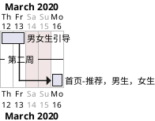

## 高效编程
接口数据 
```java
TestDatas
```
排期


[阅读源码结构图](http://asciiflow.com/)
gitk,git extensions或sourcetree

## 前端服务
启动第二个服务关掉，已经无效
[unfortunately it has been patched in Android 7.1](https://stackoverflow.com/questions/26576872/how-do-i-remove-a-foreground-notification-in-android-lollipop)
## 个人信息刷新

```java
    /**
     * 1. 登录刷新，RxBus接收
     * 2. 每次点击都展示（考虑超时刷新 setUserVisiable和onCreateView），同步服务器数据
     * 3. onResume ，个人信息可以有修改，需要更新我的中心。
     */
```
## Drawable
```xml
<gradient android:type="linear"
            android:startColor="#ffff0000"
            android:endColor="#ffff4808"
            android:angle="270" />
    java.lang.IllegalArgumentException: Linear gradient requires 'angle' attribute to be a multiple of 45
        at android.graphics.drawable.GradientDrawable$GradientState.updateGradientStateOrientation(GradientDrawable.java:2208)
        at android.graphics.drawable.GradientDrawable$GradientState.getOrientation(GradientDrawable.java:2196)
        at android.graphics.drawable.GradientDrawable.ensureValidRect(GradientDrawable.java:1273)
        at android.graphics.drawable.GradientDrawable.buildPathIfDirty(GradientDrawable.java:869)
        at android.graphics.drawable.GradientDrawable.getOutline(GradientDrawable.java:1864)
```
## RecyclerView
### 没有走Adapter
 要设置Layoutmanager
### 宽度没有填充
 inflater.inflate(R.layout.award_item, parent, false);
### 间隙分割线
```java
    new RecyclerView.ItemDecoration() {
        @Override
        public void getItemOffsets(Rect outRect, View view, RecyclerView parent, RecyclerView.State state) {
            super.getItemOffsets(outRect, view, parent, state);
            outRect.bottom = dp2px(8);

        }
    }


```

### 绘制分割綫
```java
参考
android.support.v7.widget.DividerItemDecoration

new RecyclerView.ItemDecoration() {
                int space6 = ScreenUtils.dpToPxInt(6);
                private final Rect mBounds = new Rect();
                @Override
                public void onDraw(Canvas canvas, RecyclerView parent, RecyclerView.State state) {
                    super.onDraw(canvas, parent, state);

                    Paint mPaint = new Paint();
                    mPaint.setAntiAlias(true);
                    mPaint.setColor(0xffececec);

                    canvas.save();
                    final int left;
                    final int right;
                    //noinspection AndroidLintNewApi - NewApi lint fails to handle overrides.
                    if (parent.getClipToPadding()) {
                        left = parent.getPaddingLeft();
                        right = parent.getWidth() - parent.getPaddingRight();
                        canvas.clipRect(left, parent.getPaddingTop(), right,
                                parent.getHeight() - parent.getPaddingBottom());
                    } else {
                        left = 0;
                        right = parent.getWidth();
                    }

                    final int childCount = parent.getChildCount();
                    for (int i = 0; i < childCount; i++) {
                        if (i==childCount-1)
                            continue;
                        final View child = parent.getChildAt(i);
                        parent.getDecoratedBoundsWithMargins(child, mBounds);
                        final int bottom = mBounds.bottom + Math.round(child.getTranslationY());
                        final int top = bottom - ScreenUtils.dpToPxInt(.5f);

                        canvas.drawRect(left, top, right, bottom,mPaint);
                    }
                    canvas.restore();
                }

                @Override
                public void getItemOffsets(Rect outRect, View view, RecyclerView parent, RecyclerView.State state) {
                    super.getItemOffsets(outRect, view, parent, state);
                    if ( parent.getChildAdapterPosition(view)==0){
                        outRect.bottom=space6;
                    }else if (parent.getChildAdapterPosition(view)==parent.getAdapter().getItemCount()-1){
                        outRect.top=space6;
                    }else {
                        outRect.top=space6;
                        outRect.bottom=space6;
                    }
                }
            });
        }
```

### GridLayoutManager 平均间隙
```java

    /**
        *
        * @param outRect
        * @param view
        * @param parent
        * @param rcyToScreenMargin  RecyclerView左右的外边距
        * @param contentWidth       不包含任何空白区域的item宽度
        * @param leftmarginOfFirstCol 第一列item左边到RecyclerView空隙
        * @param rightmarginOfLastCol 最后一列item，右边与RecyclerView空隙
        */
    private void setSpanGap(Rect outRect, View view, RecyclerView parent,float rcyToScreenMargin,float contentWidth,float leftmarginOfFirstCol,float rightmarginOfLastCol) {
        float leftmarginOfFirstColVal = DensityUtil.dip2px(view.getContext(), leftmarginOfFirstCol);//leftmargin
        float rightmarginOfLastColVal = DensityUtil.dip2px(view.getContext(), rightmarginOfLastCol);//rightmargin
        int spanCount = ((GridLayoutManager) parent.getLayoutManager()).getSpanCount();
        int spanIndex = ((GridLayoutManager.LayoutParams) view.getLayoutParams()).getSpanIndex();
        int rcyContentWidth = DensityUtil.getScreenWidth(view.getContext()) - DensityUtil.dip2px(view.getContext(), rcyToScreenMargin) * 2;
        float cellWidth = DensityUtil.dip2px(view.getContext(), contentWidth)+leftmarginOfFirstColVal+rightmarginOfLastColVal;
        float offsetOfFirstCell = ((rcyContentWidth - cellWidth * spanCount) / spanCount) / (spanCount - 1);
        outRect.left = (int) (offsetOfFirstCell * spanIndex+ leftmarginOfFirstColVal);
    }
```
### Grid RecyclerView item按压效果
```java
android:background="?android:attr/selectableItemBackground"
```
### RecyclerView 没有拖动阴影
```java
 android:overScrollMode="never"
```
### NestedScrollView内嵌多个RecyclerView流畅问题
```java
recyclerView.setNestedScrollingEnabled(false)
```

### 上拉加载
```xml
    <android.support.v4.widget.SwipeRefreshLayout
        android:id="@+id/sr_bind_game"
        android:layout_width="match_parent"
        android:layout_height="wrap_content">
```

### recyclerView加载更多
```java
new RecyclerView.OnScrollListener() {

            @Override
            public void onScrollStateChanged(RecyclerView recyclerView, int newState) {
                LinearLayoutManager manager = (LinearLayoutManager) recyclerView.getLayoutManager();
                // 当不滚动时
                if (newState == RecyclerView.SCROLL_STATE_IDLE) {
                    //获取最后一个完全显示的ItemPosition
                    int lastVisibleItem = manager.findLastCompletelyVisibleItemPosition();
//                    int pos=manager.findFirstVisibleItemPosition();
                    int totalItemCount = manager.getItemCount();
                    // 判断是否滚动到底部，并且是向下滚动
                    if (mPresenter.isLoading)
                        return;
                    if (lastVisibleItem >= (totalItemCount - 5) && mPresenter.hasMore) {
                        //加载更多功能的代码
                        mPresenter.isLoading = true;
                        mPresenter.getActiveList(++mPresenter.page);
                    }
                }
            }

            @Override
            public void onScrolled(RecyclerView recyclerView, int dx, int dy) {
                super.onScrolled(recyclerView, dx, dy);
            }
        }
public class Pager {
    public int page=1;
    int pageSize =15;
    public boolean isLoading;
    public boolean hasMore=true;
    public List list=new ArrayList();

    public void changeLoading(boolean isLoading){
        this.isLoading=isLoading;
    }

    public boolean isLoading() {
        return isLoading;
    }

    public boolean isHasMore() {
        return hasMore;
    }
    public void changeHasMoreStatus(List loaded){
        if (list==null||list.size()< pageSize){
            hasMore=false;
            if (page > 1)
               System.out.println("数据加载完成");
        }else {
            hasMore=true;
        }
    }
}

```
### RecyclerView图标山闪动
```java
去掉
getAdapter().notifyDataSetChanged()

换成 
list.clear();
rv.getAdapter().notifyItemRangeRemoved(start,range);//清空
list.addAll(bean.list);
rv.getAdapter().notifyItemRangeInserted(start,range);//插入


```
## 界面像素
### TextView渐变字体
```java
    private void setTextViewGradient(TextView textView) {
        int[] colors = {Color.RED,0xfffe0000};//颜色的数组
        float[] position = {0f,  1.0f};//颜色渐变位置的数组
        LinearGradient mLinearGradient = new LinearGradient(0, 0, textView.getPaint().getTextSize() * textView.getText().length(), 0, colors, position, Shader.TileMode.CLAMP);
        textView.getPaint().setShader(mLinearGradient);
        textView.invalidate();
    }

```
### TextView HTML颜色
```html
<![CDATA[ <font color="#ff971a"> $1%s </font> ]]>
```
### 去掉字体空白
```xml
android:includeFontPadding
```

### dp2px
```java
    protected float dp2px(int dp) {
        return TypedValue.applyDimension(TypedValue.COMPLEX_UNIT_DIP, dp,
                Resources.getSystem().getDisplayMetrics());
    }
```
## 对话框
```java
    public void initDialog(){
        Window window = dialog.getWindow();
        //设置dialog在屏幕底部
        window.setGravity(Gravity.BOTTOM);
        //设置dialog弹出时的动画效果，从屏幕底部向上弹出
        //window.setWindowAnimations(R.style.show_hind_anim);
        window.getDecorView().setPadding(0, 0, 0, 0);
        window.getDecorView().offsetLeftAndRight(0);
        window.getDecorView().offsetTopAndBottom(0);
        //获得window窗口的属性
        WindowManager.LayoutParams lp = window.getAttributes();
        //设置窗口宽度为充满全屏
        lp.width = WindowManager.LayoutParams.WRAP_CONTENT;
        //设置窗口高度为包裹内容
        lp.height = WindowManager.LayoutParams.WRAP_CONTENT;
        //将设置好的属性set回去
        window.setAttributes(lp);
    }


    public void initCenterDialog(){
        Window window = dialog.getWindow();
        //设置dialog在屏幕底部
        window.setGravity(Gravity.CENTER);
        //设置dialog弹出时的动画效果，从屏幕底部向上弹出
        //window.setWindowAnimations(R.style.show_hind_anim);
        window.getDecorView().setPadding(0, 0, 0, 0);
        window.getDecorView().offsetLeftAndRight(0);
        window.getDecorView().offsetTopAndBottom(0);
        //获得window窗口的属性
        WindowManager.LayoutParams lp = window.getAttributes();
        //设置窗口宽度为包裹内容
        lp.width = WindowManager.LayoutParams.WRAP_CONTENT;
        //设置窗口高度为包裹内容
        lp.height = WindowManager.LayoutParams.WRAP_CONTENT;
        //将设置好的属性set回去
        window.setAttributes(lp);
    }

```

```xml
    <style name="dialogStyle" parent="@style/Theme.AppCompat.Dialog">
        <!-- 是否有边框 -->
        <item name="android:windowFrame">@null</item>
        <!--是否在悬浮Activity之上  -->
        <item name="android:windowIsFloating">true</item>
        <!-- 标题 -->
        <item name="android:windowNoTitle">true</item>
        <!--阴影  -->
        <item name="android:windowIsTranslucent">true</item><!--半透明-->
        <!--背景透明-->
        <item name="android:windowBackground">@android:color/transparent</item>
        <!-- 还可以加入一些弹出和退出的动画 (lan)-->
    </style>
    <!-- android:windowBackground 圆角背景 -->
    <shape xmlns:android="http://schemas.android.com/apk/res/android"
        android:shape="rectangle" >

        <corners android:radius="8dp" />
        <solid android:color="#FFFFFF" />

    </shape>
```
```xml
    <style name="show_hind_anim" parent="android:Animation">
        <item name="android:windowEnterAnimation">@anim/dialog_enter</item>
        <item name="android:windowExitAnimation">@anim/dialog_exit</item>
    </style> 
    <set xmlns:android="http://schemas.android.com/apk/res/android">
        <translate
            android:duration="300"
            android:fromYDelta="100%p"
            android:toYDelta="0" />
    </set> 
    <set xmlns:android="http://schemas.android.com/apk/res/android">
        <translate
            android:duration="300"
            android:fromYDelta="0"
            android:toYDelta="100%p" />
    </set>

```
## 界面懒加载
获取到数据再加载
```xml
 <ViewStub android:id="@+id/stub"
               android:inflatedId="@+id/subTree"
               android:layout="@layout/mySubTree"
               android:layout_width="120dip"
               android:layout_height="40dip" />
```


```java
public class WrapHeightGridView  extends GridView {

    public WrapHeightGridView(Context context) {
        super(context);
    }
    public WrapHeightGridView(Context context, AttributeSet attrs) {
        super(context, attrs);
    }


    public WrapHeightGridView(Context context, AttributeSet attrs, int defStyle) {
        super(context, attrs, defStyle);
    }

    @Override
    protected void onMeasure(int widthMeasureSpec,int heightMeasureSpec) {
        int heightSpec;
        if (getLayoutParams().height == LayoutParams.WRAP_CONTENT) {
             heightSpec = MeasureSpec.makeMeasureSpec(Integer.MAX_VALUE >> 2, MeasureSpec.AT_MOST);
        } else {
             heightSpec = heightMeasureSpec;
        }
        super.onMeasure(widthMeasureSpec, heightSpec);
    }
}


```
## 数据 
### webview调试
```java
WebView.setWebContentsDebuggingEnabled(true);　

```

### Gson解析泛型
``` java
new Gson().fromJson(json, Bean.class);
 
User[] userArray = gson.fromJson(userJson, User[].class);  
 
Type userListType = new TypeToken<ArrayList<User>>(){}.getType();
 
ArrayList<User> userArray = gson.fromJson(userJson, userListType);
```

### 拦截解析Gson拦截解析
```java
        GsonBuilder builder = new GsonBuilder();
        builder.registerTypeAdapter(Base.class, new JsonDeserializer<Base>() {
            Gson g=new Gson();
            @Override
            public Base deserialize(JsonElement json, Type typeOfT, JsonDeserializationContext context) throws JsonParseException {
                if (json.getAsJsonObject().get("data").isJsonPrimitive() && typeOfT.toString() != null&&(typeOfT instanceof ParameterizedType)
                        && !typeOfT.toString().substring(typeOfT.toString().indexOf('<') + 1).startsWith("java.lang")) {
                    Base base = new Base();
                    base.setCode(json.getAsJsonObject().get("code").getAsString());
                    base.setMessage(json.getAsJsonObject().get("message").getAsString());
                    return base;
                } else {

                    Base base = g.fromJson("{}", typeOfT);
                    base.setCode(json.getAsJsonObject().get("code").getAsString());
                    base.setMessage(json.getAsJsonObject().get("message").getAsString());
                    if (typeOfT instanceof ParameterizedType) {//GenericArrayType,(x)TypeVariable,WildcardType
                        Type[] actualTypeArguments = ((ParameterizedType) typeOfT).getActualTypeArguments();
                        if (actualTypeArguments.length > 0) {
                            Type actualTypeArgument = actualTypeArguments[0];
                            Object data = context.deserialize(json.getAsJsonObject().get("data"), actualTypeArgument);
                            base.setData(data);
                            return base;
                        }
                    }
                    Object data = context.deserialize(json.getAsJsonObject().get("data"), Object.class);
                    base.setData(data);
                    return base;
                }

            }
        });
GsonConverterFactory.create(builder.create())
```
### Studio使用SVN
TortoiseSVN 安装需要勾选 **command line** 选项，才能在Studio中使用

## 异常处理
```
没有文件访问权限时候，不能写入

UncaughtExceptionHandler try-catch不能异常不能捕获

    java.io.FileNotFoundException: /sdcard/crash/crash-2020-03-16-10-21-39-1584325299121.log: open failed: EACCES (Permission denied)
        at libcore.io.IoBridge.open(IoBridge.java:496)
        at java.io.FileOutputStream.<init>(FileOutputStream.java:235)
        at java.io.FileOutputStream.<init>(FileOutputStream.java:125)
        at com.falcon.novel.utils.CrashHandler.saveCrashInfo2File(CrashHandler.java:159)
        at com.falcon.novel.utils.CrashHandler.handleException(CrashHandler.java:86)
        at com.falcon.novel.utils.CrashHandler.uncaughtException(CrashHandler.java:58)
        at java.lang.ThreadGroup.uncaughtException(ThreadGroup.java:1073)
        at java.lang.ThreadGroup.uncaughtException(ThreadGroup.java:1068)
        at java.lang.Thread.dispatchUncaughtException(Thread.java:2187)
     Caused by: android.system.ErrnoException: open failed: EACCES (Permission denied)
        at libcore.io.Linux.open(Native Method)
        at libcore.io.ForwardingOs.open(ForwardingOs.java:167)
        at libcore.io.BlockGuardOs.open(BlockGuardOs.java:252)
        at libcore.io.ForwardingOs.open(ForwardingOs.java:167)
        at android.app.ActivityThread$AndroidOs.open(ActivityThread.java:7419)
        at libcore.io.IoBridge.open(IoBridge.java:482)
        at java.io.FileOutputStream.<init>(FileOutputStream.java:235) 
        at java.io.FileOutputStream.<init>(FileOutputStream.java:125) 
        at com.falcon.novel.utils.CrashHandler.saveCrashInfo2File(CrashHandler.java:159) 
        at com.falcon.novel.utils.CrashHandler.handleException(CrashHandler.java:86) 
        at com.falcon.novel.utils.CrashHandler.uncaughtException(CrashHandler.java:58) 
        at java.lang.ThreadGroup.uncaughtException(ThreadGroup.java:1073) 
        at java.lang.ThreadGroup.uncaughtException(ThreadGroup.java:1068) 
        at java.lang.Thread.dispatchUncaughtException(Thread.java:2187) 
```