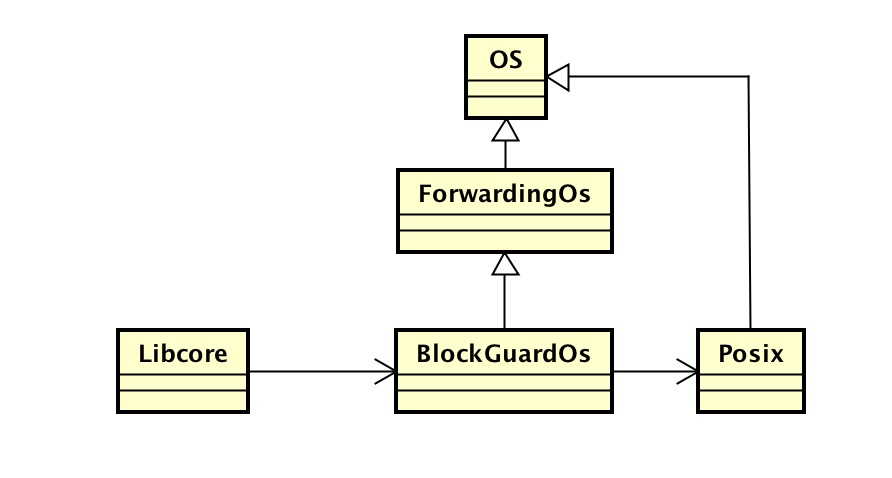
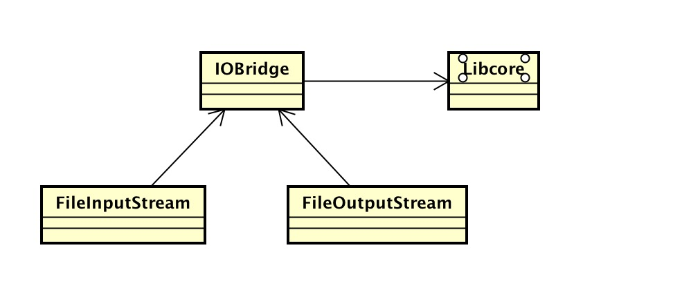

# 压缩算法
## 数据压缩算法
1. JDK GZIP ——这是一个压缩比高的慢速算法，压缩后的数据适合长期使用。JDK中的java.util.zip.GZIPInputStream / GZIPOutputStream便是这个算法的实现。
2. JDK deflate ——这是JDK中的又一个算法（zip文件用的就是这一算法）。它与gzip的不同之处在于，你可以指定算法的压缩级别，这样你可以在压缩时间和输出文件大小上进行平衡。可选的级别有0（不压缩），以及1(快速压缩)到9（慢速压缩）。它的实现是java.util.zip.DeflaterOutputStream / InflaterInputStream。
3. LZ4压缩算法的Java实现——这是本文介绍的算法中压缩速度最快的一个，与最快速的deflate相比，它的压缩的结果要略微差一点。如果想搞清楚它的工作原理，我建议你读一下这篇文章。它是基于友好的Apache 2.0许可证发布的。
4. Snappy——这是Google开发的一个非常流行的压缩算法，它旨在提供速度与压缩比都相对较优的压缩算法。我用来测试的是这个实现。它也是遵循Apache 2.0许可证发布的。

>ZIP is an archive file format that supports lossless data compression. A .ZIP file may contain one or more files or directories that may have been compressed. [wikipekia](https://en.wikipedia.org/wiki/Zip_(file_format))
> gzip is based on the DEFLATE algorithm, which is a combination of LZ77 and Huffman coding. [wikipadia](https://en.wikipedia.org/wiki/Gzip)

请注意！请注意！请注意！zip和gzip只是文件格式，算法是使用DEFLATE算法

### ZipOutputStream 压缩（compression）
```
    public ZipOutputStream(OutputStream out) {
        this(out, StandardCharsets.UTF_8);
    }
    public ZipOutputStream(OutputStream out, Charset charset) {
        super(out, new Deflater(Deflater.DEFAULT_COMPRESSION, true));
        if (charset == null)
            throw new NullPointerException("charset is null");
        this.zc = ZipCoder.get(charset);
        usesDefaultDeflater = true;
    }
```
> Deflater 是用于压缩数据包的,当数据包比较大的时候,采用压缩后的数据,可以减少带宽的占用,加多传送的速度
```
    public Deflater(int level, boolean nowrap) {
        this.level = level;
        this.strategy = DEFAULT_STRATEGY;
        this.zsRef = new ZStreamRef(init(level, DEFAULT_STRATEGY, nowrap));
    }

```
init方法是native方法，实现文件位于libcore/luni/src/main/native/java_util_zip_Deflater.cpp <br/>
文件压缩采用递归方式。文件夹只添加ZipEntry，也就是文件夹路径，文件还需要写入文件。

- putNextEntry创建zip压缩进入点。
```
    public void putNextEntry(ZipEntry e) throws IOException {
        ensureOpen();
        if (current != null) {
            closeEntry();       // close previous entry
        }
        if (e.time == -1) {
            e.setTime(System.currentTimeMillis());
        }
        if (e.method == -1) {
            e.method = method;  // use default method
        }
        // store size, compressed size, and crc-32 in LOC header
        e.flag = 0;
        switch (e.method) {
        case DEFLATED:
            // store size, compressed size, and crc-32 in data descriptor
            // immediately following the compressed entry data
            if (e.size  == -1 || e.csize == -1 || e.crc   == -1)
                e.flag = 8;

            break;
        case STORED:
            // compressed size, uncompressed size, and crc-32 must all be
            // set for entries using STORED compression method
            if (e.size == -1) {
                e.size = e.csize;
            } else if (e.csize == -1) {
                e.csize = e.size;
            } else if (e.size != e.csize) {
                throw new ZipException(
                    "STORED entry where compressed != uncompressed size");
            }
            if (e.size == -1 || e.crc == -1) {
                throw new ZipException(
                    "STORED entry missing size, compressed size, or crc-32");
            }
            break;
        default:
            throw new ZipException("unsupported compression method");
        }
        if (! names.add(e.name)) {
            throw new ZipException("duplicate entry: " + e.name);
        }
        if (zc.isUTF8())
            e.flag |= EFS;
        current = new XEntry(e, written);
        xentries.add(current);
        writeLOC(current);
    }
```
先看下Entry，构造方法和属性
```
    String name;        // entry name
    long time = -1;     // modification time (in DOS time)
    long crc = -1;      // crc-32 of entry data
    long size = -1;     // uncompressed size of entry data
    long csize = -1;    // compressed size of entry data
    int method = -1;    // compression method
    int flag = 0;       // general purpose flag
    byte[] extra;       // optional extra field data for entry
    String comment;     // optional comment string for entry

    /**
     * Compression method for uncompressed entries.
     */
    public static final int STORED = 0;

    /**
     * Compression method for compressed (deflated) entries.
     */
    public static final int DEFLATED = 8;

    /**
     * Creates a new zip entry with the specified name.
     *
     * @param name the entry name
     * @exception NullPointerException if the entry name is null
     * @exception IllegalArgumentException if the entry name is longer than
     *            0xFFFF bytes
     */
    public ZipEntry(String name) {
        if (name == null) {
            throw new NullPointerException();
        }
        if (name.length() > 0xFFFF) {
            throw new IllegalArgumentException("entry name too long");
        }
        this.name = name;
    }
```
返回看putNextEntry方法，最后执行的将Entry封装XEntry，多了个写入的偏移量。然后调用writeLOC

```
    private void writeLOC(XEntry xentry) throws IOException {
        ZipEntry e = xentry.entry;
        int flag = e.flag;
        int elen = (e.extra != null) ? e.extra.length : 0;
        boolean hasZip64 = false;
        writeInt(LOCSIG);               // LOC header signature
        if ((flag & 8) == 8) {
            writeShort(version(e));     // version needed to extract
            writeShort(flag);           // general purpose bit flag
            writeShort(e.method);       // compression method
            writeInt(e.time);           // last modification time
            // store size, uncompressed size, and crc-32 in data descriptor
            // immediately following compressed entry data
            writeInt(0);
            writeInt(0);
            writeInt(0);
        } else {
            if (e.csize >= ZIP64_MAGICVAL || e.size >= ZIP64_MAGICVAL) {
                hasZip64 = true;
                writeShort(45);         // ver 4.5 for zip64
            } else {
                writeShort(version(e)); // version needed to extract
            }
            writeShort(flag);           // general purpose bit flag
            writeShort(e.method);       // compression method
            writeInt(e.time);           // last modification time
            writeInt(e.crc);            // crc-32
            if (hasZip64) {
                writeInt(ZIP64_MAGICVAL);
                writeInt(ZIP64_MAGICVAL);
                elen += 20;        //headid(2) + size(2) + size(8) + csize(8)
            } else {
                writeInt(e.csize);  // compressed size
                writeInt(e.size);   // uncompressed size
            }
        }
        byte[] nameBytes = zc.getBytes(e.name);
        writeShort(nameBytes.length);
        writeShort(elen);
        writeBytes(nameBytes, 0, nameBytes.length);
        if (hasZip64) {
            writeShort(ZIP64_EXTID);
            writeShort(16);
            writeLong(e.size);
            writeLong(e.csize);
        }
        if (e.extra != null) {
            writeBytes(e.extra, 0, e.extra.length);
        }
        locoff = written;
    }
```
主要写入Entry的信息，最后locoff修改为刚才写入数据的偏移位置。 little-endian 存储，最低地址存放的最低字节。write数组，其实调用FileOutputStream
```
    @Override
    public void write(byte[] buffer, int byteOffset, int byteCount) throws IOException {
        IoBridge.write(fd, buffer, byteOffset, byteCount);
    }
```
IoBridge的write方法如下。
```
    public static void write(FileDescriptor fd, byte[] bytes, int byteOffset, int byteCount) throws IOException {
        Arrays.checkOffsetAndCount(bytes.length, byteOffset, byteCount);
        if (byteCount == 0) {
            return;
        }
        try {
            while (byteCount > 0) {
                int bytesWritten = Libcore.os.write(fd, bytes, byteOffset, byteCount);
                byteCount -= bytesWritten;
                byteOffset += bytesWritten;
            }
        } catch (ErrnoException errnoException) {
            throw errnoException.rethrowAsIOException();
        }
    }
```
Libcore的类关系图<br/>

使用的是代理模式，源码中可以看到BlockGuardOs中做了通知网络连接的操作，实际网络连接是在Posix上。 

- 写入压缩数据。
```
    public synchronized void write(byte[] b, int off, int len)
        throws IOException
    {
        ensureOpen();
        if (off < 0 || len < 0 || off > b.length - len) {
            throw new IndexOutOfBoundsException();
        } else if (len == 0) {
            return;
        }
        if (current == null) {
            throw new ZipException("no current ZIP entry");
        }
        ZipEntry entry = current.entry;
        switch (entry.method) {
        case DEFLATED:
            super.write(b, off, len);
            break;
        case STORED:
            written += len;
            if (written - locoff > entry.size) {
                throw new ZipException(
                    "attempt to write past end of STORED entry");
            }
            out.write(b, off, len);
            break;
        default:
            throw new ZipException("invalid compression method");
        }
        crc.update(b, off, len);
    }
```
**super.write(b, off, len);**通过调用父类DeflaterOutputStream方法使用Deflater压缩数据。

```
    protected void deflate() throws IOException {
        int len = def.deflate(buf, 0, buf.length);
        if (len > 0) {
            out.write(buf, 0, len);
        }
    }
```

### ZipInputStream 解压（decompression）

```
new ZipInputStream(new FileInputStream(filename))
    public FileInputStream(File file) throws FileNotFoundException {
        if (file == null) {
            throw new NullPointerException("file == null");
        }
        this.fd = IoBridge.open(file.getPath(), O_RDONLY);
        this.shouldClose = true;
        guard.open("close");
    }
```



posix实现文件位于external/fio/os/windows/posix.c

- getNextEntry()

```
    public ZipEntry getNextEntry() throws IOException {
        ensureOpen();
        if (entry != null) {
            closeEntry();
        }
        crc.reset();
        inf.reset();
        if ((entry = readLOC()) == null) {
            return null;
        }
        if (entry.method == STORED) {
            remaining = entry.size;
        }
        entryEOF = false;
        return entry;
    }
```
readLOC()读取解析entry.在通过BufferedInputStream封装ZipInputStream，执行read()方法读取文件。

```
    public synchronized int read() throws IOException {
        if (pos >= count) {
            fill();
            if (pos >= count)
                return -1;
        }
        return getBufIfOpen()[pos++] & 0xff;
    }
```

先看下BufferedInputSteam的构造函数和字段
```
    private static int defaultBufferSize = 8192;

    /**
     * The internal buffer array where the data is stored. When necessary,
     * it may be replaced by another array of
     * a different size.
     */
    protected volatile byte buf[];

    /**
     * Atomic updater to provide compareAndSet for buf. This is
     * necessary because closes can be asynchronous. We use nullness
     * of buf[] as primary indicator that this stream is closed. (The
     * "in" field is also nulled out on close.)
     */
    private static final
        AtomicReferenceFieldUpdater<BufferedInputStream, byte[]> bufUpdater =
        AtomicReferenceFieldUpdater.newUpdater
        (BufferedInputStream.class,  byte[].class, "buf");

    /**
     * The index one greater than the index of the last valid byte in
     * the buffer.
     * This value is always
     * in the range <code>0</code> through <code>buf.length</code>;
     * elements <code>buf[0]</code>  through <code>buf[count-1]
     * </code>contain buffered input data obtained
     * from the underlying  input stream.
     */
    protected int count;

    /**
     * The current position in the buffer. This is the index of the next
     * character to be read from the <code>buf</code> array.
     * <p>
     * This value is always in the range <code>0</code>
     * through <code>count</code>. If it is less
     * than <code>count</code>, then  <code>buf[pos]</code>
     * is the next byte to be supplied as input;
     * if it is equal to <code>count</code>, then
     * the  next <code>read</code> or <code>skip</code>
     * operation will require more bytes to be
     * read from the contained  input stream.
     *
     * @see     java.io.BufferedInputStream#buf
     */
    protected int pos;

    /**
     * The value of the <code>pos</code> field at the time the last
     * <code>mark</code> method was called.
     * <p>
     * This value is always
     * in the range <code>-1</code> through <code>pos</code>.
     * If there is no marked position in  the input
     * stream, this field is <code>-1</code>. If
     * there is a marked position in the input
     * stream,  then <code>buf[markpos]</code>
     * is the first byte to be supplied as input
     * after a <code>reset</code> operation. If
     * <code>markpos</code> is not <code>-1</code>,
     * then all bytes from positions <code>buf[markpos]</code>
     * through  <code>buf[pos-1]</code> must remain
     * in the buffer array (though they may be
     * moved to  another place in the buffer array,
     * with suitable adjustments to the values
     * of <code>count</code>,  <code>pos</code>,
     * and <code>markpos</code>); they may not
     * be discarded unless and until the difference
     * between <code>pos</code> and <code>markpos</code>
     * exceeds <code>marklimit</code>.
     *
     * @see     java.io.BufferedInputStream#mark(int)
     * @see     java.io.BufferedInputStream#pos
     */
    protected int markpos = -1;

    /**
     * The maximum read ahead allowed after a call to the
     * <code>mark</code> method before subsequent calls to the
     * <code>reset</code> method fail.
     * Whenever the difference between <code>pos</code>
     * and <code>markpos</code> exceeds <code>marklimit</code>,
     * then the  mark may be dropped by setting
     * <code>markpos</code> to <code>-1</code>.
     *
     * @see     java.io.BufferedInputStream#mark(int)
     * @see     java.io.BufferedInputStream#reset()
     */
    protected int marklimit;
    public BufferedInputStream(InputStream in) {
        this(in, defaultBufferSize);
    }
    public BufferedInputStream(InputStream in, int size) {
        super(in);
        if (size <= 0) {
            throw new IllegalArgumentException("Buffer size <= 0");
        }
        buf = new byte[size];
    }
```
主要是管理读取字节buf字段。在来看下read()方法，当读取完时需要执行fill()再读取下次数据。fill方法，组要是分配空间，并填充下一次数据,调用 *getInIfOpen().read(buffer, pos, buffer.length - pos);* ,执行的是ZipInputStream方法。
```
   public int read(byte[] b, int off, int len) throws IOException {
        ensureOpen();
        if (off < 0 || len < 0 || off > b.length - len) {
            throw new IndexOutOfBoundsException();
        } else if (len == 0) {
            return 0;
        }

        if (entry == null) {
            return -1;
        }
        switch (entry.method) {
        case DEFLATED:
            len = super.read(b, off, len);
            if (len == -1) {
                readEnd(entry);
                entryEOF = true;
                entry = null;
            } else {
                crc.update(b, off, len);
            }
            return len;
        case STORED:
            if (remaining <= 0) {
                entryEOF = true;
                entry = null;
                return -1;
            }
            if (len > remaining) {
                len = (int)remaining;
            }
            len = in.read(b, off, len);
            if (len == -1) {
                throw new ZipException("unexpected EOF");
            }
            crc.update(b, off, len);
            remaining -= len;
            if (remaining == 0 && entry.crc != crc.getValue()) {
                throw new ZipException(
                    "invalid entry CRC (expected 0x" + Long.toHexString(entry.crc) +
                    " but got 0x" + Long.toHexString(crc.getValue()) + ")");
            }
            return len;
        default:
            throw new ZipException("invalid compression method");
        }
    }
```
*super.read(b, off, len);* 调用父类InflaterInputStream使用的是Inflater读取.

因为BufferInputStream包含InputStream，实际上是ZipInputStream，所以ZipInputStream执行getNextEntry后，如果写个字节流刚好是文件部分，BufferInputStream正好可以读取文件的数据。

到此，文件的具体压缩算法在WriteNextEntry和ReadNextEnxty方法中。

## GZIP
>
> "gzip" is often also used to refer to the gzip file 
> format, which is:
>
> 1. a 10-byte header, containing a magic number (1f 8b), a version number and a timestamp
> 2. optional extra headers, such as the original file name,
> 3. a body, containing a DEFLATE-compressed payload
> 4. an 8-byte footer, containing a CRC-32 checksum and the > length of the original uncompressed data, modulo 2^32.[3] 
> The ZIP format can hold collections of files without an external archiver [wikipadia](https://en.wikipedia.org/wiki/Gzip)


```
    public GZIPOutputStream(OutputStream out, int size, boolean syncFlush)
        throws IOException
    {
        super(out, new Deflater(Deflater.DEFAULT_COMPRESSION, true),
              size,
              syncFlush);
        usesDefaultDeflater = true;
        writeHeader();
        crc.reset();
    }
    public GZIPOutputStream(OutputStream out) throws IOException {
        this(out, 512, false);
    }
```

构造方法执行的writeHeader方法就是引用的第一点，写入10字节的header。

### png文件格式压缩过程
> PNG uses a 2-stage compression process:[wikipekia](https://en.wikipedia.org/wiki/Portable_Network_Graphics)

1. pre-compression: filtering (prediction)