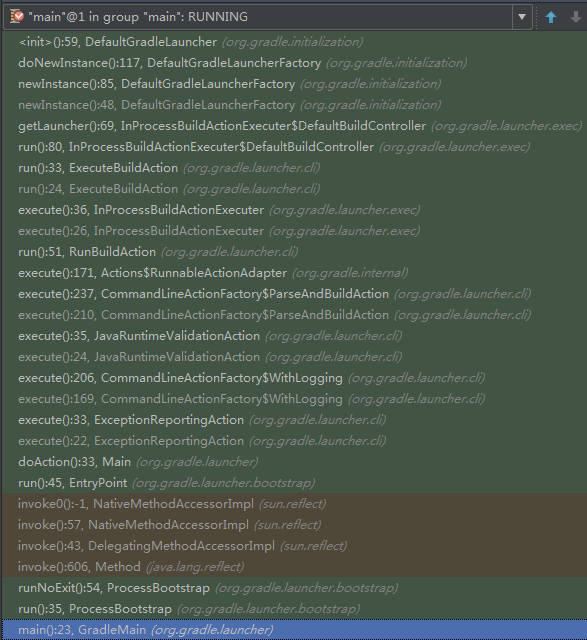

#Android常见Gradle分析

> http://blog.csdn.net/cleverwyq/article/details/42028231


@(源码分析)[HashMap|LinkedHashMap|Android]

本文对比下HashMap,LinkedHashMap,TreeMap;涉及*数组链表结构*，*双向链表*，*双重链表*,*排序模式*，*AVL结构*，*红黑树*和*Hash冲突*

- **创建及初始化**
- **存储键值对**
- **获取键值对**
- **移除键值对**
- **清理容器**

---------------------

[TOC]

##环境搭建（android studio环境中操作）
1. 创建一个Gradle项目
2. 将Gradle源文件拷贝到项目中
3. 打开Gradle，右键，点击 **Debug 'build'**


##gradle 入口
org.gradle.launcher.GradleMain#main

args:{"--build-file","{gradle的build.gradle全路径}/gradle.build"}


``` java
	org.gradle.launcher.bootstrap.ProcessBootstrap#runNoExit

    private void runNoExit(String mainClassName, String[] args) throws Exception {
        ClassPathRegistry classPathRegistry = new DefaultClassPathRegistry(new DefaultClassPathProvider(new DefaultModuleRegistry()));
        ClassLoaderFactory classLoaderFactory = new DefaultClassLoaderFactory();
        ClassPath antClasspath = classPathRegistry.getClassPath("ANT");
        ClassPath runtimeClasspath = classPathRegistry.getClassPath("GRADLE_RUNTIME");
        ClassLoader antClassLoader = classLoaderFactory.createIsolatedClassLoader(antClasspath);
        ClassLoader runtimeClassLoader = new MutableURLClassLoader(antClassLoader, runtimeClasspath);
        Thread.currentThread().setContextClassLoader(runtimeClassLoader);
        Class<?> mainClass = runtimeClassLoader.loadClass(mainClassName);
        Object entryPoint = mainClass.newInstance();
        Method mainMethod = mainClass.getMethod("run", String[].class);
        mainMethod.invoke(entryPoint, new Object[]{args});
    }
```


``` java
org.gradle.api.internal.classpath.DefaultModuleRegistry#findDistDir// 获取gradle wrapper的路径C:\Users\Haibin\.gradle\wrapper\dists\gradle-2.2.1-all\c64ydeuardnfqctvr1gm30w53\gradle-2.2.1
//根据以下的jar文件的路径，核对lib,和plugin文件夹，返回gradle-2.2.1的全路径
└─gradle-2.2.1
    ├─lib
    │  ├─plugins
    │  │  └─
    │  ├─gradle-core-2.2.1.jar

    

```
org.gradle.api.internal.classpath.DefaultModuleRegistry#classpathJars
加载了

``` java
		org.gradle.api.internal.classpath.DefaultModuleRegistry#loadModule//moduleName=>gradle-launcher,及找到C:\Users\Haibin\.gradle\wrapper\dists\gradle-2.2.1-all\c64ydeuardnfqctvr1gm30w53\gradle-2.2.1\lib\gradle-launcher-2.2.1.jar文件里面的gradle-launcher-classpath.properties文件，拷贝里面相关模块加载到

        String resourceName = String.format("%s-classpath.properties", moduleName);
        URL propertiesUrl = classLoader.getResource(resourceName);
        if (propertiesUrl != null) {
            Set<File> implementationClasspath = new LinkedHashSet<File>();
            findImplementationClasspath(moduleName, implementationClasspath);
            implementationClasspath.add(ClasspathUtil.getClasspathForResource(propertiesUrl, resourceName));
            Properties properties = GUtil.loadProperties(propertiesUrl);
            return module(moduleName, properties, implementationClasspath);
        }


```


```java
// C:\Users\Haibin\Downloads\anshu\software\gradle\gradle-2.4\src\core\org\gradle\initialization\UserHomeInitScriptFinder.java
//解析C:\Users\Haibin\.gradle\init.gradle下的脚本

//C:\Users\Haibin\Downloads\anshu\software\gradle\gradle-2.4\src\core\org\gradle\initialization\DirectoryInitScriptFinder.java
//C:\Users\Haibin\.gradle\wrapper\dists\gradle-2.2.1-all\c64ydeuardnfqctvr1gm30w53\gradle-2.2.1
```
@
##存储键值对

##移除键值对

##获取键值对

##清理容器