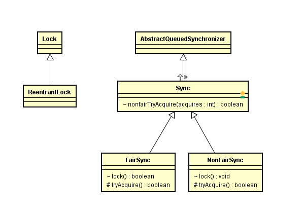

# Concurrent包分析

> 

@(源码分析)[Lock|ReentrentLock|ReentrantReadWriteLock|Semaphore|AQS|Sync|Conndition|ArrayBlockingQueue|LinkedBlockingQueue|CountDownLatch|CyclicBarrier|Semaphore|Android]

pthread创建是在Thread.start调用的本地方法创建的，详见[Timer进行调度](Timer.md)

- **Lock 创建及初始化**
创建了不公平锁，公平锁和不公平锁都是Lock的内部类，继承Sync，Sync继承AbstractQueuedSynchronizer 


```java
    /**
     * Sync object for non-fair locks
     */
    static final class NonfairSync extends Sync {
        private static final long serialVersionUID = 7316153563782823691L;

        /**
         * Performs lock.  Try immediate barge, backing up to normal
         * acquire on failure.
         */
        final void lock() {
            if (compareAndSetState(0, 1))
                setExclusiveOwnerThread(Thread.currentThread());
            else
                acquire(1);
        }

        protected final boolean tryAcquire(int acquires) {
            return nonfairTryAcquire(acquires);
        }
    }

    /**
     * Sync object for fair locks
     */
    static final class FairSync extends Sync {
        private static final long serialVersionUID = -3000897897090466540L;

        final void lock() {
            acquire(1);
        }

        /**
         * Fair version of tryAcquire.  Don't grant access unless
         * recursive call or no waiters or is first.
         */
        protected final boolean tryAcquire(int acquires) {
            final Thread current = Thread.currentThread();
            int c = getState();
            if (c == 0) {
                if (!hasQueuedPredecessors() &&
                    compareAndSetState(0, acquires)) {
                    setExclusiveOwnerThread(current);
                    return true;
                }
            }
            else if (current == getExclusiveOwnerThread()) {
                int nextc = c + acquires;
                if (nextc < 0)
                    throw new Error("Maximum lock count exceeded");
                setState(nextc);
                return true;
            }
            return false;
        }
    }
    public ReentrantLock() {
        sync = new NonfairSync();
    }
```
- Condition
> 用await()替换wait()，用signal()替换notify()，用signalAll()替换notifyAll(),在Sync有个newCondition进行初始化，所以继承Sync都可以调用newCondition获得一个Condition对象。

调用Lock.newCondition直接创建一个ConditionObject对象。ConditionObject实现了Condition接口。并且是AQS的内部类。
```java
public interface Condition {
 
    void await() throws InterruptedException;
 
    void awaitUninterruptibly();
 
    long awaitNanos(long nanosTimeout) throws InterruptedException;
 
    boolean await(long time, TimeUnit unit) throws InterruptedException;
 
    boolean awaitUntil(Date deadline) throws InterruptedException;
 
    void signal();
 
    void signalAll();
}

```
condition将待await组成链表队列
```java
    public class ConditionObject implements Condition, java.io.Serializable {
        private static final long serialVersionUID = 1173984872572414699L;
        /** First node of condition queue. */
        private transient Node firstWaiter;
        /** Last node of condition queue. */
        private transient Node lastWaiter;

        ... ...
        ... ...
    }
```
await添加Node节点到链表
```java
        public final void await() throws InterruptedException {
            if (Thread.interrupted())
                throw new InterruptedException();
            Node node = addConditionWaiter();
            int savedState = fullyRelease(node);
            int interruptMode = 0;
            while (!isOnSyncQueue(node)) {
                LockSupport.park(this);
                if ((interruptMode = checkInterruptWhileWaiting(node)) != 0)
                    break;
            }
            if (acquireQueued(node, savedState) && interruptMode != THROW_IE)
                interruptMode = REINTERRUPT;
            if (node.nextWaiter != null) // clean up if cancelled
                unlinkCancelledWaiters();
            if (interruptMode != 0)
                reportInterruptAfterWait(interruptMode);
        }
```

single方法，调用thread的unpark方法，执行 vmt.notifyAll();vm是VMThread对象


- lock方法
申请锁成功，独占线程。不成功执行acquire方法排队等候
```
        final void lock() {
            if (compareAndSetState(0, 1))
                setExclusiveOwnerThread(Thread.currentThread());
            else
                acquire(1);
        }

```
AQS 的acquire,加入链表组成的队列。
```java
    public final void acquire(int arg) {
        if (!tryAcquire(arg) &&
            acquireQueued(addWaiter(Node.EXCLUSIVE), arg))
            selfInterrupt();
    }
```

- unlock方法
```java
    public void unlock() {
        sync.release(1);
    }
```
执行的是AQS的release方法
```java
    public final boolean release(int arg) {
        if (tryRelease(arg)) {
            Node h = head;
            if (h != null && h.waitStatus != 0)
                unparkSuccessor(h);
            return true;
        }
        return false;
    }
```
tryRelease被Sync重写
```java
        protected final boolean tryRelease(int releases) {
            int c = getState() - releases;
            if (Thread.currentThread() != getExclusiveOwnerThread())
                throw new IllegalMonitorStateException();
            boolean free = false;
            if (c == 0) {
                free = true;
                setExclusiveOwnerThread(null);
            }
            setState(c);
            return free;
        }
```
最终调用Unsafe的unpark方法,关于Unsafe详解
- **信号量 Semaphore**

> Semaphore可以控制某个资源可被同时访问的个数，通过 acquire() 获取一个许可，如果没有就等待，而 release() 释放一个许可。

```java
    public Semaphore(int permits) {
        sync = new NonfairSync(permits);
    }
```
permits参数就是可以同时访问的个数。Semaphore的结构和ReentrantLock一样，内部也包含者内部类NonfairSync,FairSync.

接下来看下acquire方法,最终调用AQS的acquireSharedInterruptibly方法。
```java
    public void acquire() throws InterruptedException {
        sync.acquireSharedInterruptibly(1);
    }
```

release方法
```java
    public void release() {
        sync.releaseShared(1);
    }
```


- ArrayBlockingQueue和LinkedBlockingQueue （阻塞队列，阻塞栈）
>ArrayBlockingQueue中的锁是没有分离的，即生产和消费用的是同一个锁；LinkedBlockingQueue中的锁是分离的，即生产用的是putLock，消费是takeLock
阻塞队列的概念是，一个指定长度的队列，如果队列满了，添加新元素的操作会被阻塞等待，直到有空位为止。栈是“后入先出”的结构，每次操作的是栈顶，而队列是“先进先出”的结构，每次操作的是队列头。
```java
    BlockingQueue bqueue = new ArrayBlockingQueue(20); 
    for (int i = 0; i < 30; i++) { 
            //将指定元素添加到此队列中，如果没有可用空间，将一直等待（如果有必要）。 
            bqueue.put(i); 
            System.out.println("向阻塞队列中添加了元素:" + i); 
    } 
    System.out.println("程序到此运行结束，即将退出----"); 

    BlockingDeque bDeque = new LinkedBlockingDeque(20); 
    for (int i = 0; i < 30; i++) { 
            //将指定元素添加到此阻塞栈中，如果没有可用空间，将一直等待（如果有必要）。 
            bDeque.putFirst(i); 
            System.out.println("向阻塞栈中添加了元素:" + i); 
    } 
    System.out.println("程序到此运行结束，即将退出----"); 
```

ArrayBlockingQueue的构造方法,使用的是ReentrantLock
```java
    public ArrayBlockingQueue(int capacity, boolean fair) {
        if (capacity <= 0)
            throw new IllegalArgumentException();
        this.items = new Object[capacity];
        lock = new ReentrantLock(fair);
        notEmpty = lock.newCondition();
        notFull =  lock.newCondition();
    }

    public void put(E e) throws InterruptedException {
        checkNotNull(e);
        final ReentrantLock lock = this.lock;
        lock.lockInterruptibly();
        try {
            while (count == items.length)
                notFull.await();
            enqueue(e);
        } finally {
            lock.unlock();
        }
    }
```
LinkedBlockingQueue
```java
    public void putFirst(E e) throws InterruptedException {
        if (e == null) throw new NullPointerException();
        Node<E> node = new Node<E>(e);
        final ReentrantLock lock = this.lock;
        lock.lock();
        try {
            while (!linkFirst(node))
                notFull.await();
        } finally {
            lock.unlock();
        }
    }

```


- CountDownLatch 同步计数器

```java
    private static final class Sync extends AbstractQueuedSynchronizer {
        private static final long serialVersionUID = 4982264981922014374L;

        Sync(int count) {
            setState(count);
        }

        int getCount() {
            return getState();
        }

        protected int tryAcquireShared(int acquires) {
            return (getState() == 0) ? 1 : -1;
        }

        protected boolean tryReleaseShared(int releases) {
            // Decrement count; signal when transition to zero
            for (;;) {
                int c = getState();
                if (c == 0)
                    return false;
                int nextc = c-1;
                if (compareAndSetState(c, nextc))
                    return nextc == 0;
            }
        }
    }
    public CountDownLatch(int count) {
        if (count < 0) throw new IllegalArgumentException("count < 0");
        this.sync = new Sync(count);
    }

```
本质使用继承ASQ的Sync

- CyclicBarrier
> CountDownLatch是一次性的，而CyclicBarrier在调用reset之后还可以继续使用。

内部也是用ReentrantLock
```
    /** The lock for guarding barrier entry */
    private final ReentrantLock lock = new ReentrantLock();
    /** Condition to wait on until tripped */
    private final Condition trip = lock.newCondition();
    /** The number of parties */
    private final int parties;
    /* The command to run when tripped */
    private final Runnable barrierCommand;
    /** The current generation */
    private Generation generation = new Generation();

    /**
     * Number of parties still waiting. Counts down from parties to 0
     * on each generation.  It is reset to parties on each new
     * generation or when broken.
     */
    private int count;
```
执行await通知任务完成
```
    public int await() throws InterruptedException, BrokenBarrierException {
        try {
            return dowait(false, 0L);
        } catch (TimeoutException toe) {
            throw new Error(toe); // cannot happen
        }
    }
```
dowait方法判断，如果执行完了，调用构造方法传入的主任务执行。
<br/>
reset方法
---------------------

[TOC]

##创建及初始化


##调度流程 