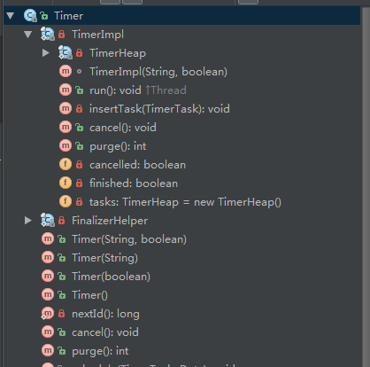

#Timer分析

> 

@(源码分析)[Timer|Android]

Timer进行调度

- **创建及初始化**
```java
    public Timer(String name, boolean isDaemon) {
        if (name == null) {
            throw new NullPointerException("name == null");
        }
        this.impl = new TimerImpl(name, isDaemon);
        this.finalizer = new FinalizerHelper(impl);
    }
```
实际上是创建了，Timer的内部类，为什么要使用内部类？,TimerImpl还有一个内部类TimerHeap，作为TimerImpl的属性，在TimerImpl初始化时候就赋值。用来管理TimerTask<br/>

```java
        /**
         * True if the method cancel() of the Timer was called or the !!!stop()
         * method was invoked
         */
        private boolean cancelled;

        /**
         * True if the Timer has become garbage
         */
        private boolean finished;

        /**
         * Contains scheduled events, sorted according to
         * {@code when} field of TaskScheduled object.
         */
        private TimerHeap tasks = new TimerHeap();

        /**
         * Starts a new timer.
         *
         * @param name thread's name
         * @param isDaemon daemon thread or not
         */
        TimerImpl(String name, boolean isDaemon) {
            this.setName(name);
            this.setDaemon(isDaemon);
            this.start();
        }
```
TimerImpl继承Thread，所以在构造方法时候调用start(),最终调用Thread的start方法,创建本地线程。
```java
    public synchronized void start() {
        checkNotStarted();

        hasBeenStarted = true;

        nativeCreate(this, stackSize, daemon);
    }

    private native static void nativeCreate(Thread t, long stackSize, boolean daemon);
```
nativeCreate实现的文件art/runtime/native/java_lang_Thread.cc
```c
static void Thread_nativeCreate(JNIEnv* env, jclass, jobject java_thread, jlong stack_size,
                                jboolean daemon) {
  Thread::CreateNativeThread(env, java_thread, stack_size, daemon == JNI_TRUE);
}
```
nativeCreate又调用了Thread::CreateNativeThread，实现文件在art/runtime/thread.cc
```c
  Thread* child_thread = new Thread(is_daemon);
  // Use global JNI ref to hold peer live while child thread starts.
  child_thread->tlsPtr_.jpeer = env->NewGlobalRef(java_peer);
  stack_size = FixStackSize(stack_size);

  // Thread.start is synchronized, so we know that nativePeer is 0, and know that we're not racing to
  // assign it.
  env->SetLongField(java_peer, WellKnownClasses::java_lang_Thread_nativePeer,
                    reinterpret_cast<jlong>(child_thread));

  pthread_t new_pthread;
  pthread_attr_t attr;
  CHECK_PTHREAD_CALL(pthread_attr_init, (&attr), "new thread");
  CHECK_PTHREAD_CALL(pthread_attr_setdetachstate, (&attr, PTHREAD_CREATE_DETACHED), "PTHREAD_CREATE_DETACHED");
  CHECK_PTHREAD_CALL(pthread_attr_setstacksize, (&attr, stack_size), stack_size);
  int pthread_create_result = pthread_create(&new_pthread, &attr, Thread::CreateCallback, child_thread);
  CHECK_PTHREAD_CALL(pthread_attr_destroy, (&attr), "new thread");
```
java_peer是java中的Thread，通过child_thread与pthred关联起来。<br/>
```
    //开启一个线程  
    //第一个参数  线程编号的地址  
    //第二个参数  线程的属性  
    //第三个参数  线程要执行的函数（函数指针）（第三个参数可以，demo，*demo, 一般用&demo）  
    //第四个参数  线程要执行的函数的参数 
    int pthread_create_result = pthread_create(&new_pthread, &attr, Thread::CreateCallback, child_thread);

```
通过注释，可以看出调用该文件的Thread::CreateCallback方法。最终会调用java层的run方法。运行完，销毁改线程
```c
  {
    ... ...
    ... ...

    // Invoke the 'run' method of our java.lang.Thread.
    mirror::Object* receiver = self->tlsPtr_.opeer;
    jmethodID mid = WellKnownClasses::java_lang_Thread_run;
    InvokeVirtualOrInterfaceWithJValues(soa, receiver, mid, nullptr);
  }
  // Detach and delete self.
  Runtime::Current()->GetThreadList()->Unregister(self);
```

TimerHeap二叉堆，数组为容器管理TimerTask。<br/>


- **调度流程**
```java
        Timer timer = new Timer(true);
        timer.schedule(new TimerTask() {
            @Override
            public void run() {

            }
        },0l);
```
最终调用TimerImpl的insertTask
```java
        private void insertTask(TimerTask newTask) {
            // callers are synchronized
            tasks.insert(newTask);
            this.notify();
        }
```
this.notify会唤醒TimerImpl的run的wait的代码。

- 销毁FinalizerHelper
重写finalize
```java
    private static final class FinalizerHelper {
        private final TimerImpl impl;

        FinalizerHelper(TimerImpl impl) {
            this.impl = impl;
        }

        @Override protected void finalize() throws Throwable {
            try {
                synchronized (impl) {
                    impl.finished = true;
                    impl.notify();
                }
            } finally {
                super.finalize();
            }
        }
    }
```
---------------------

##Thread.currentThread().getTHreadStackTrace()##
//android 调用堆栈 [0]dalvik.system.VMStack#getThreadStackTrace [1]java.lang.Thread#getStackTrace->[2]LogUtils#logDetailInfo->[3]调用的方法
//java调用堆栈 [0]java.lang.Thread#getStackTrace->[1]LogUtils#logDetailInfo->[2]调用的方法